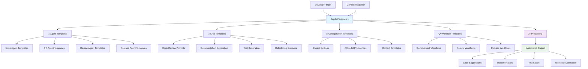

## 🤖 Copilot Templates Directory

This directory contains specialized templates and configurations for GitHub Copilot and AI-assisted development workflows in the LightSpeedWP organization.

## 📊 Copilot Integration Architecture

## 📁 Template Categories

### 🎯 Agent Templates

- **Issue Agent Templates** - Templates for AI agents handling issues
- **PR Agent Templates** - Templates for AI agents managing pull requests
- **Review Agent Templates** - Templates for automated code review agents
- **Release Agent Templates** - Templates for release management automation

### 💬 Copilot Chat Templates

- **Code Review Prompts** - Structured prompts for code review assistance
- **Documentation Generation** - Templates for auto-generating documentation
- **Test Generation** - Templates for creating comprehensive tests
- **Refactoring Guidance** - Templates for code refactoring assistance

### 🔧 Configuration Templates

- **Copilot Settings** - Workspace-specific Copilot configurations
- **AI Model Preferences** - Model selection and behavior configuration
- **Context Templates** - Templates for providing context to AI agents

## 🔗 Integration Points

Copilot templates integrate with:

- **[Agents Directory](../agents/README.md)** - AI automation agents
- **[Chatmodes](../chatmodes/README.md)** - Specialized AI conversation modes
- **[Prompts](../prompts/README.md)** - Structured AI prompts
- **[Instructions](../instructions/README.md)** - AI behavior instructions
- **[Custom Instructions](../custom-instructions.md)** - Organization-wide AI guidance

## 🤖 AI-Enhanced Features

### 📝 Code Generation

- **Template-driven code scaffolding**
- **Pattern-based component generation**
- **Automated boilerplate creation**
- **Context-aware code suggestions**

### 🔍 Code Analysis

- **Automated code review templates**
- **Security analysis prompts**
- **Performance optimization suggestions**
- **Best practice validation**

### 📚 Documentation

- **Auto-generated API documentation**
- **README template generation**
- **Code comment enhancement**
- **User guide creation**

## 📚 Related Documentation

- [**Custom Instructions**](../custom-instructions.md) - Organization-wide Copilot settings
- [**Agents Index**](../agents/agent.md) - Complete AI agent documentation
- [**Chatmodes Index**](../chatmodes/chatmodes.md) - Specialized conversation modes
- [**Prompts Index**](../prompts/prompts.md) - Structured AI prompts
- [**Awesome Copilot**](../instructions/awesome-copilot.instructions.md) - Advanced Copilot usage

## 💡 Usage Guidelines

### 🎯 Template Selection

1. **Choose the Right Template**: Select templates based on your specific use case
2. **Customize for Context**: Adapt templates to your project's unique requirements
3. **Follow Patterns**: Use established patterns for consistency across projects
4. **Test Thoroughly**: Validate AI-generated content before implementation

### 🔧 Configuration

1. **Workspace Settings**: Configure Copilot settings per workspace needs
2. **Model Selection**: Choose appropriate AI models for different tasks
3. **Context Management**: Provide clear context for better AI assistance
4. **Feedback Loop**: Continuously improve templates based on results

### ⚠️ Best Practices

- **Review AI Output**: Always review and validate AI-generated content
- **Maintain Standards**: Ensure AI assistance follows coding standards
- **Document Decisions**: Document why specific AI approaches were chosen
- **Update Regularly**: Keep templates current with evolving AI capabilities

## 🚀 Advanced Features

### 🔄 Workflow Integration

- **CI/CD Integration** - AI-assisted continuous integration
- **Automated Testing** - AI-generated test suites
- **Release Automation** - AI-powered release management
- **Documentation Updates** - Automated documentation maintenance

### 🎨 Creative Applications

- **Pattern Generation** - AI-assisted design pattern creation
- **Component Libraries** - Automated component documentation
- **Style Guide Generation** - AI-powered style guide creation
- **Architecture Suggestions** - AI-assisted architectural decisions

---

_This directory enhances development productivity through AI-assisted workflows. See [Custom Instructions](../custom-instructions.md) for organization-wide Copilot configuration._

---

<!-- RANDOM FOOTER: 🤖 AI-powered development, human-guided excellence! -->
