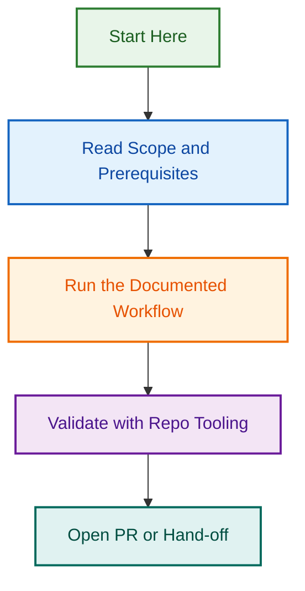

# 💭 Discussion Templates Directory

This directory contains standardized discussion templates to facilitate organized and productive community discussions across all LightSpeedWP repositories.

## 📁 Available Templates

Discussion templates help structure community conversations and ensure important topics are covered comprehensively.

### 🗣️ Template Files

| File | Purpose |
|---|---|
| `announcements.yml` | Project updates and important information |
| `contribution-help.yml` | Help and guidance for contributors |
| `general.yml` | General community discussions |
| `ideas-feedback.yml` | New feature ideas and user feedback |
| `integrations.yml` | Third-party integrations and compatibility discussions |
| `showcase.yml` | Sharing projects, achievements, and use cases |
| `sponsorship.yml` | Sponsorship enquiries and support discussions |
| `support-lsx-design.yml` | Support for LSX Design Framework |
| `support-tour-operator.yml` | Support for Tour Operator plugin |

## 🔗 Integration Points

Discussion templates work with:

- **[Discussion Labels](../../docs/DISCUSSIONS.md)** - Automated discussion categorization
- **[Community Guidelines](../SAVED_REPLIES/community/guidelines.md)** - Community interaction standards
- **[Automation Governance](../../docs/AUTOMATION.md)** - Discussion workflow automation
- **[Agents](../agents/README.md)** - AI-assisted discussion moderation and governance support

## 🤖 Automation Features

- **Auto-categorization**: Templates trigger automatic discussion categorization
- **Label Assignment**: Discussions are automatically labeled based on template
- **Notification Routing**: Relevant team members are notified based on discussion type
- **Moderation Support**: Automated moderation assistance for community guidelines

## 📚 Related Documentation

- [**Discussion Labels**](../../docs/DISCUSSIONS.md) - Complete labeling system for discussions
- [**Saved Replies**](../SAVED_REPLIES/README.md) - Response templates for discussions
- [**Community Guidelines**](../SAVED_REPLIES/README.md) - Community interaction standards
- [**Automation Governance**](../../docs/AUTOMATION.md) - Discussion automation policies

## 💡 Usage Guidelines

1. **Template Selection**: Choose the template that best fits your discussion topic
2. **Clear Titles**: Use descriptive titles that summarize the discussion topic
3. **Complete Sections**: Fill in all relevant template sections for better engagement
4. **Community Standards**: Follow community guidelines and code of conduct
5. **Search First**: Search existing discussions before creating new ones

## 🎯 Discussion Best Practices

- **Be Specific**: Provide clear context and specific examples
- **Stay On Topic**: Keep discussions focused on the chosen category
- **Encourage Participation**: Ask questions that invite community input
- **Follow Up**: Engage with responses and provide updates as needed
- **Tag Appropriately**: Let automation handle tagging, but verify accuracy

## ⚠️ Moderation Notes

- All discussions are subject to community guidelines
- Automated moderation helps maintain discussion quality
- Moderators may recategorize or restructure discussions as needed
- Off-topic or inappropriate content will be addressed promptly

---

*This directory supports the LightSpeedWP community engagement strategy. See [Community Guidelines](../SAVED_REPLIES/community/guidelines.md) for interaction standards.*

---

<!-- RANDOM FOOTER: 💭 Great discussions build great software! -->
## Visual Workflow

