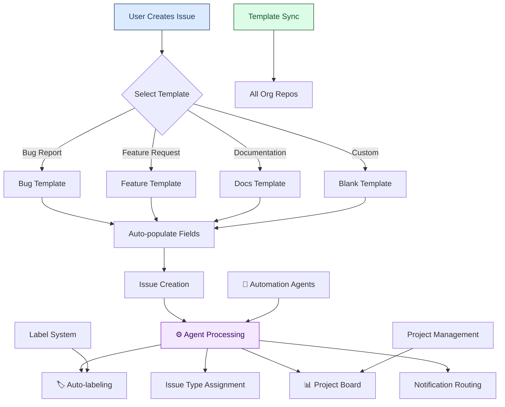

# 📋 Issue Templates Directory


This directory contains standardized issue templates used across all LightSpeedWP repositories to ensure consistent issue creation and proper automation triggering.

Markdown issue templates in this directory use `name` and `about` in front matter. Do not duplicate the picker summary into `description`.

## 🚀 Quick Start

Get started with LightSpeedWP issue templates in three steps:

1. **Clone the repository**

   ```sh
   git clone https://github.com/lightspeedwp/.github.git
   cd .github
   ```

2. **Install dependencies**
   - For Node.js/JS: `npm install`
   - For Python: `pip install -r requirements.txt` (if present)

3. **Use an issue template**
   - Navigate to `.github/ISSUE_TEMPLATE/`
   - Select the appropriate template for your issue type (bug, feature, documentation, etc.)
   - Follow the instructions in the template to submit your issue

For advanced usage, see the [Issue Template Index](./README.md) and individual template specs for configuration and automation options.

## 🗂️ Issue Template Workflow



## 📁 Available Templates

The issue templates in this directory are automatically synchronised across all organisation repositories and work in conjunction with our automation agents.

### 🗂️ Template Index

| # | File | Type label | Purpose |
|---|---|---|---|
| 01 | `01-task.md` | `type:task` | Scoped work, config updates, and small delivery items |
| 02 | `02-bug.md` | `type:bug` | Reproducible defects with environment and repro details |
| 03 | `03-feature.md` | `type:feature` | New capabilities or user-visible enhancements |
| 04 | `04-design.md` | `type:design` | UI/UX, token, or accessibility design work |
| 05 | `05-epic.md` | `type:epic` | Large multi-part initiatives grouping stories, features, and tasks |
| 06 | `06-story.md` | `type:story` | User-centric narratives with acceptance criteria and business value |
| 07 | `07-improvement.md` | `type:improve` | Suggested enhancements to existing functionality |
| 08 | `08-chore.md` | `type:chore` | Small housekeeping tasks: label hygiene, repo tweaks, file moves |
| 09 | `09-code-refactor.md` | `type:refactor` | Structured code cleanup without changing external behaviour |
| 10 | `10-build-ci.md` | `type:build` | Build system, CI/CD, and pipeline changes |
| 11 | `11-automation.md` | `type:automation` | Workflow automation and tooling |
| 12 | `12-testing-coverage.md` | `type:testing-coverage` | New or refactored automated tests |
| 13 | `13-performance.md` | `type:performance` | Speed, resource, or latency work |
| 14 | `14-a11y.md` | `type:a11y` | Accessibility compliance and WCAG 2.2 AA improvements |
| 15 | `15-security.md` | `type:security` | Vulnerabilities or security hardening |
| 16 | `16-compatibility.md` | `type:compatibility` | Cross-version, browser, or platform compatibility issues |
| 17 | `17-integration-issue.md` | `type:integration-issue` | Third-party system integration problems |
| 18 | `18-release.md` | `type:release` | Release planning, coordination, and delivery |
| 19 | `19-maintenance.md` | `type:maintenance` | System maintenance, dependency updates, and housekeeping |
| 20 | `20-documentation.md` | `type:documentation` | Docs and content updates |
| 21 | `21-research.md` | `type:research` | Exploratory or assessment work |
| 22 | `22-audit.md` | `type:audit` | Structured audits and compliance checks |
| 23 | `23-code-review.md` | `type:code-review` | Code quality discussions and review standards |
| 24 | `24-ai-ops.md` | `type:ai-ops` | Specialist AI operations workflows |
| 25 | `25-content-modelling.md` | `type:content-modelling` | Content modelling and data structure design |

> **Label-only types** (no dedicated numbered template): `type:question`, `type:support`. Use the nearest template and state the intended canonical type in the opening section.

### 🔗 Template Integration

These templates integrate with:

- **[Issue Types](../../docs/ISSUE_TYPES.md)** - Canonical issue type definitions
- **[Issue Labels](../../docs/LABELING.md#issue-labelling)** - Automated labeling system
- **[Automation Governance](../../docs/AUTOMATION.md)** - Agent-driven workflows
- **[Branching Strategy](../../docs/BRANCHING_STRATEGY.md)** - Branch naming conventions

## 🤖 Automation Features

- **Auto-labeling**: Templates trigger automatic label assignment
- **Type Detection**: Issues are automatically typed based on template
- **Agent Assignment**: Specific agents are triggered based on issue type
- **Project Sync**: Issues are automatically added to relevant projects

## 📚 Related Documentation

- [**Instructions Index**](../../instructions/README.md) - All instruction files
- [**Agents Directory**](../../agents/README.md) - Automation agents
- [**Saved Replies**](../SAVED_REPLIES/README.md) - Response templates
- [**Workflows**](../workflows/README.md) - GitHub Actions automation

## 💡 Usage Guidelines

1. **Template Selection**: Choose the most specific template for your issue
2. **Required Fields**: Fill in all required template fields
3. **Labels**: Let automation handle labeling - don't manually add labels
4. **Type Assignment**: Templates automatically set the correct issue type

---

*This directory is part of the LightSpeedWP automation ecosystem. See [Automation Governance](../../docs/AUTOMATION.md) for complete automation standards.*

Related issues: {related_issues}
