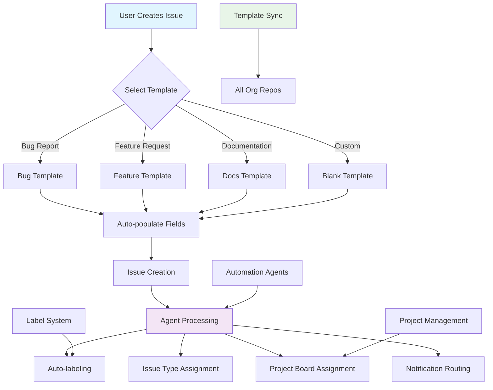

# 📋 Issue Templates Directory


This directory contains standardized issue templates used across all LightSpeedWP repositories to ensure consistent issue creation and proper automation triggering.

## 🚀 Quick Start

Get started with LightSpeedWP issue templates in three steps:

1. **Clone the repository**

   ```sh
   git clone https://github.com/lightspeedwp/.github.git
   cd .github
   ```

2. **Install dependencies**
   - For Node.js/JS: `npm install`
   - For Python: `pip install -r requirements.txt` (if present)

3. **Use an issue template**
   - Navigate to `.github/ISSUE_TEMPLATE/`
   - Select the appropriate template for your issue type (bug, feature, documentation, etc.)
   - Follow the instructions in the template to submit your issue

For advanced usage, see the [Issue Template Index](./ISSUE_TEMPLATE/README.md) and individual template specs for configuration and automation options.

## 🗂️ Issue Template Workflow



## 📁 Available Templates

The issue templates in this directory are automatically synchronized across all organization repositories and work in conjunction with our automation agents.

### 🔗 Template Integration

These templates integrate with:

- **[Issue Types](../ISSUE_TYPES.md)** - Canonical issue type definitions
- **[Issue Labels](../ISSUE_LABELS.md)** - Automated labeling system
- **[Automation Governance](../AUTOMATION_GOVERNANCE.md)** - Agent-driven workflows
- **[Branching Strategy](../BRANCHING_STRATEGY.md)** - Branch naming conventions

## 🤖 Automation Features

- **Auto-labeling**: Templates trigger automatic label assignment
- **Type Detection**: Issues are automatically typed based on template
- **Agent Assignment**: Specific agents are triggered based on issue type
- **Project Sync**: Issues are automatically added to relevant projects

## 📚 Related Documentation

- [**Instructions Index**](../instructions/README.md) - All instruction files
- [**Agents Directory**](../agents/README.md) - Automation agents
- [**Saved Replies**](../SAVED_REPLIES/README.md) - Response templates
- [**Workflows**](../workflows/README.md) - GitHub Actions automation

## 💡 Usage Guidelines

1. **Template Selection**: Choose the most specific template for your issue
2. **Required Fields**: Fill in all required template fields
3. **Labels**: Let automation handle labeling - don't manually add labels
4. **Type Assignment**: Templates automatically set the correct issue type

---

*This directory is part of the LightSpeedWP automation ecosystem. See [Automation Governance](../../docs/AUTOMATION_GOVERNANCE.md) for complete automation standards.*

---

<!-- RANDOM FOOTER: 🚀 Consistent templates, efficient workflows! -->
