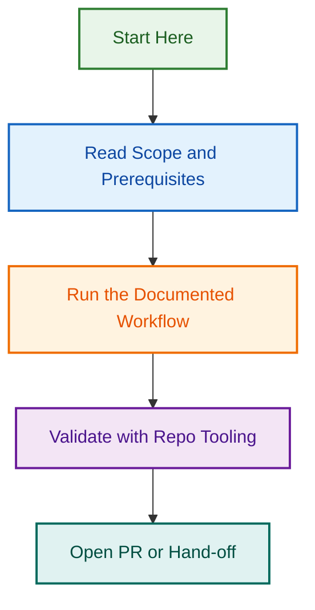

# 🔀 Pull Request Templates Directory

This directory contains standardized pull request templates used across all LightSpeedWP repositories to ensure consistent PR creation and proper automation triggering.

PR templates in this repository use `title` and `description` in front matter. Keep those repo-local metadata fields aligned with the template body and do not mirror the issue-template `about` field here.

## 📁 Available Templates

| Template           | Purpose                       | Automation Triggers                    |
| ------------------ | ----------------------------- | -------------------------------------- |
| `pr_bug.md`        | Bug fixes and patches         | Bug labeling, QA assignment            |
| `pr_chore.md`      | Maintenance and housekeeping  | Chore labeling, automated review       |
| `pr_ci.md`         | CI/CD and workflow changes    | CI labeling, workflow validation       |
| `pr_dep_update.md` | Dependency updates            | Dependency labeling, security checks   |
| `pr_docs.md`       | Documentation changes         | Documentation labeling, style checks   |
| `pr_feature.md`    | New features and enhancements | Feature labeling, comprehensive review |
| `pr_hotfix.md`     | Critical production fixes     | Hotfix labeling, expedited review      |
| `pr_refactor.md`   | Code refactoring              | Refactor labeling, code quality checks |
| `pr_release.md`    | Release preparation           | Release labeling, changelog generation |

## 🔗 Template Integration

These templates integrate with:

- **[PR Labels](../../docs/LABELING.md#pull-request-labelling)** - Automated PR labeling system
- **[Branching Strategy](../../docs/BRANCHING_STRATEGY.md)** - Branch naming and PR workflow
- **[Automation Governance](../../docs/AUTOMATION.md)** - Agent-driven PR workflows
- **[Reviewer Agent](../../.github/agents/reviewer.agent.md)** - Automated code review

## 🤖 Automation Features

- **Auto-labeling**: Templates trigger automatic label assignment based on PR type
- **Review Assignment**: Appropriate reviewers are automatically assigned
- **Status Tracking**: PR status is automatically managed through the workflow
- **Changelog Integration**: Release PRs automatically update changelogs
- **Quality Gates**: Automated checks ensure PR meets quality standards
- **Review Checklists**: Every template includes explicit accessibility and security checks

## 📚 Related Documentation

- [**Agents Directory**](../../AGENTS.md) - PR automation agents
- [**Workflows**](../workflows/README.md) - GitHub Actions for PRs
- [**Saved Replies**](../SAVED_REPLIES/README.md) - PR response templates
- [**Instructions**](../../instructions/pull-requests.instructions.md) - PR handling instructions

## 💡 Usage Guidelines

1. **Template Selection**: Choose the template that best matches your PR type
2. **Required Fields**: Complete all required sections in the template
3. **Branch Naming**: Follow the [branching strategy](../../docs/BRANCHING_STRATEGY.md) for automatic detection
4. **A11y & Security**: Complete the WCAG 2.2 AA and OWASP-aligned checklist items before review
5. **Automation**: Let the system handle labeling and assignment - avoid manual changes

## ⚠️ Important Notes

- Templates are automatically selected based on branch naming conventions
- Manual template selection overrides automatic detection
- All PRs must use a template to ensure proper automation triggering

---

*This directory is part of the LightSpeedWP automation ecosystem. See [Automation Governance](../../docs/AUTOMATION.md) for complete automation standards.*

Closes: {closes_issues}
## Visual Workflow

