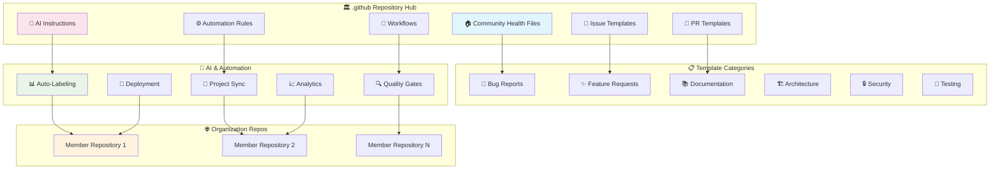
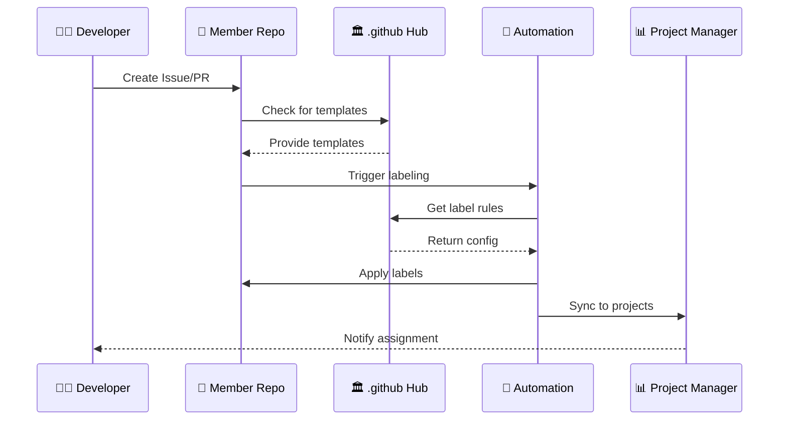
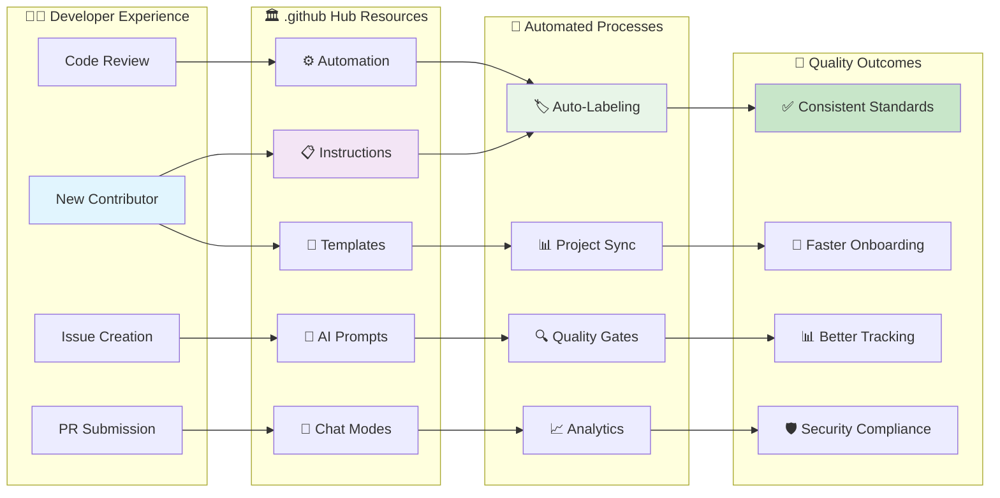

# 🏛️ LightSpeed Organisation .github Community Health Repository

[](./ISSUE_TEMPLATE/)
[](./automation/)
[](./custom-instructions.md)
[](./workflows/)
[](./instructions/)
[](https://www.gnu.org/licenses/gpl-3.0)

> **Central hub** for all shared GitHub templates, Copilot instructions, workflow automation, labeling systems, and community health files across the LightSpeed WordPress organisation.

---

## 📋 Table of Contents

- [Purpose and GitHub Template Ecosystem Overview](#purpose-and-github-template-ecosystem-overview)
- [Usage & Quickstart](#usage--quickstart)
- [Validation & Testing](#validation--testing)
- [Change Log / History](#change-log--history)
- [FAQ / Troubleshooting](#faq--troubleshooting)
- [Limitations & Notes](#limitations--notes)
- [Labelling and Automation](#labelling-and-automation)
- [Folder Structure and Organization Flow](#folder-structure-and-organization-flow)
- [Comprehensive Workflow Integration](#comprehensive-workflow-integration)
- [Community & Q&A](#community--qa)
- [Contribution Guidelines & Instruction Index](#contribution-guidelines--instruction-index)
- [Related Root-Level Organisation Files](#related-root-level-organisation-files)
- [Best Practices](#best-practices)
- [License](#license)

## Purpose and GitHub Template Ecosystem Overview

This repository's `.github` folder serves as the **single source of truth** for all organisation-wide community health files, automation rules, standards, and AI/Copilot instructions for LightSpeed projects. By centralising these files, we ensure consistency, discoverability, and maintainability across every repo in the organisation.

## GitHub Template Ecosystem Architecture



**Key goals:**

- Standardise contribution, code quality, review, and labelling across all repos.
- Automate issue/PR labelling, project syncing, and governance.
- Provide a canonical set of instructions for AI agents & Copilot.
- Centralise saved replies, prompts, chatmodes, and reusable workflows.
- Enable fast onboarding and safe, scalable development.

See [GitHub: About organisation-wide community health files](https://github.blog/changelog/2019-02-21-organization-wide-community-health-files/) and [Creating a default community health file for your organization](https://docs.github.com/en/communities/setting-up-your-project-for-healthy-contributions/creating-a-default-community-health-file) for more context.

## How Organisation-wide Health Files Work

Organizations can add community health files to a specially named `.github` repository, which then serves as the organisation-wide default for all repositories. You can include `CONTRIBUTING`, `SUPPORT`, `CODE_OF_CONDUCT`, `ISSUE_TEMPLATE(S)`, or `PULL_REQUEST_TEMPLATE(S)` files here. If a repository does not have its own version of a given file, the org-wide default from `.github` will be surfaced throughout developer workflows (e.g., when opening issues or PRs, or via the Community Profile), as if it were committed directly to that repo.

> While the file itself won’t appear in the file browser or Git history for each repository, it will be surfaced throughout developers’ workflows, such as when opening a new issue or when viewing the Community Profile, just as if it were committed to the repository directly.

## Usage & Quickstart

Follow these steps to onboard and use this repository effectively across the organisation:

1. Reference issue and PR templates automatically surfaced when creating new items in any repo without overrides.
2. Use files in `instructions/` before starting development to align with standards.
3. For AI-assisted workflows, load prompts from `prompts/` and agents from `agents/`.
4. Reusable workflows in `workflows/` can be invoked via `uses:` in member repositories.
5. Update labels or labeler rules only in `automation/` to propagate consistency.
6. Add or adjust saved replies in `SAVED_REPLIES/` for common maintainer responses.
7. Consult `AGENTS.md`, `GEMINI.md`, or `CLAUDE.md` before modifying AI agent behavior.

> To override an org-wide template in a member repository, add a local copy there; GitHub will prefer the repo-local version.

## Validation & Testing

This repository participates in organisation validation via:

- Frontmatter validation (schema enforcement for instructions, prompts, agents).
- Workflow linting (reusable Actions syntax integrity).
- Markdown linting (heading style, spacing, list formatting).

Run validation scripts (example command structure shown; adjust to actual tooling):

```bash
# Run all tests and validation (example)
./scripts/run-all-tests.sh

# Validate frontmatter across .github folders (placeholder)
node scripts/validation/validate-frontmatter.js .github/
```

## Change Log / History

Version: 3.0 (see `version` frontmatter field)
Last Updated: 2025-10-24
Refer to the organisation-wide [CHANGELOG.md](../CHANGELOG.md) for historical changes impacting templates, automation, or agent instructions.

## FAQ / Troubleshooting

**Templates not appearing in a repo?** Ensure the target repository does not already have local conflicting templates.

**Labels didn’t auto-apply?** Confirm the path/branch patterns in `automation/labeler.yml` match the change set and that the workflow ran.

**How do I add a new chat mode?** Chat modes have been deprecated in favor of agents. Use the agent system instead.

**Agent behavior seems outdated?** Check `AGENTS.md` and the specific agent file in `agents/` for version updates; bump the frontmatter version when modifying logic.

**Prompts aren’t producing expected reviews?** Verify prompt file frontmatter fields and ensure correct model/tool configuration is active.

## Limitations & Notes

- Org-wide defaults are only applied when a member repo lacks local overrides.
- Saved replies are not automatically synced to external tooling—manual updates required.
- AI agent guidance documents rely on maintainers to enforce version discipline.
- Frontmatter validation coverage may expand; some legacy files might need retrofitting.

---

## Labelling and Automation

This repository is the **canonical, organisation-wide source** for:

- **Labels** ([automation/labels.yml](./automation/labels.yml)): Official label names, colours, and descriptions.
- **Labeler Rules** ([automation/labeler.yml](./automation/labeler.yml)): Automation for applying labels based on file paths, branch names, or PR type.
- **Issue Types** ([automation/issue-types.yml](./automation/issue-types.yml)): Machine-readable definitions mapping issue templates, types, and automation.

## GitHub Automation Workflow Process



**How it works:**

- Labels, labeler, and issue types from this repo are referenced by reusable workflows and automation across all LightSpeed repositories.
- If a repository does not have its own label or labeler config, the defaults from this repo apply.
- **Automated labelling** ensures consistent triage, prioritisation, and project management across the organisation.
- Maintainers should update labels and labeler rules *here* to synchronise org-wide conventions.
- For more detail, see [AUTOMATION_GOVERNANCE.md](./automation/AUTOMATION_GOVERNANCE.md) and [ISSUE_LABELS.md](./automation/ISSUE_LABELS.md).

**Quick links:**

- [Label Definitions](./automation/labels.yml)
- [Labeler Rules](./automation/labeler.yml)
- [Issue Types](./automation/issue-types.yml)
- [Automation Governance](./automation/AUTOMATION_GOVERNANCE.md)

---

## Folder Structure and Organization Flow

The `.github` folder is organised for maximum clarity and modularity, grouping related files for easy reference and automation.

## Repository Structure Visualization

```mermaid
graph TB
    subgraph "📁 .github/ Directory Structure"
        A[📋 instructions/]
        B[🎯 prompts/]
        C[🤖 agents/]
        D[⚙️ workflows/]
        E[📝 ISSUE_TEMPLATE/]
        F[🔄 PULL_REQUEST_TEMPLATE/]
        G[💾 SAVED_REPLIES/]
        H[🔧 automation/]
    end

    subgraph "📋 Instructions Ecosystem"
        A1[coding-standards.instructions.md]
        A2[linting.instructions.md]
        A3[a11y.instructions.md]
        A4[security.instructions.md]
    end

    subgraph "🤖 AI Integration Hub"
        B1[accessibility-review.prompt.md]
        B2[code-review.prompt.md]
        B3[pattern-generation.prompt.md]
        C1[agent.md]
    end

    subgraph "⚙️ Automation Core"
        H1[labels.yml]
        H2[labeler.yml]
        H3[issue-types.yml]
        H4[AUTOMATION_GOVERNANCE.md]
        D1[labeling.yml]
    end

    A --> A1
    A --> A2
    A --> A3
    A --> A4

    B --> B1
    B --> B2
    B --> B3
    C --> C1

    H --> H1
    H --> H2
    H --> H3
    H --> H4
    D --> D1

    style A fill:#e1f5fe
    style B fill:#fce4ec
    style H fill:#e8f5e8
    style D fill:#fff3e0
```



## Directory Structure Details

```text
.github/
├── instructions/           # Coding, linting, and development standards
│   ├── block-plugin/       # Block plugin development instructions
│   ├── block-theme/        # Block theme development instructions
│   ├── wpcs/               # WordPress coding standards instructions
│   ├── coding-standards.instructions.md
│   ├── linting.instructions.md
│   ├── a11y.instructions.md
│   ├── security.instructions.md
│   └── ... (other instruction files)
│
├── prompts/                # AI prompt templates
│   └── *.prompt.md
│
├── agents/                 # Agent specs and automation
│   └── agent.md
│
├── workflows/              # Reusable GitHub Actions workflows
│   ├── labeling.yml
│   └── ... (other workflows)
│
├── metrics/                # Metrics collection and reporting
│   ├── README.md
│   └── ... (metrics files)
│
├── reports/                # Generated reports and artifacts
│   ├── README.md
│   └── ... (report categories)
│
├── ISSUE_TEMPLATE/         # Issue templates
│   └── *.md
│
├── PULL_REQUEST_TEMPLATE/  # Pull request templates
│   └── *.md
│
├── SAVED_REPLIES/          # Saved replies for maintainers
│   └── *.md
│
├── schemas/                # JSON schemas for validation
│   └── *.json
│
├── custom-instructions.md  # Org-wide Copilot instructions
├── AGENTS.md               # Global agent rules
├── GEMINI.md               # Gemini agent guidance
├── CLAUDE.md               # Claude agent guidance
├── README.md               # This file: folder overview
└── ... (other shared files)
```

---

## 📋 Instruction Consolidation (v2.0)

**22 instruction files → 5 consolidated files (77% reduction)**

We've consolidated related instruction files for better maintainability:

- **languages.instructions.md** - JS/TS, JSON, YAML, JSDoc, linting (4 files)
- **documentation-formats.instructions.md** - Markdown, frontmatter, Mermaid (3 files)
- **quality-assurance.instructions.md** - Testing, Jest, coverage, CI/CD (3 files)
- **automation.instructions.md** - Agents, labeling, release, metrics (8 files)
- **community-standards.instructions.md** - File org, naming, README, replies (4 files)

📖 **[View Migration Guide](../MIGRATION_GUIDE.md)** - Complete mapping of old → new locations

---

## Comprehensive Workflow Integration

This diagram illustrates how all components work together to create a seamless development and governance experience across the LightSpeed organization.

## Complete Integration Flow



## Component Integration Details

- **Instructions**: The `instructions/` folder contains canonical, versioned standards for coding, linting, HTML templates, WordPress pattern development, PHP blocks, and theme configuration. Always reference these before starting work or reviewing code.
- **Prompts & Chat Modes**: Modular prompt templates and chat modes designed for Copilot, Gemini, Claude, and custom agents—enabling consistent AI-assisted workflows and reviews.
- **Agents**: Agent specs and rules (see `AGENTS.md`, `GEMINI.md`, `CLAUDE.md`) detail expected behaviour, standards, and escalation procedures for all automated or AI contributors.
- **Workflows & Automation**: Includes reusable GitHub Actions workflows for labelling, project syncing, and more. The `automation/` folder covers label rules, branching, and governance files.
- **Templates**: Issue and PR templates standardise reporting, changelog, and review for all repos, supporting automation and reducing triage effort. Saved replies help maintainers respond consistently.
- **Custom Instructions**: The root-level `custom-instructions.md` and agent files define Copilot/AI behaviour org-wide, so all automated actions and suggestions follow LightSpeed rules.
- **Discoverability & Onboarding**: All files are indexed, referenced, and cross-linked for easy discoverability. New contributors can start in this folder and be directed to relevant standards, templates, or automation docs.

---

## Community & Q&A

Have questions, feedback, or want to propose an idea? Visit our [GitHub Discussions](https://github.com/orgs/lightspeedwp/discussions) for open conversation and community support.

---

## Contribution Guidelines & Instruction Index

For all contributors, please reference these key guidelines and indexes:

- [LightSpeed General Copilot Instructions](https://github.com/lightspeedwp/.github/blob/HEAD/.github/custom-instructions.md)
- [Coding Standards](https://github.com/lightspeedwp/.github/blob/HEAD/.github/instructions/coding-standards.instructions.md)
- [HTML Templates](https://github.com/lightspeedwp/.github/blob/HEAD/.github/instructions/block-theme/html-template.instructions.md)
- [Pattern Development](https://github.com/lightspeedwp/.github/blob/HEAD/.github/instructions/block-theme/pattern-development.instructions.md)
- [PHP Block Instructions](https://github.com/lightspeedwp/.github/blob/HEAD/.github/instructions/block-theme/php-block.instructions.md)
- [Theme JSON](https://github.com/lightspeedwp/.github/blob/HEAD/.github/instructions/block-theme/theme-json.instructions.md)
- When generating a summary for pull requests, use this [pull request template](https://github.com/lightspeedwp/.github/blob/HEAD/.github/PULL_REQUEST_TEMPLATE.md).

---

## For Contributors & Maintainers

- **Always start here** when onboarding, contributing, or reviewing.
- Reference **instructions** for standards, **templates** for issues/PRs, and **automation** docs for workflows and governance.
- Use **saved replies** for common support scenarios; update them as needed.
- For agent/Copilot questions, see the agent guides and custom instructions.
- Update this folder when org-wide standards, workflows, or automation rules change.

## VS Code Setup

To ensure a consistent development experience and code quality, all contributors should:

- Install all recommended extensions from `.vscode/extensions.json` (includes ESLint, Prettier, YAML, WordPress, PHP, AI, and GitHub workflow tools).
- Use the workspace settings in `.vscode/settings.json` for code style, linting, and workflow automation. These settings align with `.editorconfig` and enforce 2-space indentation for YAML, JS, CSS, and JSON, and 4-space tabs for PHP.
- Enable format-on-save and linting in your editor for best results.
- Periodically review and update your extensions to match evolving project standards.

Refer to `.vscode/extensions.json` and `.vscode/settings.json` for the authoritative list and configuration.

---

## VS Code Workspace Setup

To ensure a consistent and standards-driven development experience, this repository includes a dedicated [`.vscode/`](../.vscode/) folder with:

- **Recommended Extensions**: See [`extensions.json`](../.vscode/extensions.json) for AI, linting, WordPress, PHP, and GitHub workflow tools.
- **Workspace Settings**: See [`settings.json`](../.vscode/settings.json) for formatting, linting, and file association rules that align with org standards.
- **Predefined Tasks**: See [`tasks.json`](../.vscode/tasks.json) for running tests, linting, and E2E automation.
- **Debug & Automation**: Includes launch configs and Model Context Protocol (MCP) server integration for advanced automation and E2E testing.

> For a full overview, see [`.vscode/README.md`](../.vscode/README.md).

**All contributors should open the project in VS Code to automatically apply these settings and see extension recommendations.**

---

## Related Root-Level Organisation Files

These files typically reside in the root of the repository for visibility but are managed from this `.github` folder:

- [README.md](../README.md) — High-level overview of the organisation and community health repository.
- [CONTRIBUTING.md](../CONTRIBUTING.md) — Full contribution guidelines (reference [.github/instructions/](./instructions/) for standards).
- [CODE_OF_CONDUCT.md](../CODE_OF_CONDUCT.md) — Organisation code of conduct, aligned with WordPress community standards.
- [SECURITY.md](../SECURITY.md) — Security policy and responsible disclosure instructions.
- [SUPPORT.md](../SUPPORT.md) — Support policy and contact details.
- [GOVERNANCE.md](../GOVERNANCE.md) — Maintainer and contributor governance, responsibilities, and process.
- [CHANGELOG.md](../CHANGELOG.md) — Keep-a-Changelog format, linking to standards and change log instructions.
- [DEVELOPMENT.md](../DEVELOPMENT.md) — Developer setup, scripts, linting, and workflow guidance.

**Reference and update these root-level files as needed, but maintain canonical instructions, templates, and workflows in `.github/`.**

---

## Best Practices

- **Modularity**: Reuse files as much as possible across repos; avoid duplication.
- **Discoverability**: Cross-link instructions, templates, and automation docs.
- **Automation**: Use labeler, workflows, and governance rules for consistent triage and release.
- **Security & Accessibility**: Adhere to WordPress standards and OWASP top 10 in every template, instruction, and workflow.
- **AI/Copilot Enablement**: Leverage prompts, agent rules, and custom instructions to optimise AI-powered workflows safely.

---

## License

This repository and all its contents are licensed under the GNU General Public License v3.0 — see the [LICENSE](../LICENSE) file.

## 🏛️ Core Organization Files

- [🏠 Main Repository README](../README.md) - Organization overview and repository purpose
- [🤝 Contributing Guidelines](../CONTRIBUTING.md) - Complete contribution process and standards
- [🛡️ Code of Conduct](../CODE_OF_CONDUCT.md) - Community standards and expectations
- [🆘 Support Policy](../SUPPORT.md) - Getting help and support resources

## 🤖 AI & Automation Resources

- [🧠 AI Agents Overview](../AGENTS.md) - Global AI rules and agent specifications
- [💬 Custom Instructions](./custom-instructions.md) - Organization-wide Copilot settings
- [🎯 Prompt Library](./prompts/prompts.md) - Reusable AI prompts and templates

## ⚙️ Automation & Governance

- [🏷️ Label Definitions](./labels.yml) - Canonical organization labels
- [🔧 Labeler Configuration](./labeler.yml) - Automated labeling rules
- [📋 Issue Types](./issue-types.yml) - Standardized issue categorization
- [⚖️ Automation Governance](../docs/AUTOMATION_GOVERNANCE.md) - Automation standards and oversight

## 🔧 Development Standards

- [💻 Coding Standards](./instructions/coding-standards.instructions.md) - Unified development guidelines
- [🎨 Linting Instructions](./instructions/linting.instructions.md) - Code quality and formatting
- [🏗️ Pattern Development](./instructions/block-theme/pattern-development.instructions.md) - WordPress block patterns
- [🌐 HTML Templates](./instructions/block-theme/html-template.instructions.md) - Semantic markup standards

---

**🏛️ This directory is managed by the LightSpeed team. All organizational GitHub templates, automation, and AI resources are maintained here.**

**❓ Questions?** [Open an issue](https://github.com/lightspeedwp/.github/issues/new), start a [Discussion](https://github.com/orgs/lightspeedwp/discussions), or contact [support@lightspeedwp.agency](mailto:support@lightspeedwp.agency)
