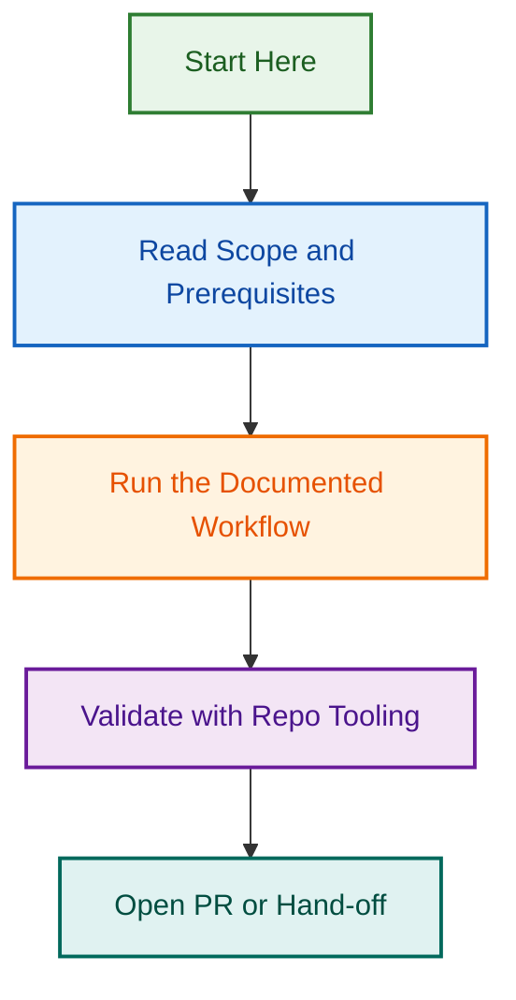

# 💬 Saved Replies Directory

This directory contains standardized saved replies for consistent and professional GitHub interactions across all LightSpeedWP repositories.

## 📁 Directory Structure

### 🏘️ Community Replies (`community/`)

- `code-of-conduct.md` - Code of conduct reminders and guidance
- `contribution-thanks.md` - Thanking contributors and community members
- `guidelines.md` - Community guideline references and explanations
- `legal.md` - Legal and licensing related responses
- `welcome.md` - Welcome messages for new contributors

### 🐛 Issue Replies (`issues/`)

- `a11y-acknowledge.md` - Accessibility issue acknowledgments
- `area-routing.md` - Routing issues to appropriate areas/teams
- `blockers.md` - Addressing blocking issues and dependencies
- `bug-reports.md` - Bug report guidance and follow-up
- `documentation.md` - Documentation requests and guidance
- `duplicate.md` - Handling duplicate issues
- `duplicates.md` - Duplicate issue batch handling
- `epic-tracking.md` - Epic and large feature tracking
- `feature-requests.md` - Feature request processing
- `good-first-issue.md` - Identifying good first issues for newcomers
- `inactive-issue.md` - Handling inactive or stale issues
- `label-clarification.md` - Explaining label meanings and usage
- `meta-label-nudge.md` - Nudging contributors to add meta labels
- `missing-info.md` - Requesting additional information
- `more-info.md` - Requesting more context or detail
- `needs-reproduction.md` - Requesting bug reproduction steps
- `research-completion.md` - Research completion and handoff
- `security-acknowledge.md` - Security issue acknowledgments
- `stale-abandoned.md` - Handling stale or abandoned issues
- `support.md` - Support request handling
- `triage.md` - Issue triage and classification
- `wontfix.md` - Issues that won't be fixed with explanations

### 🔀 Pull Request Replies (`pull-requests/`)

- `ai-assist.md` - AI assistance and Copilot guidance
- `area-labeling.md` - PR area labeling explanations
- `area-routing.md` - Routing PRs to appropriate areas/teams
- `automated-dependency-update.md` - Automated dependency update responses
- `awaiting-author.md` - Waiting for author response
- `branch-naming.md` - Branch naming convention guidance
- `changelog-required.md` - Changelog requirements
- `closing-inactive.md` - Closing inactive pull requests
- `code-review.md` - Code review feedback and guidance
- `conflicts.md` - Merge conflict resolution
- `dependency-update.md` - Dependency update procedures
- `documentation-pr.md` - Documentation PR guidelines
- `draft-pr.md` - Draft PR guidance and status
- `merge-discipline.md` - Merge discipline and procedures
- `missing-labels.md` - Missing label reminders
- `needs-qa.md` - QA requirements and procedures
- `performance.md` - Performance considerations
- `ready-for-review.md` - PR ready for review notifications
- `release-label-guidance.md` - Release label guidance and requirements
- `security.md` - Security-related PR guidance
- `testing.md` - Testing requirements and guidance

### 🔧 Technical Replies (`technical/`)

- `api-integration.md` - API integration guidance
- `code-style.md` - Code style and formatting guidance
- `configuration.md` - Configuration and setup help
- `dependencies.md` - Dependency management guidance
- `dependency-update.md` - Dependency update guidance
- `environment-config.md` - Environment configuration help
- `environment.md` - General environment setup guidance
- `missing-tests.md` - Test coverage requirements
- `performance.md` - Performance optimisation guidance
- `security.md` - Security best practices

### 🔄 Workflow Replies (`workflow/`)

- `automation.md` - Automation and workflow explanations
- `branch-management.md` - Branch management procedures
- `branches.md` - Branch naming and hygiene guidance
- `changelog-versioning.md` - Changelog and versioning guidance
- `cicd-failures.md` - CI/CD failure explanations
- `dependency-update.md` - Dependency update workflow guidance
- `deployment.md` - Deployment procedures and guidance
- `draft-pr.md` - Draft PR status and workflow guidance
- `environment-config.md` - Environment configuration for workflows
- `labeling.md` - Labeling system explanations
- `needs-rebase.md` - Rebase requirements and guidance
- `permissions-secrets.md` - Permissions and secrets management
- `project-sync.md` - Project synchronisation procedures
- `release-management.md` - Release management procedures
- `releases.md` - Release notes and announcements
- `workflow-failure.md` - Workflow failure troubleshooting

## 🤖 Automation Integration

Saved replies integrate with:

- **[Saved Replies Prompt](../prompts/saved-replies.prompt.md)** - AI-powered reply suggestions
- **[Issue Management Agents](../../.github/agents/README.md#issue-management)** - Automated issue responses
- **[PR Automation](../../.github/agents/reviewer.agent.md)** - Automated PR feedback
- **[Community Management](../../docs/AUTOMATION.md)** - Community interaction automation

## 📚 Related Documentation

- [**Saved Replies Index**](./README.md) - Complete saved replies documentation
- [**Automation Governance**](../../docs/AUTOMATION.md) - Communication automation standards
- [**Issue Labels**](../../docs/LABELING.md#issue-labelling) - Label-based response triggers
- [**PR Labels**](../../docs/LABELING.md#pull-request-labelling) - PR-based response automation

## 💡 Usage Guidelines

1. **Consistency**: Use saved replies to maintain consistent messaging tone
2. **Personalization**: Customize replies while maintaining core messaging
3. **Context**: Choose the most appropriate reply for the specific situation
4. **Automation**: Many replies are automatically suggested by AI agents
5. **Updates**: Keep replies current with project changes and policies

## 🔗 Cross-References

- **Issue Templates**: Work with [issue templates](../ISSUE_TEMPLATE/README.md) for complete workflows
- **PR Templates**: Complement [PR templates](../PULL_REQUEST_TEMPLATE/README.md) for comprehensive communication
- **Agents**: Enhanced by repo-local agents and future portable skills

---

*This directory ensures consistent, professional communication across the LightSpeedWP organization. See [Communication Standards](../../docs/AUTOMATION.md) for complete guidelines.*

---

<!-- RANDOM FOOTER: 💬 Clear communication, stronger community! -->
## Visual Workflow

