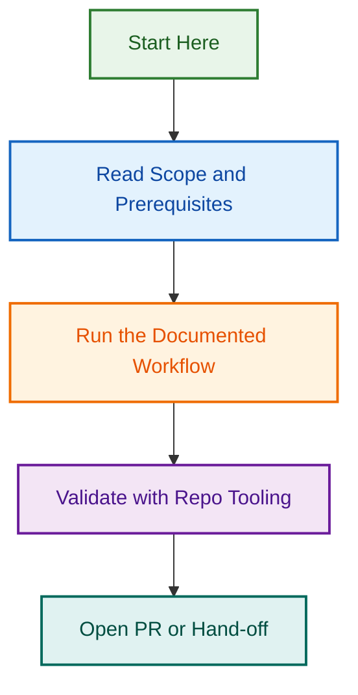

# Agentic Workflows

GitHub Agentic Workflows for LightSpeed release orchestration and automation.

## Contents

### Release Agent

**File:** `release.agent.js`

Orchestrates release automation with:

- Step 1: Initialize & Pre-flight checks
- Step 2: Agentic reasoning with confidence scoring
- Steps 3-9: 7-layer safety gates
- Step 10: Audit logging and report generation

Features:

- Dry-run mode with artifact generation
- Structured audit logging
- AUGMENT strategy: wraps Phase 4 shell scripts (no breaking changes)
- Patch/minor/major scopes with tiered approvals

**Usage:**

```bash

# Dry-run test

node release.agent.js --scope=patch --dry-run --skip-branch-check

# Live release

node release.agent.js --scope=patch
```

### Specifications

**File:** `release.md`

Declarative workflow specification defining:

- 10 workflow steps
- Input/output contracts
- Safety gates and approval flows
- Error handling strategies
- Dry-run mode behavior

## Status

Phase 5A MVP (Week 2, 2026-08-12)

- ✅ Core orchestrator implemented
- ✅ All 7 safety gates functional
- ✅ Dry-run support verified
- ⏳ Phase 4 shell script integration (Phase 5A Week 2 Days 3-4)

## References

- [AGENTIC_WORKFLOW_SPEC.md](../../projects/active/release-agentic-workflows-2026-08-11/AGENTIC_WORKFLOW_SPEC.md) — Design decisions
- [Phase 5A Project](../../projects/active/release-agentic-workflows-2026-08-11/) — Full project documentation

## Visual Workflow


