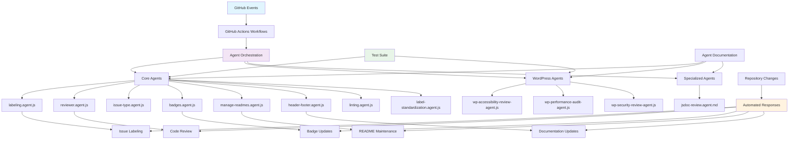
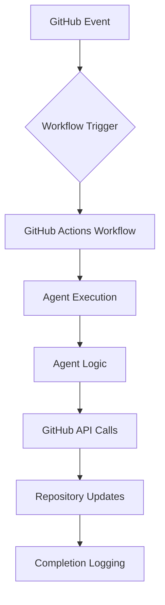

This directory contains all GitHub automation agents that power LightSpeed's repository workflows, including their implementations, documentation, and comprehensive test suites.

## 📊 Agent Ecosystem Architecture

## 🤖 Available Agents

| Agent | Description | Status | Tests |
|-------|-------------|---------|-------|
| [badges.agent.js](./badges.agent.js) | Manages repository badges and automation status indicators | ✅ Active | - |
| [header-footer.agent.js](./header-footer.agent.js) | Maintains consistent headers and footers across documentation | ✅ Active | - |
| [issue-type.agent.js](./issue-type.agent.js) | Automatically assigns issue types based on content analysis | ✅ Active | [✅ Tests](../__tests__/issue-type.agent.test.js) |
| [label-standardization.agent.js](./label-standardization.agent.js) | Ensures consistent labeling across repositories | ✅ Active | [✅ Tests](../__tests__/label-standardization.agent.test.js) |
| [labeling.agent.js](./labeling.agent.js) | Unified labeling system for issues and pull requests | ✅ Active | [✅ Tests](../__tests__/labeling.agent.test.js) |
| [linting.agent.js](./linting.agent.js) | Code quality and linting enforcement | ✅ Active | - |
| [manage-readmes.agent.js](./manage-readmes.agent.js) | Automated README generation and maintenance | ✅ Active | - |
| [reviewer.agent.js](./reviewer.agent.js) | Automated code review and feedback | ✅ Active | [✅ Tests](../__tests__/reviewer.agent.test.js) |

### WordPress-Specific Agents

| Agent | Description | Status |
|-------|-------------|---------|
| [wp-accessibility-review-agent.js](./wp-accessibility-review-agent.js) | WordPress accessibility compliance checking | ✅ Active |
| [wp-performance-audit-agent.js](./wp-performance-audit-agent.js) | WordPress performance analysis and optimization | ✅ Active |
| [wp-security-review-agent.js](./wp-security-review-agent.js) | WordPress security vulnerability scanning | ✅ Active |

### Agent Documentation

| Agent | Markdown Documentation |
|-------|----------------------|
| [badges.agent.md](./badges.agent.md) | Badge management specification |
| [header-footer.agent.md](./header-footer.agent.md) | Header/footer maintenance specification |
| [issue-type.agent.md](./issue-type.agent.md) | Issue type assignment specification |
| [jsdoc-review.agent.md](./jsdoc-review.agent.md) | JSDoc documentation review specification |
| [label-standardization.agent.md](./label-standardization.agent.md) | Label standardization specification |
| [labeling.agent.md](./labeling.agent.md) | Unified labeling specification |
| [linting.agent.md](./linting.agent.md) | Code linting specification |
| [manage-readmes.agent.md](./manage-readmes.agent.md) | README management specification |
| [reviewer.agent.md](./reviewer.agent.md) | Code review automation specification |

## 🔄 Active Workflows

These GitHub Actions workflows integrate with and trigger our agents:

### Core Automation Workflows

| Workflow | Triggers | Agent(s) Used | Description |
|----------|----------|---------------|-------------|
| **[labeling.yml](../../workflows/labeling.yml)** | `push`, `pull_request`, `issues` events | `labeling.agent.js` | Unified labeling for issues and PRs with status enforcement |
| **[reviewer.yml](../../workflows/reviewer.yml)** | `push`, `pull_request` on `develop` | `reviewer.agent.js` | Automated code review and feedback |
| **[planner.yml](../../workflows/planner.yml)** | `push`, `pull_request` on `develop` | Internal planner logic | Project planning automation |
| **[badges.yml](../../workflows/badges.yml)** | Path changes, `workflow_dispatch` | `badges.agent.js` | Badge status updates |
| **[manage-readmes.yml](../../workflows/manage-readmes.yml)** | Path changes, `workflow_dispatch` | `manage-readmes.agent.js` | README maintenance |
| **[header-footer.yml](../../workflows/header-footer.yml)** | File changes | `header-footer.agent.js` | Documentation consistency |

### Supporting Workflows

| Workflow | Purpose | Agent Integration |
|----------|---------|-------------------|
| **[lint.yml](../../workflows/lint.yml)** | Code quality enforcement | Works with `linting.agent.js` |
| **[jest-test-audit.yml](../../workflows/jest-test-audit.yml)** | Test execution for agents | Runs agent test suites |
| **[issue_metrics.yml](../../workflows/issue_metrics.yml)** | Repository health metrics | Data used by multiple agents |
| **[labels-issues-prs.yml](../../workflows/labels-issues-prs.yml)** | Legacy labeling support | Transitioning to unified system |
| **[pr-project-label.yml](../../workflows/pr-project-label.yml)** | Project-based PR labeling | Integrates with labeling system |
| **[project-meta-sync.yml](../../workflows/project-meta-sync.yml)** | Project metadata synchronization | Cross-repository consistency |
| **[release.yml](../../workflows/release.yml)** | Release automation | Coordinated release processes |

## 🧪 Test Suite

The [`__tests__/`](./__tests__/) directory contains comprehensive test suites for our agents:

| Test File | Coverage | Status |
|-----------|----------|--------|
| [issue-type.agent.test.js](./__tests__/issue-type.agent.test.js) | Issue type assignment logic | ✅ Active |
| [label-standardization.agent.test.js](./__tests__/label-standardization.agent.test.js) | Label consistency validation | ✅ Active |
| [labeling.agent.test.js](./__tests__/labeling.agent.test.js) | Unified labeling system | ✅ Active |
| [planner.agent.test.js](./__tests__/planner.agent.test.js) | Planning automation logic | ✅ Active |
| [reviewer.agent.test.js](./__tests__/reviewer.agent.test.js) | Code review automation | ✅ Active |
| [template.agent.test.js](./__tests__/template.agent.test.js) | Agent template validation | ✅ Template |

### Running Tests

Tests are automatically executed via the [`jest-test-audit.yml`](../../workflows/jest-test-audit.yml) workflow on push and pull request events.

## 📝 Available Prompts

Agent-related prompts available in the [`../prompts/`](../prompts/) directory:

| Prompt | Purpose | Usage |
|--------|---------|-------|
| [build-agent-and-tests.prompt.md](../prompts/build-agent-and-tests.prompt.md) | Create new agents with test suites | `/build-agent-and-tests` |

### Awesome Copilot Agent Prompts

| Prompt | Purpose | Usage |
|--------|---------|-------|
| [create-agentsmd.prompt.md](../prompts/awesome-copilot/create-agentsmd.prompt.md) | Scaffold new AGENTS.md files | `/create-agentsmd` |
| [declarative-agents.prompt.md](../prompts/awesome-copilot/declarative-agents.prompt.md) | Design declarative workflow agents | `/declarative-agents` |
| [finalize-agent-prompt.prompt.md](../prompts/awesome-copilot/finalize-agent-prompt.prompt.md) | Polish agent prompts | `/finalize-agent-prompt` |

## 📖 Instructions & Guidelines

Agent development instructions in the [`../instructions/`](../instructions/) directory:

### Core Instructions

| Instruction File | Purpose |
|------------------|---------|
| [agents.instructions.md](../instructions/agents.instructions.md) | Canonical index for all agent specifications |
| [ai-agents.instructions.md](../instructions/ai-agents.instructions.md) | Author, evaluate, and test AI agents; design workflows |
| [automation.instructions.md](../instructions/automation.instructions.md) | Automation standards and best practices |
| [automation-testing.instructions.md](../instructions/automation-testing.instructions.md) | Testing standards for automation components |

### Agent-Specific Instructions

| Instruction File | Purpose |
|------------------|---------|
| [agent-labels-issues-prs.instructions.md](../instructions/agents/agent-labels-issues-prs.instructions.md) | Labeling system specifications |
| [agent-planner.instructions.md](../instructions/agents/agent-planner.instructions.md) | Planning automation guidelines |
| [agent-project-meta-sync.instructions.md](../instructions/agents/agent-project-meta-sync.instructions.md) | Project metadata sync specifications |
| [agent-release.instructions.md](../instructions/agents/agent-release.instructions.md) | Release automation guidelines |
| [agent-reviewer.instructions.md](../instructions/agents/agent-reviewer.instructions.md) | Code review automation specifications |
| [labeling.instructions.md](../instructions/agents/labeling.instructions.md) | Unified labeling system guidelines |
| [linting.instructions.md](../instructions/agents/linting.instructions.md) | Code quality enforcement specifications |
| [metrics.instructions.md](../instructions/agents/metrics.instructions.md) | Repository metrics collection guidelines |
| [planner.instructions.md](../instructions/agents/planner.instructions.md) | Project planning automation |
| [release.instructions.md](../instructions/agents/release.instructions.md) | Release process automation |
| [reviewer.instructions.md](../instructions/agents/reviewer.instructions.md) | Automated review processes |

## 💬 Chat Modes

Agent-related chat modes available in the [`../chatmodes/awesome-copilot/`](../chatmodes/awesome-copilot/) directory:

| Chat Mode | Purpose | Install |
|-----------|---------|---------|
| [declarative-agents-architect.chatmode.md](../chatmodes/awesome-copilot/declarative-agents-architect.chatmode.md) | Architect declarative automation agents | [VS Code](https://aka.ms/awesome-copilot/install/chatmode) |
| [meta-agentic-project-scaffold.chatmode.md](../chatmodes/awesome-copilot/meta-agentic-project-scaffold.chatmode.md) | Meta agentic project creation assistant | [VS Code](https://aka.ms/awesome-copilot/install/chatmode) |
| [software-engineer-agent-v1.chatmode.md](../chatmodes/awesome-copilot/software-engineer-agent-v1.chatmode.md) | Expert-level software engineering agent | [VS Code](https://aka.ms/awesome-copilot/install/chatmode) |

## 🏗️ Architecture & Integration

### Agent Execution Flow

### Agent Dependencies

- **Node.js 20+**: All JavaScript agents
- **GitHub API**: Repository interaction
- **YAML Configs**: Label and issue type definitions
- **Test Framework**: Jest for automated testing

## 🚀 Getting Started

### Creating a New Agent

1. Use the [build-agent-and-tests.prompt.md](../prompts/build-agent-and-tests.prompt.md) prompt
2. Follow the [ai-agents.instructions.md](../instructions/ai-agents.instructions.md) guidelines
3. Reference existing agents for patterns and structure
4. Include comprehensive test coverage
5. Document the agent in both `.js` and `.md` formats

### Agent Development Standards

- **Security**: Never expose secrets or tokens
- **Reliability**: Include error handling and logging
- **Testing**: Comprehensive test suites required
- **Documentation**: Both technical specs and user guides
- **Integration**: Proper workflow integration

## 📚 Related Resources

| Resource | Purpose | Location |
|----------|---------|----------|
| **Main Agent Index** | Directory of all agent specifications | [agent.md](./agent.md) |
| **Custom Instructions** | Central Copilot/org standards | [../custom-instructions.md](../custom-instructions.md) |
| **Automation Governance** | Workflow and agent policies | [../AUTOMATION_GOVERNANCE.md](../AUTOMATION_GOVERNANCE.md) |
| **Global AI Rules** | Organization-wide AI guidelines | [../../AGENTS.md](../../AGENTS.md) |
| **Collections** | Curated agent toolkits | [../collections/](../collections/) |

---

> **Note**: This directory is actively maintained and automatically updated by our automation systems. For questions or issues, reference the [agent.md](./agent.md) index or open an issue with the `ai-ops:agents` label.
