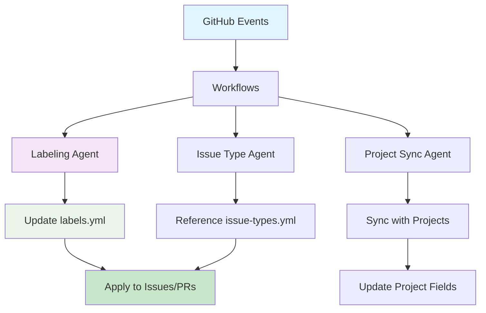

# ⚙️ Automation Configuration Directory

This directory contains all configuration files for LightSpeed organization-wide automation systems, including canonical label definitions, labeling rules, issue type mappings, and governance documentation.

## 📁 Directory Contents

### Core Configuration Files

- **`labels.yml`** - Canonical label definitions with colors, descriptions, and aliases
- **`labeler.yml`** - Automated labeling rules based on file paths and branch names
- **`issue-types.yml`** - Issue type mappings and categorization rules
- **`emoji.schema.yml`** - Emoji mapping for documentation headers

### Governance & Documentation

- **`AUTOMATION_GOVERNANCE.md`** - Complete automation governance policies and procedures
- **`BRANCHING_STRATEGY.md`** - Git branching conventions and PR workflow
- **`ISSUE_LABELS.md`** - Detailed issue label documentation
- **`PR_LABELS.md`** - Detailed PR label documentation
- **`README.md`** - This file

## 🔄 Automation System Architecture

## 🏷️ Label System

### Label Categories

The organization uses a comprehensive label taxonomy organized by category:

- **Status** (`status:*`) - Workflow progression
- **Priority** (`priority:*`) - Urgency levels
- **Type** (`type:*`) - Nature of work
- **Area** (`area:*`) - Codebase areas
- **Component** (`comp:*`) - Specific components
- **Language** (`lang:*`) - Programming languages
- **Meta** (`meta:*`) - Process and administration
- **Contributor** (`contrib:*`) - Community labels

See `labels.yml` for complete definitions.

## 🔐 Governance

### Approval Process for Changes

1. **Minor Changes** - Single approver:
   - Label description updates
   - Color adjustments
   - Documentation improvements

2. **Major Changes** - Platform Team approval:
   - New label categories
   - Workflow logic changes
   - Schema modifications

3. **Emergency Changes** - Post-approval review:
   - Security fixes
   - Critical bug fixes

See `AUTOMATION_GOVERNANCE.md` for complete procedures.

## 🤖 Integration with Agents

### Labeling Agent

- **File**: `../agents/labeling.agent.js`
- **Spec**: `../agents/labeling.agent.md`
- **Purpose**: Unified labeling system for issues and PRs
- **Config Reference**: `labels.yml`, `labeler.yml`, `issue-types.yml`

### Workflow Integration

- **Labeling Workflow**: `../workflows/labeling.yml`
- **Project Sync Workflow**: `../workflows/project-meta-sync.yml`
- **Label Sync Workflow**: `../workflows/label-sync.yml`

## 📊 Configuration Validation

All configuration files are validated through:

1. **YAML Syntax**: Validated on commit and in CI
2. **Schema Validation**: Against canonical schemas
3. **Referential Integrity**: Labels referenced in templates must exist in `labels.yml`
4. **Consistency Checks**: No duplicate or conflicting definitions

## 🔗 Related Documentation

- **[Automation Governance](../AUTOMATION_GOVERNANCE.md)** - Complete governance framework
- **[Agents Index](../agents/README.md)** - All automation agents
- **[Workflows](../workflows/README.md)** - GitHub Actions workflows
- **[Labeling Strategy](../../docs/LABEL_STRATEGY.md)** - Strategic approach to labeling
- **[Custom Instructions](../custom-instructions.md)** - AI and automation instructions

## 📋 Quick Reference

### Common Tasks

**Adding a new label:**

1. Edit `labels.yml` with name, color, description
2. Submit PR with justification
3. Requires 2 Platform Team approvals
4. Takes effect on next label-sync run

**Updating labeling rules:**

1. Edit `labeler.yml` with file/branch patterns
2. Test in sandbox repo
3. Submit PR with test results
4. Requires 1 approval

**Modifying issue types:**

1. Edit `issue-types.yml`
2. Update related templates
3. Submit PR with change rationale
4. Requires 1 approval

## 🚀 Getting Started

For new contributors or maintainers:

1. Read `AUTOMATION_GOVERNANCE.md` for complete policies
2. Review `labels.yml` for canonical label definitions
3. Check `labeler.yml` for existing automation rules
4. See `../agents/labeling.agent.md` for implementation details
5. Reference `../../docs/LABEL_STRATEGY.md` for strategic context

---

*This directory is the central hub for all LightSpeed automation configuration. See [Automation Governance](../AUTOMATION_GOVERNANCE.md) for complete policies and procedures.*

---

<!-- RANDOM FOOTER: ⚙️ Automated workflows, consistent standards! -->
