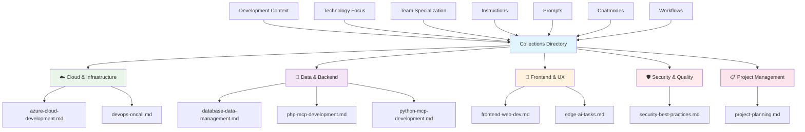

# 📚 Collections Directory


This directory contains curated collections of related instructions, prompts, chatmodes, and workflows organized by development context and technology focus.

## 🚀 Quick Start

Get started with LightSpeedWP collections in three steps:

1. **Clone the repository**

   ```sh
   git clone https://github.com/lightspeedwp/.github.git
   cd .github
   ```

2. **Install dependencies**
   - For Node.js/JS: `npm install`
   - For Python: `pip install -r requirements.txt` (if present)

3. **Use a collection**
   - Review available collections in the section below
   - Follow usage guidelines for each collection type
   - Example: Import or reference a collection in your workflow or automation script

For advanced usage, see the [Collections Index](./collections/README.md) and individual collection specs for configuration and integration options.

## 📊 Collections Organization



## 📁 Available Collections

### ☁️ Cloud & Infrastructure

- **[Azure Cloud Development](azure-cloud-development.md)** - Azure services, deployment, and cloud-native development

### 💾 Data & Backend

- **[Database Data Management](database-data-management.md)** - Database design, migrations, and data handling
- **[PHP MCP Development](php-mcp-development.md)** - PHP Model Context Protocol development
- **[Python MCP Development](python-mcp-development.md)** - Python Model Context Protocol development

### 🎨 Frontend & User Experience

- **[Frontend Web Development](frontend-web-dev.md)** - Modern web frontend development practices
- **[Edge AI Tasks](edge-ai-tasks.md)** - Edge computing and AI integration

### 🛡️ Security & Quality

- **[Security Best Practices](security-best-practices.md)** - Security guidelines and vulnerability prevention

### 📋 Project Management

- **[Project Planning](project-planning.md)** - Project planning, estimation, and management workflows

## 🎯 Collection Structure

Each collection includes:

### 📋 Instructions

- **Core Guidelines** - Fundamental principles and standards
- **Best Practices** - Proven approaches and methodologies
- **Troubleshooting** - Common issues and solutions
- **Configuration** - Setup and configuration guidance

### 💬 Chatmodes

- **Specialized Modes** - Context-specific AI conversation modes
- **Expert Personas** - Role-based AI assistance
- **Workflow Guides** - Step-by-step interactive guidance

### 🎨 Prompts

- **Task Templates** - Structured prompts for common tasks
- **Quality Checks** - Validation and review prompts
- **Generation Aids** - Content and code generation assistance

### ⚙️ Workflows

- **Automation Scripts** - GitHub Actions and automation
- **CI/CD Pipelines** - Continuous integration and deployment
- **Quality Gates** - Automated quality assurance

## 🔗 Integration Points

Collections integrate with:

- **[Instructions Directory](../instructions/README.md)** - Detailed instruction files
- **[Chatmodes Directory](../chatmodes/README.md)** - Specialized conversation modes
- **[Prompts Directory](../prompts/README.md)** - Structured AI prompts
- **[Agents Directory](../agents/README.md)** - Automation agents
- **[Workflows Directory](../workflows/README.md)** - GitHub Actions workflows

## 💡 Usage Guidelines

### 🎯 Selecting Collections

1. **Identify Context** - Choose collections that match your development context
2. **Layer Appropriately** - Use multiple collections for complex projects
3. **Follow Dependencies** - Respect collection dependencies and prerequisites
4. **Customize Wisely** - Adapt collections to project-specific needs

### 📚 Implementation

1. **Start with Basics** - Begin with core instructions and guidelines
2. **Add Automation** - Integrate relevant workflows and agents
3. **Enable AI Support** - Activate appropriate chatmodes and prompts
4. **Iterate Continuously** - Refine based on project feedback

### 🔄 Maintenance

- **Regular Updates** - Keep collections current with evolving practices
- **Cross-References** - Maintain accurate links between related resources
- **Feedback Integration** - Incorporate user feedback and lessons learned
- **Version Control** - Track changes and maintain compatibility

## 📊 Collection Metrics

Collections are evaluated based on:

- **Completeness** - Coverage of essential topics and scenarios
- **Accuracy** - Correctness and currency of information
- **Usability** - Ease of implementation and adoption
- **Integration** - Seamless workflow with other collections
- **Feedback** - Community and user satisfaction scores

## 🚀 Advanced Features

### 🔄 Dynamic Collections

- **Context-Aware Suggestions** - Collections adapt to project context
- **Automated Updates** - Collections update based on new best practices
- **Dependency Resolution** - Automatic handling of collection dependencies
- **Performance Monitoring** - Tracking collection effectiveness and usage

### 🎨 Customization Options

- **Project Templates** - Pre-configured collection combinations
- **Role-Based Views** - Collections filtered by team role or responsibility
- **Technology Stacks** - Collections optimized for specific tech stacks
- **Complexity Levels** - Beginner to advanced implementation paths

---

_Collections provide organized, contextual guidance for efficient development workflows. See [Instructions Index](../instructions/README.md) for complete documentation._

---

<!-- RANDOM FOOTER: 📚 Organized knowledge, accelerated development! -->
