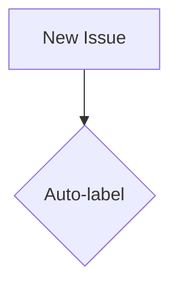

## What documentation is needed?

Many folder README files across the repository contain auto-generated or stale content, including outdated file listings, incorrect paths, and missing cross-references between major documentation indexes. This creates wayfinding issues and onboarding friction.

**Current state:**

- Auto-generated READMEs with outdated file lists
- Stale paths and references
- Missing cross-links between DOCS.md and DEVELOPMENT.md
- Mermaid diagrams without captions
- Poor discoverability of related documentation

**Desired state:**

- All `docs/**/README.md` files reflect current directory contents
- Accurate file listings and paths
- `DOCS.md` ↔ `DEVELOPMENT.md` bidirectional cross-links
- Every Mermaid diagram has a clear one-line caption
- Improved wayfinding and navigation

## Why is this documentation important?

**For contributors:**

- Accurate READMEs reduce onboarding time and confusion
- Clear cross-references help discover related documentation
- Diagram captions improve understanding and accessibility
- Better navigation supports self-service learning

**For maintainers:**

- Reduced support burden from lost or confused contributors
- Higher quality documentation reflects well on project professionalism
- Easier maintenance when structure is clearly documented

**Impact:**

- **Medium** - Onboarding friction increases ramp-up time
- **Medium** - Wayfinding issues waste contributor time
- **Low** - Damages perception of documentation quality

## Acceptance Criteria

- [ ] All `docs/**/README.md` files audited and updated
- [ ] File listings reflect actual current files (no missing or extra entries)
- [ ] All paths are accurate and link correctly
- [ ] `DOCS.md` contains clear link to `DEVELOPMENT.md` (and vice versa)
- [ ] Cross-link context explains relationship between the two indexes
- [ ] Every Mermaid diagram has a one-line caption above or below
- [ ] Captions are descriptive and accessible
- [ ] Manual verification of top-level and at least two subfolder READMEs
- [ ] Follows [WordPress documentation standards](https://developer.wordpress.org/coding-standards/inline-documentation/)
- [ ] Changelog entry prepared for PR

## Additional Context

**Folders to audit (minimum):**

- `/docs/` (root)
- `/docs/governance/`
- `/docs/workflows/`
- `/docs/agents/`
- `/.github/`
- `/.github/automation/`

**Cross-linking strategy:**
Add sections in both files:

**In DOCS.md:**

```markdown
## Related Documentation

- [DEVELOPMENT.md](./DEVELOPMENT.md) - Development setup, workflows, and technical guidelines
```

**In DEVELOPMENT.md:**

```markdown
## Related Documentation

- [DOCS.md](./DOCS.md) - Complete documentation index and content inventory
```

**Mermaid caption examples:**

```markdown
**Figure 1: Issue Labeling Workflow**


**Automation approach (optional):**

- Consider script to auto-generate README file listings
- Document generation process for future updates
- Add CI check to warn if READMEs are stale

**Telemetry (post-merge):**

- Manual review of updated READMEs for accuracy
- Spot-check cross-links resolve correctly
- User feedback on improved navigation

## References

- [DOCS.md](https://github.com/lightspeedwp/.github/blob/develop/DOCS.md)
- [DEVELOPMENT.md](https://github.com/lightspeedwp/.github/blob/develop/DEVELOPMENT.md)
- [Contribution Guidelines](../CONTRIBUTING.md)
- [Branching Strategy](.github/BRANCHING_STRATEGY.md)
- [Automation Governance](.github/AUTOMATION_GOVERNANCE.md)

---

### Definition of Ready (DoR)

- [ ] Documentation need is clear and well-defined
- [ ] Related docs/issues or files linked
- [ ] Acceptance criteria listed
- [ ] Estimate added: **Medium** (2-4 hours: audit, update, cross-link, captions)
- [ ] Folders to audit identified

### Definition of Done (DoD)

- [ ] All target folder READMEs updated and accurate
- [ ] DOCS ↔ DEVELOPMENT cross-links added and tested
- [ ] All Mermaid diagrams have captions
- [ ] Documentation meets org standards and guidelines
- [ ] Changelog entry prepared for PR (CHANGELOG.md)
- [ ] Documentation reviewed for clarity and accessibility
- [ ] Manual verification complete for key folders
- [ ] PR uses correct branch prefix (`docs/refresh-readmes`)

---

## Directions & Next Steps

1. Create feature branch: `docs/refresh-readmes`
2. Audit all `docs/**/README.md` files for accuracy
3. Update file listings to match current directory contents
4. Fix any broken or incorrect paths
5. Add bidirectional cross-links between DOCS.md and DEVELOPMENT.md
6. Add one-line captions to all Mermaid diagrams
7. Manual spot-check of updates
8. Update CHANGELOG.md
9. Submit PR with reference: `fixes #<issue_number>`
10. Tag @docs-team or maintainer for review

**Branch prefix:** `docs/`

**Suggested workflow:**

```bash
# Find all READMEs
find docs -name "README.md"

# Find all Mermaid diagrams without captions
git grep -B1 "```mermaid" | grep -v "^--" | grep -v "Figure"
```

See [Contribution Guidelines](../CONTRIBUTING.md) and [Coding Standards](../instructions/coding-standards.instructions.md).
