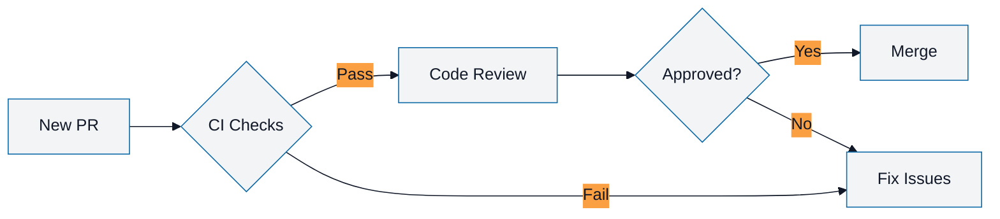

## A11y Summary

Mermaid diagrams across the repository currently lack consistent, accessible colour palettes and descriptive captions, creating readability and inclusion barriers for users with visual impairments, colour vision deficiencies, or those using assistive technologies.

**Issue:** Diagrams may use low-contrast colours, lack alternative text, and miss descriptive captions.

**Proposed Solution:** Adopt a standardised high-contrast colour palette for all Mermaid diagrams and add one-line captions that describe the diagram's purpose.

**Accessibility Impact:**
- Improves readability for users with low vision
- Supports users with colour vision deficiencies (deuteranopia, protanopia, tritanopia)
- Provides context for screen reader users
- Meets WCAG 2.1 AA contrast requirements

## Steps to Reproduce / Area to Check

**Areas with Mermaid diagrams:**
1. Review all documentation files containing Mermaid diagrams
2. Check contrast ratios of current colour schemes
3. Verify presence and quality of captions
4. Test with colour blindness simulation tools
5. Validate with screen readers (NVDA, JAWS, VoiceOver)

**Files to audit:**
```bash
# Find all Mermaid diagrams
git grep -l "```mermaid"
```

## Expected Behavior

**High-contrast palette:**
- **Surfaces:** Light: `#F3F4F6`, Dark: `#111827`
- **Accent 1:** Blue: `#0E6BA8` (primary actions, main flows)
- **Accent 2:** Orange: `#FA9F42` (secondary actions, highlights)
- Minimum contrast ratio: 4.5:1 for normal text, 3:1 for large text (WCAG 2.1 AA)

**Caption requirements:**
- One-line descriptive caption above or below each diagram
- Format: `**Figure N: [Description]**`
- Description explains diagram purpose, not implementation details
- Example: `**Figure 1: Issue Labeling Workflow**`

**Example accessible diagram:**
```markdown
**Figure 1: Pull Request Review Process**


```

## Environment / Devices

**Testing environments:**
- Browser rendering (Chrome, Firefox, Safari, Edge)
- GitHub's Mermaid renderer
- Dark mode and light mode
- Colour blindness simulators (e.g., Color Oracle, Chromatic Vision Simulator)
- Screen readers (NVDA, JAWS, VoiceOver)

## Acceptance Criteria

- [ ] Accessibility guideline document created (e.g., `docs/MERMAID_ACCESSIBILITY.md`)
- [ ] High-contrast palette defined and documented:
  - Surfaces: `#F3F4F6` (light), `#111827` (dark)
  - Accents: `#0E6BA8` (blue), `#FA9F42` (orange)
- [ ] Contrast ratios verified to meet WCAG 2.1 AA (minimum 4.5:1)
- [ ] At least top 5 most-viewed diagrams patched with new palette and captions
- [ ] All new diagrams required to follow palette (added to PR template/checklist)
- [ ] Caption format standardised: `**Figure N: [Description]**`
- [ ] Documentation includes examples and templates
- [ ] Testing performed with colour blindness simulators
- [ ] Accessibility standards referenced (WCAG 2.1 AA)
- [ ] Documentation/changelog updated
- [ ] PR uses correct branch prefix (`a11y/mermaid-palette`)
- [ ] Approved by at least one maintainer

## Additional Context

**WCAG 2.1 AA Requirements:**
- **1.4.3 Contrast (Minimum):** 4.5:1 for normal text, 3:1 for large text
- **1.4.11 Non-text Contrast:** 3:1 for graphical objects and UI components
- **1.1.1 Non-text Content:** Text alternatives for non-text content

**Colour palette rationale:**
- **Blue (`#0E6BA8`):** Professional, trustworthy, widely accessible
- **Orange (`#FA9F42`):** High visibility, good contrast with blue
- **Neutrals (`#F3F4F6`, `#111827`):** High contrast, easy on eyes
- Palette tested with deuteranopia, protanopia, and tritanopia simulations

**Implementation phases:**
1. **Phase 1 (this issue):** Define palette, create guidelines, patch top 5 diagrams
2. **Phase 2 (future):** Systematically update all existing diagrams
3. **Phase 3 (future):** Add automated linting for diagram accessibility

**Example `docs/MERMAID_ACCESSIBILITY.md` structure:**
```markdown
# Mermaid Diagram Accessibility Guidelines

## Colour Palette

[palette definition]

## Caption Format

[caption requirements]

## Templates

[copy-paste templates for common diagram types]

## Testing

[how to verify accessibility]
```

**Tooling:**
- Colour contrast checker: https://webaim.org/resources/contrastchecker/
- Colour blindness simulator: Color Oracle, Chromatic Vision Simulator
- Mermaid documentation: https://mermaid.js.org/config/theming.html

**Telemetry (post-merge):**
- Review sample of patched diagrams for contrast compliance
- Include a11y checklist in PR template
- Track adoption rate of new palette in subsequent PRs

## References

- [DOCS.md](https://github.com/lightspeedwp/.github/blob/develop/DOCS.md)
- [WCAG 2.1 Contrast (Minimum)](https://www.w3.org/WAI/WCAG21/Understanding/contrast-minimum.html)
- [WCAG 2.1 Non-text Contrast](https://www.w3.org/WAI/WCAG21/Understanding/non-text-contrast.html)
- [Mermaid Theming](https://mermaid.js.org/config/theming.html)
- [WebAIM Contrast Checker](https://webaim.org/resources/contrastchecker/)
- [Contribution Guidelines](../CONTRIBUTING.md)
- [Branching Strategy](.github/BRANCHING_STRATEGY.md)

---

### Definition of Ready (DoR)
- [ ] Issue/goal described
- [ ] Palette and standards defined
- [ ] Acceptance criteria mapped
- [ ] Estimate added: **Medium** (3-4 hours: guidelines, palette, patch diagrams)
- [ ] Top diagrams to patch identified

### Definition of Done (DoD)
- [ ] All acceptance criteria met
- [ ] Palette guidelines documented
- [ ] Top 5 diagrams patched and verified
- [ ] Contrast ratios verified with tools
- [ ] Documentation/changelog updated
- [ ] PR uses correct branch prefix (`a11y/mermaid-palette`)
- [ ] Stakeholder/maintainer reviewed
- [ ] A11y checklist completed

---

## Directions & Next Steps

1. Create feature branch: `a11y/mermaid-palette`
2. Create `docs/MERMAID_ACCESSIBILITY.md` with guidelines and palette
3. Identify top 5 most-viewed/critical diagrams to patch
4. Apply palette and captions to identified diagrams
5. Verify contrast ratios with WebAIM or similar tool
6. Test with colour blindness simulators
7. Update PR template to include diagram accessibility checklist
8. Update CHANGELOG.md
9. Submit PR with reference: `fixes #<issue_number>`
10. Tag @a11y-team or maintainer for review

**Branch prefix:** `a11y/`

**High-priority diagrams to patch first:**
- README.md main workflow diagram
- DOCS.md navigation/structure diagram
- DEVELOPMENT.md setup/workflow diagrams
- Key architecture diagrams in `docs/`

See [Contribution Guidelines](../CONTRIBUTING.md) and [Accessibility Guidelines](https://make.wordpress.org/accessibility/handbook/).
