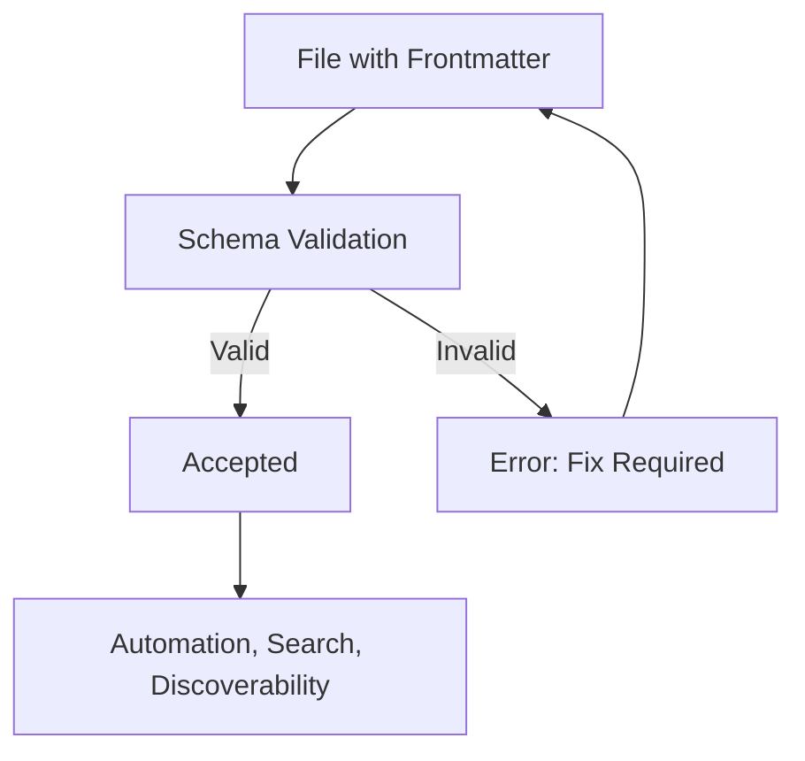

*Note: This file follows LightSpeedWP governance and metadata conventions as described in schema file ([./schemas/frontmatter.schema.json](./schemas/frontmatter.schema.json)).*

# Frontmatter Instructions

## Purpose

- Every documentation, agent, configuration, and markdown file must contain a valid YAML frontmatter block.
- Frontmatter enables automation, search, discoverability, and validation by humans and machines.

## Unified Frontmatter Fields

See the canonical [frontmatter schema](../../schemas/frontmatter.schema.json) for the full list and validation.

| Field        | Type     | Required | Description                                 |
| ------------ | -------- | -------- | ------------------------------------------- |
| title        | string   | yes      | Human-readable title                        |
| description  | string   | yes      | Short summary of the file's purpose         |
| version      | string   | yes      | Version string (e.g., v2.0)                 |
| created_date | string   | yes      | ISO date of creation (e.g., 2025-10-23)     |
| last_updated | string   | yes      | ISO date of last update (e.g., 2025-10-23)  |
| author       | string   | yes      | Main author or responsible party            |
| maintainer   | string   | yes      | Maintainer or team                          |
| owners       | string[] | no       | List of owners/maintainers                  |
| tags         | string[] | no       | Keywords for search/filtering               |
| status       | string   | no       | Current status (active, deprecated, etc.)   |
| stability    | string   | no       | Maturity expectation (stable, experimental) |
| deprecated   | boolean  | no       | Whether this file is deprecated             |
| replacement  | string   | no       | Path to replacement file if deprecated      |
| domain       | string   | no       | Classification domain                       |
| extraDomains | string[] | no       | Secondary classifications                   |
| license      | string   | no       | License identifier                          |
| mode         | string   | no       | Operational/content mode                    |
| references   | object[] | no       | Array of {path, description} objects        |

## Example

```yaml
$schema: "schemas/frontmatter.schema.json"
---
title: "Pattern Development Instructions"
description: "Instructions for developing block patterns."
version: "v2.0"
created_date: "2025-10-23"
last_updated: "2025-10-25"
author: "LightSpeedWP Team"
maintainer: "Ash Shaw"
owners:
  - "lightspeedwp/maintainers"
tags:
  - "lightspeed"
  - "patterns"
  - "instructions"
status: "active"
stability: "stable"
domain: "governance"
mode: "instruction"
deprecated: false
references:
  - path: "schemas/frontmatter.schema.json"
    description: "Unified frontmatter schema definition"
  - path: "docs/frontmatter-schema.md"
    description: "Frontmatter schema documentation"
  - path: "docs/YAML.md"
    description: "YAML frontmatter documentation"
---
```

## Validation

- All frontmatter must validate against the schema at `schemas/frontmatter.schema.json`
- VS Code and Copilot validate automatically if configured (see `.vscode/settings.json`).



## References

- [Unified Frontmatter Schema](../../schemas/frontmatter.schema.json)
- [Frontmatter Schema Documentation](../../docs/frontmatter-schema.md)
- [YAML Frontmatter Documentation](../../docs/YAML.md)
- [Chatmode Frontmatter Documentation](../../docs/CHATMODE-FRONTMATTER.md)
- [Tagging and Frontmatter Conventions](tagging-and-frontmatter-conventions.instructions.md)
- [VS Code Settings](../../.vscode/settings.json)

# LightSpeedWP Unified Frontmatter Conventions

**Version**: v2.0 | **Last Updated**: 2025-10-24 | **Author**: LightSpeedWP | **Maintainer**: Ash Shaw

These conventions merge **LightSpeedWP governance requirements** with **awesome-copilot tagging standards** to create a unified frontmatter system for all `.github` assets. This includes instructions (`*.instructions.md`), prompts (`*.prompt.md`), chat modes (`*.chatmode.md`), agents (`*.agent.md`), templates, and collection manifests.

**Key Integration Points:**

- LightSpeedWP governance fields (`file_type`, `version`, `author`, `maintainer`, `owners`)
- Awesome-copilot conventions (`mode`, `applyTo`, `stability`, `domain`, `deprecated`)
- GitHub/Copilot compatibility (validated against `../../schemas/frontmatter.schema.json`)

## Universal Required Fields (All File Types)

| Field          | Type                         | Applies To           | Required | Purpose                                                |
| -------------- | ---------------------------- | -------------------- | -------- | ------------------------------------------------------ |
| `file_type`    | string (const per file type) | all LightSpeed files | ✅       | Discriminator for schema validation                    |
| `description`  | string                       | all asset markdown   | ✅       | Human-readable summary (single sentence preferred)     |
| `title`        | string                       | governance files     | ✅\*     | Human-readable title (required for governance docs)    |
| `version`      | string (e.g., v1.1)          | governance files     | ✅\*     | Version string for governance tracking                 |
| `last_updated` | string (ISO date)            | governance files     | ✅\*     | Date of last update (YYYY-MM-DD format)                |
| `author`       | string                       | governance files     | 📋       | Main author or responsible party                       |
| `maintainer`   | string                       | governance files     | 📋       | Current maintainer                                     |
| `owners`       | array[string]                | team files           | 📋       | List of owners/maintainers (alternative to maintainer) |

## Awesome-Copilot Integration Fields

| Field          | Type                                                                                                  | Applies To          | Required | Purpose                                                             |
| -------------- | ----------------------------------------------------------------------------------------------------- | ------------------- | -------- | ------------------------------------------------------------------- |
| `mode`         | enum(`agent`,`ask`,`edit`)                                                                            | prompts, chat modes | 📋       | Execution style (contextual agent vs single-turn ask)               |
| `applyTo`      | glob string or array[string]                                                                          | instructions        | ✅\*     | Scope selectors for auto-application (instructions only)            |
| `model`        | string                                                                                                | prompts, chat modes | 📋       | Preferred AI model (e.g., "gpt-4", "claude-3")                      |
| `tools`        | array[string]                                                                                         | prompts, chat modes | 📋       | Available tools/capabilities                                        |
| `deprecated`   | boolean                                                                                               | all                 | 📋       | Signals exclusion from generated tables (generator skips when true) |
| `replacement`  | string (path)                                                                                         | deprecated assets   | ✅\*     | Points to canonical successor file (required if deprecated=true)    |
| `stability`    | enum(`stable`,`experimental`,`incubating`)                                                            | all                 | 📋       | Communicates maturity expectation                                   |
| `tags`         | array[string] (max 8)                                                                                 | all                 | 📋       | Taxonomy for discovery/filtering (limit 8 items)                    |
| `domain`       | enum(`wp-core`,`block-theme`,`plugin-hardening`,`perf`,`a11y`,`i18n`,`security`,`headless`,`generic`) | all                 | 📋       | Primary classification (choose one)                                 |
| `extraDomains` | array[string]                                                                                         | optional            | 📋       | Secondary classifications if needed                                 |
| `license`      | string                                                                                                | all                 | 📋       | License identifier (e.g., "GPL-3.0", "MIT")                         |
| `references`   | array[string]                                                                                         | all                 | 📋       | AI-focused references to related docs (relative paths)              |

**Legend**: ✅ = Required, 📋 = Recommended, ✅\* = Required conditionally

## LightSpeedWP Domain Taxonomy

**Primary Domains** (choose exactly one for `domain`):

- `wp-core` - WordPress core functionality, hooks, APIs
- `block-theme` - Block themes, FSE, theme.json, patterns
- `plugin-hardening` - Plugin security, validation, best practices
- `perf` - Performance optimization, caching, speed
- `a11y` - Accessibility, WCAG compliance, inclusive design
- `i18n` - Internationalization, localization, translations
- `security` - Security hardening, sanitization, authentication
- `headless` - Headless WordPress, APIs, decoupled architecture
- `generic` - General purpose, cross-domain, or unclassified

**Supplemental Tags** (use in `tags` array, max 8 total):

*Development*: `testing`, `lint`, `ci`, `automation`, `docs`, `validation`
*WordPress*: `rest`, `graphql`, `gutenberg`, `blocks`, `patterns`, `theme-json`
*Technical*: `api`, `data`, `editor`, `cli`, `deployment`, `logging`
*UX/Design*: `ux`, `design-tokens`, `accessibility`, `responsive`, `mobile`

**Tagging Rules**:

1. **Limit**: Max 8 tags total for clarity and performance
2. **Format**: Use lowercase kebab-case only (no spaces, no uppercase)
3. **No Duplication**: Don't repeat the chosen `domain` in `tags` (it's implicit)
4. **Consistency**: Prefer existing tags; only create new ones with clear reuse potential
5. **Specificity**: Be specific enough for discovery, general enough for reuse

## Deprecation Workflow

1. Mark legacy file with `deprecated: true` and add `replacement: 'relative/path/to/new-file.ext'`.
2. Keep content minimal: brief rationale + migration pointer.
3. Generator excludes deprecated assets from tables automatically (implemented in `update-readme.js`).
4. After one release cycle (or zero inbound references in link audit), remove the deprecated file.

## Stability Lifecycle

| Stability      | Intent                         | Change Expectations                       |
| -------------- | ------------------------------ | ----------------------------------------- |
| `experimental` | Early exploration              | Breaking changes likely                   |
| `incubating`   | Maturing, seeking feedback     | Minor structural tweaks possible          |
| `stable`       | Adopted, versioned conventions | Backward compatibility strongly preferred |

## File Type Specific Examples

### LightSpeed Governance File (Documentation)

```markdown
---
$schema: "schemas/frontmatter.schema.json"
file_type: "documentation"
title: "WordPress Security Guidelines"
description: "Security best practices for WordPress development"
version: "v2.1"
last_updated: "2025-10-24"
author: "LightSpeedWP"
maintainer: "Security Team"
domain: "security"
stability: "stable"
tags: ["guidelines", "best-practices", "wp-core"]
license: "GPL-3.0"
references:
  - "CONTRIBUTING.md"
  - "README.md"
  - ".github/README.md"
  - "schemas/frontmatter.schema.json"
---

# WordPress Security Guidelines

Content here...

---

## References

- [Contributing Guidelines](CONTRIBUTING.md) - For human contributors
- [Main Documentation](README.md) - Project overview
- [GitHub Documentation](.github/README.md) - Repository structure
- [Frontmatter Schema](schemas/frontmatter.schema.json) - Schema validation
```

### Copilot Instructions File

```markdown
---
description: "Secure coding guardrails for custom WP REST endpoints"
applyTo: "includes/api/**/*.php"
---

# Security Instructions for REST API Development

<!-- LightSpeed Metadata (in content) -->

**Domain**: security | **Stability**: stable | **Tags**: rest, plugin-hardening, validation

Follow these security practices when developing WordPress REST endpoints...
```

### Prompt File (Awesome-Copilot Style)

```markdown
---
description: "Generate performance remediation checklist for a WordPress site"
mode: ask
model: gpt-4o
domain: perf
stability: "stable"
tags: ["audit", "wp-core", "optimization"]
tools: ["terminal", "browser"]
---
```

### Chat Mode File

```markdown
---
description: "WordPress accessibility review specialist mode"
tools: ["browser", "accessibility-scanner"]
model: "claude-3"
domain: "a11y"
stability: "experimental"
tags: ["wcag", "review", "validation"]
---
```

### Agent File (LightSpeed)

```markdown
---
file_type: "agent"
name: "wp-security-scanner"
description: "Automated WordPress security vulnerability scanner"
version: "v1.0"
last_updated: "2025-10-24"
owners: ["lightspeedwp/security-team"]
category: "security"
domain: "security"
stability: "incubating"
tags: ["scanner", "vulnerabilities", "automation"]
status: "active"
---
```

## Collection Manifest Additions (`.collection.yml`)

Collections already use `tags:`. Add optional `stability:` and `domain:` keys aligned with above. Validation tooling may be extended to enforce.

## Schema Validation & Compatibility

**LightSpeed Schema**: All files are validated against `../../schemas/frontmatter.schema.json`
**Copilot Compatibility**: Instructions files are limited to `description` and `applyTo` only
**Awesome-Copilot Integration**: Domain taxonomy and stability lifecycle preserved

**Validation Tools**:

1. `validate-frontmatter.js` - Validates all .github files against schema
2. `validate-collections.js` - Extended to check domain and tag compliance
3. CI/CD integration - Rejects PRs with invalid frontmatter
4. VS Code validation - Real-time schema checking (if configured)

## Migration Strategy

**From Legacy LightSpeed**:

- Add `file_type` field to existing files
- Update `apply_to` → `applyTo` for instructions
- Add `domain` and `stability` fields

**From Awesome-Copilot**:

- Add LightSpeed governance fields (`version`, `author`, etc.) to documentation
- Ensure `domain` selection follows LightSpeed taxonomy
- Validate tag limits (8 max)

**GitHub Template Compatibility**:

- Issue/PR templates keep existing frontmatter structure
- Add optional `domain` and `tags` for categorization

## Authoring Checklist

**Required for All Files**:

- [ ] Includes `file_type` (except Copilot instructions)
- [ ] Has clear, concise `description` (<= 120 chars)
- [ ] Chooses exactly one `domain` from approved list
- [ ] Uses <= 8 meaningful tags (kebab-case)
- [ ] Sets appropriate `stability` level

**Required for Governance Files**:

- [ ] Includes `title`, `version`, `last_updated`
- [ ] Has `author` and/or `maintainer`/`owners`
- [ ] References related documentation

**Required for Copilot Files**:

- [ ] Specifies `mode` for prompts/chatmodes
- [ ] Lists `tools` if specialized
- [ ] Uses `applyTo` glob patterns for instructions

**Deprecation Process**:

- [ ] Sets `deprecated: true`
- [ ] Provides `replacement` path
- [ ] Updates references in other files
- [ ] Plans removal after one release cycle

---

---

📐 *Schema validated by LightSpeedWP — always compliant.*

[📋 Coding Standards](https://github.com/lightspeedwp/.github/blob/develop/instructions/coding-standards.instructions.md) · [🔗 Related Files](https://github.com/lightspeedwp/.github/tree/develop/instructions)
