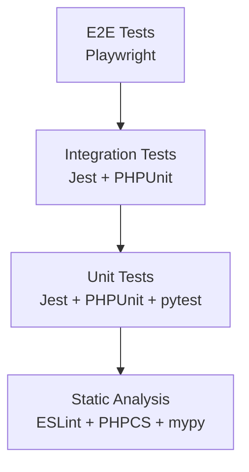
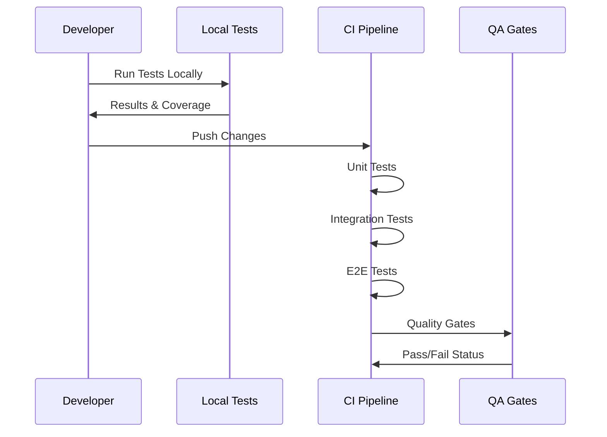
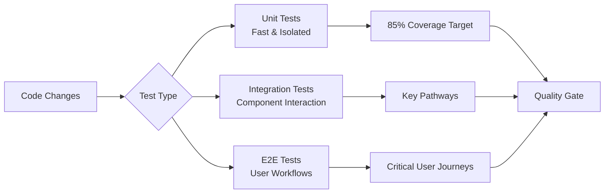

# 🧪 Test Standards Index


This is the canonical index for all LightSpeed test-related instruction files. **Version: v1.2** | **Last Updated: 2025-10-24**

## 📖 Overview

Our comprehensive testing strategy ensures code quality, reliability, and maintainability across all LightSpeed WordPress projects through:

- **Multi-layer Testing** - Unit, integration, and E2E test coverage
- **Automated Validation** - CI/CD integrated testing pipelines
- **Quality Gates** - Mandatory testing requirements for merges
- **Performance Monitoring** - Load and performance testing standards

# Role

You are the test style and quality enforcer for LightSpeed projects. Maintain consistent, reliable tests using the appropriate framework for each language.

# Configuration

- JS/TS: [Jest](https://jestjs.io/) ([`jest.config.js`](../../jest.config.js)), [Playwright](https://playwright.dev/) ([`playwright.config.js`](../../playwright.config.js))
- Shell: [Bats](https://bats-core.readthedocs.io/en/stable/)
- Python: [pytest](https://docs.pytest.org/en/stable/)
- Editor: [`.editorconfig`](../../.editorconfig)
- NPM scripts: `"test:js"`, `"test"`, `"e2e: test"` (see `package.json`)
- CI: Linting and test jobs run via [`.github/workflows/lint.yml`](../../.github/workflows/lint.yml)
- Pre-commit: Add Husky hook to run tests

# Setup

1. **Install dependencies:**

   ```bash
   npm install --save-dev jest @playwright/test playwright babel-jest husky
   pip install pytest
   brew install bats-core  # or via package manager
   ```

2. **Config files:**
   Ensure that `jest.config.js`, `playwright.config.js`, and `.editorconfig` exist.
3. **NPM scripts:**
   - `"test:js": "jest --coverage --forceExit --detectOpenHandles"`
   - `"test": "npm run test:js"`
   - `"e2e: test": "npx playwright test"`
4. **VS Code:**
   Use tasks (see `tasks.json`) for running unit and E2E tests.
5. **Pre-commit hook (recommended):**

   ```bash
   npx husky add .husky/pre-commit "npm test"
   ```

6. **CI:**
   Test suites run automatically on every PR.

# Rules & Practices

- JS/TS: Use Arrange-Act-Assert, descriptive test names, high coverage.
- E2E: Use Playwright with reporters, baseURL, and device configs.
- Shell: Use Bats for all \*.sh scripts.
- Python: Use pytest for all \*.py scripts.
- All: Avoid global state, ensure deterministic tests, use coverage tools.

# Running & Fixing

- Manually: `npm test`, `npx playwright test`, `pytest`
- VS Code: Use the Test Task Runner.
- CI: Tests are enforced via workflow.

# References

- [Jest docs](https://jestjs.io/)
- [Playwright docs](https://playwright.dev/)
- [Bats docs](https://bats-core.readthedocs.io/en/stable/)
- [pytest docs](https://docs.pytest.org/en/stable/)

## 🧪 Testing Pyramid



## 🔄 Test Execution Flow



## 🔗 Integration Points

### 📚 Related Documentation

- **[Agents Instructions](./agents.instructions.md)** - Testing automation agents
- **[Coding Standards Instructions](./coding-standards.instructions.md)** - Code quality standards
- **[Linting Instructions](./linting.instructions.md)** - Static code analysis
- **[Workflows Instructions](./workflows.instructions.md)** - CI/CD testing integration

### ⚙️ Tool Integration

- **Test Workflows** - Automated test execution in CI/CD
- **Coverage Reports** - Test coverage tracking and reporting
- **Performance Tests** - Load and performance testing automation

---

## 🛠️ Technology-Specific Test Standards

### 🌐 Frontend Testing

#### 🧪 [Jest Testing](./tests/tests-jest.instructions.md)

- **Purpose**: JavaScript/TypeScript unit and integration testing
- **Coverage**: Component testing, utility functions, API integrations
- **Integration**: CI/CD pipelines, coverage reporting
- **Tools**: Jest, Testing Library, MSW for mocking

#### 🎭 [Playwright Testing](./tests/tests-playwright.instructions.md)

- **Purpose**: End-to-end browser testing and automation
- **Coverage**: User workflows, cross-browser compatibility, visual testing
- **Integration**: CI/CD pipelines, parallel execution
- **Tools**: Playwright, Page Object Model, Visual comparisons

### ⚙️ Backend Testing

#### 🐘 [PHPUnit Testing](./tests/tests-phpunit.instructions.md)

- **Purpose**: PHP and WordPress unit/integration testing
- **Coverage**: Plugin functionality, theme components, API endpoints
- **Integration**: WordPress test suite, database testing
- **Tools**: PHPUnit, WP Test Suite, Brain Monkey

#### 🐍 [Python Testing](./tests/tests-python.instructions.md)

- **Purpose**: Python application and script testing
- **Coverage**: Automation scripts, data processing, API services
- **Integration**: pytest, coverage reporting, type checking
- **Tools**: pytest, coverage.py, mypy, tox

### 🔧 System Testing

#### 🦇 [Bats Testing](./tests/tests-bats.instructions.md)

- **Purpose**: Shell script and system integration testing
- **Coverage**: Deployment scripts, system configuration, CLI tools
- **Integration**: CI/CD pipelines, Docker containers
- **Tools**: Bats, ShellCheck, Docker test environments

## 📊 Test Coverage Matrix



## 💡 Best Practices

### ✅ Testing Standards

- **Test-Driven Development** - Write tests before implementation
- **Coverage Requirements** - Minimum 85% code coverage for critical paths
- **Performance Testing** - Include performance benchmarks
- **Accessibility Testing** - Validate WCAG compliance

### 🔄 CI/CD Integration

- **Automated Execution** - All tests run on every PR
- **Parallel Execution** - Optimize test execution time
- **Failure Reporting** - Clear error messages and debugging info
- **Environment Consistency** - Identical test environments

### 📈 Continuous Improvement

- **Test Maintenance** - Regular review and updates
- **Flaky Test Detection** - Monitor and fix unreliable tests
- **Performance Monitoring** - Track test execution times
- **Coverage Analysis** - Identify untested code paths

## 🔗 Cross-References

### 📚 Related Instructions

- **[Coding Standards Instructions](./coding-standards.instructions.md)** - Code quality requirements
- **[Linting Instructions](./linting.instructions.md)** - Static analysis integration
- **[Workflows Instructions](./workflows.instructions.md)** - CI/CD test automation
- **[Agents Instructions](./agents.instructions.md)** - Test automation agents

### 🎯 Specialized Resources

- **[WordPress Instructions](./wordpress.instructions.md)** - WordPress-specific testing
- **[Performance Instructions](./performance.instructions.md)** - Performance testing standards
- **[Security Instructions](./security.instructions.md)** - Security testing requirements
- **[Accessibility Instructions](./a11y.instructions.md)** - Accessibility testing standards

---

*This testing framework ensures reliable, maintainable code across the LightSpeedWP organization. See [Automation Governance](../AUTOMATION_GOVERNANCE.md) for quality assurance policies.*

---

<!-- RANDOM FOOTER: 🧪 Thorough testing, reliable software! -->
---

---

📐 *Schema validated by LightSpeedWP — always compliant.*

[📋 Coding Standards](https://github.com/lightspeedwp/.github/blob/develop/instructions/coding-standards.instructions.md) · [🔗 Related Files](https://github.com/lightspeedwp/.github/tree/develop/instructions)
