## 📋 Instructions Directory

This directory contains comprehensive development instructions, standards, and guidelines that govern all LightSpeedWP projects and automation systems.

## 📊 Instructions Architecture

```mermaid
graph TB
    A[Instructions Directory] --> B[🤖 Automation & AI]
    A --> C[💻 Development Standards]
    A --> D[🏗️ Architecture & Workflows]
    A --> E[📚 Documentation & Communication]
    A --> F[🔗 Integration & Security]

    B --> B1[automation.instructions.md]
    B --> B2[awesome-copilot.instructions.md]
    B --> B3[automation.instructions.md]
    B --> B4[automation-testing.instructions.md]
    B --> B5[copilot.instructions.md]

    C --> C1[coding-standards.instructions.md]
    C --> C2[linting.instructions.md]
    C --> C3[quality-assurance.instructions.md]
    C --> C4[inline-docs.instructions.md]

    D --> D1[workflows.instructions.md]
    D --> D2[wordpress.instructions.md]
    D --> D3[gitops.instructions.md]

    E --> E1[docs.instructions.md]
    E --> E2[documentation-formats.instructions.md]

    F --> F1[security.instructions.md]
    F --> F2[ci-cd.instructions.md]

    G[Project Implementation] --> A
    H[Agent Systems] --> B
    I[Code Quality] --> C
    J[Workflow Automation] --> D
    K[Knowledge Management] --> E

    style A fill:#e1f5fe
    style B fill:#f3e5f5
    style C fill:#e8f5e8
    style D fill:#fff3e0
    style E fill:#fce4ec
```

## 📁 Core Instruction Categories

### 🤖 Automation & AI

- **[Automation Instructions](automation.instructions.md)** - Agents, labeling, release, metrics, planning, reporting, metadata
- **[Meta Instructions](meta.instructions.md)** - Front matter, badges, references, quirky footers automation
- **[Copilot Instructions](copilot.instructions.md)** - GitHub Copilot configuration and usage

### 💻 Development Standards

- **[Coding Standards Instructions](coding-standards.instructions.md)** - Unified coding standards across all projects
- **[Languages Instructions](languages.instructions.md)** - JS/TS linting, JSON, YAML, JSDoc, Actions validation
- **[Quality Assurance Instructions](quality-assurance.instructions.md)** - Testing pyramid, Jest, coverage, CI/CD
- **[Documentation Formats Instructions](documentation-formats.instructions.md)** - Markdown, frontmatter, Mermaid, accessibility
- **[Security Instructions](security.instructions.md)** - Security best practices and standards

### 🏗️ Architecture & Workflows

- **[Workflows Instructions](workflows.instructions.md)** - GitHub Actions and CI/CD standards
- **[Tools Instructions](tools.instructions.md)** - Development tool configuration
- **[TaskSync Instructions](tasksync.instructions.md)** - Task synchronization protocol

### 📚 Documentation & Community

- **[Documentation Instructions](docs.instructions.md)** - Documentation standards and practices
- **[Community Standards Instructions](community-standards.instructions.md)** - File organisation, naming, README, saved replies
- **[Issues Instructions](issues.instructions.md)** - Issue creation and management guidelines
- **[PR Creation Instructions](pr-creation.instructions.md)** - Pull request creation and management guidelines
- **[Inline TXT Instructions](inline-txt.instructions.md)** - Plain text documentation
- **[Inline XML Instructions](inline-xml.instructions.md)** - XML documentation standards
- **[Inline YAML Instructions](Inline-yaml.instructions.md)** - YAML inline documentation

### 🏷️ Organization & Governance

- **[Documentation Formats Instructions](documentation-formats.instructions.md)** - Markdown, frontmatter, Mermaid, accessibility
- **[Naming Conventions Instructions](naming-conventions.instructions.md)** - File and variable naming
- **[Tagging and Frontmatter Conventions](tagging-and-frontmatter-conventions.instructions.md)** - Tagging standards
- **[File Management Guidelines](file-management-guidelines.instructions.md)** - File organization standards

## 🔗 Integration Points

Instructions integrate with:

- **[Agents Directory](../agents/README.md)** - Automation implementation
- **[Workflows Directory](../workflows/README.md)** - CI/CD implementation
- **[Prompts Directory](../prompts/README.md)** - Structured AI prompts
- **[Reports Directory](../reports/README.md)** - Generated reports and artifacts

## 💡 Usage Guidelines

### 📚 Finding Instructions

1. **Start with Core** - Begin with core instruction categories for your domain
2. **Check Specializations** - Look for technology-specific instructions
3. **Review Subdirectories** - Explore specialized subdirectories for detailed guidance
4. **Cross-Reference** - Use integration points to find related resources

### 🎯 Implementation

1. **Follow Hierarchy** - Apply general instructions before specific ones
2. **Check Dependencies** - Ensure prerequisite instructions are followed
3. **Validate Compliance** - Use automation to verify instruction adherence
4. **Update Regularly** - Keep implementation current with instruction updates

### 🔄 Maintenance

- **Version Control** - Track instruction changes and their impact
- **Automation Integration** - Ensure instructions are reflected in automation
- **Feedback Loop** - Incorporate learnings back into instruction updates
- **Cross-Reference Accuracy** - Maintain accurate links between related instructions

## ⚠️ Compliance Requirements

### 🛡️ Mandatory Instructions

Certain instructions are mandatory for all LightSpeedWP projects:

- **Coding Standards** - Must be followed in all code contributions
- **Security Guidelines** - Required for all production code
- **Testing Standards** - Minimum testing requirements must be met
- **Documentation Standards** - All code must meet documentation requirements

### 🤖 Automated Enforcement

Many instructions are automatically enforced through:

- **GitHub Actions** - Workflow validation and compliance checking
- **AI Agents** - Automated review and correction
- **Quality Gates** - Automated blocking of non-compliant changes
- **Metrics Collection** - Continuous compliance monitoring

## 📊 Instruction Metrics

Instructions are tracked for:

- **Adoption Rate** - How widely instructions are followed
- **Compliance Score** - Automated compliance measurement
- **Update Frequency** - How often instructions are updated
- **Community Feedback** - User satisfaction and effectiveness ratings

---

*This directory provides the foundation for consistent, high-quality development across the LightSpeedWP organization. See [Automation Governance](../../docs/AUTOMATION_GOVERNANCE.md) for enforcement policies.*

---

<!-- RANDOM FOOTER: 📋 Clear instructions, consistent results! -->
