## 📋 Instructions Directory

This directory contains comprehensive development instructions, standards, and guidelines that govern all LightSpeedWP projects and automation systems.

## 📊 Instructions Architecture

```mermaid
graph TB
    A[Instructions Directory] --> B[🤖 Automation & AI]
    A --> C[💻 Development Standards]
    A --> D[🏗️ Architecture & Workflows]
    A --> E[📚 Documentation & Communication]
    A --> F[🔗 Integration & Security]

    B --> B1[agents.instructions.md]
    B --> B2[awesome-copilot.instructions.md]
    B --> B3[automation.instructions.md]
    B --> B4[automation-testing.instructions.md]
    B --> B5[copilot.instructions.md]

    C --> C1[coding-standards.instructions.md]
    C --> C2[linting.instructions.md]
    C --> C3[tests.instructions.md]
    C --> C4[inline-docs.instructions.md]

    D --> D1[workflows.instructions.md]
    D --> D2[wordpress.instructions.md]
    D --> D3[gitops.instructions.md]

    E --> E1[docs.instructions.md]
    E --> E2[markdown.instructions.md]
    E --> E3[frontmatter.instructions.md]

    F --> F1[security.instructions.md]
    F --> F2[ci-cd.instructions.md]

    G[Project Implementation] --> A
    H[Agent Systems] --> B
    I[Code Quality] --> C
    J[Workflow Automation] --> D
    K[Knowledge Management] --> E

    style A fill:#e1f5fe
    style B fill:#f3e5f5
    style C fill:#e8f5e8
    style D fill:#fff3e0
    style E fill:#fce4ec
```

## 📁 Core Instruction Categories

### 🤖 Automation & AI

- **[Agents Instructions](agents.instructions.md)** - AI agent specifications and automation standards
- **[Awesome Copilot Instructions](awesome-copilot.instructions.md)** - Advanced Copilot usage and configuration
- **[Automation Instructions](automation.instructions.md)** - General automation guidelines and best practices
- **[Automation Testing Instructions](automation-testing.instructions.md)** - Testing strategies for automation systems
- **[Copilot Instructions](copilot.instructions.md)** - GitHub Copilot configuration and usage

### 💻 Development Standards

- **[Coding Standards Instructions](coding-standards.instructions.md)** - Unified coding standards across all projects
- **[Linting Instructions](linting.instructions.md)** - Code quality and linting standards
- **[Testing Instructions](tests.instructions.md)** - Comprehensive testing strategies and standards
- **[Inline Documentation Instructions](inline-docs.instructions.md)** - Code documentation standards

### 🏗️ Architecture & Workflows

- **[Workflows Instructions](workflows.instructions.md)** - GitHub Actions and CI/CD standards
- **[WordPress Instructions](wordpress.instructions.md)** - WordPress-specific development guidelines
- **[GitOps Instructions](gitops.instructions.md)** - Git-based operations and deployment strategies

### 📚 Documentation & Communication

- **[Documentation Instructions](docs.instructions.md)** - Documentation standards and practices
- **[Markdown Instructions](markdown.instructions.md)** - Markdown formatting and style guidelines
- **[Issues Instructions](issues.instructions.md)** - Issue creation and management guidelines
- **[Reviews Instructions](reviews.instructions.md)** - Code review processes and standards

## 🎯 Specialized Instructions

### 🔧 Technology-Specific

- **[PHP Instructions](php.instructions.md)** - PHP development standards
- **[JavaScript Instructions](js.instructions.md)** - JavaScript and TypeScript guidelines
- **[JSON Instructions](json.instructions.md)** - JSON formatting and validation
- **[Theme JSON Instructions](theme-json.instructions.md)** - WordPress theme.json configuration

### 🧪 Testing & Quality

- **[Playwright Tests Instructions](playwright-tests.instructions.md)** - End-to-end testing with Playwright
- **[Performance Instructions](performance.instructions.md)** - Performance optimization guidelines
- **[Security Instructions](security.instructions.md)** - Security best practices and standards

### 🎨 Design & Patterns

- **[Pattern Development Instructions](pattern-development.instructions.md)** - Design pattern creation guidelines
- **[Block Development Instructions](blocks.instructions.md)** - WordPress block development standards
- **[Accessibility Instructions](a11y.instructions.md)** - Accessibility compliance and testing

## 📂 Specialized Subdirectories

### 🤖 agents/

Agent-specific instruction files for individual automation agents:

- `badges.instructions.md` - Badge generation and management
- `header-footer.instructions.md` - Header/footer automation
- `jsdoc-review.instructions.md` - JSDoc review automation
- `labeling.instructions.md` - Issue and PR labeling automation
- `linting.instructions.md` - Automated linting processes
- `manage-readmes.instructions.md` - README maintenance automation
- `metrics.instructions.md` - Metrics collection and reporting
- `planner.instructions.md` - Project planning automation
- `project-meta-sync.instructions.md` - Project metadata synchronization
- `release.instructions.md` - Release management automation
- `reviewer.instructions.md` - Automated code review processes

### 🎨 awesome-copilot/

Advanced Copilot instructions for specialized domains:

- `a11y.instructions.md` - Accessibility-focused Copilot usage
- `angular.instructions.md` - Angular development with Copilot
- `ai-prompt-engineering-safety-best-practices.instructions.md` - Safe AI prompt engineering
- `bicep-code-best-practices.instructions.md` - Azure Bicep development standards
- And many more specialized instruction files...

### 💬 chatmodes/

Instructions for specialized AI conversation modes:

- `awesome-copilot.chatmodes.md` - Advanced chatmode configurations
- Various chatmode-specific instruction files

### 🎯 prompts/

Prompt-specific instruction files:

- `awesome-copilot.prompts.md` - Advanced prompt engineering instructions

## 🔗 Integration Points

Instructions integrate with:

- **[Agents Directory](../agents/README.md)** - Automation implementation
- **[Workflows Directory](../workflows/README.md)** - CI/CD implementation
- **[Chatmodes Directory](../chatmodes/README.md)** - AI conversation modes
- **[Prompts Directory](../prompts/README.md)** - Structured AI prompts
- **[Collections Directory](../collections/README.md)** - Curated instruction sets

## 💡 Usage Guidelines

### 📚 Finding Instructions

1. **Start with Core** - Begin with core instruction categories for your domain
2. **Check Specializations** - Look for technology-specific instructions
3. **Review Subdirectories** - Explore specialized subdirectories for detailed guidance
4. **Cross-Reference** - Use integration points to find related resources

### 🎯 Implementation

1. **Follow Hierarchy** - Apply general instructions before specific ones
2. **Check Dependencies** - Ensure prerequisite instructions are followed
3. **Validate Compliance** - Use automation to verify instruction adherence
4. **Update Regularly** - Keep implementation current with instruction updates

### 🔄 Maintenance

- **Version Control** - Track instruction changes and their impact
- **Automation Integration** - Ensure instructions are reflected in automation
- **Feedback Loop** - Incorporate learnings back into instruction updates
- **Cross-Reference Accuracy** - Maintain accurate links between related instructions

## ⚠️ Compliance Requirements

### 🛡️ Mandatory Instructions

Certain instructions are mandatory for all LightSpeedWP projects:

- **Coding Standards** - Must be followed in all code contributions
- **Security Guidelines** - Required for all production code
- **Testing Standards** - Minimum testing requirements must be met
- **Documentation Standards** - All code must meet documentation requirements

### 🤖 Automated Enforcement

Many instructions are automatically enforced through:

- **GitHub Actions** - Workflow validation and compliance checking
- **AI Agents** - Automated review and correction
- **Quality Gates** - Automated blocking of non-compliant changes
- **Metrics Collection** - Continuous compliance monitoring

## 📊 Instruction Metrics

Instructions are tracked for:

- **Adoption Rate** - How widely instructions are followed
- **Compliance Score** - Automated compliance measurement
- **Update Frequency** - How often instructions are updated
- **Community Feedback** - User satisfaction and effectiveness ratings

---

*This directory provides the foundation for consistent, high-quality development across the LightSpeedWP organization. See [Automation Governance](../AUTOMATION_GOVERNANCE.md) for enforcement policies.*

---

<!-- RANDOM FOOTER: 📋 Clear instructions, consistent results! -->
