## 📋 Instructions Directory

This directory contains comprehensive development instructions, standards, and guidelines that govern all LightSpeedWP projects and automation systems.

## 📊 Instructions Architecture

```mermaid
graph TB
    A[Instructions Directory] --> B[🤖 Automation & AI]
    A --> C[💻 Development Standards]
    A --> D[🏗️ Architecture & Workflows]
    A --> E[📚 Documentation & Communication]
    A --> F[🔗 Integration & Security]

    B --> B1[agents.instructions.md]
    B --> B2[awesome-copilot.instructions.md]
    B --> B3[automation.instructions.md]
    B --> B4[automation-testing.instructions.md]
    B --> B5[copilot.instructions.md]

    C --> C1[coding-standards.instructions.md]
    C --> C2[linting.instructions.md]
    C --> C3[tests.instructions.md]
    C --> C4[inline-docs.instructions.md]

    D --> D1[workflows.instructions.md]
    D --> D2[wordpress.instructions.md]
    D --> D3[gitops.instructions.md]

    E --> E1[docs.instructions.md]
    E --> E2[markdown.instructions.md]
    E --> E3[frontmatter.instructions.md]

    F --> F1[security.instructions.md]
    F --> F2[ci-cd.instructions.md]

    G[Project Implementation] --> A
    H[Agent Systems] --> B
    I[Code Quality] --> C
    J[Workflow Automation] --> D
    K[Knowledge Management] --> E

    style A fill:#e1f5fe
    style B fill:#f3e5f5
    style C fill:#e8f5e8
    style D fill:#fff3e0
    style E fill:#fce4ec
```

## 📁 Core Instruction Categories

### 🤖 Automation & AI

- **[Agents Instructions](agents.instructions.md)** - AI agent specifications and automation standards
- **[Copilot Instructions](copilot.instructions.md)** - GitHub Copilot configuration and usage
- **[Agent Badges Instructions](agent-badges.instructions.md)** - Badge generation and management
- **[Agent Branding Instructions](agent-branding.instructions.md)** - Header/footer automation
- **[Agent Design Instructions](agent-design.instructions.md)** - AI agent development guidelines
- **[Agent Labeling Instructions](agent-labeling.instructions.md)** - Automated labeling systems
- **[Agent Linting Instructions](agent-linting.instructions.md)** - Automated code quality enforcement
- **[Agent Metrics Instructions](agent-metrics.instructions.md)** - Repository metrics collection
- **[Agent Planner Instructions](agent-planner.instructions.md)** - Project planning automation
- **[Agent Project Meta Sync Instructions](agent-project-meta-sync.instructions.md)** - Project metadata synchronization
- **[Agent Release Instructions](agent-release.instructions.md)** - Release management automation
- **[Agent Reporting Instructions](agent-reporting.instructions.md)** - Report generation standards
- **[Agent Reviewer Instructions](agent-reviewer.instructions.md)** - Automated code review processes

### 💻 Development Standards

- **[Coding Standards Instructions](coding-standards.instructions.md)** - Unified coding standards across all projects
- **[Linting Instructions](linting.instructions.md)** - Code quality and linting standards
- **[Testing Instructions](tests.instructions.md)** - Comprehensive testing strategies and standards
- **[Inline Documentation Instructions](inline-docs.instructions.md)** - Code documentation standards
- **[JavaScript WordPress Instructions](javascript-wordpress.instructions.md)** - WordPress JavaScript development
- **[JSON Schema Instructions](json-schema.instructions.md)** - JSON schema creation and validation
- **[Security Instructions](security.instructions.md)** - Security best practices and standards

### 🏗️ Architecture & Workflows

- **[Workflows Instructions](workflows.instructions.md)** - GitHub Actions and CI/CD standards
- **[Tools Instructions](tools.instructions.md)** - Development tool configuration
- **[TaskSync Instructions](tasksync.instructions.md)** - Task synchronization protocol

### 📚 Documentation & Communication

- **[Documentation Instructions](docs.instructions.md)** - Documentation standards and practices
- **[Markdown Instructions](markdown.instructions.md)** - Markdown formatting and style guidelines
- **[Issues Instructions](issues.instructions.md)** - Issue creation and management guidelines
- **[PR Creation Instructions](pr-creation.instructions.md)** - Pull request creation and management guidelines
- **[README Instructions](readme.instructions.md)** - README file standards
- **[Saved Replies Instructions](saved-replies.instructions.md)** - GitHub saved replies management

### 🎯 Specialized Instructions

### 🔧 Technology-Specific

- **[Linting CSS Instructions](linting-css.instructions.md)** - CSS/SCSS linting standards
- **[Linting HTML Instructions](linting-html.instructions.md)** - HTML validation standards
- **[Linting JavaScript Instructions](linting-javascript.instructions.md)** - JavaScript/TypeScript linting
- **[Linting JSON Instructions](linting-json.instructions.md)** - JSON validation standards
- **[Linting Markdown Instructions](linting-markdown.instructions.md)** - Markdown linting standards
- **[Linting PHP Instructions](linting-php.instructions.md)** - PHP linting standards
- **[Linting Python Instructions](linting-python.instructions.md)** - Python linting standards
- **[Linting Shell Instructions](linting-shell.instructions.md)** - Shell script linting
- **[Linting Tests Instructions](linting-tests.instructions.md)** - Test linting standards
- **[Linting YAML Instructions](linting-yaml.instructions.md)** - YAML linting standards

### 🧪 Testing & Quality

- **[Tests Bats Instructions](tests-bats.instructions.md)** - Shell script testing with Bats
- **[Tests Jest Instructions](tests-jest.instructions.md)** - JavaScript testing with Jest
- **[Tests PHPUnit Instructions](tests-phpunit.instructions.md)** - PHP testing with PHPUnit
- **[Tests Playwright Instructions](tests-playwright.instructions.md)** - E2E testing with Playwright
- **[Tests Python Instructions](tests-python.instructions.md)** - Python testing standards

### 🎨 Design & Patterns

- **[Mermaid Diagrams Instructions](mermaid-diagrams.instructions.md)** - Diagram creation standards
- **[Accessibility Instructions](a11y.instructions.md)** - Accessibility compliance guidelines

### 📝 Content & Documentation

- **[Inline CSS Instructions](inline-css.instructions.md)** - CSS inline documentation
- **[Inline I18n Instructions](inline-i18n.instructions.md)** - Internationalization standards
- **[Inline JSDoc Instructions](inline-jsdoc.instructions.md)** - JavaScript documentation
- **[Inline Markdown Instructions](inline-markdown.instructions.md)** - Markdown inline docs
- **[Inline PHPDoc Instructions](inline-phpdoc.instructions.md)** - PHP documentation standards
- **[Inline TXT Instructions](inline-txt.instructions.md)** - Plain text documentation
- **[Inline XML Instructions](inline-xml.instructions.md)** - XML documentation standards
- **[Inline YAML Instructions](Inline-yaml.instructions.md)** - YAML inline documentation

### 🏷️ Organization & Governance

- **[Frontmatter Instructions](frontmatter.instructions.md)** - YAML frontmatter standards
- **[Naming Conventions Instructions](naming-conventions.instructions.md)** - File and variable naming
- **[Tagging and Frontmatter Conventions](tagging-and-frontmatter-conventions.instructions.md)** - Tagging standards
- **[File Management Guidelines](file-management-guidelines.instructions.md)** - File organization standards

## 🔗 Integration Points

Instructions integrate with:

- **[Agents Directory](../agents/README.md)** - Automation implementation
- **[Workflows Directory](../workflows/README.md)** - CI/CD implementation
- **[Prompts Directory](../prompts/README.md)** - Structured AI prompts
- **[Reports Directory](../reports/README.md)** - Generated reports and artifacts

## 💡 Usage Guidelines

### 📚 Finding Instructions

1. **Start with Core** - Begin with core instruction categories for your domain
2. **Check Specializations** - Look for technology-specific instructions
3. **Review Subdirectories** - Explore specialized subdirectories for detailed guidance
4. **Cross-Reference** - Use integration points to find related resources

### 🎯 Implementation

1. **Follow Hierarchy** - Apply general instructions before specific ones
2. **Check Dependencies** - Ensure prerequisite instructions are followed
3. **Validate Compliance** - Use automation to verify instruction adherence
4. **Update Regularly** - Keep implementation current with instruction updates

### 🔄 Maintenance

- **Version Control** - Track instruction changes and their impact
- **Automation Integration** - Ensure instructions are reflected in automation
- **Feedback Loop** - Incorporate learnings back into instruction updates
- **Cross-Reference Accuracy** - Maintain accurate links between related instructions

## ⚠️ Compliance Requirements

### 🛡️ Mandatory Instructions

Certain instructions are mandatory for all LightSpeedWP projects:

- **Coding Standards** - Must be followed in all code contributions
- **Security Guidelines** - Required for all production code
- **Testing Standards** - Minimum testing requirements must be met
- **Documentation Standards** - All code must meet documentation requirements

### 🤖 Automated Enforcement

Many instructions are automatically enforced through:

- **GitHub Actions** - Workflow validation and compliance checking
- **AI Agents** - Automated review and correction
- **Quality Gates** - Automated blocking of non-compliant changes
- **Metrics Collection** - Continuous compliance monitoring

## 📊 Instruction Metrics

Instructions are tracked for:

- **Adoption Rate** - How widely instructions are followed
- **Compliance Score** - Automated compliance measurement
- **Update Frequency** - How often instructions are updated
- **Community Feedback** - User satisfaction and effectiveness ratings

---

*This directory provides the foundation for consistent, high-quality development across the LightSpeedWP organization. See [Automation Governance](../../docs/AUTOMATION_GOVERNANCE.md) for enforcement policies.*

---

<!-- RANDOM FOOTER: 📋 Clear instructions, consistent results! -->
