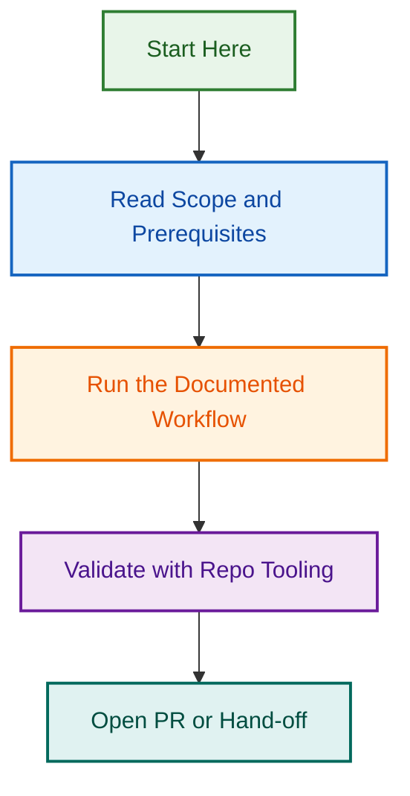

*Docs signed by 🤖 Copilot for LightSpeedWP – always fresh!*

## Related Resources

- [Portable instruction library index](../../instructions/README.md)
- [Issue #295 local source draft](../projects/active/portable-ai-plugin-restructure/issues/children/batch-02-portable-migration/02-03-refactor-migrate-portable-instructions.md)

## Visual Workflow

