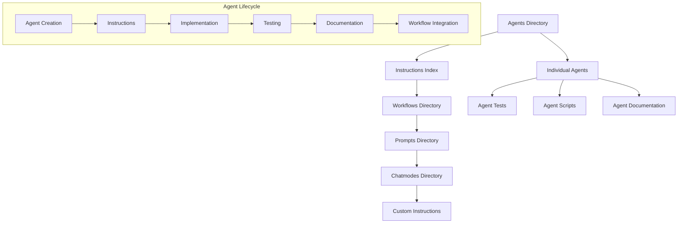
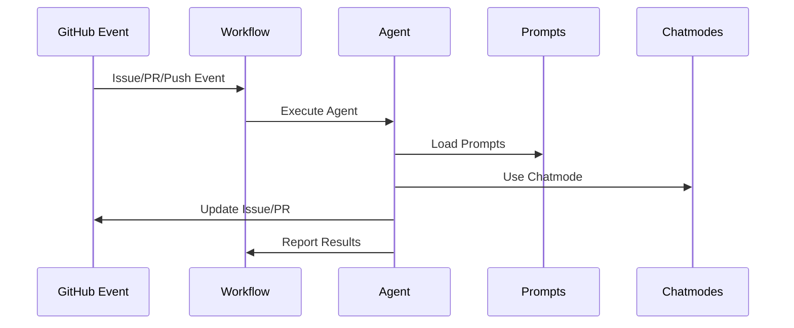

# 🤖 Agent Instructions Index

This is the canonical index for all LightSpeedWP agent specifications and related automation governance. **Version: v1.3** | **Last Updated: 2025-10-24**

## 📖 Overview

Each agent is:

- **Canonically documented** in `.github/agents/*.instructions.md` files
- **Workflow-aligned** with one or more GitHub workflows
- **Purpose-mapped** to clear automation objectives
- **Versioned & auditable** through this dynamic index
- **Discoverable** via comprehensive cross-references

> 💡 All files matching `.github/agents/*.instructions.md` in this folder are dynamically indexed here and are considered canonical for LightSpeedWP automation.

## 🔗 Integration Points

### 📚 Related Documentation

- **[Agents Directory](../agents/README.md)** - Complete agent specifications and implementations
- **[Workflows Directory](../workflows/README.md)** - GitHub Actions that trigger agents
- **[Prompts Directory](../prompts/prompts.md)** - AI prompts used by agents
- **[Chatmodes Directory](../chatmodes/chatmodes.md)** - Specialized AI conversation modes
- **[Custom Instructions](../custom-instructions.md)** - Organization-wide Copilot settings

### ⚙️ Automation Integration

- **[Automation Governance](../AUTOMATION_GOVERNANCE.md)** - Agent governance policies
- **[Branching Strategy](../BRANCHING_STRATEGY.md)** - Branch-based agent triggers
- **[Issue Labels](../ISSUE_LABELS.md)** - Agent-driven labeling system
- **[PR Labels](../PR_LABELS.md)** - Pull request automation

---

## 🤖 Agent Instructions Directory

### 📋 Core Automation Agents

#### 🏷️ [Labeling Agent](./agents/labeling.instructions.md)

- **Purpose**: Automates labeling, status, and changelog management for issues and PRs
- **Triggers**: Issue/PR creation, label changes, milestone updates
- **Integration**: Works with [labeling.yml](../workflows/labeling.yml) workflow
- **Prompts**: Uses [label-issues.prompt.md](../prompts/label-issues.prompt.md)

#### 🔍 [Reviewer Agent](./agents/reviewer.instructions.md)  

- **Purpose**: Summarizes PR/CI status, review requirements, and reviewer guidance
- **Triggers**: PR creation, review submission, CI completion
- **Integration**: Works with [reviewer.yml](../workflows/reviewer.yml) workflow
- **Prompts**: Uses [dev-code-review.prompt.md](../prompts/dev-code-review.prompt.md)

#### 📋 [Planner Agent](./agents/planner.instructions.md)

- **Purpose**: Manages PR checklists, merge readiness, and process analytics
- **Triggers**: PR creation, status changes, merge events
- **Integration**: Works with [planner.yml](../workflows/planner.yml) workflow
- **Features**: Automated task tracking and completion analysis

#### 🚀 [Release Agent](./agents/release.instructions.md)

- **Purpose**: Drives release automation, changelog, versioning, and publishing
- **Triggers**: Release tags, version bumps, changelog updates
- **Integration**: Works with [release.yml](../workflows/release.yml) workflow
- **Prompts**: Uses [release-notes.prompt.md](../prompts/release-notes.prompt.md)

#### 🔄 [Project Meta Sync Agent](./agents/project-meta-sync.instructions.md)

- **Purpose**: Syncs GitHub Project board fields with issue/PR metadata and labels
- **Triggers**: Project field changes, label updates, status changes
- **Integration**: Works with [project-meta-sync.yml](../workflows/project-meta-sync.yml) workflow
- **Features**: Bi-directional synchronization

### 🎨 Content & Documentation Agents

#### 🏷️ [Branding Agent](./agents/branding.agent.md)

- **Purpose**: Generates and manages project badges and status indicators
- **Integration**: Works with [badges.yml](../workflows/badges.yml) workflow
- **Prompts**: Uses [badges.prompt.md](../prompts/agents/badges.prompt.md)

#### 📚 [Manage READMEs Agent](./agents/manage-readmes.instructions.md)

- **Purpose**: Maintains and updates README files across repositories
- **Integration**: Works with [manage-readmes.yml](../workflows/manage-readmes.yml) workflow
- **Prompts**: Uses [manage-readmes.prompt.md](../prompts/agents/manage-readmes.prompt.md)

#### 📊 [Metrics Agent](./agents/metrics.instructions.md)

- **Purpose**: Collects and reports project metrics and analytics
- **Integration**: Works with [metrics.yml](../workflows/metrics.yml) workflow
- **Features**: Performance tracking and reporting

### 🧪 Quality & Testing Agents

#### 🔍 [JSDoc Review Agent](./agents/jsdoc-review.instructions.md)

- **Purpose**: Audits JavaScript/TypeScript code for JSDoc coverage
- **Integration**: Automated code review process
- **Prompts**: Uses [audit-jsdoc.prompt.md](../prompts/audit-jsdoc.prompt.md)

#### ✅ [Linting Agent](./agents/linting.instructions.md)

- **Purpose**: Automated code linting and style enforcement
- **Integration**: Works with [lint.yml](../workflows/lint.yml) workflow
- **Features**: Multi-language linting support

<!-- 📝 Add new agent instruction files here as they are created -->

---

## 🧪 Testing & Development

### 📁 Directory Structure

- **Agent Tests**: `.github/agents/__tests__/` with naming convention `{module}.test.js`
- **Shared Utilities**: `.github/agents/includes/` for reusable JS modules
- **Agent Scripts**: `.github/agents/*.agent.js` for implementation files

### 📚 Testing Guidelines

- **[Automation Testing Instructions](./automation-testing.instructions.md)** - Testing strategies for automation systems
- **[Tests Instructions](./tests.instructions.md)** - Organization-wide test strategy and standards
- **Test Coverage Standards** - Comprehensive testing requirements for all agents

## 📋 Standards & Compliance

### 🎯 Coding Standards

- **[Coding Standards Instructions](./coding-standards.instructions.md)** - Unified coding standards
- **[Naming Conventions Instructions](./naming-conventions.instructions.md)** - File, function, and configuration naming
- **[Linting Instructions](./linting.instructions.md)** - Code quality and linting standards

### 🔄 Workflow Integration

- **[Workflows Instructions](./workflows.instructions.md)** - GitHub Actions and CI/CD standards
- **[Automation Instructions](./automation.instructions.md)** - General automation guidelines
- **[GitOps Instructions](./gitops.instructions.md)** - Git-based operations

## 🤝 Contribution Guidelines

### ✅ Agent Development Requirements

1. **Create/Update** corresponding `*.instructions.md` file for each agent
2. **Write Tests** following the established testing patterns
3. **Document Integration** with workflows and prompts
4. **Follow Standards** per coding-standards and naming conventions
5. **Cross-Reference** ensure reciprocal links between agents and workflows

### 📝 Documentation Requirements

- **Agent Specification** - Complete `.agent.md` file in agents directory
- **Instructions File** - Corresponding `.instructions.md` file
- **Integration Documentation** - Links to related workflows, prompts, chatmodes
- **Testing Documentation** - Test coverage and validation procedures

### 🔗 Cross-Reference Maintenance

Every agent must maintain references to:

- **Workflows** that trigger the agent
- **Prompts** used by the agent
- **Instructions** that govern the agent
- **Tests** that validate the agent
- **Dependencies** on other agents or systems

## 📊 Agent Ecosystem Map

## 🔄 Agent Trigger Flow

---

_This index is part of the LightSpeedWP automation ecosystem. See [Automation Governance](../AUTOMATION_GOVERNANCE.md) for complete automation standards._

---

<!-- RANDOM FOOTER: 🤖 Intelligent automation, seamless workflows! -->
