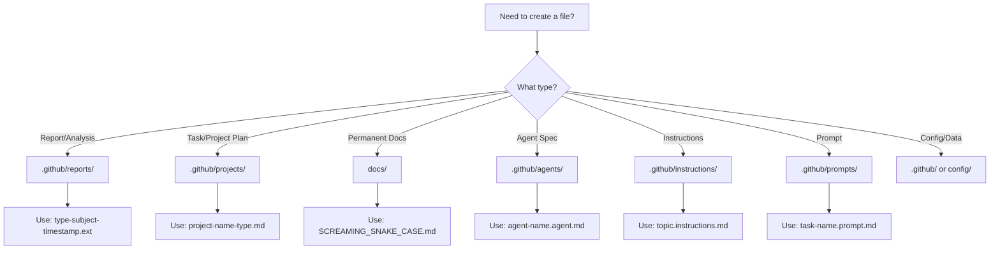

# File Output Organization Instructions for Copilot & Agents

## Mission

Ensure all Copilot-generated and agent-generated files are created in the correct, predictable locations based on file type and purpose. Prevent file organization drift and maintain repository cleanliness.

---

## Core Principle

**NEVER create reports, task files, or project artifacts in the repository root or docs/ folder unless explicitly requested.**

All generated files must go to their designated `.github/` subfolder based on type.

---

## File Type → Location Mapping (Canonical Reference)

### 📊 Reports & Analysis Outputs

**Location:** `.github/reports/{category}/`

All reports, analysis, logs, and metrics belong in a subdirectory of `.github/reports/`.

**For detailed standards, see: Reporting Standards and Conventions**

**Naming Convention:**

```
{type}-{subject}-{timestamp?}.{ext}

Examples:
.github/reports/optimisation/priority1-analysis-2025-12-09.txt
.github/reports/audits/frontmatter-audit-2025-12-09.csv
.github/reports/labeling/summary-run-12345.md
.github/reports/metrics/weekly-summary-2025-w50.json
.github/reports/migration/file-organization-migration-2025-12-09.md
```

**Subdirectory Structure:**

```
.github/reports/
├── analysis/        # Code analysis, technical audits, and investigation reports
├── audits/          # One-time audit outputs (compliance, schema validation, system audits)
├── implementation/  # Implementation tracking, completion summaries, and rollout reports
├── migration/       # Migration reports, data transfer logs, and transition documentation
├── validation/      # Schema validation, config validation, and compliance reports
├── agents/          # Agent execution reports, completion summaries, and performance logs
├── coverage/        # Test coverage reports and quality metrics
├── frontmatter/     # Frontmatter schema validation and compliance reports
├── issue-metrics/   # GitHub issue analytics, metrics, and trends
├── labeling/        # Label automation reports, sync logs, and refactoring analysis
├── linting/         # ESLint baselines, code quality reports, and wave plans
├── meta/            # Documentation metadata (badges, references, footer updates)
├── metrics/         # General metrics collection, weekly summaries, and trend reports
├── optimisation/    # Performance optimisation reports, token reduction, context analysis
└── tech-debt/       # Technical debt reports, remediation plans, and deferred work tracking
```

---

### 📝 Temporary & Working Files

**Location:** `.github/tmp/`

Use this folder for short-lived processing artifacts (drafts, intermediate outputs, scratch analysis). Nothing here is permanent.

- **Create/move:** while a workflow is running.
- **Promote:** move finalized outputs into `.github/reports/{category}/`.
- **Clean:** delete leftovers after completion; keep `.gitignore` entries for `.github/tmp/` and retain only `.gitkeep`.
- **Naming:** `{workflow}-{step}-{date}-{description}.{ext}` (e.g., `analysis-step-2-2025-12-10.json`, `draft-feature-spec-v2.md`).

**Decision helper:** If it's final → put it in reports/projects/docs; if it's intermediate or uncertain → put it in `.github/tmp/` and clean up after promotion.

---

### 📋 Task Tracking & Planning Files

**Location:** `.github/projects/`

**File Types:**

- Task lists (e.g., `CONTEXT_REDUCTION_TASKS.md`, `ROADMAP.md`)
- Project planning documents (e.g., `MIGRATION_GUIDE.md`, `CONSOLIDATION_PLAN.md`)
- Implementation tracking (e.g., `phase-tracking.md`, `sprint-plan.md`)
- Decision records (e.g., `ADR/`, `DECISIONS.md`)
- Progress tracking (e.g., `optimisation-progress.md`, `feature-status.md`)

**Naming Convention:**

```
{project-name}-{type}.md

Examples:
.github/projects/context-reduction-tasks.md
.github/projects/instruction-consolidation-guide.md
.github/projects/labeling-system-roadmap.md
.github/projects/phase6-planning.md
```

**Subdirectory Structure (Recommended):**

```
.github/projects/
├── active/          # Current active projects and sprints
├── completed/       # Finished project archives
├── planning/        # Planning and scoping documents
└── ADR/             # Architecture Decision Records
```

**Subdirectory Usage:**

- **`active/`**: Work-in-progress projects, current sprints, active implementation tracking. Move files here when work begins.
- **`completed/`**: Archived projects for historical reference. Move files here when all objectives are achieved and work is done.
- **`planning/`**: Pre-implementation planning, scoping documents, proposals not yet started.
- **`ADR/`**: Architecture Decision Records documenting significant technical decisions.
- **Root level**: Cross-project files, organizational documents, or files spanning multiple phases.

---

### 📚 Permanent Documentation

**Location:** `docs/`

**File Types (ONLY):**

- Architecture documentation (e.g., `ARCHITECTURE.md`)
- Governance and policies (e.g., `AUTOMATION_GOVERNANCE.md`, `LABEL_STRATEGY.md`)
- User guides (e.g., `ISSUE_CREATION_GUIDE.md`, `PR_CREATION_PROCESS.md`)
- Reference documentation (e.g., `FRONTMATTER_SCHEMA.md`, `ISSUE_TYPES.md`)
- Standards and conventions (e.g., `VERSIONING.md`, `BRANCHING_STRATEGY.md`)

**Criteria for docs/:**

- Must be permanent reference material (not ephemeral reports)
- Must be user-facing or policy documentation
- Must be version-controlled and maintained long-term
- Must be linked from README or other main docs

---

### 🔧 Agent Specifications & Scripts

**Location:** `.github/agents/`

**File Types:**

- Agent specs (e.g., `labeling.agent.md`, `release.agent.md`)
- Agent implementations (e.g., `labeling.agent.js`)
- Agent utilities (e.g., `includes/*.js`)
- Agent tests (e.g., `__tests__/*.test.js`)

**DO NOT create temporary reports or task files here.**

---

### 🤖 Instruction Files

**Location:** `.github/instructions/`

**File Types:**

- Copilot instructions (e.g., `*.instructions.md`)
- Agent behavior rules (e.g., `automation.instructions.md`)
- Coding standards (e.g., `coding-standards.instructions.md`)

**DO NOT create task tracking or reports here.**

---

### 🎯 Prompts

**Location:** `.github/prompts/`

**File Types:**

- Reusable prompts (e.g., `*.prompt.md`)
- Prompt templates
- Prompt indexes

**DO NOT create reports or project files here.**

---

## Decision Tree for File Creation



---

## Execution Checklist for Copilot/Agents

When creating a new file, **always** follow this checklist:

### 1. Determine File Type

- [ ] Is this a report/analysis? → `.github/reports/`
- [ ] Is this a task/project plan? → `.github/projects/`
- [ ] Is this permanent documentation? → `docs/`
- [ ] Is this an agent spec? → `.github/agents/`
- [ ] Is this an instruction file? → `.github/instructions/`

### 2. Check Naming Convention

- [ ] Follows `{type}-{subject}-{timestamp?}.{ext}` for reports
- [ ] Follows `{project-name}-{type}.md` for projects
- [ ] Follows `SCREAMING_SNAKE_CASE.md` for docs
- [ ] Follows `{name}.agent.md` for agents
- [ ] Follows `{topic}.instructions.md` for instructions

### 3. Verify Directory Exists

- [ ] Use `mkdir -p` to create directory if needed
- [ ] Check for subdirectories (e.g., `.github/reports/optimisation/`)

### 4. Add Frontmatter (if applicable)

- [ ] Include `file_type`, `description`, `created_date`, `version`
- [ ] Add `tags` for discoverability
- [ ] Include `references` if linking to other docs

### 5. Update Indexes

- [ ] Add entry to relevant README or index file
- [ ] Update cross-references in related docs

---

## Common Mistakes to Avoid

❌ **DON'T:**

- Create `OPTIMIZATION_COMPLETE.txt` in `/tmp/` or repository root
- Create `context-reduction-tasks.md` in `docs/`
- Create `audit-report.csv` in repository root
- Create task tracking files in `.github/agents/`
- Create reports in `.github/instructions/`

✅ **DO:**

- Create `.github/reports/optimisation/optimisation-complete-2025-12-09.txt`
- Create `.github/projects/context-reduction-tasks.md`
- Create `.github/reports/audits/frontmatter-audit-2025-12-09.csv`
- Create `.github/projects/phase6-planning.md`
- Create `.github/reports/labeling/summary-run-12345.md`

---

## Migration Tasks (One-Time Cleanup)

### Files to Move from docs/ to .github/reports/

```bash
# None currently (already cleaned up)
```

### Files to Move from docs/ to .github/projects/

```bash
mv docs/CONTEXT_REDUCTION_TASKS.md .github/projects/context-reduction-tasks.md
mv docs/INSTRUCTION_CONSOLIDATION_GUIDE.md .github/projects/instruction-consolidation-guide.md
# Update all references in other files
```

### Files to Keep in docs/

All current files in `docs/` are permanent reference documentation and should remain:

- `ARCHITECTURE.md`
- `AUTOMATION_GOVERNANCE.md`
- `BRANCHING_STRATEGY.md`
- `FRONTMATTER_SCHEMA.md`
- `ISSUE_CREATION_GUIDE.md`
- `LABEL_STRATEGY.md`
- `PR_CREATION_PROCESS.md`
- `TESTING.md`
- `VERSIONING.md`
- `WORKFLOWS.md`
- etc.

---

## .gitignore Updates

Add these patterns to `.gitignore` to prevent committing temporary reports:

```gitignore
# Temporary reports and analysis (commit manually if needed)
.github/reports/*.tmp
.github/reports/*-draft.*
.github/reports/*/temp-*

# Task tracking work-in-progress (commit when ready)
.github/projects/*-wip.md
.github/projects/*/draft-*

# Agent execution logs (regenerable)
.github/reports/labeling/*-run-*.md
.github/reports/metrics/*-daily-*.json
```

---

## Enforcement

### Automated Validation

A validation script should be added to CI/CD to check:

```bash
# scripts/validate-file-locations.js
# - Scan for misplaced report files
# - Scan for task tracking files in wrong locations
# - Flag files in repository root that should be in subfolders
```

### Pre-commit Hook

Add to `.husky/pre-commit`:

```bash
# Check for misplaced files
if ls OPTIMIZATION*.txt 2>/dev/null || ls *-tasks.md 2>/dev/null; then
  echo "❌ Error: Report/task files detected in repository root"
  echo "Move to .github/reports/ or .github/projects/"
  exit 1
fi
```

---

## Examples

### Example 1: Creating an Optimization Report

**Scenario:** Agent completes Priority 3 analysis and needs to save output.

**Correct:**

```bash
cat > .github/reports/optimisation/priority3-analysis-2025-12-09.txt << 'EOF'
# Priority 3 Consolidated Instructions Review
...
EOF
```

**Incorrect:**

```bash
# ❌ DON'T create in /tmp/ or root
cat > /tmp/priority3-analysis.txt
cat > priority3-analysis.txt
cat > docs/priority3-analysis.txt
```

### Example 2: Creating a Task Tracking File

**Scenario:** User requests a new project roadmap for Phase 6 planning.

**Correct:**

```bash
cat > .github/projects/phase6-planning-suite-consolidation.md << 'EOF'
# Phase 6: Planning Suite Consolidation
...
EOF
```

**Incorrect:**

```bash
# ❌ DON'T create in docs/ or root
cat > docs/PHASE6_PLANNING.md
cat > PHASE6_TASKS.md
```

### Example 3: Creating an Audit Report

**Scenario:** Frontmatter audit script generates CSV output.

**Correct:**

```bash
node scripts/audit-frontmatter.js > .github/reports/audits/frontmatter-audit-$(date +%Y-%m-%d).csv
```

**Incorrect:**

```bash
# ❌ DON'T create in root or docs/
node scripts/audit-frontmatter.js > audit-frontmatter-report.csv
node scripts/audit-frontmatter.js > docs/audit-report.csv
```

---

## References

- [File Management Instructions](./community-standards.instructions.md)
- [Repository Organization](../../docs/ORGANIZATION.md)
- [Automation Governance](../../docs/AUTOMATION_GOVERNANCE.md)
- [Agent Development Standards](./automation.instructions.md)

---

## Summary

**Golden Rules:**

1. **Reports → `.github/reports/`** (with subdirectories: analysis/, audits/, implementation/, migration/, validation/, agents/, coverage/, frontmatter/, issue-metrics/, labeling/, linting/, meta/, metrics/, optimisation/)
2. **Tasks/Projects → `.github/projects/`** (with optional subdirectories: active/, completed/, planning/)
3. **Permanent Docs → `docs/`** (only for reference documentation and user guides)
4. **Agent Specs → `.github/agents/`** (only for agent definitions and implementations)
5. **Instructions → `.github/instructions/`** (only for Copilot behavior rules)
6. **Never create reports or tasks in repository root, `/tmp/`, or wrong folders**

**When in doubt:**

- Ask yourself: "Is this ephemeral or permanent?"
- Ephemeral (reports, analysis, logs) → `.github/reports/`
- Planning/tracking (tasks, roadmaps) → `.github/projects/`
- Permanent reference → `docs/`

---

*Last updated: 2025-12-09 | Maintainer: Ash Shaw | Status: Active*
