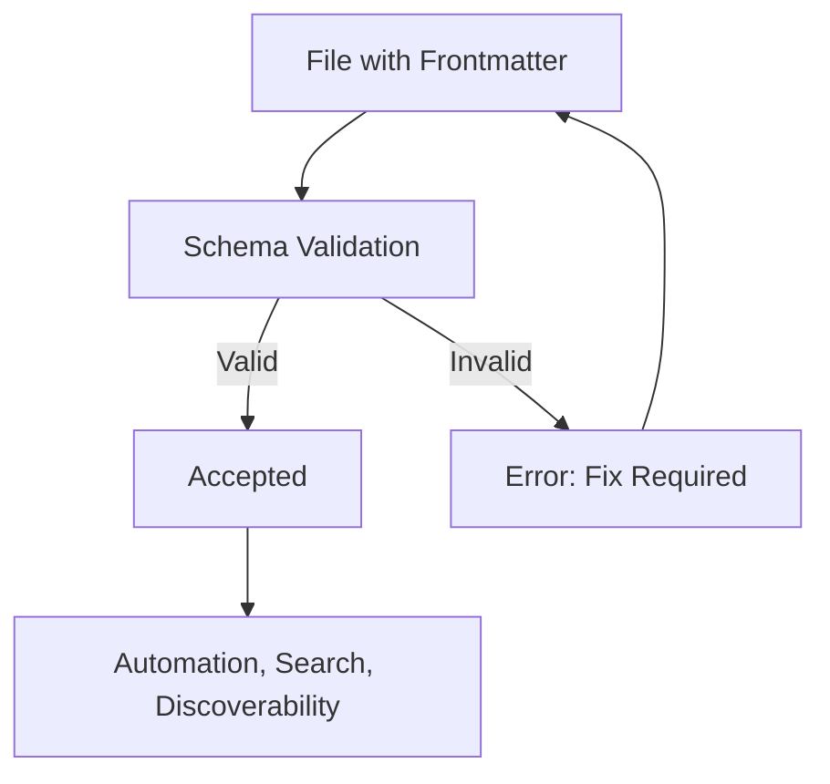

*Note: This file follows LightSpeedWP governance and metadata conventions as described in schema file ([./schemas/frontmatter.schema.json](./schemas/frontmatter.schema.json)).*

# Frontmatter Instructions

## Purpose

- Every documentation, agent, configuration, and markdown file must contain a valid YAML frontmatter block.
- Frontmatter enables automation, search, discoverability, and validation by humans and machines.

## Unified Frontmatter Fields

See the canonical [frontmatter schema](../../schemas/frontmatter.schema.json) for the full list and validation.

| Field        | Type     | Required | Description                                 |
| ------------ | -------- | -------- | ------------------------------------------- |
| title        | string   | yes      | Human-readable title                        |
| description  | string   | yes      | Short summary of the file's purpose         |
| version      | string   | yes      | Version string (e.g., v2.0)                 |
| created_date | string   | yes      | ISO date of creation (e.g., 2025-10-23)     |
| last_updated | string   | yes      | ISO date of last update (e.g., 2025-10-23)  |
| author       | string   | yes      | Main author or responsible party            |
| maintainer   | string   | yes      | Maintainer or team                          |
| owners       | string[] | no       | List of owners/maintainers                  |
| tags         | string[] | no       | Keywords for search/filtering               |
| status       | string   | no       | Current status (active, deprecated, etc.)   |
| stability    | string   | no       | Maturity expectation (stable, experimental) |
| deprecated   | boolean  | no       | Whether this file is deprecated             |
| replacement  | string   | no       | Path to replacement file if deprecated      |
| domain       | string   | no       | Classification domain                       |
| extraDomains | string[] | no       | Secondary classifications                   |
| license      | string   | no       | License identifier                          |
| mode         | string   | no       | Operational/content mode                    |
| references   | object[] | no       | Array of {path, description} objects        |

## Example

```yaml
$schema: "schemas/frontmatter.schema.json"
---
title: "Pattern Development Instructions"
description: "Instructions for developing block patterns."
version: "v2.0"
created_date: "2025-10-23"
last_updated: "2025-10-25"
author: "LightSpeedWP Team"
maintainer: "Ash Shaw"
owners:
  - "lightspeedwp/maintainers"
tags:
  - "lightspeed"
  - "patterns"
  - "instructions"
status: "active"
stability: "stable"
domain: "governance"
mode: "instruction"
deprecated: false
references:
  - path: "schemas/frontmatter.schema.json"
    description: "Unified frontmatter schema definition"
  - path: "docs/frontmatter-schema.md"
    description: "Frontmatter schema documentation"
  - path: "docs/YAML.md"
    description: "YAML frontmatter documentation"
---
```

## Validation

- All frontmatter must validate against the schema at `schemas/frontmatter.schema.json`
- VS Code and Copilot validate automatically if configured (see `.vscode/settings.json`).



## References

- [Unified Frontmatter Schema](../../schemas/frontmatter.schema.json)
- [Frontmatter Schema Documentation](../../docs/frontmatter-schema.md)
- [YAML Frontmatter Documentation](../../docs/YAML.md)
- [Chatmode Frontmatter Documentation](../../docs/CHATMODE-FRONTMATTER.md)
- [Tagging and Frontmatter Conventions](tagging-and-frontmatter-conventions.instructions.md)
- [VS Code Settings](../../.vscode/settings.json)
