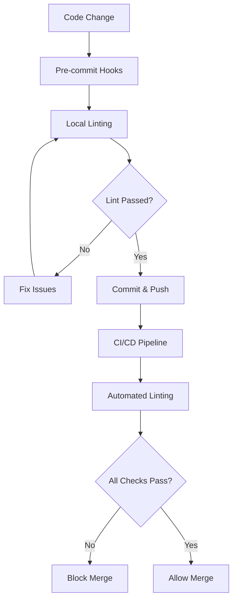
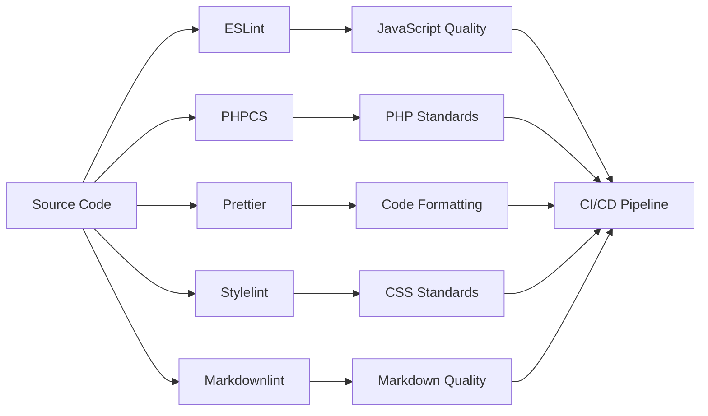

# 🔍 LightSpeed Linting Instructions Library

This directory contains comprehensive linting instructions for maintaining code quality across all LightSpeed WordPress projects. **Version: v2.0** | **Last Updated: 2025-11-27**

## 📖 Overview

Linting instructions apply to all supported file types and enforce our coding standards and automation best practices through:

- **Automated Quality Checks** - Continuous validation through CI/CD
- **IDE Integration** - Real-time feedback during development
- **Standards Enforcement** - Consistent code style across projects
- **Error Prevention** - Early detection of potential issues

## 🔄 Linting Process Flow

## 🔗 Integration Points

### 📚 Related Documentation

- **[Coding Standards Instructions](./coding-standards.instructions.md)** - Unified coding standards
- **[Workflows Instructions](./workflows.instructions.md)** - CI/CD integration
- **[Agents Instructions](./agents.instructions.md)** - Automated linting agents
- **[Custom Instructions](../custom-instructions.md)** - Organization-wide settings

### ⚙️ Tool Integration

- **[Lint Workflow](../workflows/lint.yml)** - GitHub Actions linting
- **[Linting Agent](./agents/linting.instructions.md)** - Automated code review
- **Pre-commit Hooks** - Local validation setup

---

## Dynamic Reference

All linting instruction files in this directory:

- [`linting/*.instructions.md`](./linting/) — All Markdown files ending with `.instructions.md` inside the `linting/` folder are considered reusable linting instructions for Copilot Chat, GitHub Actions, VS Code, and workflow automation.

> **When adding a new linting instruction file, ensure it has clear YAML frontmatter (`file_type: instructions`, `applyTo`, `description`), complies with our governance schema, and is listed below.**

---

## 🛠️ Linting Toolchain

## 📋 Explicit Linting Instructions File Index

Below are all linting instruction files available in this folder. Each file defines standards, config, and tools for linting a specific file type:

| File                                                                               | Description                                                                             |
| ---------------------------------------------------------------------------------- | --------------------------------------------------------------------------------------- |
| [linting-css.instructions.md](./linting/linting-css.instructions.md)               | Lint and format CSS, SCSS, and Sass with stylelint and Prettier.                        |
| [linting-html.instructions.md](./linting/linting-html.instructions.md)             | Validate and lint HTML (and embedded HTML in PHP) for semantics and accessibility.      |
| [linting-javascript.instructions.md](./linting/linting-javascript.instructions.md) | Lint JavaScript/TypeScript with ESLint (flat/classic), Prettier, and project standards. |
| [linting-json.instructions.md](./linting/linting-json.instructions.md)             | Validate JSON files against schemas and enforce formatting with Prettier.               |
| [linting-markdown.instructions.md](./linting/linting-markdown.instructions.md)     | Lint Markdown for style and readability using markdownlint and Prettier.                |
| [linting-php.instructions.md](./linting/linting-php.instructions.md)               | Lint PHP with PHPCS and WordPress coding standards.                                     |
| [linting-python.instructions.md](./linting/linting-python.instructions.md)         | Lint and format Python using Black, Ruff, and enforce type hints.                       |
| [linting-shell.instructions.md](./linting/linting-shell.instructions.md)           | Lint shell scripts with ShellCheck and enforce strict mode.                             |
| [linting-tests.instructions.md](./linting/linting-tests.instructions.md)           | Enforce consistent test style for Jest, Playwright, Python, and shell tests.            |
| [linting-yaml.instructions.md](./linting/linting-yaml.instructions.md)             | Lint YAML files and workflows using yamllint, Spectral, and actionlint.                 |

---

## Reference: Coding Standards

For unified coding standards and documentation practices, see:

- [Main Coding Standards Instructions](./coding-standards.instructions.md)

---

## How to Use

1. Copy the content of the relevant linting instruction.
2. Paste it into GitHub Copilot Chat, your editor, or your workflow.
3. Customize as needed for your project.
4. Use the generated config, scripts, or workflow as a starting point.

---

## Creating or Updating Linting Instructions

When creating or updating linting instructions for this directory:

1. Use clear, descriptive filenames with the `linting-*.instructions.md` extension.
2. Include a YAML frontmatter with `file_type: instructions`, `applyTo`, `description`, and other relevant fields per the frontmatter schema.
3. Structure the instruction with clear setup steps, config references, tools, scripts, and links to org-wide documentation.
4. Update this index to include the new or changed instruction.

---

## Maintaining Linting Instructions

Linting instructions should evolve with our standards and requirements. When updating:

1. Ensure changes align with our project guidelines and automation.
2. Test the updated instruction with CI, pre-commit, and Copilot before committing.
3. Consider backward compatibility with existing code.
4. Document significant changes in the commit message.

---

## Related Guidance

- [Coding Standards Instructions](./coding-standards.instructions.md)
- [Custom Instructions (Org-wide)](../custom-instructions.md)
- [Workflows Instructions](./workflows.instructions.md)
- [Global AI Rules (AGENTS.md)](../../AGENTS.md)
- [Instructions Directory](../instructions/)

## License

These linting instructions are part of the LightSpeed organization's community health files, licensed under the GNU General Public License v3.0.
