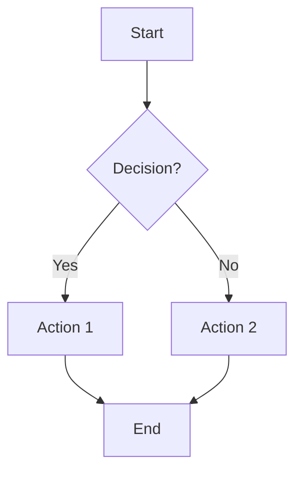
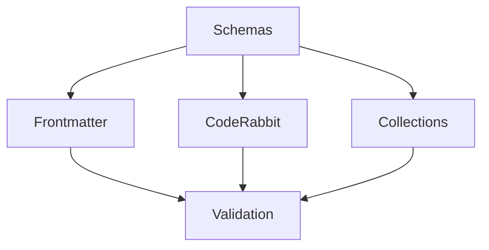
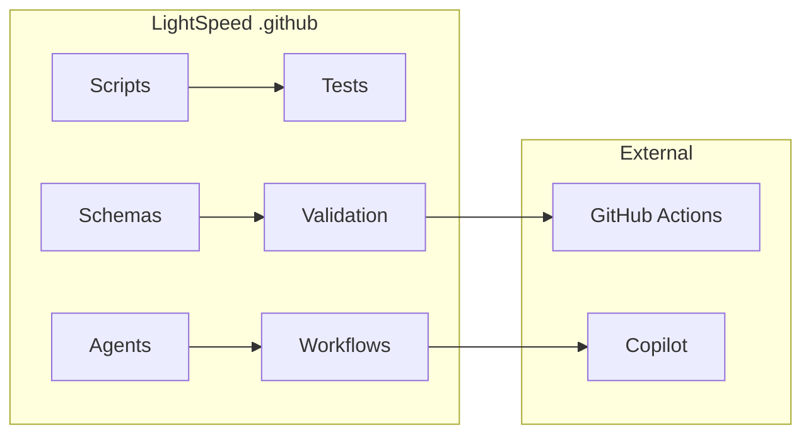
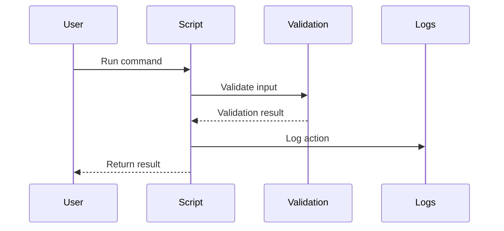
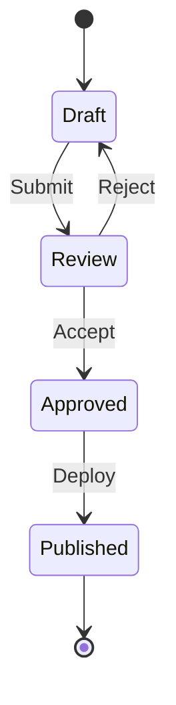
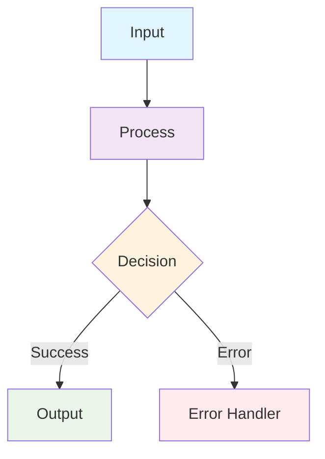
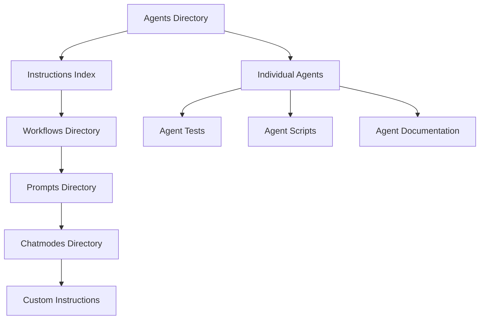
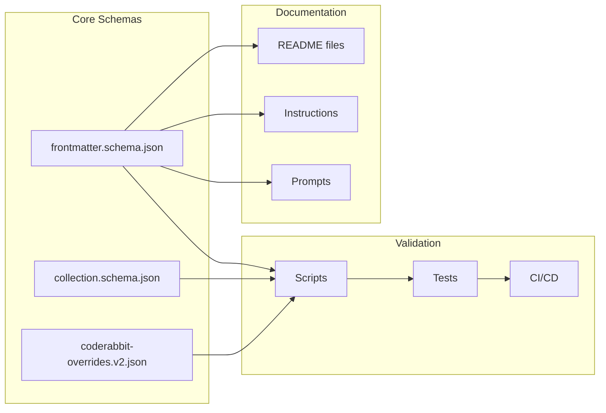
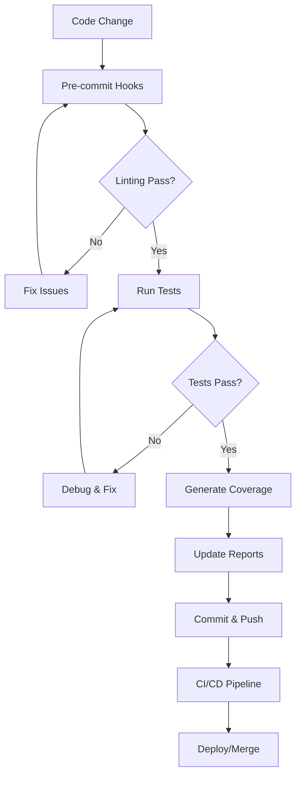

# Mermaid Diagrams Implementation Guide

## Purpose

Mermaid diagrams enhance documentation by visualizing:

- Process flows and workflows
- Architecture and system relationships  
- Directory structures and hierarchies
- Data flows and dependencies
- State transitions and lifecycles

## When to Use Mermaid Diagrams

### ✅ **MANDATORY Use Cases - Add Whenever Present**

**CRITICAL: Mermaid diagrams MUST be inserted whenever they would enhance understanding of:**

**Architecture & Structure:**

- Folder/directory relationships - ALWAYS add for complex structures
- System component interactions - REQUIRED for multi-component systems
- Schema relationships and dependencies - MANDATORY for data relationships
- Agent ecosystems and workflows - ESSENTIAL for AI/automation documentation

**Process Flows:**

- CI/CD pipelines and workflows - REQUIRED for all automation documentation
- Testing processes and validation flows - MANDATORY in test documentation
- Data transformation and validation - ESSENTIAL for data processing docs
- User journeys and decision trees - REQUIRED for user-facing processes

**Documentation Enhancement:**

- Complex README files with multiple components - ALWAYS include overview diagrams
- Technical specifications with interdependencies - MANDATORY for system docs
- Onboarding guides with sequential steps - REQUIRED for process documentation
- Troubleshooting decision trees - ESSENTIAL for support documentation

### ⚠️ **Limited Exceptions Only**

**Only avoid when ALL of the following are true:**

- Simple lists or basic hierarchies work better AND
- Diagram would be significantly larger than the text it represents AND
- Information changes frequently (maintenance overhead) AND
- Accessibility concerns cannot be resolved with proper alt text

**DEFAULT POSITION: When in doubt, ADD the diagram. Visual documentation enhances understanding for all users.**

## Mermaid Syntax Reference

### Basic Graph Types

#### **Flowchart (Most Common)**



#### **Graph (Relationships)**



#### **Architecture Diagram**



### Advanced Diagram Types

#### **Sequence (Process Flow)**



#### **State Diagram (Lifecycles)**



#### **GitGraph (Development Flow)**

```mermaid
gitgraph
    commit id: "Initial"
    branch feature
    checkout feature
    commit id: "Add schema"
    commit id: "Add tests"
    checkout main
    merge feature
    commit id: "Release v1.0"
```

## Implementation Best Practices

### 1. **Consistent Styling**

**Node Shapes:**

- `[Rectangle]` - Standard processes/components
- `{Diamond}` - Decisions/conditionals  
- `((Circle))` - Start/end points
- `[/Parallelogram/]` - Input/output
- `[[Subroutine]]` - Sub-processes

**Color Coding:**



### 2. **Accessibility Requirements**

**Always Include:**

- Descriptive alt text in surrounding context
- Text description of diagram purpose
- Key relationships explained in prose

**Example:**

```markdown
The following diagram shows the LightSpeed testing ecosystem:

```mermaid
[diagram here]
```

The diagram illustrates how test files in different folders (awesome-copilot, includes, maintenance, projects, pytests, utility) all connect to the central test runner, which coordinates with the coverage system and generates reports.

```

### 3. **Size and Complexity Guidelines**

**Maximum Recommended:**
- 15 nodes per diagram
- 3 levels of nesting in subgraphs
- 20 connections/arrows maximum

**Break Large Diagrams Into:**
- Multiple smaller focused diagrams
- Hierarchical approach (overview → details)
- Separate diagrams per major component

### 4. **Documentation Integration**

**Standard Placement:**
- After introductory paragraph
- Before detailed technical sections
- At the end for summary/overview diagrams

**File Structure Example:**
```markdown
# Component Name

Brief description of what this component does.

## Architecture Overview

```mermaid
[high-level architecture diagram]
```

The system consists of three main parts...

## Detailed Workflows  

### Workflow A

```mermaid  
[specific workflow diagram]
```

Process steps:

1. ...

```

## LightSpeedWP-Specific Patterns

### 1. **Agent Ecosystem Map**


### 2. **Schema Relationships**



### 3. **Testing Flow**



## Quality Checklist

**Before Adding a Diagram:**

- [ ] Diagram adds clarity beyond text description
- [ ] All nodes and connections are labeled clearly
- [ ] Color coding is consistent and meaningful
- [ ] Accessibility context is provided
- [ ] Diagram size is reasonable (< 15 nodes)
- [ ] Alternative text description exists
- [ ] Fits the documentation flow naturally

**Maintenance:**

- [ ] Diagram reflects current system state
- [ ] Related documentation is updated when diagram changes
- [ ] Links and references in diagram are valid
- [ ] Mermaid syntax is valid (test in editor)

## Tools & Testing

**Recommended Editors:**

- GitHub (native support)
- VS Code with Mermaid extensions
- Mermaid Live Editor (<https://mermaid.live>)
- Draw.io (has Mermaid support)

**Validation:**

- Test diagrams in Mermaid Live Editor before committing
- Verify GitHub renders them correctly
- Check accessibility with screen readers when possible
- Validate in both light and dark themes

## Examples Repository

See existing diagrams in:

- `.github/agents/README.md` - Agent Ecosystem Map
- `tests/README.md` - Testing Architecture  
- `scripts/README.md` - Scripts Workflow
- `schemas/README.md` - Schema Relationships

---

## References

- **Mermaid Documentation**: <https://mermaid.js.org/>
- **GitHub Mermaid Support**: <https://github.blog/2022-02-14-include-diagrams-markdown-files-mermaid/>
- **Accessibility Guidelines**: <https://www.w3.org/WAI/tutorials/images/complex/>
- **LightSpeed Schema**: [frontmatter.schema.json](../../schemas/frontmatter.schema.json)

*Follow LightSpeed governance v2.0 and awesome-copilot integration standards for all diagram implementations.*
