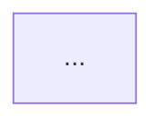
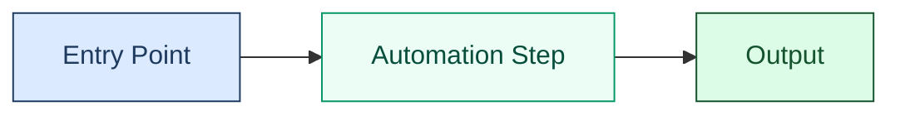

# Mermaid Diagram Instructions

All Mermaid diagrams must be visually clear, accessible (WCAG 2.2 AA), and consistent. Follow every rule in this file. The validation workflow enforces them automatically on every PR.

---

## When to Include a Diagram

Include at least one Mermaid diagram in any README or documentation file that describes:

- A multi-step process or workflow
- Component relationships or architecture
- A state machine or lifecycle
- Data flow between systems
- A timeline or schedule

Do **not** force a diagram into a file where a simple list or paragraph is clearer. One well-chosen diagram adds more value than several weak ones.

---

## Required Structure

Every Mermaid block **must** include accessibility attributes placed inline, immediately after the diagram type declaration and before any nodes:

````text

````

For complex diagrams use the block form:

````text

````

**Rules:**

- `accTitle` is mandatory on every diagram — no exceptions.
- `accDescr` is mandatory on every diagram — no exceptions.
- The diagram type (e.g. `flowchart`, `graph`, `sequenceDiagram`) **must** be the first line after the opening ` ```mermaid ` fence.
- Place `accTitle` and `accDescr` inline, directly after the diagram type and before any node definitions.
- **Do NOT use the YAML `---` front-matter syntax** before the diagram type — GitHub's Mermaid renderer does not support it and will display an error instead of the diagram.

---

## Diagram Types — When to Use Each

| Type | Use for | Example |
|------|---------|---------|
| `flowchart LR` | Left-to-right pipelines, data flows | CI/CD pipeline, API request flow |
| `flowchart TD` | Top-down hierarchies, decision trees | Component tree, issue triage |
| `sequenceDiagram` | System interactions over time | Auth flow, webhook delivery |
| `stateDiagram-v2` | State machines, lifecycle transitions | Issue status, deployment states |
| `erDiagram` | Data relationships and schema | Database schema, data models |
| `gantt` | Timelines, release schedules | Sprint plan, milestone calendar |
| `pie` | Proportional composition | Label distribution, coverage breakdown |
| `mindmap` | Topic hierarchies and associations | Feature exploration, knowledge maps |

**Prefer `flowchart` over `graph`** — `flowchart` is the current Mermaid standard and supports more styling features. Only use `graph` if you need legacy compatibility.

**Always specify direction** — `flowchart LR`, `flowchart TD`, etc. Never leave the direction implicit.

---

## Colour Palette — Approved WCAG AA Pairs

Every `style` declaration **must** set `fill`, `color`, and `stroke` together. Never set `fill` alone — Mermaid's theme may override the text colour to white or another low-contrast value depending on the viewer's GitHub theme (light/dark mode).

All pairs below are pre-verified to meet **WCAG 2.2 AA 4.5:1** normal-text contrast in every GitHub theme:

| Role | `fill` | `color` | `stroke` | Contrast |
|------|--------|---------|----------|----------|
| **Information** (primary, entry points) | `#dbeafe` | `#1e3a5f` | `#1e3a5f` | 9.1:1 |
| **Success** (outputs, completed states) | `#dcfce7` | `#14532d` | `#14532d` | 10.5:1 |
| **Warning** (external dependencies, caution) | `#fef3c7` | `#4a2c00` | `#b45309` | 8.3:1 |
| **Error / Alert** (failure states, blockers) | `#fee2e2` | `#7f1d1d` | `#b91c1c` | 8.7:1 |
| **Documentation** (specs, instructions, AI) | `#f3e8ff` | `#3b0764` | `#7e22ce` | 10.2:1 |
| **Neutral** (supporting nodes, connectors) | `#f1f5f9` | `#0f172a` | `#334155` | 14.7:1 |
| **Highlight** (key actions, automation) | `#ecfdf5` | `#064e3b` | `#059669` | 10.8:1 |

**Usage:**



**Rules:**

- Only use colours from the approved palette above, or colours you have manually verified using `scripts/validation/validate-mermaid-colour-contrast.js`.
- Never use `fill:#e1f5fe` without `color:#1e3a5f` (the old single-property pattern fails in dark mode).
- Never use inline colour strings not from this palette without running the contrast validator first.
- Do not rely on colour alone to convey meaning — use node shape and label text as the primary communicators.

---

## Theme Initialisation

Include a theme init block only when you have a specific reason. The default theme is correct for nearly all cases:

```text
%%{init: {'theme': 'default'}}%%
```

Do **not** use `theme: 'dark'` in diagram definitions — this forces dark mode regardless of the viewer's system preference and creates contrast problems with the approved palette.

For subgraph labels on dark backgrounds, prefer changing the subgraph border and title with inline styles rather than switching the whole theme.

---

## Emoji in Node Labels

Phosphor Icons and other SVG icon sets **cannot** be used in GitHub-rendered Mermaid diagrams. GitHub's embedded renderer does not support the Mermaid v11 `@{ icon: }` syntax.

Use the following canonical emoji vocabulary for node types. Apply consistently across all diagrams in the repository:

| Node type | Emoji | Example label |
|-----------|-------|---------------|
| Entry / start | (none — use a rounded node shape) | `([Start])` |
| User / developer | 👤 | `[👤 Developer]` |
| Repository / storage | 📁 | `[📁 Repository]` |
| Workflow / automation | ⚙️ | `[⚙️ Automation]` |
| Documentation / instructions | 📋 | `[📋 Instructions]` |
| AI / Copilot | 🤖 | `[🤖 AI Agent]` |
| Template | 📝 | `[📝 Template]` |
| Label / tag | 🏷️ | `[🏷️ Labels]` |
| Security | 🛡️ | `[🛡️ Security]` |
| Analytics / reporting | 📊 | `[📊 Report]` |
| Deployment / release | 🚀 | `[🚀 Deploy]` |
| Success / check | ✅ | `[✅ Passed]` |
| Error / failure | ❌ | `[❌ Failed]` |
| Warning | ⚠️ | `[⚠️ Review needed]` |
| External service | 🌐 | `[🌐 External API]` |
| Organisation | 🏛️ | `[🏛️ .github Hub]` |
| Tests | 🧪 | `[🧪 Test Suite]` |
| Lock / protected | 🔒 | `[🔒 Protected]` |

**Rules:**

- Use at most one emoji per node label.
- Place the emoji at the start of the label, followed by a space.
- Never use emoji as the entire label — always include a text description.
- Do not use emoji in subgraph titles where they are not consistently supported.

---

## Layout and Clarity

- **One concept per diagram.** If a diagram needs more than ~12 nodes, split it.
- **Direction convention:**
  - Left-to-right (`LR`) for linear pipelines, data flows, and timelines.
  - Top-down (`TD`) for hierarchies, trees, and decision flows.
- **Label length:** Keep node labels to 3–5 words maximum.
- **Subgraph titles:** Use plain text, no emoji, no special characters.
- **Arrow labels:** Use sparingly — only when the relationship is not obvious from context.
- **Avoid crossing arrows** — rearrange node order to keep flows readable.

---

## Validation

Run before every commit:

```bash
npm run validate:mermaid-syntax        # Validates diagram type, direction, bracket matching
npm run validate:mermaid-accessibility # Checks for accTitle and accDescr
npm run validate:mermaid-contrast      # WCAG 2.2 AA colour contrast check (new)
```

The PR validation workflow (`.github/workflows/validate-mermaid-pr.yml`) runs all three checks automatically on every pull request that modifies `.md` files. A failing contrast check **blocks merge**.

To validate only changed files locally:

```bash
node scripts/validation/validate-mermaid-colour-contrast.js --changed-files=path/to/file.md
```

---

## Repository-wide Update Process

When diagrams across the repository need to be updated (new palette, new structural requirements):

1. **Open a `chore/` or `docs/` branch** — e.g., `docs/mermaid-colour-standards-v2`.
2. **Run the fixer script** to apply approved palette colours to all existing style declarations:

   ```bash
   node .github/scripts/fix-mermaid-diagrams.js
   ```

3. **Run all three validators** to confirm no regressions:

   ```bash
   npm run validate:mermaid-syntax && npm run validate:mermaid-accessibility && npm run validate:mermaid-contrast
   ```

4. **Open a PR targeting `develop`** with a description that lists all files changed.
5. The CI workflow will re-validate on the PR — review any residual findings.

---

## Testing and Rendering

- Test all diagrams in the [Mermaid Live Editor](https://mermaid.live/) before committing.
- Check both GitHub light mode and dark mode rendering in the GitHub preview.
- Confirm mobile rendering is readable (diagrams should not require horizontal scroll on a 375px viewport).
- Provide a plain-text alternative directly below any diagram that contains more than 7 nodes or represents a critical process.

---

*Maintained by the 🤖 LightSpeedWP Automation Team*
