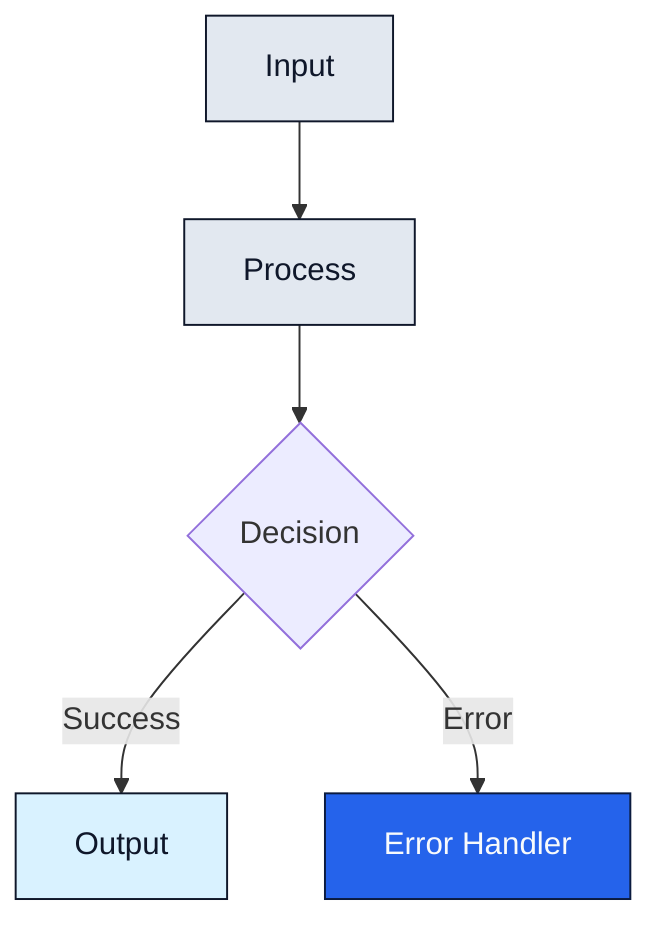
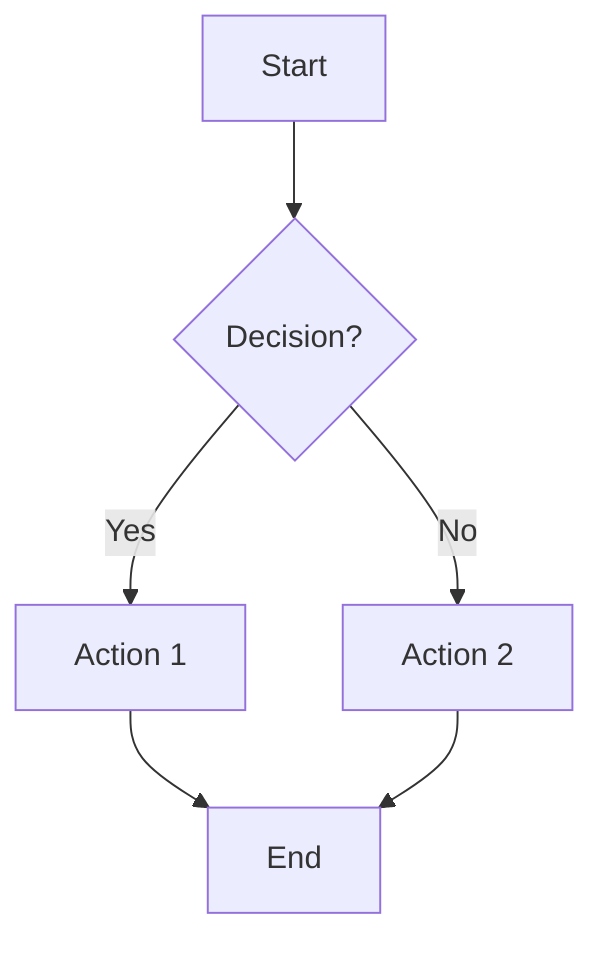
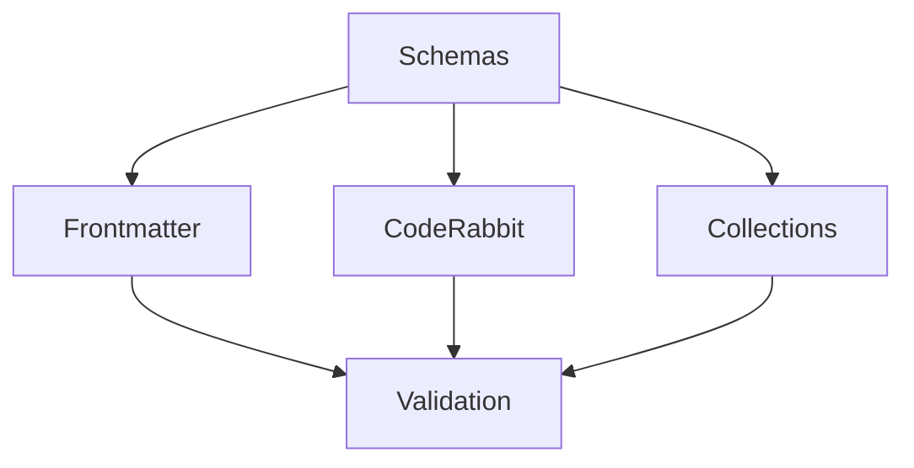
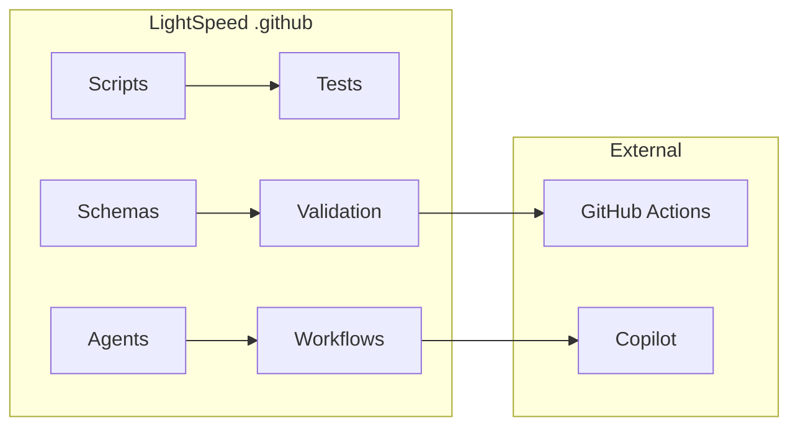
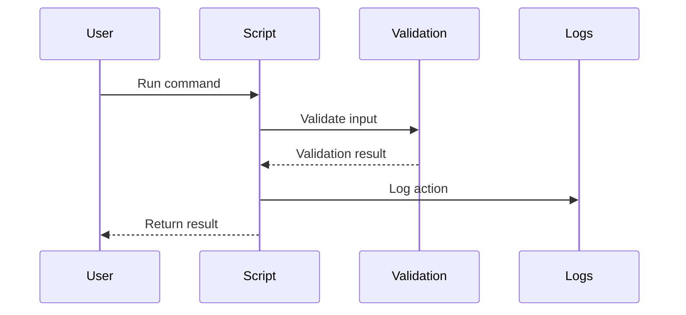
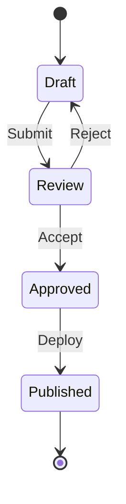
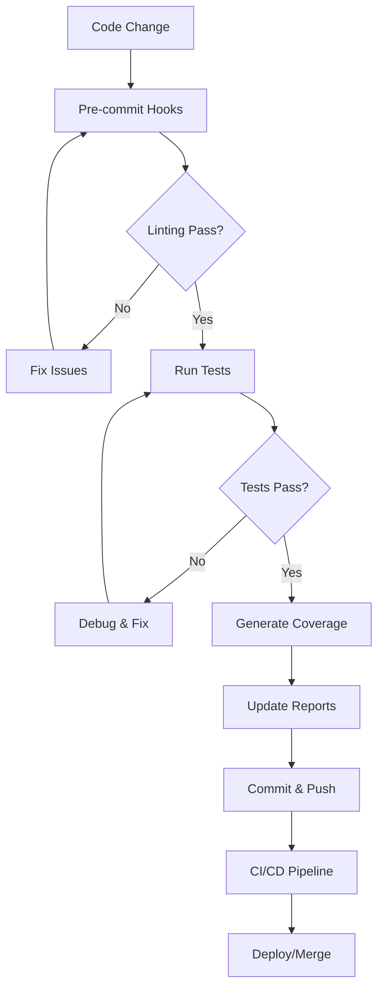

# Mermaid Diagram Guide

## Scope

Use this file for **how** to create high-quality Mermaid diagrams: layout, styling, accessibility (including **WCAG AA contrast**), and validation. For **when** a README must include a diagram, follow `readme.instructions.md` (mandatory/optional/unnecessary rules). For placement/naming, see `file-organisation.instructions.md`.

## Purpose

Mermaid diagrams enhance documentation by visualising:

- Process flows and workflows
- Architecture and system relationships
- Directory structures and hierarchies
- Data flows and dependencies
- State transitions and lifecycles

## When to Use Mermaid Diagrams

### ✅ Mandatory — add whenever present

- Folder/directory relationships (complex structures)
- System component interactions (multi-component systems)
- Schema relationships and dependencies (data relationships)
- Agent ecosystems and automation workflows
- CI/CD pipelines and workflows
- Testing processes and validation flows
- Data transformation/validation flows
- User journeys and decision trees
- Complex READMEs with multiple components
- Technical specifications with interdependencies
- Onboarding guides with sequential steps
- Troubleshooting decision trees
- READMEs: obey inclusion rules in `readme.instructions.md`; typically add after the Overview or before detailed sections.
- Other docs: place diagrams adjacent to the explanatory text and precede them with a one-line description.
- File placement/naming: follow `file-organisation.instructions.md`.

### ⚠️ Limited exceptions (skip only if ALL true)

- Simple lists/hierarchies explain it better **and**
- Diagram would be significantly larger than the text **and**
- Information changes frequently (high maintenance) **and**
- Accessibility concerns cannot be resolved with proper alt text

**Default:** When in doubt, add the diagram.

## Diagram Types (reference)

- **Flowchart** (default) — processes, decision trees, CI/test flows.
- **Graph** — relationships and hierarchies (folders, schemas, dependencies).
- **Sequence** — request/response or event timelines.
- **State** — lifecycles and status transitions.
- **GitGraph** — branching/release flows.
- **Architecture** — composed graph/flowchart for systems.
- **Timeline/Pie/Gantt** — only if they improve clarity; keep minimal.

## Layout & Readability

- Target ~15 nodes; split into overview + detail when larger.
- Use clear flow direction (`TD`, `LR`); group related nodes with `subgraph`.
- Label nodes and edges; avoid colour-only meaning and unlabeled arrows.
- Keep text concise; use verbs for actions and nouns for entities.
- Avoid unstable content unless you commit to maintenance.

## Style & WCAG AA Accessibility

- Provide prose context and alt text near every diagram (purpose + key relationships).
- Ensure colour contrast meets **WCAG AA** (4.5:1 for normal text):
  - Dark on light: `#0f172a` on `#e2e8f0` (~10:1), `#0f172a` on `#d9f2ff` (>10:1).
  - Light on dark: `#f8fafc` on `#1f2937` (~12:1), `#f8fafc` on `#2563eb` (>7:1).
- Define classes to enforce contrast and consistency:



- Maintain connector contrast; avoid pale strokes on light backgrounds.
- Do not rely on colour alone; reinforce meaning with labels/icons.
- Keep font sizes at least Mermaid defaults; check light and dark theme legibility.

## Placement & Integration

- Introduce each diagram with a sentence explaining what it shows and why it matters.
- READMEs: follow `readme.instructions.md` placement (typically after Overview or before detail).
- Other docs: place near the relevant explanation; precede with a one-line description.
- Keep related commands/sections close to the diagram for context.

## Mermaid Syntax Reference (examples)

### Basic graph types

**Flowchart (most common)**



**Graph (relationships)**



**Architecture diagram**



### Advanced types

**Sequence (process flow)**



**State diagram (lifecycles)**



**GitGraph (development flow)**

```mermaid
gitgraph
    commit id: "Initial"
    branch feature
    checkout feature
    commit id: "Add schema"
    commit id: "Add tests"
    checkout main
    merge feature
    commit id: "Release v1.0"
```

## Implementation Best Practices

### Consistent styling

- Node shapes: `[Rectangle]` processes/components; `{Diamond}` decisions; `((Circle))` start/end; `[/Parallelogram/]` input/output; `[[Subroutine]]` sub-processes.
- Colour coding: use classDefs with WCAG AA contrast (see example above).

### Accessibility requirements

- Always include alt text/context in surrounding prose.
- Explain key relationships in text; do not rely solely on the graphic.
- Check contrast with a WCAG tool (Stark/axe/WebAIM) in both light and dark themes.

### Size and complexity

- Recommended maxima: ~15 nodes, 3 levels of subgraph nesting, ~20 connections.
- Break large diagrams into multiple focused views (overview → detail).

### Documentation integration

- Standard placement: after intro paragraph or before detailed sections; summary diagrams can be near the end.
- Example structure:

````markdown
# Component Name

Brief description.

## Architecture Overview

```mermaid
[high-level architecture diagram]
```
````

Short prose explaining relationships.

````

## LightSpeedWP-Specific Patterns

**Agent Ecosystem Map**
```mermaid
graph TB
    A[Agents Directory] --> B[Instructions Index]
    B --> C[Workflows Directory]
    C --> D[Prompts Directory]
    D --> E[Chatmodes Directory]
    E --> F[Custom Instructions]

    A --> G[Individual Agents]
    G --> H[Agent Tests]
    G --> I[Agent Scripts]
    G --> J[Agent Documentation]
````

**Schema Relationships**

```mermaid
graph LR
    subgraph "Core Schemas"
        A[frontmatter.schema.json]
        B[collection.schema.json]
        C[coderabbit-overrides.v2.json]
    end

    subgraph "Validation"
        D[Scripts]
        E[Tests]
        F[CI/CD]
    end

    subgraph "Documentation"
        G[README files]
        H[Instructions]
        I[Prompts]
    end

    A --> D
    B --> D
    C --> D
    D --> E
    E --> F
    A --> G
    A --> H
    A --> I
```

**Testing Flow**



## Quality Checklist

**Before adding:**

- [ ] Diagram adds clarity beyond text (default: include if relevant).
- [ ] Context + alt description provided in prose.
- [ ] Nodes/edges clearly labelled; direction obvious.
- [ ] Size reasonable (< ~15 nodes); split if complex.
- [ ] Colour contrast meets WCAG AA (check light/dark themes).
- [ ] Mermaid syntax validated (mermaid.live or editor preview).
- [ ] Reflects current system; related docs updated.

**Maintenance:**

- [ ] Diagram matches current state.
- [ ] Linked docs updated alongside diagram changes.
- [ ] Links/refs inside diagram are valid.
- [ ] Re-validated syntax and contrast after edits.

## Validation & Tools

- Validate with Mermaid Live Editor (<https://mermaid.live>) or VS Code Mermaid preview.
- Spot-check GitHub rendering (light/dark).
- Use contrast checkers (Stark, axe, WebAIM) for chosen colours.
- Recommended editors: GitHub native Mermaid, VS Code Mermaid extensions, Draw.io (Mermaid support).
- If diagrams include links, ensure anchor text is descriptive and accessible.

## Examples Repository

- `.github/agents/README.md` — Agent ecosystem map
- `tests/README.md` — Testing architecture
- `scripts/README.md` — Scripts workflow
- `schemas/README.md` — Schema relationships

## References

- `readme.instructions.md` — when diagrams are required/optional in READMEs.
- `file-organisation.instructions.md` — placement/naming of files.
- Mermaid docs: <https://mermaid.js.org/>
- GitHub support: <https://github.blog/2022-02-14-include-diagrams-markdown-files-mermaid/>
- Accessibility: <https://www.w3.org/WAI/tutorials/images/complex/>
