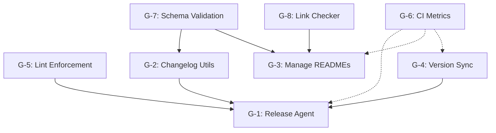

# GitHub Workflow Automation Issue Templates

This directory contains issue templates for implementing the LightSpeed workflow automation system.

## Overview

Eight issues (G-1 through G-8) define the complete workflow automation architecture, from release management to CI metrics collection. These templates provide comprehensive acceptance criteria, implementation notes, testing requirements, and dependency tracking.

## Templates

### 🚀 Promotion-Ready (Priority Implementation)

These issues are marked as promotion-ready and are candidates for the main branch once implemented and validated on develop:

| Issue | Title | Description |
|-------|-------|-------------|
| **G-1** | [Release Agent Implementation](./G-1-release-agent.md) | Automate develop → main releases with lint gates and metrics |
| **G-2** | [Changelog Utilities](./G-2-changelog-utilities.md) | Parse and validate CHANGELOG.md schema |
| **G-3** | [Manage READMEs Agent](./G-3-manage-readmes-agent.md) | Automate README management with coverage tracking |
| **G-8** | [Link Checker Integration](./G-8-link-checker.md) | Broken link detection in documentation |

### Supporting Infrastructure

| Issue | Title | Description |
|-------|-------|-------------|
| **G-4** | [Version Sync Script](./G-4-version-sync-script.md) | Ensure VERSION consistency with drift detection |
| **G-5** | [Lint Enforcement](./G-5-lint-enforcement.md) | Protected branch rules and required checks |
| **G-6** | [CI Metrics](./G-6-ci-metrics.md) | Workflow performance tracking and reporting |
| **G-7** | [Schema Validation](./G-7-schema-validation.md) | Front-matter and changelog schema validation |

## Dependencies



## Implementation Order

### Phase 1: Foundation (No Dependencies)
1. **G-5**: Lint Enforcement (enables all other workflows)
2. **G-7**: Schema Validation (required by G-2 and G-3)

### Phase 2: Core Utilities (Depends on Phase 1)
3. **G-2**: Changelog Utilities (depends on G-7)
4. **G-4**: Version Sync Script (standalone)
5. **G-8**: Link Checker (standalone)

### Phase 3: Automation Agents (Depends on Phase 2)
6. **G-3**: Manage READMEs Agent (depends on G-7, G-8)
7. **G-1**: Release Agent (depends on G-2, G-4, G-5)

### Phase 4: Observability (Parallel to all phases)
8. **G-6**: CI Metrics (integrates with G-1, G-3, G-4)

## Usage

Since the `gh` CLI is not available in this environment, create issues manually using these templates:

1. Navigate to the repository's Issues page
2. Click "New issue"
3. Copy the content from the relevant template file
4. Fill in the front-matter (title, labels, assignees)
5. Create the issue

Alternatively, if you have `gh` CLI access locally:

```bash
# Example for G-1
gh issue create \
  --title "G-1: Release Agent Implementation" \
  --label "🚀 promotion-ready,enhancement,aiops" \
  --body-file .github/issue-templates/G-1-release-agent.md
```

## Related Documentation

- [Release Process](../../docs/RELEASE-PROCESS.md) - Authoritative guide for develop → main flow
- [Manage READMEs](../../docs/MANAGE-READMES.md) - README coverage requirements
- [Workflows](../ workflows/) - Scaffolded workflow files

## Validation Checklist

Before marking an issue as complete, verify:

- [ ] All acceptance criteria met
- [ ] Tests written and passing
- [ ] Documentation updated
- [ ] Lint checks passing
- [ ] Code follows LightSpeed standards
- [ ] UK English used in documentation
- [ ] Metrics emission implemented (where applicable)
- [ ] Error handling and rollback support added

## Notes

- Templates use UK English as per LightSpeed standards
- All workflows target the `develop` branch for development
- Lint gates are hard requirements (cannot be bypassed)
- Metrics should be emitted in standardised format: `metric=name conclusion=status`
- Front-matter should follow the YAML schema defined in G-7

## Questions?

For questions or clarifications:
- Reference the [AGENTS.md](../../AGENTS.md) guide
- Check [CLAUDE.md](../../CLAUDE.md) for model selection guidance
- Consult [custom-instructions.md](../.github/custom-instructions.md) for coding standards

---

_These templates were generated as part of the workflow automation scaffolding initiative. Last updated: 2025-11-13_
