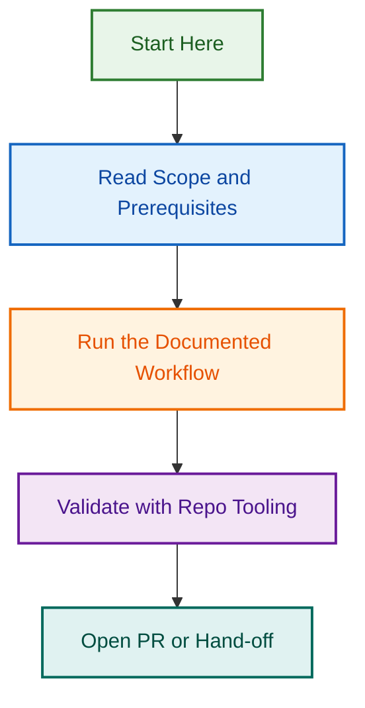

# LightSpeed Metrics Directory

This directory contains metrics collection scripts, configuration files, and automation logic for tracking repository health, documentation quality, and project activity across the LightSpeed organization.

## Purpose

- **Metrics Collection**: Scripts and tools for gathering metrics from various sources
- **Configuration Management**: Centralized configuration for all metrics collection
- **Data Validation**: Schema enforcement and quality checks for collected data
- **Automation Integration**: Hooks into workflows for scheduled and event-driven metrics

## Directory Structure

```text
.github/metrics/
├── README.md                      # This file
├── metrics.config.json            # Master configuration for all metrics
├── frontmatter-metrics.js         # Frontmatter coverage and quality metrics
├── branding-log.md                # Historical branding metrics log
├── branding.json                  # Latest branding metrics snapshot
└── out/                           # Generated output (gitignored)
    ├── frontmatter-metrics.json   # Latest frontmatter report (JSON)
    └── frontmatter-metrics.md     # Latest frontmatter report (Markdown)
```

**Note**: The `out/` directory is typically gitignored. Generated reports are moved to `.github/reporting/` for version control and distribution.

## Metrics Types

### 1. Frontmatter Metrics

**Script**: `frontmatter-metrics.js`

**Purpose**: Validate and track frontmatter coverage across all markdown and YAML template files.

**Collected Metrics**:

- Coverage percentage (valid frontmatter / eligible files)
- Unknown keys (schema violations)
- Broken references (invalid cross-links)
- Version skews (file version > repo version)

**Configuration**: `metrics.config.json` → `includeGlobs`, `excludeGlobs`, `thresholds`

**Outputs**:

- JSON artifact: `out/frontmatter-metrics.json`
- Markdown report: `out/frontmatter-metrics.md`

**Frequency**: Weekly (Monday 03:00 UTC)

### 2. Branding Metrics

**Workflow**: `.github/workflows/branding.yml`

**Purpose**: Track branding automation coverage and effectiveness.

**Collected Metrics**:

- Coverage: Percentage of docs with branding applied
- Changes: Number of files modified in last run
- Errors: Number of errors encountered
- Opt-outs: Number of files opted out

**Outputs**:

- Latest snapshot: `branding.json`
- Historical log: `branding-log.md`

**Frequency**: Weekly (Monday 03:00 UTC)

### 3. Issue & PR Metrics (Future)

**Agent Spec**: `.github/agents/metrics.agent.md`

**Purpose**: Repository health and activity metrics.

**Planned Metrics**:

- Open/closed issue counts
- PR response times
- Review turnaround
- Project velocity

**Status**: Planned (see agent spec)

## Configuration

### Master Config: `metrics.config.json`

```json
{
  "includeGlobs": ["**/*.md", ".github/ISSUE_TEMPLATE/*.yml"],
  "excludeGlobs": ["**/node_modules/**", "**/.git/**", "**/CHANGELOG.md"],
  "frontmatterEligible": {
    "md": true,
    "issue_template": true,
    "pr_template": false,
    "discussion_template": true
  },
  "thresholds": {
    "coveragePctMin": 90,
    "unknownKeysMax": 0,
    "brokenRefsMax": 0,
    "versionSkewMax": 0
  },
  "report": {
    "issueTitle": "Weekly Frontmatter Metrics",
    "storeJsonArtifact": true,
    "artifactPath": "metrics/out/frontmatter-metrics.json",
    "reportPath": "metrics/out/frontmatter-metrics.md"
  },
  "version": {
    "repoVersionFile": "VERSION",
    "enforceFileNotAboveRepo": true
  }
}
```

### Configuration Fields

| Field                 | Type   | Purpose                                 |
| --------------------- | ------ | --------------------------------------- |
| `includeGlobs`        | array  | File patterns to include in metrics     |
| `excludeGlobs`        | array  | File patterns to exclude from metrics   |
| `frontmatterEligible` | object | File types expected to have frontmatter |
| `thresholds`          | object | Quality gates and failure conditions    |
| `report`              | object | Output paths and artifact configuration |
| `version`             | object | Version enforcement rules               |

## Usage

### Running Metrics Locally

**Frontmatter Metrics**:

```bash
# Run from repository root
node .github/metrics/frontmatter-metrics.js

# Outputs:
# - metrics/out/frontmatter-metrics.json
# - metrics/out/frontmatter-metrics.md
```

**Branding Metrics**:

```bash
# Triggered via workflow
gh workflow run branding.yml --ref develop

# Or manually dispatch in GitHub Actions UI
```

### Automated Collection

Metrics are automatically collected via GitHub Actions workflows:

1. **Weekly Schedule**: Every Monday at 03:00 UTC
2. **Push Events**: On push to `develop` branch
3. **Manual Dispatch**: Via `workflow_dispatch` trigger

See `.github/workflows/branding.yml` for automation details.

### Consuming Metrics

**From JSON Artifacts**:

```javascript
const fs = require("fs");
const metrics = JSON.parse(
  fs.readFileSync(".github/metrics/out/frontmatter-metrics.json", "utf8"),
);

console.log(`Coverage: ${metrics.summary.coveragePct}%`);
console.log(`Broken refs: ${metrics.summary.brokenRefs}`);
```

**From Markdown Reports**:

- Include in weekly status updates
- Link in project dashboards
- Reference in governance reviews

## Thresholds and Quality Gates

Metrics can fail CI/CD builds if thresholds are exceeded:

| Metric        | Threshold | Action                         |
| ------------- | --------- | ------------------------------ |
| Coverage      | < 90%     | Warning (configurable to fail) |
| Unknown keys  | > 0       | Fail build                     |
| Broken refs   | > 0       | Fail build                     |
| Version skews | > 0       | Fail build                     |

Configure thresholds in `metrics.config.json` → `thresholds`.

Enable build failures with `thresholds.failOnError: true`.

## Integration

### Workflow Integration

Metrics scripts integrate with GitHub Actions workflows:

```yaml
# Example: .github/workflows/branding.yml
jobs:
  metrics-update:
    runs-on: ubuntu-latest
    steps:
      - uses: actions/checkout@v4
      - name: Run frontmatter metrics
        run: node .github/metrics/frontmatter-metrics.js
      - name: Move reports to reporting directory
        run: |
          mkdir -p .github/reporting/frontmatter
          mv metrics/out/frontmatter-metrics.* .github/reporting/frontmatter/
      - name: Commit metrics
        run: |
          git add .github/reporting
          git commit -m "chore: update metrics [skip ci]"
```

### Dashboard Integration

Metrics can feed external dashboards:

- **PowerBI**: Import JSON artifacts
- **Grafana**: Parse JSON for time-series visualization
- **Custom Dashboards**: Fetch via GitHub API

### Alert Integration

Configure alerts based on threshold violations:

```yaml
# Example: Slack notification on threshold failure
- name: Notify on failure
  if: failure()
  uses: slackapi/slack-github-action@v1
  with:
    payload: |
      {
        "text": "Metrics thresholds failed in ${{ github.repository }}"
      }
```

## Development

### Adding New Metrics

1. **Create Collection Script**: Add new script in `.github/metrics/`
2. **Update Config**: Add configuration to `metrics.config.json`
3. **Define Output**: Specify artifact and report paths
4. **Integrate Workflow**: Update or create workflow in `.github/workflows/`
5. **Document**: Update this README with metric details
6. **Test**: Run locally and validate outputs

### Testing Metrics

```bash
# Test frontmatter metrics locally
node .github/metrics/frontmatter-metrics.js

# Validate output schema
npx ajv validate -s schemas/metrics-output.schema.json \
  -d metrics/out/frontmatter-metrics.json

# Run with test fixtures
TEST_MODE=true node .github/metrics/frontmatter-metrics.js
```

### Debugging

```bash
# Enable verbose logging
DEBUG=metrics:* node .github/metrics/frontmatter-metrics.js

# Dry run (no file writes)
DRY_RUN=true node .github/metrics/frontmatter-metrics.js

# Test specific file patterns
node .github/metrics/frontmatter-metrics.js --include="docs/**/*.md"
```

## Best Practices

- **Version Control Config**: Always commit `metrics.config.json` changes
- **Document Thresholds**: Explain rationale for threshold values
- **Test Before Deploy**: Run metrics locally before pushing changes
- **Schema Validation**: Validate JSON outputs against schemas
- **Incremental Changes**: Add metrics incrementally, not all at once
- **Monitor Performance**: Track execution time for metrics scripts
- **Archive Old Outputs**: Move historical data to `.github/reporting/archive/`

## Troubleshooting

**Script fails with "Cannot find module"**:

```bash
# Install dependencies
npm install
```

**Threshold failures causing build issues**:

```bash
# Review thresholds in metrics.config.json
# Adjust or fix underlying issues
# Set failOnError: false for warnings only
```

**Output files not generated**:

```bash
# Check output directory exists
mkdir -p metrics/out

# Verify script permissions
chmod +x .github/metrics/frontmatter-metrics.js

# Run with debug logging
DEBUG=* node .github/metrics/frontmatter-metrics.js
```

**Frontmatter validation errors**:

```bash
# Review schema: schemas/frontmatter.schema.json
# Validate individual file:
npx ajv validate -s schemas/frontmatter.schema.json -d path/to/file.md
```

## Related Resources

| Resource                  | Purpose                           | Location                                                                              |
| ------------------------- | --------------------------------- | ------------------------------------------------------------------------------------- |
| **Reporting Directory**   | Generated report outputs          | [.github/reporting/](../reporting/)                                                   |
| **Metrics Agent Spec**    | Future automated metrics agent    | [.github/agents/metrics.agent.md](../agents/metrics.agent.md)                         |
| **Branding Workflow**     | Branding metrics automation       | [.github/workflows/branding.yml](../workflows/branding.yml)                           |
| **Frontmatter Schema**    | Validation schema for frontmatter | [schemas/frontmatter.schema.json](../../schemas/frontmatter.schema.json)              |
| **Automation Governance** | Metrics and reporting policies    | [docs/AUTOMATION.md](../../docs/AUTOMATION.md) |

## Future Enhancements

See [.github/agents/metrics.agent.md](../agents/metrics.agent.md) for planned metrics automation:

- Automated issue/PR metrics collection
- Multi-repo aggregation
- Real-time metrics dashboards
- Configurable alert thresholds
- Metrics API endpoint

## Contributing

To contribute new metrics or improvements:

1. Review [CONTRIBUTING.md](../../CONTRIBUTING.md)
2. Follow [coding standards](../instructions/coding-standards.instructions.md)
3. Add tests for new metrics scripts
4. Document configuration changes
5. Submit PR with rationale and examples

---

Made with ❤️ by the LightSpeed team.
## Visual Workflow


