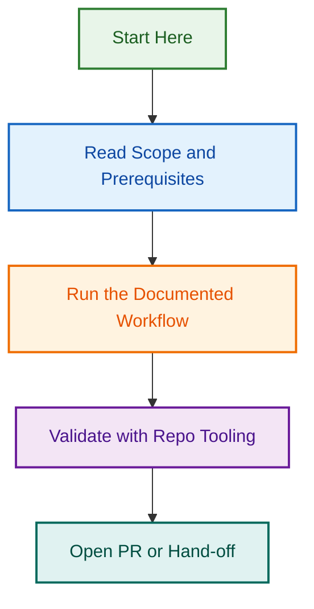

# Operations Documentation

This folder contains operational runbooks, procedures, and guides for automated systems.

## Project Maintenance Agent

See: `project-maintenance/` folder

**Quick Links:**

- **New to this?** Read: [Team Training Guide](project-maintenance/TRAINING.md)
- **Need to fix something?** Read: [Operations Runbook](project-maintenance/RUNBOOK.md)
- **Got an error?** Read: [Troubleshooting Guide](project-maintenance/TROUBLESHOOTING.md)
- **Quick Q?** Read: [FAQ](project-maintenance/FAQ.md)

## How to Use

1. **First time?** → Start with TRAINING.md (30 min)
2. **Doing a task?** → Use RUNBOOK.md (step-by-step)
3. **Got an error?** → Use TROUBLESHOOTING.md (find error + solution)
4. **Quick question?** → Use FAQ.md (50+ answers)

## Adding New Operations

When adding new automated systems:

1. Create folder: `operations/[system-name]/`
2. Create README.md with overview
3. Create TRAINING.md (30-min guide)
4. Create RUNBOOK.md (procedures)
5. Create TROUBLESHOOTING.md (errors)
6. Create FAQ.md (common questions)

## Questions?

If documentation is unclear:

1. Check if there's a related FAQ answer
2. Create a GitHub issue with type:support label
3. Link to the documentation section that confused you

---

*Operations Documentation*

## Visual Workflow

