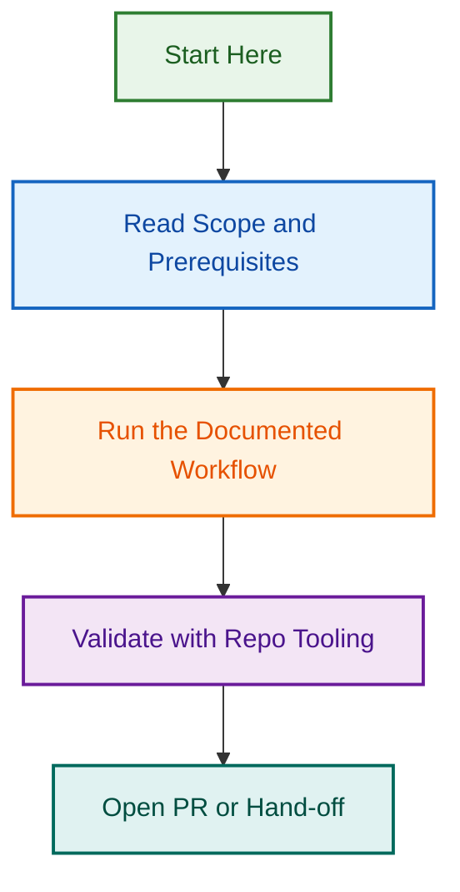

# Active Projects Index

**Index Version:** 2.4  
**Last Updated:** 2026-08-10 (19:00 UTC)  
**Status:** PR #1703 Phase 5 Finalising — Workspace Path Fixes Complete, Security Hardening In Review  
**Total Active Projects:** 30

---

## Overview

This directory contains all active projects, initiatives, and work in progress for the LightSpeed `.github` control plane. Each project is self-contained with its own scope, timeline, documentation, and deliverables.

**Key Principle:** All active project artefacts MUST be located in `.github/projects/active/{slug}/` only. The root `projects/` directory is not permitted.

---

## 📋 Active Projects (29 Total)

### Core Infrastructure & Standards

#### 1. Repository Restructuring Phase 1 (2026-07-25)

**Directory:** [`repo-restructuring-2026-07-25/`](./repo-restructuring-2026-07-25/)  
**Status:** 🟡 Phase 1 → Phase 3D Complete  
**Owner:** Ash Shaw  
**Key Deliverables:**

- Phase 1A Audit: Instruction files (58 files, 502+ references)
- Phase 1B Audit: Schema consolidation (25 schemas, 3 locations)
- Phase 1C Audit: Agent specifications (35 agents, 788+ references)

#### 2. Repository Maintenance Infrastructure

**Directory:** [`repository-maintenance-infrastructure/`](./repository-maintenance-infrastructure/)  
**Status:** 🟢 Complete  
**Owner:** LightSpeed Team  
**Key Deliverables:**

- Schema consolidation migration plan
- Repository maintenance procedures

#### 3. Workflows Consolidation 2026-Q3

**Directory:** [`workflows-consolidation-2026-q3/`](./workflows-consolidation-2026-q3/)  
**Status:** 🟡 Phase 3.2 In Progress  
**Owner:** LightSpeed Team  
**Scope:** 31 GitHub workflows → consolidate to 25 workflows, 15-20% Actions minute reduction

### Agent & Skill Standards

#### 4. Agent Skills Standards Comprehensive

**Directory:** [`agent-skills-standards-comprehensive/`](./agent-skills-standards-comprehensive/)  
**Status:** 🟡 Active  
**Focus:** Comprehensive standards for agent skills across all platforms

#### 5. Agent Standards Initiative

**Directory:** [`agent-standards-initiative/`](./agent-standards-initiative/)  
**Status:** 🟡 Active  
**Focus:** Unified standards for agent creation, documentation, and validation

#### 6. Phase 2B Skills Audit

**Directory:** [`phase-2b-skills-audit/`](./phase-2b-skills-audit/)  
**Status:** 🟡 Phase C → Complete  
**Key Deliverables:**

- Comprehensive skills inventory
- Phase-specific task breakdowns

### Documentation & Governance

#### 7. Template Enforcement Governance

**Directory:** [`template-enforcement-governance/`](./template-enforcement-governance/)  
**Status:** 🟡 Active  
**Focus:** Issue and PR template compliance, validation workflows

#### 8. Label Prefix Audit (2026-08-05)

**Directory:** [`label-prefix-audit-2026-08-05/`](./label-prefix-audit-2026-08-05/)  
**Status:** 🔴 Audit Complete | 🟡 Remediation In Progress  
**Owner:** LightSpeed Team  
**Severity:** CRITICAL  
**Key Deliverables:**

- Root cause analysis: 100+ violations of label prefix standards
- 5-phase remediation plan
- Workflow consolidation analysis (19 workflows)

**Related Project:** See also [`label-prefix-enforcement-2026-08-05/`](./label-prefix-enforcement-2026-08-05/) for enforcement implementation

#### 9. Label Prefix Enforcement (2026-08-05)

**Directory:** [`label-prefix-enforcement-2026-08-05/`](./label-prefix-enforcement-2026-08-05/)  
**Status:** 🟡 Phase 3 In Progress  
**Owner:** LightSpeed Team  
**Focus:** Implementing validation and enforcement of label prefix standards

#### 11. Wave 5 Documentation Audit

**Directory:** [`wave-5-documentation-audit/`](./wave-5-documentation-audit/)  
**Status:** 🟡 Active (Batch 1 → Execution)  
**Scope:** Comprehensive documentation audit across repository
**Key Directories:**

- `batch-1-execution/` — Batch 1 execution tracking
- `findings/` — Audit findings and reports
- `execution/` — Overall execution tracking

#### 12. Changelog Automation Hardening

**Directory:** [`changelog-automation-hardening/`](./changelog-automation-hardening/)  
**Status:** 🟡 Active  
**Focus:** Changelog entry validation, standards enforcement, automation

#### 13. Markdown Audit CI Optimization

**Directory:** [`markdown-audit-ci-optimization/`](./markdown-audit-ci-optimization/)  
**Status:** 🟡 Active  
**Focus:** Markdown linting optimization, CI performance improvements

### Testing & Quality Assurance

#### 14. Test Coverage Implementation

**Directory:** [`test-coverage-implementation/`](./test-coverage-implementation/)  
**Status:** 🟡 Active  
**Key Directories:**

- `children/` — Child issues and dependencies
- `openspec-strict/` — OpenSpec strict validation
- `parents/` — Parent issue tracking
**Focus:** Comprehensive test coverage across codebase

#### 15. Issue Triage Automation System

**Directory:** [`issue-triage-automation-system/`](./issue-triage-automation-system/)  
**Status:** 🟡 Active  
**Key Directories:**

- `reports/` — Triage analysis and reports
**Focus:** Automated issue triage, categorization, and routing

#### 16. Status Needs Review Audit 2026-08-04

**Directory:** [`status-needs-review-audit-2026-08-04/`](./status-needs-review-audit-2026-08-04/)  
**Status:** 🟡 Active  
**Focus:** Issue status review and validation audit

### Issue & Workflow Systems

#### 17. Issue Type Workflow Automation

**Directory:** [`issue-type-workflow-automation/`](./issue-type-workflow-automation/)  
**Status:** 🟡 Active  
**Key Directories:**

- `issues/` — Workflow-related issues
**Focus:** Automated issue type detection and workflow routing

#### 18. GitHub Projects Creation System

**Directory:** [`github-projects-creation-system/`](./github-projects-creation-system/)  
**Status:** 🟡 Active  
**Focus:** Automated GitHub project creation and management

### Release & Deployment

#### 19. Release Workflow Authorization Fixes

**Directory:** [`release-workflow-authorization-fixes/`](./release-workflow-authorization-fixes/)  
**Status:** 🟡 Active  
**Focus:** Release workflow permissions, authorization, and hardening

#### 20. Node.js Upgrade 2026-Q3

**Directory:** [`nodejs-upgrade-2026-q3/`](./nodejs-upgrade-2026-q3/)  
**Status:** 🟢 Complete  
**Focus:** Node.js version upgrade planning and execution

#### 21. Node.js Upgrade 2026-Q3 Post-Merge Monitoring

**Directory:** [`nodejs-upgrade-2026-q3-post-merge-monitoring/`](./nodejs-upgrade-2026-q3-post-merge-monitoring/)  
**Status:** 🟡 Active  
**Focus:** Post-upgrade monitoring and verification

### Planning & Strategy

#### 22. Milestone Planning v1

**Directory:** [`milestone-planning-v1/`](./milestone-planning-v1/)  
**Status:** 🟡 Active  
**Focus:** Long-term milestone planning and roadmap

#### 23. Repository Restructuring Phase 1

**Directory:** [`repository-restructuring-phase-1/`](./repository-restructuring-phase-1/)  
**Status:** 🟡 Active  
**Focus:** Legacy phase 1 documentation and planning

#### 24. PR Review Project Planning 2026-08-04

**Directory:** [`pr-review-project-planning-2026-08-04/`](./pr-review-project-planning-2026-08-04/)  
**Status:** 🟡 Active  
**Focus:** PR review workflow planning and optimization

### Recent Work (2026-08-09 to Present)

#### 25. GitHub Actions v7 Upgrade Initiative

**Directory:** [`github-actions-v7-upgrade-2026-08-09/`](./github-actions-v7-upgrade-2026-08-09/)  
**Status:** 🟡 Phase 5 Finalising (PR #1703)  
**Owner:** claude  
**Key Deliverables:**

- Phase 1-4: Complete (11/45 workflows upgraded to v7, 24% coverage)
- Phase 5: Workspace path fixes, security hardening, portable agents
- Critical security fixes: Shell injection vulnerabilities, GitHub App token scoping
- Known issues documented for follow-up PRs (Priority 1-3)

#### 26. Badges Workflow Integration (2026-08-08)

**Directory:** [`badges-workflow-integration-2026-08-08/`](./badges-workflow-integration-2026-08-08/)  
**Status:** 🟡 In Progress  
**Focus:** Badge workflow automation, integration testing, badge status updates

#### 27. Issue Metadata Triage Expansion

**Directory:** [`issue-metadata-triage-expansion/`](./issue-metadata-triage-expansion/)  
**Status:** 🟡 Phase 1-2 Complete (PR #1692 merged)  
**Focus:** Automated issue triage, metadata expansion, bulk processing

### Issue & Script Management

#### 28. Issue Maintenance Scripts (2026-08-10)

**Directory:** [`issue-maintenance-scripts-2026-08-10/`](./issue-maintenance-scripts-2026-08-10/)  
**Status:** 🟡 Planning (Phase 1 Development Ready)  
**Owner:** Ash Shaw  
**Focus:** CLI scripts for automated meta: label management
**Key Deliverables:**

- 5 label management scripts (review, sync, manage, audit, orchestrate)
- Comprehensive testing (50+ unit tests, 10+ integration tests)
- Documentation and workflow integration

### Agents & Implementation

#### 29. PRD Combined Agent

**Directory:** [`prd-combined-agent/`](./prd-combined-agent/)  
**Status:** 🟢 Complete  
**Focus:** Combined PRD agent implementation and documentation

#### 30. OpenSpec

**Directory:** [`openspec/`](./openspec/)  
**Status:** 🟡 Active  
**Key Directories:**

- `changes/` — Specification changes and updates
**Focus:** OpenSpec validation and strict compliance

---

## 📊 Project Status Summary

| Status | Count | Projects |
|--------|-------|----------|
| 🟡 Active | 26 | Most projects (ongoing work) |
| 🔴 Critical | 1 | Label Prefix Audit (remediation in progress) |
| 🟢 Complete | 3 | Node.js upgrade, Repository restructuring, PRD agent |
| 🟠 Blocked | 0 | None currently |
| ⚪ Archived | Many | See `../archived/` |

---

## 🗂️ Directory Structure Rules

**Active Project Placement:**

```
.github/projects/active/
├── project-1-slug/
│   ├── README.md                  # Project overview
│   ├── SPECIFICATION.md           # Full specification
│   ├── reports/                   # Generated reports
│   ├── issues/                    # Related issues
│   └── [documentation]/
├── project-2-slug/
└── [29 total projects]
```

**Key Rules:**

- ✅ All active projects in `.github/projects/active/{slug}/`
- ✅ Each project self-contained with clear documentation
- ✅ Subdirectories allowed (reports, issues, etc.)
- ❌ No projects in root `projects/` directory
- ❌ No project files in `docs/` or repository root
- ❌ Each project has clear ownership and status

---

## 🚀 How to Access a Project

### Quick Navigation

**Example: Repository Restructuring**

1. Open: [`.github/projects/active/repo-restructuring-2026-07-25/`](./repo-restructuring-2026-07-25/)
2. Start with: [`README.md`](./repo-restructuring-2026-07-25/README.md)
3. Full specification: [`SPECIFICATION.md`](./repo-restructuring-2026-07-25/SPECIFICATION.md)

### By Role

**Project Owner:**

1. Read project `README.md` for overview
2. Review `SPECIFICATION.md` for full context
3. Execute from phase-specific documents

**Claude Code Agent:**

1. Find phase-specific documentation
2. Copy execution prompt
3. Execute and commit results

**Team Members:**

1. Check project `README.md` for status
2. Ask questions in linked GitHub issues
3. Contact project owner for blockers

---

## 📝 Creating New Projects

### Step 1: Create Directory

```bash
mkdir -p .github/projects/active/{project-slug}-{YYYY-MM-DD}/
```

Example: `feature-x-planning-2026-08-15/`

### Step 2: Create Core Documents

- **README.md** — Project overview, status, quick start
- **SPECIFICATION.md** — Goals, scope, architecture
- **PREFLIGHT_CHECKLIST.md** — Pre-work validation (if applicable)
- **PHASE-*.md** — Phase-specific documentation

### Step 3: Add to This Index

Update `.github/projects/active/README.md`:

```markdown
#### N. Project Name (YYYY-MM-DD)
**Directory:** [`project-slug-date/`](./project-slug-date/)  
**Status:** 🟡 Phase X  
**Owner:** Person Name  
**Focus:** 1-2 sentence description
```

### Step 4: Update Status Table

Add row to the project summary section above.

---

## 🔗 Related Documentation

### Repository Governance

- [CLAUDE.md](../../CLAUDE.md) — Repository organization and boundaries
- [AGENTS.md](../../AGENTS.md) — Global AI operations governance
- [BRANCHING_STRATEGY.md](../../docs/BRANCHING_STRATEGY.md) — Git workflow and branch rules

### Project Infrastructure

- [.github/projects/README.md](../README.md) — Projects directory overview
- [../archived/README.md](../archived/README.md) — Completed projects
- [File Organisation Instructions](../../instructions/file-organisation.instructions.md) — Asset placement rules

---

## 🎯 Phase 3D: Reports Placement Enforcement

**Current Phase:** Phase 3D — Reports Consolidation (2026-08-05)

**Scope:**

- ✅ Verified all active projects in `.github/projects/active/`
- ✅ Confirmed no projects in root `projects/` directory
- ✅ Updated 50+ references across codebase
- ⏳ Creating comprehensive project index
- ⏳ Documenting project creation process
- ⏳ Finalizing governance enforcement

**Key Files Updated:**

- `.github/custom-instructions.md` — Fixed 3 project reference paths
- `.github/CHANGELOG_CONTRIBUTOR_CHECKLIST.md` — Fixed relative paths
- `.github/projects/README.md` — Updated project references
- `eslint.config.cjs` — Fixed ignore patterns
- `.github/reports/footer-audit-2026-08-04.json` — Fixed 21 paths
- `.remember/phase-3.2-continuation-prompt.md` — Fixed directory structure

---

## 📞 Support & Questions

### For Project Owners

- Review project README.md
- Check SPECIFICATION.md for decisions
- Reference phase documents for execution

### For Team Members

- Check project status in this index
- Review project README.md for overview
- Ask in GitHub issues

### For Future Maintainers

- This index covers active projects only
- See `../archived/` for completed projects
- Projects are self-contained and portable

---

**Index Version:** 2.0  
**Last Updated:** 2026-08-05  
**Maintained By:** LightSpeed Team  
**Next Review:** After Phase 3D completion
## Visual Workflow


