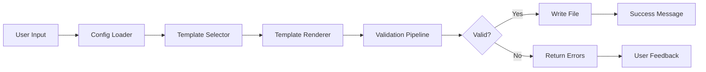

# ADR Agent Portability — OpenSpec Specification

**Status:** 🟡 In Progress  
**Last Updated:** 2026-08-12  
**Owner:** @ash

---

## Executive Summary

This OpenSpec document captures the detailed specification for making the ADR Generator Agent portable across the LightSpeedWP organization. The agent will support configuration-driven behavior, allowing adoption in:

- **GitHub Control Plane** (`.github` — central governance)
- **Organization Repositories** (org-wide tooling, utilities)
- **WordPress Block Plugins** (block ecosystem)
- **WordPress Block Themes** (theme ecosystem)

The solution emphasizes **extensibility without forking**, **configuration over hardcoding**, and **comprehensive test coverage**.

---

## Phase 1: Core Portability (8–10 weeks)

### Objective

Establish a configurable, portable ADR agent that can be installed in any repository with minimal customization.

### Scope

#### 1.1 Configuration System

**Deliverable:** `.adr-config.json` schema and loader

**Requirements:**

- JSON schema validation for `.adr-config.json`
- Support sensible defaults (no config = works)
- Configurable paths, numbering schemes, metadata
- Configuration loader skill (reusable component)
- Support configuration inheritance (org defaults + repo overrides)

**Files to Create:**

- `agents/adr-generator/config/adr-config.schema.json` — JSON schema
- `agents/adr-generator/config/defaults.json` — default values
- `agents/adr-generator/skills/adr-config-loader.md` — loader skill
- `agents/adr-generator/examples/org-config-example.json` — example org config
- `agents/adr-generator/examples/repo-config-example.json` — example repo config

**Configuration Options:**

```json
{
  "organization": "lightspeedwp",
  "adr_directory": "docs/adr",
  "numbering_scheme": "sequential",
  "prefix": "adr",
  "metadata": {
    "required_fields": ["status", "date", "authors"],
    "optional_fields": [],
    "custom_fields": {}
  },
  "templates": ["standard"],
  "validation": {
    "enabled": true,
    "rules": ["no-duplicates", "metadata-completeness"]
  },
  "governance": {
    "review_required": false
  }
}
```

**Tests:**

- Unit: Schema validation (valid/invalid configs)
- Unit: Config loader (merge defaults, parse values)
- Integration: Config inheritance (org + repo)
- Acceptance: Zero-config scenario (uses defaults)

---

#### 1.2 Template System

**Deliverable:** Multiple ADR templates with variant support

**Requirements:**

- Standard ADR template (full-featured, current format)
- Lightweight ADR template (minimal, 1-page)
- Domain-specific template examples
- Template loader integrated into agent
- Support for custom templates via configuration

**Files to Create:**

- `agents/adr-generator/templates/standard-adr.template.md` — full template
- `agents/adr-generator/templates/lightweight-adr.template.md` — minimal template
- `agents/adr-generator/templates/security-adr.template.md` — example domain template
- `agents/adr-generator/templates/infrastructure-adr.template.md` — example domain template
- `agents/adr-generator/skills/adr-template-loader.md` — template loader skill

**Template Features:**

- All templates include YAML front matter with customizable fields
- Consequence tracking (positive/negative with codes)
- Alternative evaluation section
- Implementation guidance
- References and relationships

**Tests:**

- Unit: Template file validation (markdown structure)
- Unit: Template rendering (placeholder replacement)
- Integration: Template selection via config
- Acceptance: All templates generate valid ADR files

---

#### 1.3 Validation & Quality Framework

**Deliverable:** Reusable validation rules and quality checking

**Requirements:**

- Modular validation rules (each in separate skill)
- Configurable rule set per repository
- Quality checklist validation
- Metadata completeness checking
- No-duplicate detection (repo-local)
- ADR structure validation

**Files to Create:**

- `agents/adr-generator/skills/adr-validator.md` — orchestrator
- `agents/adr-generator/skills/adr-structure-validator.md` — file structure
- `agents/adr-generator/skills/adr-metadata-validator.md` — front matter
- `agents/adr-generator/skills/adr-duplicate-detector.md` — repo-local duplicates
- `agents/adr-generator/skills/adr-completeness-checker.md` — required sections
- `agents/adr-generator/skills/adr-clarity-checker.md` — language quality

**Validation Rules:**

| Rule | Purpose | Triggered |
|------|---------|-----------|
| `no-duplicates` | Prevent duplicate ADR titles/decisions | on-creation |
| `metadata-completeness` | Ensure all required fields present | on-creation |
| `structure-validity` | Valid markdown + front matter structure | on-creation |
| `clarity-check` | Language clarity (automated suggestions) | on-creation |
| `consequence-coverage` | At least 1 positive & 1 negative consequence | on-creation |

**Tests:**

- Unit: Each validation rule independently
- Unit: Error message generation
- Integration: Full validation pipeline
- Acceptance: Quality checks prevent low-quality ADRs

---

#### 1.4 Portable Agent Specification

**Deliverable:** Organization-agnostic agent spec

**Requirements:**

- Move from `.github/agents/adr.agent.md` to `agents/adr-generator/adr-generator.agent.md`
- Remove hardcoded paths and branding
- Integrate configuration system
- Orchestrate template system
- Call validation pipeline
- No organization-specific assumptions

**Files to Create:**

- `agents/adr-generator/adr-generator.agent.md` — main agent spec

**Changes from Current:**

- Remove hardcoded `/docs/adr/` path (use config)
- Remove LightSpeedWP branding (use org name from config)
- Integrate config loader at startup
- Template selection via config
- Validation rule orchestration

**Tests:**

- Integration: Agent workflow from start to finish
- Integration: Config-driven behavior
- Acceptance: Different configs produce different outputs

---

#### 1.5 Test Suite

**Deliverable:** Comprehensive unit + integration tests

**Requirements:**

- Jest for unit tests
- Node.js file system tests
- >90% code coverage for scripts
- >80% coverage for agent workflows
- Mock GitHub file system interactions
- Test both happy path and error cases

**Files to Create:**

- `agents/adr-generator/__tests__/config-loader.test.js`
- `agents/adr-generator/__tests__/template-loader.test.js`
- `agents/adr-generator/__tests__/validators/*.test.js` (per validator)
- `agents/adr-generator/__tests__/integration/*.test.js`
- `agents/adr-generator/jest.config.js` — Jest configuration

**Test Scenarios:**

```
Config Loader Tests:
✓ Load valid .adr-config.json
✓ Fall back to defaults when no config
✓ Merge org + repo configs
✓ Validate config schema
✓ Error on invalid schema

Template Loader Tests:
✓ Load all template variants
✓ Render templates with values
✓ Error on missing required placeholders
✓ Support custom template paths

Validator Tests (per rule):
✓ Detect duplicate ADR titles
✓ Check metadata completeness
✓ Validate markdown structure
✓ Enforce consequence coverage

Integration Tests:
✓ Full workflow: config → template → validation → file
✓ Different configs produce different ADR structures
✓ Error handling and user messaging
```

**CI Integration:**

- Run tests on every PR to this repo
- Report coverage to PR
- Block merge if coverage <80%

---

#### 1.6 Documentation

**Deliverable:** Complete documentation with mermaid diagrams

**Files to Create:**

1. **Installation Guide** (`agents/adr-generator/INSTALL.md`)
   - Prerequisites
   - Step-by-step setup
   - Configuration template
   - Troubleshooting

2. **Configuration Reference** (`agents/adr-generator/CONFIG.md`)
   - Full schema documentation
   - All options with examples
   - Per-repo customization patterns
   - Inheritance and defaults

3. **Best Practices** (`agents/adr-generator/BEST-PRACTICES.md`)
   - When to write an ADR
   - Decision structure guidance
   - Examples across domains
   - Common pitfalls

4. **API Reference** (`agents/adr-generator/API.md`)
   - Skills and functions
   - Validation rules
   - Template system
   - Configuration schema

5. **Architecture Guide** (`agents/adr-generator/ARCHITECTURE.md`)
   - System overview
   - Component relationships
   - Data flow
   - Extension points

**Mermaid Diagrams Required:**

- System architecture (components and relationships)
- ADR creation workflow (user input → file output)
- Configuration decision tree (which options when)
- Validation pipeline (order and dependencies)
- Template selection logic

**Example Diagram:**



---

### Acceptance Criteria (Phase 1)

- ✅ Configuration system is implemented and tested
- ✅ Template system supports standard + lightweight + examples
- ✅ All validation rules are modular and testable
- ✅ Agent spec is portable and organization-agnostic
- ✅ Test coverage >85% for all code
- ✅ Documentation complete with mermaid diagrams
- ✅ Works in 3+ test repositories (control-plane, org repo, WordPress plugin)
- ✅ Zero hardcoded organization-specific assumptions

---

## Phase 2: Cross-Repository Integration (6–8 weeks)

### Objective

Enable ADR discovery and linking across repositories in the organization.

### Scope

#### 2.1 Cross-Repository Linking

**Deliverable:** ADR discovery and cross-repo references

**Requirements:**

- Detect ADRs in related repositories
- Generate cross-repo links with proper formatting
- Validate links don't break
- Support org-prefixed ADR IDs (e.g., `monorepo:adr-0001`)

**Files to Create:**

- `agents/adr-generator/skills/adr-discovery.md` — find existing ADRs
- `agents/adr-generator/skills/cross-repo-linker.md` — link to other repos
- `agents/adr-generator/skills/link-validator.md` — validate cross-repo links

---

#### 2.2 GitHub Actions Integration

**Deliverable:** Automated ADR validation in PR workflow

**Requirements:**

- Validate ADR changes in PR
- Check for duplicate ADRs
- Ensure all required fields present
- Report validation results as PR comment

**Files to Create:**

- `.github/workflows/adr-validation.yml` — PR validation
- `.github/scripts/validate-adr.js` — validation script

---

#### 2.3 Governance Hooks

**Deliverable:** Extensibility for org-specific governance

**Requirements:**

- Pre-creation hooks (e.g., duplicate checking)
- Post-creation hooks (e.g., registry sync)
- Custom validation rules
- Integration with GitHub code owners

**Files to Create:**

- `agents/adr-generator/hooks/pre-creation.example.js`
- `agents/adr-generator/hooks/post-creation.example.js`

---

### Acceptance Criteria (Phase 2)

- ✅ ADRs can reference ADRs in other repositories
- ✅ Cross-repo links are validated and don't break
- ✅ GitHub Actions validate ADRs on PR
- ✅ Governance hooks allow org-specific customization
- ✅ WordPress plugins/themes can use cross-repo linking

---

## Phase 3: Organization-Wide Features (4–6 weeks)

### Objective

Central ADR registry and organization-wide decision tracking.

### Scope

#### 3.1 ADR Registry

**Deliverable:** Central discovery and indexing

**Requirements:**

- Registry endpoint or index file
- ADR discovery across all repositories
- Search and filtering
- Automatic registration on ADR creation

#### 3.2 Metrics & Reporting

**Deliverable:** Decision tracking and analysis

**Requirements:**

- ADR creation rate
- Decision reversal frequency
- Time-to-approval metrics
- Team autonomy metrics

#### 3.3 Knowledge Management

**Deliverable:** ADR archival and retirement

**Requirements:**

- Mark ADRs as deprecated/archived
- Preserve decision history
- Transition ADRs between status values

---

## Integration Points

### GitHub Actions

```yaml
name: ADR Validation
on: [pull_request]
jobs:
  validate:
    runs-on: ubuntu-latest
    steps:
      - uses: actions/checkout@v4
      - name: Load Configuration
        run: npm run adr:load-config
      - name: Validate ADR
        run: npm run adr:validate
      - name: Check Duplicates
        run: npm run adr:check-duplicates
      - name: Report Results
        uses: actions/github-script@v7
```

### Environment Integration

```bash
# In adopting repository
npm install --save-dev @lightspeedwp/adr-agent

# Configure
cp node_modules/@lightspeedwp/adr-agent/.adr-config.example.json .adr-config.json

# Use
npm run adr:create "My Decision Title"
npm run adr:validate
```

---

## Decision Points to Resolve

### DP-001: Single vs. Multiple Agents

**Current Recommendation:** Single configurable agent (simpler, consistent)

**Decision Required:** Confirm with team

### DP-002: Config Format & Location

**Current Recommendation:** `.adr-config.json` at repo root

**Decision Required:** Confirm file format and location

### DP-003: Registry Type

**Current Recommendation:** Hybrid (Phase 1: local, Phase 3: optional central)

**Decision Required:** Confirm registry approach for Phase 1

### DP-004: WordPress Customization

**Current Recommendation:** Optional custom fields via configuration

**Decision Required:** Define WordPress-specific metadata needs

### DP-005: Numbering Scheme

**Question:** Should ADR numbers be:

1. Sequential per repository (0001, 0002, ...)
2. Sequential organization-wide (global counter)
3. Date-based (YYYY-MM-DD)
4. UUID-based

**Recommendation:** Sequential per repository (simplest, local autonomy)

**Decision Required:** Confirm approach

### DP-006: Approval Workflow

**Question:** Should ADRs require approval before "Accepted" status?

**Options:**

1. No approval (optional peer review)
2. Code owner approval (via CODEOWNERS)
3. Team lead approval (configurable)
4. Architecture board approval (org-wide governance)

**Recommendation:** Configurable per repository

**Decision Required:** Define default and org guidance

---

## Testing Strategy Summary

### Unit Tests (Jest)

- Configuration loading and validation
- Template rendering
- Each validation rule
- Error handling

**Target:** >90% coverage

### Integration Tests

- End-to-end ADR creation workflow
- Configuration inheritance
- Validation pipeline
- GitHub Actions workflows (dry-run)

**Target:** >80% coverage

### Acceptance Tests

- Real-world scenarios (control-plane, org repo, WordPress)
- Cross-repo linking
- Registry sync
- Governance workflows

**Target:** All scenarios pass

---

## Risk Mitigation

### Risk: Configuration Complexity

**Mitigation:** Sensible defaults, interactive config wizard, comprehensive documentation

### Risk: Version Incompatibility

**Mitigation:** Semantic versioning, backward-compatible config, migration guide

### Risk: Adoption Friction

**Mitigation:** One-command setup, detailed guides, example configs, proof-of-concept in 2 repos

---

## Success Metrics

1. **Code Quality:** >85% test coverage across all components
2. **Adoption:** 5+ repositories successfully using agent by end of Phase 1
3. **Documentation:** Complete with mermaid diagrams, 0 outstanding clarifications
4. **Test Results:** All CI checks passing, 0 known bugs
5. **User Feedback:** Positive feedback from adopting teams

---

## Timeline (Detailed)

| Phase | Weeks | Start | Deliverables |
|-------|-------|-------|--------------|
| **Phase 1A** | 2–3 | 2026-08-12 | Config system, schema, loader |
| **Phase 1B** | 3–4 | 2026-08-26 | Templates, validation, quality |
| **Phase 1C** | 2–3 | 2026-09-09 | Test suite, documentation |
| **Phase 1 Review** | 1 | 2026-09-23 | Acceptance tests, sign-off |
| **Phase 2** | 6–8 | 2026-09-30 | Cross-repo, GitHub Actions, governance |
| **Phase 3** | 4–6 | 2026-11-24 | Registry, metrics, knowledge mgmt |

---

## Open Questions for Discussion

1. Should we have a central ADR registry from day 1, or is local discovery sufficient for Phase 1?
2. What approval workflow makes sense for WordPress repos?
3. Should ADRs trigger GitHub issues automatically?
4. How should we handle ADR versioning/changes after creation?
5. Should the central registry be public or private?

---

**Next Steps:**

1. ✅ Create this OpenSpec document
2. ⏳ Review and refine with team
3. ⏳ Create linked GitHub issues for each phase
4. ⏳ Begin Phase 1A implementation

---

*Last Updated: 2026-08-12 by @ash*
*Built by 🧱 LightSpeedWP with ☕, 🚀, and open-source spirit!*
