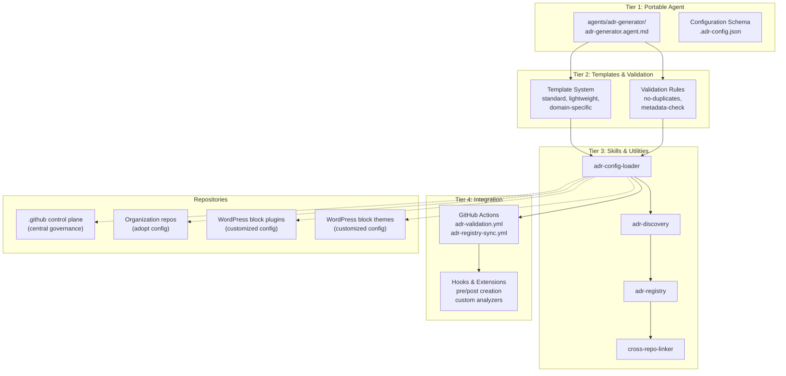

# ADR Agent Portability — Organization-Wide Implementation

**Project Start Date:** 2026-08-12  
**Scope:** Transform the ADR Generator Agent into a portable, organization-agnostic system usable across all LightSpeedWP repositories (control-plane, WordPress plugins/themes, and organization-wide projects)  
**Status:** 🔵 Planning Phase

---

## Project Overview

The current ADR Generator Agent (`.github/agents/adr.agent.md`) is tightly coupled to the `.github` control plane with hardcoded paths, organization-specific branding, and inflexible metadata. This project transforms it into a **reusable, configurable, extensible agent** that can be installed and adapted across the entire GitHub organization.

### Key Deliverables

1. **Portable Agent Specification** (`agents/adr-generator/`)
2. **Configuration System** (`.adr-config.json` schema and defaults)
3. **Multiple ADR Templates** (standard, lightweight, domain-specific)
4. **Validation & Governance Skills** (reusable components)
5. **Test Suite** (comprehensive coverage for scripts, validation, integration)
6. **Documentation** (installation guide, configuration reference, best practices, mermaid diagrams)
7. **GitHub Integration** (Actions, hooks, issue linking)

---

## Related Issues

| Issue | Type | Purpose | Status |
|-------|------|---------|--------|
| [#1816](../../../issues/1816) | epic | Master Initiative Epic — ADR Agent Portability | 🟡 Planning |
| [#1817](../../../issues/1817) | task | Phase 1A: Design & Configuration System | ⏳ Blocked |
| [#1818](../../../issues/1818) | task | Phase 1B: Template & Validation Framework | ⏳ Blocked |
| [#1819](../../../issues/1819) | task | Phase 1C: Test Suite & Documentation | ⏳ Blocked |
| [#1820](../../../issues/1820) | task | Phase 2: Cross-Repository Integration | ⏳ Blocked |
| [#1821](../../../issues/1821) | task | Phase 3: Registry & Organization-Wide Features | ⏳ Blocked |

---

## Project Phases

### Phase 1: Core Portability (8–10 weeks)

Establish configuration system, templates, validation, and test coverage.

**Deliverables:**

- Configuration schema and loader
- Template system with 3+ variants
- Validation rule engine
- Test suite (unit + integration)
- Initial documentation

**Related Issues:** #1816, #1817, #1818

### Phase 2: Cross-Repository Integration (6–8 weeks)

Enable ADR discovery, linking, and governance across repositories.

**Deliverables:**

- Cross-repo linking capability
- GitHub Actions for validation
- Governance hooks and approval workflows
- Agent variant guidance (control-plane vs. WordPress)

**Related Issues:** #1819

### Phase 3: Organization-Wide Features (4–6 weeks)

Central registry, metrics, and knowledge management.

**Deliverables:**

- ADR registry and discovery
- Metrics and reporting
- Archival and retirement workflows
- Organizational decision tracking

**Related Issues:** #1820

---

## Architecture Overview

---

## Component Breakdown

### Tier 1: Portable Agent Specification

**Directory:** `agents/adr-generator/`

| Component | Purpose | Owner |
|-----------|---------|-------|
| `adr-generator.agent.md` | Core agent spec (organization-agnostic) | @ash |
| `config/adr-config.schema.json` | JSON schema for configuration | @ash |
| `config/defaults.json` | Default configuration values | @ash |

### Tier 2: Templates & Validation

| Component | Purpose | Tests |
|-----------|---------|-------|
| `templates/standard-adr.template.md` | Full-featured ADR template | unit |
| `templates/lightweight-adr.template.md` | Minimal ADR template | unit |
| `templates/custom-example.template.md` | Example custom template | unit |
| Validation rules (no-duplicates, metadata-check, etc.) | Enforce quality standards | unit + integration |

### Tier 3: Skills & Utilities

| Skill | Functionality | Tests |
|-------|--------------|-------|
| `adr-config-loader` | Load and validate `.adr-config.json` | unit + integration |
| `adr-discovery` | Find existing ADRs, detect next number | unit + integration |
| `adr-validator` | Validate ADR structure and content | unit |
| `adr-registry` | Register ADR in central index | integration |
| `cross-repo-linker` | Link ADRs across repositories | integration |

### Tier 4: GitHub Integration

| Component | Purpose | Tests |
|-----------|---------|-------|
| `.github/workflows/adr-validation.yml` | Validate PR changes to ADRs | integration |
| `.github/workflows/adr-registry-sync.yml` | Sync new ADRs to central registry | integration |
| Hooks (pre/post creation) | Custom org-specific behavior | integration |

---

## Test Strategy

### Unit Tests

- **Configuration Loading** — validate `.adr-config.json` parsing and schema
- **Template Rendering** — verify all templates generate valid ADR structure
- **Validation Rules** — test each validation rule independently
- **Metadata Validation** — ensure required/optional fields are checked

**Coverage Target:** >90% for all skills

### Integration Tests

- **End-to-End ADR Creation** — full workflow from user input to file creation
- **Cross-Repo Linking** — verify ADR discovery and linking across repositories
- **GitHub Actions** — test validation and registry sync workflows
- **Configuration Inheritance** — test default config + org-specific overrides

**Coverage Target:** >80% for workflows

### Acceptance Tests

- **WordPress Plugin Adoption** — can plugin repo successfully use the agent?
- **WordPress Theme Adoption** — can theme repo successfully use the agent?
- **Org-Wide Registry** — can ADRs be discovered across all repositories?

---

## Documentation Requirements

### 1. **Installation Guide** (`agents/adr-generator/INSTALL.md`)

- Step-by-step setup for adopting repositories
- Configuration template with examples
- Troubleshooting guide

### 2. **Configuration Reference** (`agents/adr-generator/CONFIG.md`)

- Full schema documentation
- All configuration options with examples
- Per-repository customization patterns

### 3. **Best Practices** (`agents/adr-generator/BEST-PRACTICES.md`)

- When to write an ADR
- How to structure decisions
- Examples across domains

### 4. **Architecture Documentation** (diagrams + text)

- System architecture (mermaid)
- Data flow (mermaid)
- Integration points (mermaid)
- Decision tree for configuration (mermaid)

### 5. **WordPress-Specific Guide** (if applicable)

- ADR patterns for block plugins
- ADR patterns for block themes
- Integration with WordPress.org ecosystem

---

## Decision Points (Open Spec)

### DP-001: Single Agent or Multiple Variants?

**Question:** Should we create a single ADR agent for all repositories, or separate agents for control-plane vs. WordPress ecosystems?

**Options:**

1. **Single Agent** — One configurable agent used everywhere (simpler, consistent)
2. **Multiple Agents** — Separate agents for control-plane, plugins, themes (optimized per domain)

**Recommendation:** Single agent with configuration-driven behavior (simpler maintenance, consistent standards)

---

### DP-002: Configuration Location & Format

**Question:** Where and how should repos store ADR configuration?

**Options:**

1. `.adr-config.json` at repo root
2. `.adr-config.yml` with YAML format
3. Inside existing config files (e.g., `package.json`, `composer.json`)
4. GitHub org-level config with per-repo overrides

**Recommendation:** `.adr-config.json` at repo root (easy discovery, JSON schema support, clear separation)

---

### DP-003: Registry Integration

**Question:** Should all ADRs auto-register to a central registry, or is local discovery sufficient?

**Options:**

1. Central registry with full org-wide discovery
2. Local discovery only (each repo maintains its own)
3. Hybrid (optional registry with local fallback)

**Recommendation:** Hybrid approach (Phase 1: local, Phase 3: optional central registry)

---

### DP-004: WordPress-Specific Metadata

**Question:** Do WordPress plugins/themes need custom ADR metadata?

**Options:**

1. No custom metadata (same schema as control-plane)
2. Optional WordPress fields (version compat, block type, hooks)
3. Separate WordPress schema variant

**Recommendation:** Optional custom fields via configuration (flexibility without duplication)

---

## Testing & Quality

### Test Framework

- Jest for unit tests
- Node.js + fs module for file system integration tests
- GitHub Actions workflow tests (dry-run mode)

### Coverage Requirements

- **Scripts:** >90% coverage
- **Agent specs:** Structure validation
- **Validation rules:** >85% coverage
- **Integration tests:** All workflows tested

### CI/CD Integration

- All tests run on PR to this repository
- Configuration schema validation on `.adr-config.json` changes
- Test results linked to PR

---

## Success Criteria

- ✅ ADR agent is portable and installable in any LightSpeedWP repository
- ✅ Configuration system allows per-repo customization
- ✅ Test coverage >85% for all code
- ✅ Documentation includes mermaid diagrams and clear examples
- ✅ ADRs can be discovered and linked across repositories
- ✅ WordPress plugins/themes can adopt the agent with minimal effort
- ✅ Governance integration supports org-wide decision tracking
- ✅ All related GitHub issues are linked and tracked

---

## Timeline

| Phase | Duration | Start | End |
|-------|----------|-------|-----|
| Phase 1: Core Portability | 8–10 weeks | 2026-08-12 | ~2026-10-21 |
| Phase 2: Cross-Repo Integration | 6–8 weeks | ~2026-10-22 | ~2026-12-16 |
| Phase 3: Org-Wide Features | 4–6 weeks | ~2026-12-17 | ~2027-01-27 |

---

## Open Questions for OpenSpec

1. Should ADR numbering be organization-wide (global counter) or per-repository?
2. What approval workflow is appropriate for ADRs in different contexts?
3. Should deprecated/archived ADRs be removed or marked with special status?
4. How should cross-repo ADR dependencies be tracked and validated?
5. What metrics are most valuable for org-wide decision tracking?

---

## Next Steps

1. ✅ Rename branch to `feat/adr-agent-portability-org-wide` (DONE)
2. ✅ Create active project folder and README (DONE)
3. ⏳ Create linked GitHub issue #1815 (epic)
4. ⏳ Run OpenSpec to flesh out implementation plan
5. ⏳ Create PR with planning documentation
6. ⏳ Create Phase 1 implementation issues (#1816–#1818)
7. ⏳ Begin Phase 1 work

---

**Built by 🧱 LightSpeedWP with ☕, 🚀, and open-source spirit!**
