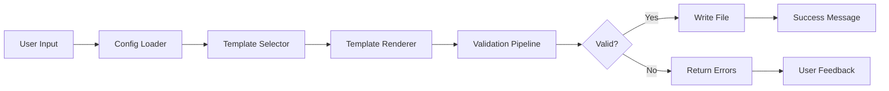
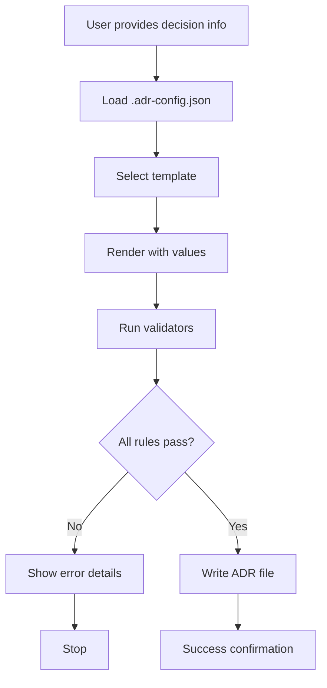

# ADR Agent Portability — OpenSpec Specification

**Status:** 🟡 In Progress  
**Last Updated:** 2026-08-12  
**Owner:** @ash

---

## Executive Summary

This OpenSpec document captures the detailed specification for making the ADR Generator Agent portable across the LightSpeedWP organization. The agent will support configuration-driven behavior, allowing adoption in all repository contexts (control-plane, organization repos, WordPress plugins/themes) without modification.

The solution emphasizes:

- **Extensibility without forking** — One agent, many configurations
- **Configuration over hardcoding** — All paths, metadata, templates configurable
- **Comprehensive test coverage** — >85% coverage for production quality
- **Clear migration path** — Existing repos can adopt gradually

---

## Phase 1: Core Portability (8–10 weeks)

### Objective

Establish a configurable, portable ADR agent that can be installed in any repository with minimal customization.

---

### 1.1 Configuration System

**Deliverable:** `.adr-config.json` schema and loader skill

**Files to Create:**

```
agents/adr-generator/
├── config/
│   ├── adr-config.schema.json      # JSON schema for validation
│   └── defaults.json               # Default configuration values
├── examples/
│   ├── org-config-example.json     # Organization-level defaults
│   ├── repo-config-example.json    # Repository-specific config
│   ├── wordpress-plugin-example.json
│   └── wordpress-theme-example.json
└── skills/
    └── adr-config-loader.md        # Config loading and validation skill
```

**Configuration Schema:**

```json
{
  "organization": "lightspeedwp",
  "adr_directory": "docs/adr",
  "numbering_scheme": "sequential",
  "prefix": "adr",
  "metadata": {
    "required_fields": ["status", "date", "authors"],
    "optional_fields": [],
    "custom_fields": {}
  },
  "templates": ["standard"],
  "validation": {
    "enabled": true,
    "rules": ["no-duplicates", "metadata-completeness"]
  },
  "governance": {
    "review_required": false
  }
}
```

**Features:**

- JSON schema validation
- Sensible defaults (zero-config works)
- Configuration inheritance (org defaults + repo overrides)
- Support for custom fields per repository
- Environment-aware defaults

**Tests:**

| Test | Type | Coverage |
|------|------|----------|
| Load valid `.adr-config.json` | Unit | Schema validation |
| Fall back to defaults when no config | Unit | Default behavior |
| Merge org + repo configs | Unit | Inheritance |
| Validate config schema | Unit | Schema compliance |
| Error on invalid schema | Unit | Error handling |
| Zero-config scenario | Integration | Works without config |
| Configuration inheritance | Integration | Multi-level merging |

**Coverage Target:** >95% (critical component)

---

### 1.2 Template System

**Deliverable:** Multiple ADR templates with variant support

**Files to Create:**

```
agents/adr-generator/
├── templates/
│   ├── standard-adr.template.md        # Full-featured template
│   ├── lightweight-adr.template.md     # Minimal, 1-page
│   ├── security-adr.template.md        # Domain example
│   ├── infrastructure-adr.template.md  # Domain example
│   └── TEMPLATE-GUIDE.md              # How to create custom templates
└── skills/
    └── adr-template-loader.md          # Template selection and rendering
```

**Template Features:**

All templates include:

- YAML front matter with customizable fields
- Consequence tracking (positive/negative with codes)
- Alternative evaluation section
- Implementation guidance
- References and relationships

**Template Variants:**

| Template | Use Case | Sections | Target |
|----------|----------|----------|--------|
| Standard | Full decisions | 12+ (all sections) | Architecture, major decisions |
| Lightweight | Quick decisions | 6 (core only) | Minor decisions, constraints |
| Security | Security decisions | 8 (security-focused) | Security policies, threat model |
| Infrastructure | Infrastructure | 10 (infra-focused) | Cloud, DevOps, systems |
| Custom | Org-specific | Variable | Defined per org |

**Tests:**

| Test | Type | Coverage |
|------|------|----------|
| Load all template variants | Unit | File loading |
| Render templates with values | Unit | Template rendering |
| Validate template structure | Unit | Markdown structure |
| Error on missing required placeholders | Unit | Error handling |
| Support custom template paths | Unit | Configuration |
| All templates generate valid ADRs | Integration | Output validation |
| Template selection via config | Integration | Config-driven selection |

**Coverage Target:** >90% (core functionality)

---

### 1.3 Validation & Quality Framework

**Deliverable:** Reusable validation rules and quality checking

**Files to Create:**

```
agents/adr-generator/
└── skills/
    ├── adr-validator.md                # Orchestrator
    ├── adr-structure-validator.md      # Markdown + front matter
    ├── adr-metadata-validator.md       # YAML fields
    ├── adr-duplicate-detector.md       # No duplicates
    ├── adr-completeness-checker.md     # Required sections
    └── adr-clarity-checker.md          # Language quality
```

**Validation Rules:**

| Rule | Purpose | Triggered | Configurable |
|------|---------|-----------|--------------|
| `no-duplicates` | Prevent duplicate titles/decisions | on-creation | Yes |
| `metadata-completeness` | Ensure required fields present | on-creation | Yes |
| `structure-validity` | Valid markdown + front matter | on-creation | No |
| `clarity-check` | Language clarity suggestions | on-creation | Yes |
| `consequence-coverage` | At least 1 positive & 1 negative | on-creation | Yes |
| `alternative-coverage` | At least 2–3 alternatives | on-creation | Yes |

**Tests:**

| Test | Type | Coverage |
|------|------|----------|
| Detect duplicate ADR titles | Unit | Duplicate detection |
| Check metadata completeness | Unit | Field validation |
| Validate markdown structure | Unit | Structure validation |
| Enforce consequence coverage | Unit | Content requirements |
| Full validation pipeline | Integration | End-to-end flow |
| Error message generation | Unit | User feedback |
| Quality checks prevent low-quality ADRs | Integration | Acceptance criteria |

**Coverage Target:** >90% per rule

---

### 1.4 Portable Agent Specification

**Deliverable:** Organization-agnostic agent spec

**Files to Create:**

```
agents/adr-generator/
└── adr-generator.agent.md             # Main agent specification
```

**Agent Responsibilities:**

1. Load configuration at startup
2. Select appropriate template based on config
3. Orchestrate validation pipeline
4. Generate ADR with proper numbering
5. Return user-friendly feedback

**Changes from Current:**

| Current | Change | Reason |
|---------|--------|--------|
| Hardcoded `/docs/adr/` | Use config path | Flexibility |
| LightSpeedWP branding | Use org name from config | Portability |
| Single template | Multiple templates | Flexibility |
| Limited validation | Modular validation rules | Extensibility |

**Tests:**

| Test | Type | Coverage |
|------|------|----------|
| Agent workflow start-to-finish | Integration | Full flow |
| Config-driven behavior | Integration | Configuration impact |
| Different configs produce different outputs | Integration | Behavior variance |

**Coverage Target:** >85% (integration focus)

---

### 1.5 Test Suite

**Deliverable:** Comprehensive unit + integration tests

**Test Infrastructure:**

```
agents/adr-generator/
├── __tests__/
│   ├── config-loader.test.js
│   ├── template-loader.test.js
│   ├── validators/
│   │   ├── structure-validator.test.js
│   │   ├── metadata-validator.test.js
│   │   ├── duplicate-detector.test.js
│   │   ├── completeness-checker.test.js
│   │   └── clarity-checker.test.js
│   ├── integration/
│   │   ├── end-to-end-workflow.test.js
│   │   ├── config-inheritance.test.js
│   │   └── cross-repo-linking.test.js
│   └── fixtures/
│       ├── valid-config.json
│       ├── invalid-config.json
│       ├── sample-adr.md
│       └── expected-output.md
├── jest.config.js
└── .testignore
```

**Test Scenarios:**

**Config Loader Tests:**

- ✓ Load valid `.adr-config.json`
- ✓ Fall back to defaults when no config
- ✓ Merge org defaults with repo-specific overrides
- ✓ Validate config schema
- ✓ Error gracefully on invalid schema
- ✓ Handle missing required fields

**Template Loader Tests:**

- ✓ Load all template variants
- ✓ Render templates with actual values
- ✓ Error on missing required placeholders
- ✓ Support custom template paths
- ✓ Handle template inheritance

**Validator Tests (per rule):**

- ✓ Detect duplicate ADR titles
- ✓ Check metadata completeness
- ✓ Validate markdown structure
- ✓ Enforce consequence coverage
- ✓ Suggest improvements for clarity

**Integration Tests:**

- ✓ Full workflow: config → template → validation → file
- ✓ Different configs produce different ADR structures
- ✓ Error handling and user messaging
- ✓ Configuration inheritance edge cases

**Test Frameworks & Tools:**

- **Jest** — Unit and integration tests
- **Node.js fs module** — File system operations
- **Mock GitHub file system** — Simulate repo structure
- **Snapshot testing** — Validate output consistency

**CI/CD Integration:**

```yaml
# Run on every PR to ADR agent changes
- Run tests: npm run test:adr
- Report coverage: codecov
- Block merge if coverage <85%
- Run linting: npm run lint:adr
```

**Coverage Report:**

| Component | Target | Method |
|-----------|--------|--------|
| Config loader | >95% | Unit + integration |
| Template system | >90% | Unit + integration |
| Validators | >90% | Unit (per rule) |
| Agent spec | >85% | Integration |
| **Overall** | **>85%** | Combined |

---

### 1.6 Documentation

**Deliverable:** Complete documentation with mermaid diagrams

**Files to Create:**

```
agents/adr-generator/
├── INSTALL.md                       # Installation guide
├── CONFIG.md                        # Configuration reference
├── BEST-PRACTICES.md               # Best practices guide
├── ARCHITECTURE.md                 # System architecture
├── API.md                          # Skills and functions
├── TROUBLESHOOTING.md              # Common issues
└── examples/
    ├── standard-adr-output.md
    ├── lightweight-adr-output.md
    └── custom-config-example.json
```

**Documentation Sections:**

**INSTALL.md:**

- Prerequisites (Node.js, npm, git)
- Step-by-step setup for adopting repositories
- Configuration template with explanations
- Troubleshooting common setup issues

**CONFIG.md:**

- Full schema documentation
- All configuration options with defaults
- Per-repository customization patterns
- Configuration inheritance examples
- WordPress-specific configuration

**BEST-PRACTICES.md:**

- When to write an ADR
- How to structure decisions effectively
- Examples across domains (security, infrastructure, etc.)
- Common pitfalls to avoid
- Decision templates and patterns

**ARCHITECTURE.md:**

- System overview
- Component relationships
- Data flow diagrams (mermaid)
- Extension points and hooks
- Plugin development guide

**Mermaid Diagrams Required:**





---

### 1.7 Acceptance Criteria (Phase 1)

✅ Configuration system implemented and tested  
✅ Template system supports standard + lightweight + examples  
✅ All validation rules are modular and testable  
✅ Agent spec is portable and organization-agnostic  
✅ Test coverage >85% for all code  
✅ Documentation complete with mermaid diagrams  
✅ Works in 3+ test repositories (control-plane, org repo, WordPress)  
✅ Zero hardcoded organization-specific assumptions  
✅ All skills are reusable and independent

---

## Phase 2: Cross-Repository Integration (6–8 weeks)

### Objective

Enable ADR discovery and linking across repositories.

### High-Level Scope

- Cross-repo ADR discovery and linking
- GitHub Actions for validation in PRs
- Governance hooks for org-specific workflows
- Support for different repo contexts (control-plane, WordPress)

**Files to Create:** Skills and workflows for cross-repo operations

---

## Phase 3: Organization-Wide Features (4–6 weeks)

### Objective

Central ADR registry and organization-wide decision tracking.

### High-Level Scope

- Central ADR registry and index
- Metrics and reporting
- Knowledge management and archival
- Organizational decision tracking

---

## Decision Points (Ready for Team Input)

### DP-001: Single Agent vs. Multiple Variants

**Status:** ⏳ Awaiting decision

### DP-002: WordPress Adaptation Strategy

**Status:** ⏳ Awaiting decision

### DP-003: Configuration Format & Location

**Status:** ⏳ Awaiting decision

### DP-004: Registry Integration Type

**Status:** ⏳ Awaiting decision

### DP-005: ADR Numbering Scheme

**Status:** ⏳ Awaiting decision

### DP-006: Approval Workflow Requirements

**Status:** ⏳ Awaiting decision

---

## Success Metrics

✅ Code Quality: >85% test coverage across all components  
✅ Adoption: 5+ repositories successfully using agent by end of Phase 1  
✅ Documentation: Complete with mermaid diagrams, 0 outstanding clarifications  
✅ Test Results: All CI checks passing, 0 known bugs  
✅ User Feedback: Positive feedback from adopting teams

---

## Timeline (Detailed)

| Phase | Duration | Start | Key Milestones |
|-------|----------|-------|-----------------|
| Phase 1A | 2–3 weeks | 2026-08-12 | Config system, schema, loader |
| Phase 1B | 3–4 weeks | 2026-08-26 | Templates, validation, quality |
| Phase 1C | 2–3 weeks | 2026-09-09 | Test suite, documentation |
| Phase 1 Review | 1 week | 2026-09-23 | Acceptance tests, sign-off |
| Phase 2 | 6–8 weeks | 2026-09-30 | Cross-repo, GitHub Actions, governance |
| Phase 3 | 4–6 weeks | 2026-11-24 | Registry, metrics, knowledge mgmt |

---

## Risk Mitigation

### Risk: Configuration Complexity

**Mitigation:** Sensible defaults, interactive config wizard, comprehensive documentation

### Risk: Version Incompatibility

**Mitigation:** Semantic versioning, backward-compatible config, migration guide

### Risk: Adoption Friction

**Mitigation:** One-command setup, detailed guides, example configs, proof-of-concept in 2 repos

---

---

## Phase 1 Detailed Implementation Roadmap

### Phase 1A: Configuration System (Weeks 1–2)

**Lead:** @ash  
**Deliverables:** Configuration schema, loader, examples, documentation

#### Week 1: Schema Design & Validation

**Tasks:**

1. Define JSON schema for `.adr-config.json` (adr-config.schema.json)
2. Create configuration validation rules
3. Define default configuration (defaults.json)
4. Create configuration examples for different repository contexts
5. Design configuration inheritance logic (org defaults + repo overrides)

**Files:**

- `agents/adr-generator/config/adr-config.schema.json` (500–700 lines)
- `agents/adr-generator/config/defaults.json` (100–150 lines)
- `agents/adr-generator/examples/org-config-example.json`
- `agents/adr-generator/examples/repo-config-example.json`
- `agents/adr-generator/examples/wordpress-plugin-example.json`
- `agents/adr-generator/examples/wordpress-theme-example.json`

**Tests (Unit):**

- Schema validation tests (valid/invalid configs)
- Default value tests
- Error handling tests
- Example configuration validation

**Acceptance Criteria:**

- Schema is JSON Schema Draft 7 compliant
- All configuration options documented
- Examples cover 4+ repository contexts
- Zero-config scenario works (uses defaults)

#### Week 2: Config Loader Skill & Integration

**Tasks:**

1. Implement adr-config-loader skill
2. Build configuration loading logic
3. Implement configuration inheritance
4. Add environment-aware defaults
5. Create configuration validation utility

**Files:**

- `agents/adr-generator/skills/adr-config-loader.md` (skill definition)
- `agents/adr-generator/__tests__/config-loader.test.js` (>95% coverage)

**Tests (Unit + Integration):**

- Load valid .adr-config.json
- Fall back to defaults when no config
- Merge org + repo configs
- Validate config schema
- Error on invalid schema
- Configuration inheritance edge cases

**Acceptance Criteria:**
>
- >95% test coverage for config loader
- Skill is reusable and independent
- Configuration inheritance works correctly
- Clear error messages on validation failures

### Phase 1B: Template System & Validation (Weeks 3–5)

**Lead:** @ash  
**Deliverables:** Templates, template loader, validation rules

#### Week 3–4: Template Design & Development

**Tasks:**

1. Create standard-adr.template.md (full-featured, 12+ sections)
2. Create lightweight-adr.template.md (minimal, 6 sections)
3. Create security-adr.template.md (domain-specific)
4. Create infrastructure-adr.template.md (domain-specific)
5. Implement template-loader skill
6. Build template rendering system

**Files:**

- `agents/adr-generator/templates/standard-adr.template.md` (400–500 lines)
- `agents/adr-generator/templates/lightweight-adr.template.md` (200–250 lines)
- `agents/adr-generator/templates/security-adr.template.md` (350–400 lines)
- `agents/adr-generator/templates/infrastructure-adr.template.md` (350–400 lines)
- `agents/adr-generator/templates/TEMPLATE-GUIDE.md` (custom template guide)
- `agents/adr-generator/skills/adr-template-loader.md`

**Tests (Unit + Integration):**

- Load all template variants
- Render templates with values
- Validate template structure
- Error on missing placeholders
- Support custom template paths
- Template selection via config

**Acceptance Criteria:**
>
- >90% test coverage for template system
- All templates generate valid markdown
- Template placeholders are consistent
- Custom template paths work

#### Week 5: Validation Framework

**Tasks:**

1. Implement adr-validator (orchestrator)
2. Create modular validation rules:
   - Structure validator (markdown + front matter)
   - Metadata validator (YAML fields)
   - Duplicate detector (repo-local)
   - Completeness checker (required sections)
   - Clarity checker (language quality)
3. Build validation pipeline
4. Create error message system

**Files:**

- `agents/adr-generator/skills/adr-validator.md` (orchestrator)
- `agents/adr-generator/skills/adr-structure-validator.md`
- `agents/adr-generator/skills/adr-metadata-validator.md`
- `agents/adr-generator/skills/adr-duplicate-detector.md`
- `agents/adr-generator/skills/adr-completeness-checker.md`
- `agents/adr-generator/skills/adr-clarity-checker.md`
- `agents/adr-generator/__tests__/validators/*.test.js`

**Tests (Unit):**

- Detect duplicate ADR titles
- Check metadata completeness
- Validate markdown structure
- Enforce consequence coverage
- Suggest improvements for clarity

**Acceptance Criteria:**
>
- >90% coverage per validation rule
- All rules are independent and composable
- Clear, actionable error messages
- Validation pipeline is configurable

### Phase 1C: Agent Spec, Tests & Documentation (Weeks 6–8)

**Lead:** @ash  
**Deliverables:** Agent spec, test suite, complete documentation

#### Week 6: Portable Agent Specification

**Tasks:**

1. Refactor current `.github/agents/adr.agent.md`
2. Remove all hardcoded paths
3. Remove organization-specific branding
4. Integrate config loader at startup
5. Orchestrate template system
6. Orchestrate validation pipeline
7. Design numbering logic (configurable)

**Files:**

- `agents/adr-generator/adr-generator.agent.md` (400–500 lines)

**Tests (Integration):**

- Agent workflow start-to-finish
- Config-driven behavior
- Different configs produce different outputs

**Acceptance Criteria:**

- Agent is organization-agnostic
- All config options are used
- Zero hardcoded assumptions
- >85% integration coverage

#### Week 7: Test Suite Development

**Tasks:**

1. Set up Jest configuration
2. Create test fixtures and mocks
3. Write comprehensive unit tests
4. Write integration tests
5. Set up CI/CD integration
6. Configure code coverage reporting

**Files:**

- `agents/adr-generator/jest.config.js`
- `agents/adr-generator/__tests__/config-loader.test.js` (>95%)
- `agents/adr-generator/__tests__/template-loader.test.js` (>90%)
- `agents/adr-generator/__tests__/validators/*.test.js` (>90% each)
- `agents/adr-generator/__tests__/integration/*.test.js`
- `agents/adr-generator/__tests__/fixtures/` (test data)

**Test Coverage Targets:**

- Config loader: >95% (critical)
- Template system: >90%
- Validators: >90% per rule
- Agent spec: >85% (integration focus)
- Overall: >85%

**Acceptance Criteria:**
>
- >85% overall coverage
- All CI checks passing
- Test failures block merge
- Code coverage reports available

#### Week 8: Documentation & Review

**Tasks:**

1. Create INSTALL.md (setup guide)
2. Create CONFIG.md (configuration reference)
3. Create BEST-PRACTICES.md
4. Create ARCHITECTURE.md (system design)
5. Create API.md (skills and functions)
6. Create TROUBLESHOOTING.md
7. Generate mermaid diagrams
8. Phase 1 review and sign-off

**Files:**

- `agents/adr-generator/INSTALL.md` (installation guide)
- `agents/adr-generator/CONFIG.md` (config reference)
- `agents/adr-generator/BEST-PRACTICES.md`
- `agents/adr-generator/ARCHITECTURE.md` (with diagrams)
- `agents/adr-generator/API.md` (skills reference)
- `agents/adr-generator/TROUBLESHOOTING.md`

**Mermaid Diagrams:**

- System architecture (4-tier)
- ADR creation workflow
- Configuration decision tree
- Validation pipeline
- Template selection logic

**Acceptance Criteria:**

- Documentation is complete and clear
- All examples work
- Diagrams render correctly
- Phase 1 sign-off from team

### Phase 1 Completion Checklist

- [ ] Configuration system implemented and tested (>95% coverage)
- [ ] Template system with 4 variants (>90% coverage)
- [ ] Modular validation rules (>90% per rule)
- [ ] Portable agent specification (>85% coverage)
- [ ] Complete test suite with Jest
- [ ] CI/CD integration configured
- [ ] Documentation complete with diagrams
- [ ] Works in 3+ test repositories
- [ ] Zero hardcoded assumptions
- [ ] Team review and approval
- [ ] Phase 1 deliverables signed off

---

## Phase 2 & 3 Roadmap (High-Level)

### Phase 2: Cross-Repository Integration (6–8 weeks)

**Deliverables:**

- Cross-repo ADR discovery and linking
- GitHub Actions for PR validation
- Governance hooks for custom workflows
- Support for different repository contexts

**Key Features:**

- ADR discovery across repositories
- Cross-repo reference validation
- PR validation workflows
- GitHub Actions integration
- Org-specific governance hooks

### Phase 3: Organization-Wide Features (4–6 weeks)

**Deliverables:**

- Central ADR registry
- Metrics and reporting
- Knowledge management and archival
- Organization-wide decision tracking

**Key Features:**

- ADR index and discovery
- Decision analytics
- ADR lifecycle management
- Organizational metrics

---

## Success Metrics & Acceptance Criteria

### Code Quality

- ✅ Test coverage: >85% across all components
- ✅ Jest test suite: Unit + integration tests
- ✅ CI/CD: All checks passing before merge
- ✅ Code review: Zero critical issues

### Adoption & Usability

- ✅ 5+ repositories using agent by Phase 1 completion
- ✅ Zero code modification required for adoption
- ✅ Installation time: <15 minutes
- ✅ User satisfaction: Positive feedback

### Documentation

- ✅ Complete documentation with mermaid diagrams
- ✅ Working examples for all use cases
- ✅ Clear troubleshooting guide
- ✅ API documentation for all skills

### Technical Requirements

- ✅ All paths configurable
- ✅ All metadata customizable
- ✅ Template system extensible
- ✅ Validation rules modular
- ✅ Skills reusable and independent

---

## Risk Mitigation Strategies

### Risk 1: Configuration Complexity

**Mitigation:**

- Sensible defaults (zero-config works)
- Interactive config wizard
- Comprehensive documentation
- Example configurations for all contexts

### Risk 2: Version Incompatibility

**Mitigation:**

- Semantic versioning
- Backward-compatible configuration
- Migration guide for updates
- Deprecation notices

### Risk 3: Adoption Friction

**Mitigation:**

- One-command setup
- Detailed installation guide
- Example configurations
- Proof-of-concept in 2 repositories
- Demo and training materials

---

*Last Updated: 2026-08-12 by @ash*  
*Status: Detailed Implementation Plan Ready for Execution*  
*Built by 🧱 LightSpeedWP with ☕, 🚀, and open-source spirit!*
