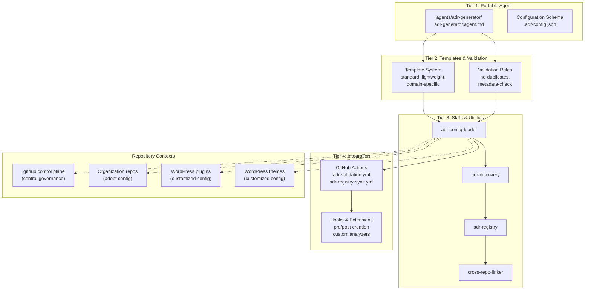

# ADR Agent Portability — Organization-Wide Implementation

**Project Start Date:** 2026-08-12  
**Status:** 🔵 Planning Phase  
**Scope:** Transform the ADR Generator Agent into a portable, organization-agnostic system usable across all LightSpeedWP repositories (control-plane, organization repos, WordPress plugins/themes)

---

## Project Overview

The current ADR Generator Agent (`.github/agents/adr.agent.md`) is tightly coupled to the `.github` control plane with hardcoded paths, organization-specific branding, and inflexible metadata. This project transforms it into a **reusable, configurable, extensible agent** that can be installed and adapted across the entire GitHub organization.

### Key Deliverables

1. **Portable Agent Specification** (`agents/adr-generator/`)
2. **Configuration System** (`.adr-config.json` schema and defaults)
3. **Multiple ADR Templates** (standard, lightweight, domain-specific)
4. **Validation & Governance Skills** (reusable components)
5. **Test Suite** (comprehensive coverage for scripts, validation, integration)
6. **Documentation** (installation guide, configuration reference, best practices)
7. **GitHub Integration** (Actions, hooks, issue linking)

---

## Architecture Overview

---

## Project Phases

### Phase 1: Core Portability (8–10 weeks)

Establish configuration system, templates, validation, and test coverage.

**Deliverables:**

- Configuration schema and loader
- Template system with 3+ variants
- Validation rule engine
- Test suite (unit + integration)
- Documentation

**Related Issues:** To be created

### Phase 2: Cross-Repository Integration (6–8 weeks)

Enable ADR discovery, linking, and governance across repositories.

**Deliverables:**

- Cross-repo linking capability
- GitHub Actions for validation
- Governance hooks and approval workflows
- Agent variant guidance (if needed)

**Related Issues:** To be created

### Phase 3: Organization-Wide Features (4–6 weeks)

Central registry, metrics, and knowledge management.

**Deliverables:**

- ADR registry and discovery
- Metrics and reporting
- Archival and retirement workflows

**Related Issues:** To be created

---

## Component Breakdown

### Tier 1: Portable Agent Specification

**Directory:** `agents/adr-generator/`

| Component | Purpose | Owner |
|-----------|---------|-------|
| `adr-generator.agent.md` | Core agent spec (organization-agnostic) | @ash |
| `config/adr-config.schema.json` | JSON schema for configuration | @ash |
| `config/defaults.json` | Default configuration values | @ash |

### Tier 2: Templates & Validation

| Component | Purpose | Tests |
|-----------|---------|-------|
| `templates/standard-adr.template.md` | Full-featured ADR template | unit |
| `templates/lightweight-adr.template.md` | Minimal ADR template | unit |
| `templates/custom-example.template.md` | Example custom template | unit |
| Validation rules | Enforce quality standards | unit + integration |

### Tier 3: Skills & Utilities

| Skill | Functionality | Tests |
|-------|--------------|-------|
| `adr-config-loader` | Load and validate `.adr-config.json` | unit + integration |
| `adr-discovery` | Find existing ADRs, detect next number | unit + integration |
| `adr-validator` | Validate ADR structure and content | unit |
| `adr-registry` | Register ADR in central index | integration |
| `cross-repo-linker` | Link ADRs across repositories | integration |

### Tier 4: GitHub Integration

| Component | Purpose | Tests |
|-----------|---------|-------|
| `.github/workflows/adr-validation.yml` | Validate PR changes to ADRs | integration |
| `.github/workflows/adr-registry-sync.yml` | Sync new ADRs to registry | integration |
| Hooks (pre/post creation) | Custom org-specific behavior | integration |

---

## Test Strategy

### Unit Tests

- **Configuration Loading** — validate `.adr-config.json` parsing and schema
- **Template Rendering** — verify all templates generate valid ADR structure
- **Validation Rules** — test each validation rule independently
- **Metadata Validation** — ensure required/optional fields are checked

**Coverage Target:** >90% for all skills

**Test Framework:** Jest

### Integration Tests

- **End-to-End ADR Creation** — full workflow from user input to file creation
- **Cross-Repo Linking** — verify ADR discovery and linking across repositories
- **GitHub Actions** — test validation and registry sync workflows
- **Configuration Inheritance** — test default config + org-specific overrides

**Coverage Target:** >80% for workflows

### Acceptance Tests

- **Real-world Adoption** — test in control-plane, org repo, WordPress plugin
- **Cross-repo Functionality** — verify links don't break across repos
- **Configuration Flexibility** — confirm different configs produce different outputs

**Coverage Target:** All scenarios pass

---

## Documentation Requirements

### 1. Installation Guide

- Step-by-step setup for adopting repositories
- Configuration template with examples
- Troubleshooting guide

### 2. Configuration Reference

- Full schema documentation
- All configuration options with examples
- Per-repository customization patterns

### 3. Best Practices

- When to write an ADR
- How to structure decisions
- Examples across domains

### 4. Architecture Documentation

- System overview (mermaid)
- Data flow (mermaid)
- Integration points (mermaid)
- Configuration decision tree (mermaid)

---

## Decision Points

### DP-001: Single Agent vs. Multiple Variants

**Question:** One configurable agent for all repos, or separate agents for different contexts?

**Options:**

1. Single agent (simpler, consistent standards)
2. Multiple agents (optimized per domain)

**Recommendation:** Single agent with configuration-driven behavior

---

### DP-002: WordPress Adaptation Strategy

**Question:** Do WordPress plugins/themes need special handling?

**Options:**

1. No special handling (use standard system)
2. Custom metadata fields (via configuration)
3. Separate variant agents

**Recommendation:** Custom metadata fields via configuration (flexibility without duplication)

---

### DP-003: Configuration Location & Format

**Question:** Where and how should repos store ADR configuration?

**Options:**

1. `.adr-config.json` at repo root
2. `.adr-config.yml` with YAML
3. Inside existing config files

**Recommendation:** `.adr-config.json` at repo root (easy discovery, schema support)

---

### DP-004: Registry Integration

**Question:** Central registry for all ADRs, or local discovery only?

**Options:**

1. Central registry (org-wide discovery, Phase 3)
2. Local discovery only (per-repo)
3. Hybrid (optional registry with local fallback)

**Recommendation:** Hybrid approach (Phase 1: local, Phase 3: optional central)

---

### DP-005: ADR Numbering Scheme

**Question:** How should ADRs be numbered?

**Options:**

1. Sequential per repository (0001, 0002, ...)
2. Sequential organization-wide
3. Date-based (YYYY-MM-DD)
4. UUID-based

**Recommendation:** Sequential per repository (simpler, local autonomy)

---

### DP-006: Approval Workflow

**Question:** Should ADRs require approval before "Accepted" status?

**Options:**

1. No approval (optional peer review)
2. Code owner approval (via CODEOWNERS)
3. Team lead approval (configurable)
4. Architecture board approval (org governance)

**Recommendation:** Configurable per repository

---

## Success Criteria

- ✅ Agent is portable and installable without modification
- ✅ Configuration system enables per-repo customization
- ✅ Test coverage >85% across all code
- ✅ Documentation complete with mermaid diagrams
- ✅ ADRs can be discovered and linked across repositories
- ✅ WordPress repos can adopt with minimal effort
- ✅ Governance integration supports org-wide decision tracking
- ✅ All related GitHub issues are linked and tracked

---

## Timeline

| Phase | Duration | Start | End |
|-------|----------|-------|-----|
| Phase 1: Core Portability | 8–10 weeks | 2026-08-12 | ~2026-10-21 |
| Phase 2: Cross-Repo Integration | 6–8 weeks | ~2026-10-22 | ~2026-12-16 |
| Phase 3: Org-Wide Features | 4–6 weeks | ~2026-12-17 | ~2027-01-27 |

---

## Related Issues

| Issue | Type | Purpose | Status |
|-------|------|---------|--------|
| [#1828](../../../issues/1828) | epic | Master Initiative Epic — ADR Agent Portability | 🟡 Planning |
| [#1829](../../../issues/1829) | task | Phase 1A: Design & Configuration System | ⏳ Blocked |
| [#1830](../../../issues/1830) | task | Phase 1B: Template & Validation Framework | ⏳ Blocked |
| [#1831](../../../issues/1831) | task | Phase 1C: Test Suite & Documentation | ⏳ Blocked |
| [#1832](../../../issues/1832) | task | Phase 2: Cross-Repository Integration | ⏳ Blocked |
| [#1833](../../../issues/1833) | task | Phase 3: Registry & Organization-Wide Features | ⏳ Blocked |

---

## OpenSpec Documentation

This project is tracked in the formal OpenSpec specification system:

**OpenSpec Location:** `/openspec/changes/adr-agent-portability/`

**Available Specs:**

- **[proposal.md](/openspec/changes/adr-agent-portability/proposal.md)** — Problem statement, solution overview, scope, decision points
- **[design.md](/openspec/changes/adr-agent-portability/design.md)** — Technical design, architecture, component specifications, implementation approach

**OpenSpec Status:** 🔵 Active (Proposal & Design phases complete)

---

## Project Documentation Index

### Core Planning Documents

| Document | Purpose | Status |
|----------|---------|--------|
| [README.md](README.md) | Project overview, architecture, timeline | ✅ Complete |
| [OPENSPEC.md](OPENSPEC.md) | Detailed Phase 1–3 specifications | ✅ Complete |
| [PHASE_1_IMPLEMENTATION_PLAN.md](PHASE_1_IMPLEMENTATION_PLAN.md) | 8–10 week detailed roadmap with deliverables | ✅ Complete |
| [ARCHITECTURE_DECISIONS.md](ARCHITECTURE_DECISIONS.md) | 6 architectural decisions (AD-001–AD-006) | ✅ Complete |

### OpenSpec Formal Specifications

| Document | Purpose | Status |
|----------|---------|--------|
| [proposal.md](/openspec/changes/adr-agent-portability/proposal.md) | Problem statement, solution, scope, success criteria | ✅ Complete |
| [design.md](/openspec/changes/adr-agent-portability/design.md) | Technical design, architecture, configuration schema | ✅ Complete |

---

## Next Steps

1. ✅ Create linked GitHub epic issue (#1828)
2. ✅ Run OpenSpec to flesh out Phase 1 details (COMPLETE)
3. ✅ Create comprehensive planning documentation (COMPLETE)
4. ⏳ Review and finalize decision points (DP-001 through DP-006) with team
5. ⏳ Create Phase 1A–1C implementation issues (#1829–#1831)
6. ⏳ Begin Phase 1A work (configuration system, Weeks 1–2)

---

**Built by 🧱 LightSpeedWP with ☕, 🚀, and open-source spirit!**
