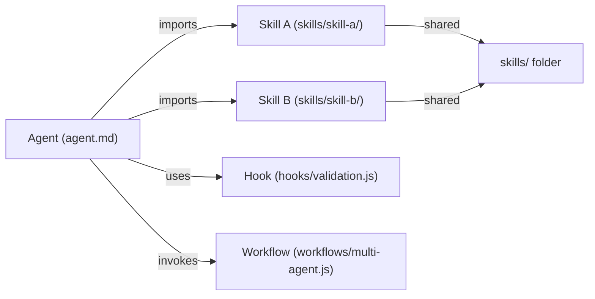

# Plan: Agent & Skills Standards Documentation Initiative

## Context

The `.github` repository needs comprehensive, cohesive documentation on creating agents, skills, instructions, workflows, cookbooks, plugins, hooks, and prompts. Currently, documentation is scattered or minimal. The goal is to create a unified, step-by-step guide that mirrors the structure and quality of the [awesome-copilot](https://github.com/github/awesome-copilot) repository, while accounting for LightSpeedWP's existing standards and folder structure.

This documentation will serve as the authoritative reference for internal teams building agents and skills, reducing friction and ensuring consistency.

## Branch Name

**`docs/agent-skills-standards-comprehensive`**

Follows the `docs/{scope}-{short-title}` pattern per CLAUDE.md branching strategy.

## File Organization (Top-Level)

All documentation files should live in the root `docs/` directory (not subfolders). Rationale: agent/skills/workflows are cross-cutting concerns; a subfolder would fragment related documentation.

**Files to create:**

1. `docs/AGENT_STANDARDS.md` — Replaces/extends current `docs/AGENT_CREATION.md` with comprehensive agent design, folder structure, and multi-file organization
2. `docs/SKILLS_STANDARDS.md` — New: skill creation, shared skills concept, reusability patterns, and best practices
3. `docs/INSTRUCTIONS_STANDARDS.md` — New: instruction file creation, structure, and guidelines
4. `docs/WORKFLOWS_STANDARDS.md` — New: shared workflows, org-level agentic workflows, best practices
5. `docs/COOKBOOKS_STANDARDS.md` — New: what cookbooks are, structure, examples, when to create them
6. `docs/PROMPTS_STANDARDS.md` — New: prompt engineering best practices, structure, testing prompts
7. `docs/PLUGINS_STANDARDS.md` — New: plugin architecture, folder structure, manifest, examples
8. `docs/HOOKS_STANDARDS.md` — New: hooks for agents/skills, event triggers, implementation patterns
9. `docs/AI_REFERENCES_STANDARDS.md` — New: what lives in `ai/` folder (Claude.md, Gemini.md, RUNNERS.md), purpose and usage

## Key Existing Files to Review (Avoid Duplicates)

- `docs/AGENT_CREATION.md` — Current single-file spec (will extend, not duplicate)
- `docs/BRANCHING_STRATEGY.md` — Don't re-document; cross-reference
- `docs/PR_CREATION_PROCESS.md` — Cross-reference for submission workflows
- `AGENTS.md` — Global AI rules; reference but don't duplicate
- `.github/instructions/` — Review existing instruction patterns to avoid conflicts

## Folder Structure to Document

Reference these existing folders when writing standards:

- `agents/` — Agent specifications; document folder vs. single-file structure
- `skills/` — Shared skills; document reusability patterns and when to create skills
- `instructions/` — Instruction files; document role, format, and examples
- `workflows/` — Agentic workflows; document workflow types and composition
- `cookbook/` — Implementation guides; document structure and use cases
- `prompts/` — Prompt templates; document prompt structure and testing
- `plugins/` — Plugin bundles; document plugin.json and file organization
- `hooks/` — Event hooks; document hook types and examples
- `ai/` — Reference files (Claude.md, Gemini.md, RUNNERS.md); document purpose

## Topics to Cover (Per Document)

### 1. AGENT_STANDARDS.md

- **Single-file agents:** Current `.agent.md` spec (from AGENT_CREATION.md)
- **Folder-based agents:** Multi-file structure for complex agents
  - Recommended folder layout: `agents/{agent-name}/`, with `agent.md`, `skills/`, `hooks/`, `examples/`
  - Minimum requirements: agent.md + at least one skill reference
  - How agents compose shared skills from `skills/` folder
- **Agent metadata:** name, description, version, providers (multi-provider pattern from PRD Agent work)
- **Examples:** Reference existing agents in repo (prd-agent, playwright-agent, etc.)
- **Validation:** Link to agent validation processes

### 2. SKILLS_STANDARDS.md

- **Skill concept:** Individual, reusable capabilities (not agent-specific)
- **Shared vs. dedicated skills:** When to create shared skills vs. agent-only skills
- **Folder structure:** `skills/{skill-name}/` with `SKILL.md` entrypoint
- **Minimum requirements:**
  - SKILL.md with frontmatter (name, description, version, dependencies)
  - Implementation (JS/TS/Python/etc.)
  - Examples and documentation
- **Skill composition:** How agents import and use shared skills
- **Maintenance patterns:** Versioning, backward compatibility, deprecation
- **Audit:** Reference agentskills.io best practices:
  - <https://agentskills.io/skill-creation/best-practices>
  - <https://agentskills.io/skill-creation/evaluating-skills>
  - <https://agentskills.io/skill-creation/optimizing-descriptions>
  - <https://agentskills.io/skill-creation/using-scripts>
- **External references:**
  - <https://platform.claude.com/docs/en/agents-and-tools/agent-skills/overview>
  - <https://agentskills.io/specification>

### 3. INSTRUCTIONS_STANDARDS.md

- **Instruction file purpose:** Reusable, portable instructions for Copilot/agents
- **File format:** Markdown with YAML frontmatter (role, language, context)
- **Folder structure:** `instructions/{scope}.instructions.md`
- **Mandatory sections:** Role declaration, Overview, General Rules, Detailed Guidance, Examples, Validation, References
- **Constraints:** NO `references` frontmatter field; use inline links or footer sections
- **Examples from repo:** Reference existing instruction files in `.github/instructions/` and top-level `instructions/`
- **Best practices:** Conciseness, clarity, actionable guidance, no ambiguity
- **Version control:** How to deprecate and migrate instructions

### 4. WORKFLOWS_STANDARDS.md

- **Shared workflows:** Portable, reusable agentic workflows (not GitHub Actions)
- **Use cases:** Multi-agent orchestration, fan-out patterns, aggregation patterns
- **Folder structure:** `workflows/{workflow-name}.js` or `workflows/{workflow-name}/`
- **Workflow script format:** Export meta, phase definitions, agent spawning
- **Best practices:**
  - Loop patterns (loop-until-dry, loop-until-budget)
  - Pipeline vs. parallel execution
  - Adversarial verification, multi-modal sweep
  - Budget awareness
- **Composition:** How agents invoke shared workflows
- **Examples:** Reference existing workflow patterns in repo
- **External reference:** Anthropic documentation (Claude Agent SDK)

### 5. COOKBOOKS_STANDARDS.md

- **Cookbook concept:** Implementation guides, recipes, playbooks (not code libraries)
- **Purpose:** "How to accomplish X task" with step-by-step walkthroughs
- **Folder structure:** `cookbook/{recipe-name}/` with README, steps, examples, tools
- **Sections:**
  - Overview and use case
  - Prerequisites and setup
  - Step-by-step walkthrough
  - Troubleshooting and pitfalls
  - Examples and templates
  - Related resources
- **When to create:** Complex workflows, common patterns, educational content
- **Examples from awesome-copilot:** Review <https://github.com/github/awesome-copilot/tree/main/docs>
- **Mermaid diagrams:** Use process flows, decision trees, architecture diagrams

### 6. PROMPTS_STANDARDS.md

- **Prompt concept:** Reusable prompt templates and patterns (not one-off prompts)
- **Folder structure:** `prompts/{prompt-name}.md` with metadata and template
- **Frontmatter:** Name, version, use-case, model, temperature, context requirements
- **Template format:** Placeholder variables (e.g., `{{topic}}`, `{{format}}`), expected inputs/outputs
- **Best practices:**
  - Clear role/persona
  - Specific task definition
  - Constraints and guidelines
  - Examples of good/bad outputs
  - Testing strategy
- **External references:**
  - <https://www.anthropic.com/engineering/building-effective-agents>
  - Anthropic prompt engineering guides
- **Mermaid diagrams:** Show prompt flow, decision branches, validation gates

### 7. PLUGINS_STANDARDS.md

- **Plugin concept:** Installable extensions for Claude Code/agents (VS Code, JetBrains, CLI)
- **Plugin anatomy:**
  - `plugin.json` manifest
  - Commands, hooks, settings, MCP integrations
  - Custom instructions (if applicable)
- **Folder structure:** `plugins/{plugin-name}/` with plugin.json, implementation, tests
- **Minimum requirements:**
  - plugin.json (name, version, description, commands, hooks)
  - README with setup instructions
  - Examples of plugin in action
- **External references:**
  - <https://code.claude.com/docs/en/plugins>
  - <https://docs.github.com/en/copilot/how-tos/copilot-cli/customize-copilot/plugins-creating>
- **Composition with skills/workflows:** How plugins expose agent capabilities

### 8. HOOKS_STANDARDS.md

- **Hooks concept:** Event-driven handlers for agents and skills
- **Hook types:** startup, shutdown, before-run, after-run, on-error, validation, logging
- **Folder structure:** `hooks/{hook-name}.js` or `hooks/{event-type}/`
- **Hook implementation:** Event signature, return values, error handling
- **Use cases:** Setup/teardown, logging, validation, branching logic, metrics
- **Examples:** Reference existing hooks in repo (branch-validation, template-enforcement, etc.)
- **Best practices:**
  - Idempotency
  - Error resilience
  - Performance (avoid blocking operations)
  - Testing hooks

### 9. AI_REFERENCES_STANDARDS.md

- **Purpose of `ai/` folder:** Canonical AI agent references for the organisation
- **Contents:**
  - `ai/Claude.md` — Claude model capabilities, use cases, constraints
  - `ai/Gemini.md` — Gemini model capabilities, use cases, constraints
  - `ai/RUNNERS.md` — Agent runners, execution patterns, orchestration
  - (Future: `ai/OpenAI.md`, `ai/LlamaIndex.md`, etc.)
- **Frontmatter:** Version, last-updated, scope (internal/external)
- **Format:** Structured, scannable, with links to canonical sources
- **Governance:** How/when to update, deprecation policy
- **Use:** Reference from CLAUDE.md, AGENTS.md, and agent/skill docs
- **External references:**
  - <https://platform.claude.com/docs/>
  - <https://geminicli.com/docs/>

## Reference Links to Retain

**Agent & Skill Creation Standards (External):**

- <https://www.anthropic.com/engineering/building-effective-agents>
- <https://oracle.github.io/agent-spec/26.1.2/index.html>
- <https://github.com/agentskills/agentskills>
- <https://agentskills.io/home>
- <https://agentskills.io/specification>
- <https://agentskills.io/skill-creation/best-practices>
- <https://agentskills.io/skill-creation/evaluating-skills>
- <https://agentskills.io/skill-creation/optimizing-descriptions>
- <https://agentskills.io/skill-creation/using-scripts>

**Platform Documentation:**

- <https://platform.claude.com/docs/en/agents-and-tools/agent-skills/overview>
- <https://code.claude.com/docs/en/plugins>
- <https://learn.chatgpt.com/docs/build-plugins>
- <https://geminicli.com/docs/extensions/writing-extensions/>
- <https://docs.github.com/en/copilot/how-tos/copilot-cli/customize-copilot/plugins-creating>

**Inspiration & Benchmarks:**

- <https://github.com/github/awesome-copilot> (full repo audit)
- <https://github.com/github/awesome-copilot/tree/main/docs>

## Implementation Notes

### Audit awesome-copilot

1. Review `docs/` folder structure, file naming, and format
2. Extract patterns for:
   - Clear section organization
   - Use of diagrams (Mermaid recommended)
   - Example code blocks and templates
   - Cross-referencing and links
   - Progressive disclosure (beginner → advanced)
3. Adapt (don't copy) patterns to LightSpeedWP context

### Mermaid Diagrams (Use Liberally)

Include diagrams for:

- **Agent anatomy:** How agents compose skills, hooks, workflows
- **Skill lifecycle:** Creation → validation → publishing → versioning
- **Workflow execution:** Pipeline vs. parallel patterns, fan-out/fan-in
- **Plugin architecture:** Plugin.json → commands → hooks → MCP integration
- **Instruction hierarchy:** Global rules → repo-specific → agent-specific
- **Folder structure trees:** Visual representation of recommended layouts

Example:

### Validation Checklist (Per Document)

- [ ] No duplication of existing docs (e.g., BRANCHING_STRATEGY.md, PR_CREATION_PROCESS.md)
- [ ] All external links functional and retained
- [ ] Mermaid diagrams render correctly
- [ ] Examples reference real files/patterns from repo
- [ ] Cross-references between docs (e.g., SKILLS_STANDARDS.md → AGENT_STANDARDS.md)
- [ ] Consistent terminology and formatting across all 9 documents
- [ ] Frontmatter compliant with `.github/instructions/` patterns (no `references` field)
- [ ] Markdown linting: passes `npm run lint:md`
- [ ] Language: UK English throughout (organisation, optimise, colour, behaviour)

## Verification

After documentation is written:

1. **Structure check:** All 9 docs exist in `docs/` and follow naming convention
2. **Content check:**
   - Each doc covers all required sections
   - Examples reference actual repo files
   - External links are active and relevant
3. **Cross-references:** Verify links between docs are correct
4. **Mermaid validation:** All diagrams render (can use <https://mermaid.live>)
5. **Linting:** Run `npm run lint:md` and fix any violations
6. **Review with team:** Present docs for feedback before merge

## Next Steps (Post-Plan)

1. Create the branch: `docs/agent-skills-standards-comprehensive`
2. For each of the 9 docs, implement the sections and topics above
3. Audit awesome-copilot and extract patterns
4. Include Mermaid diagrams liberally
5. Cross-reference all docs
6. Test all external links
7. Run linting and validation
8. Submit PR to `develop` with squash merge
9. Update AGENTS.md if needed to reference new docs

---

**Branch:** `docs/agent-skills-standards-comprehensive`  
**Target:** `develop`  
**Files:** 9 new docs in `docs/` (AGENT_STANDARDS.md, SKILLS_STANDARDS.md, etc.)  
**Retention:** ALL link references embedded and functional
