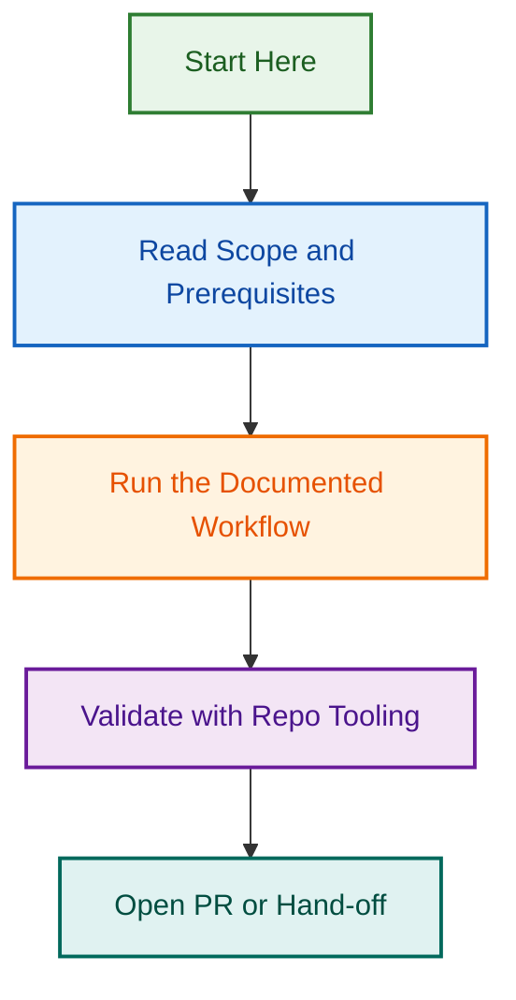

# Agent & Plugin Standardization Initiative — Complete Documentation Package

**Created:** 2026-07-22  
**Package Status:** ✅ Ready for Implementation  
**Phase:** Ready to Begin Phase 1 (Playwright Testing Agent Pilot)  

---

## 📋 What's Included

This package contains everything you need to standardize the LightSpeedWP agent ecosystem for multi-provider support (Claude, GitHub Copilot, OpenAI Codex).

### 📄 Documentation Files (In This Package)

1. **README.md** (this file)
   - Quick navigation guide
   - File descriptions
   - Quick start

2. **IMPLEMENTATION_SUMMARY.md**
   - Executive overview
   - Timeline & effort estimates
   - Complete roadmap
   - Success criteria
   - **START HERE** for high-level understanding

3. **AGENT_STANDARDIZATION_AUDIT.md**
   - Comprehensive current state analysis
   - 16 ChatGPT agent exports identified
   - Standardization gaps & framework
   - Folder structure specifications
   - Naming conventions
   - **READ NEXT** for detailed understanding

4. **PROMPT_1_PLAYWRIGHT_AGENT_REWRITE.md** 🚀
   - Complete orchestration prompt for Phase 1
   - Playwright testing agent pilot rewrite
   - Repository audit & framework creation
   - Schema & hook implementation
   - 7 detailed phases with task breakdowns
   - **USE THIS** to execute Phase 1

5. **PROMPT_2_GENERIC_AGENT_REWRITE.md** 📋
   - Reusable template for remaining agents
   - Parameterized for any agent
   - 8 detailed phases
   - Quick checklist
   - Timeline per agent
   - **REFERENCE** for Phase 2-3 (use batch prompts instead)

6. **PHASE_2_BATCH_PROMPTS_INDEX.md** 📋 (NEW)
   - Complete index of all 14 Phase 2 batch prompts
   - Quick reference guide
   - Timeline suggestions (8-10 weeks)
   - Navigation to individual agent prompts
   - **USE THIS** to navigate Phase 2 agents

7. **PROMPT_BATCH_2_*.md** (5 files) 🚀
   - Individual parameterized prompts for each agent
   - Agent-specific parameters & capabilities
   - Ready-to-copy-and-paste execution prompts
   - **USE THESE** to execute Phase 2 agents

---

## 🚀 Quick Start (5 Minutes)

### For Executives / Stakeholders

1. Read: **IMPLEMENTATION_SUMMARY.md** (sections: Overview, Timeline, Success Criteria)
2. Time estimate: 18 hours Phase 1, 2-4 hours × 15 agents for Phase 2
3. Decision: Approve and allocate time

### For Engineers

1. Read: **IMPLEMENTATION_SUMMARY.md** (complete)
2. Read: **AGENT_STANDARDIZATION_AUDIT.md** (Part 2 + Part 5)
3. Review: **PROMPT_1_PLAYWRIGHT_AGENT_REWRITE.md** (get familiar with structure)
4. Execute: **PROMPT_1_PLAYWRIGHT_AGENT_REWRITE.md** (Phase 1)

### For Project Managers

1. Read: **IMPLEMENTATION_SUMMARY.md** (Overview, Roadmap, Timeline)
2. Track: Phase 1 (18 hours), Phase 2 (30-60 hours), Phase 3 (4-8 hours)
3. Batch: 2-3 agents per week in Phase 2
4. Monitor: Test passing, PR merge, documentation

---

## 📁 File Navigation

### By Role

**Executive Sponsor:**

```
IMPLEMENTATION_SUMMARY.md
  ├─ Overview
  ├─ Timeline & Effort
  ├─ Roadmap
  └─ Success Criteria
```

**Technical Lead:**

```
1. AGENT_STANDARDIZATION_AUDIT.md (complete)
2. PROMPT_1_PLAYWRIGHT_AGENT_REWRITE.md (PHASE 1)
3. PROMPT_2_GENERIC_AGENT_REWRITE.md (PHASE 2 template)
4. Reference: .github/agents/playwright-testing-agent/ (existing pilot)
```

**Individual Contributor (Agent Developer):**

```
1. IMPLEMENTATION_SUMMARY.md (sections 2-3: Framework, Roadmap)
2. AGENT_STANDARDIZATION_AUDIT.md (Part 2: Folder Structure)
3. PROMPT_1 or PROMPT_2 (whichever phase you're on)
4. Reference: .github/instructions/agent-creation-workflow.instructions.md
```

**QA / Testing:**

```
1. IMPLEMENTATION_SUMMARY.md (section: Success Criteria)
2. AGENT_STANDARDIZATION_AUDIT.md (Part 2: Schemas & Hooks)
3. PROMPT_1_PLAYWRIGHT_AGENT_REWRITE.md (Phase 5: Testing)
4. Reference: .github/.schemas/multi-provider-agent.schema.json
```

### By Workflow

**To Understand the Standards:**

```
1. AGENT_STANDARDIZATION_AUDIT.md (Part 2: Standardization Framework)
2. IMPLEMENTATION_SUMMARY.md (section: Standardization Framework)
```

**To Execute Phase 1:**

```
1. PROMPT_1_PLAYWRIGHT_AGENT_REWRITE.md (read all 7 phases first)
2. AGENT_STANDARDIZATION_AUDIT.md (reference folder structures)
3. Follow tasks systematically in PROMPT_1
```

**To Execute Phase 2 (Per Agent - 14 agents available):**

```
1. PHASE_2_BATCH_PROMPTS_INDEX.md (select your agent)
2. Use agent-specific batch prompt:
   - Agents 1-3: PROMPT_BATCH_2_TOUR_OPERATOR_CONFIG_AGENT.md, etc.
   - Agent 4: PROMPT_BATCH_2_PRD_COMBINED_AGENT.md (merge operation)
   - Agents 5-14: PROMPT_BATCH_2_AGENTS_5_14.md (quick reference)
3. Reference: PROMPT_2_GENERIC_AGENT_REWRITE.md (8-phase process)
4. Reference: PROMPT_1 (Playwright agent as example)
```

**To Understand Agent-Plugin Relationships:**

```
AGENT_STANDARDIZATION_AUDIT.md
  └─ Part 2: Standardization Framework
      ├─ Section 2.2: Folder Structure - Agent Export
      ├─ Section 2.3: Folder Structure - Plugin
      └─ Section 2.7: AI Configuration Updates
```

---

## 🎯 Key Concepts

### The Three Providers

1. **Claude** — Anthropic's AI model
   - Uses Claude SDK
   - Strong reasoning & code understanding
   - Custom tools via JSON

2. **GitHub Copilot** — Microsoft-hosted GitHub integration
   - Chat-based interface
   - Code completion suggestions
   - Copilot-specific slash commands

3. **OpenAI Codex** — OpenAI's deployment option
   - Function calling API
   - Structured JSON responses
   - Enterprise-grade API

### The Three Layers of Structure

**Shared (Provider-Agnostic):**

- Core prompt (shared/core-prompt.md)
- Agent spec (AGENT.md)
- Common tools/skills

**Provider-Specific:**

- Agent instructions (claude/agent.md, copilot/agent.md, openai/agent.md)
- Tool definitions (claude/tools.json, copilot/skills.yaml, openai/tools.json)
- Response formats

**Plugin-Level:**

- Multiple agents grouped by domain
- Shared skills across agents
- Shared hooks for validation

### The Agents to Convert

**Current ChatGPT Exports (16 total):**

1. playwright-testing-agent ← **Phase 1 (PILOT)**
2. ai-readiness-estimator-agent
3. client-website-discovery-assistant-agent
4. design-partner-agent
5. harvest-analytical-agent
6. linear-advisor-agent
7. pagespeed-agent
8. prd-agent
9. prd-factory-planner-agent
10. proposal-desk-agent
11. tour-operator-config-agent
12. website-content-strategist-agent
13. website-scope-estimator-agent
14. woo-config-agent
15. wp-config-agent
16. zendesk-support-agent

---

## 📊 Project Statistics

### Current State

- **Agents:** 41 total (25 `.agent.md` specs + 16 ChatGPT exports)
- **ChatGPT Exports:** 16 (not yet multi-provider compatible)
- **Plugins:** 6 existing
- **Instruction Files:** 42
- **Schema Files:** 16
- **Hooks:** 3

### After Phase 1 (Playwright)

- **New Schemas:** 4
- **New Hooks:** 4
- **New Instructions:** 4
- **New Plugin:** 1 (`lightspeed-playwright-testing`)

### After Phase 2 (Remaining Agents)

- **Converted Agents:** 16 total
- **Plugins:** 6-8 (grouped by domain)
- **Schemas:** 20 total
- **Hooks:** 7 total
- **Instructions:** 46 total

### After Phase 3 (Governance)

- **Unified AI Config:** ✅
- **Canonical Schema Registry:** ✅
- **Org-wide Hook Enforcement:** ✅
- **Complete Documentation:** ✅

---

## ⏱️ Timeline & Effort

### Phase 1: Playwright Testing Agent (Pilot)

- **Effort:** 12-18 hours
- **Duration:** 1-2 days of focused work
- **Benefit:** Define pattern for all future agents

**Breakdown:**

- Audit & Plan: 2-3h
- Restructure & Specs: 3-4h
- Provider Configs: 2-3h
- Tools & Plugin: 2-3h
- Schemas & Hooks: 2-3h
- Testing & Docs: 1-2h

### Phase 2: Remaining 15 Agents

- **Effort per Agent:** 2-4 hours
- **Total Effort:** 30-60 hours
- **Batching:** 2-3 agents per week
- **Duration:** 6-10 weeks
- **Benefit:** Complete multi-provider ecosystem

**Suggested Batching:**

- Week 1: Agents 1-3 (project-mgmt, planning, design)
- Week 2: Agents 4-6 (time-tracking, performance, estimation)
- Week 3: Agents 7-9 (prd, proposals, tour-operator)
- ... and so on

### Phase 3: Governance & Consolidation

- **Effort:** 4-8 hours
- **Duration:** 1-2 days
- **Benefit:** Unified, enforceable architecture

---

## ✅ Success Criteria

### Phase 1 Success

- ✅ Playwright agent restructured
- ✅ Claude, Copilot, OpenAI configs created
- ✅ Plugin created & functional
- ✅ 4 schemas created & validated
- ✅ 4 hooks created & working
- ✅ 4 instruction files created
- ✅ Cookbook entry added
- ✅ All tests passing

### Full Project Success

- ✅ 16 agents converted
- ✅ 6-8 plugins created/organized
- ✅ Schemas & hooks enforcing standards
- ✅ Complete documentation
- ✅ Multi-provider parity verified
- ✅ Team trained on standards

---

## 🔗 References

### In This Package

- `IMPLEMENTATION_SUMMARY.md` — High-level overview & roadmap
- `AGENT_STANDARDIZATION_AUDIT.md` — Detailed analysis & framework
- `PROMPT_1_PLAYWRIGHT_AGENT_REWRITE.md` — Phase 1 execution
- `PROMPT_2_GENERIC_AGENT_REWRITE.md` — Phase 2 template

### In Repository

- `.github/AGENTS.md` — Global AI rules
- `.github/CLAUDE.md` — Repository governance
- `.github/agents/agent.md` — Agent index
- `.github/agents/playwright-testing-agent/` — Reference implementation (to be created)
- `.github/instructions/` — Existing instruction files
- `.github/.schemas/` — Schema definitions
- `.github/hooks/` — Hook implementations

### External Resources

- [Playwright Documentation](https://playwright.dev)
- [GitHub Copilot API](https://github.com/features/copilot/plans)
- [OpenAI API Reference](https://platform.openai.com/docs)
- [Claude API Documentation](https://docs.anthropic.com)

---

## 🚨 Important Notes

### Before Starting Phase 1

1. **Review** AGENT_STANDARDIZATION_AUDIT.md completely
2. **Approve** naming conventions & folder structure with team
3. **Create** branch: `feat/agent-standards-playwright-testing`
4. **Setup** test infrastructure (if not already in place)

### During Execution

1. **Validate** at each phase (don't skip)
2. **Test** provider configs against actual APIs (Claude, Copilot, OpenAI)
3. **Document** any deviations from standard
4. **Flag** blockers early

### After Each Phase

1. **Run** all validation tests
2. **Get** code review before merge
3. **Update** memory with progress
4. **Celebrate** milestone completion

---

## 📞 Support & Questions

### Documentation Questions

→ Review the appropriate audit or prompt document  
→ Check `.github/instructions/` for additional guidance  

### Implementation Questions

→ Refer to PROMPT_1 or PROMPT_2 step-by-step  
→ Review playwright-testing-agent as reference  

### Standards Questions

→ Check AGENT_STANDARDIZATION_AUDIT.md Part 2  
→ Review IMPLEMENTATION_SUMMARY.md standardization section  

### Technical Issues

→ Contact: <contact@lightspeedwp.agency>  
→ Check: `.github/CLAUDE.md` for governance  

---

## 🎓 Learning Path

**If you're new to this initiative:**

1. Read: `IMPLEMENTATION_SUMMARY.md` (20 min)
2. Read: `AGENT_STANDARDIZATION_AUDIT.md` Part 2 (30 min)
3. Skim: `PROMPT_1_PLAYWRIGHT_AGENT_REWRITE.md` (20 min)
4. Reference existing: `.github/agents/playwright-testing-agent-backup/`
5. Start Phase 1 execution

**If you're taking over Phase 2:**

1. Read: `IMPLEMENTATION_SUMMARY.md` Phase 2 section (10 min)
2. Read: `PROMPT_2_GENERIC_AGENT_REWRITE.md` (30 min)
3. Reference: Completed Phase 1 agent (playwright-testing-agent)
4. Start Phase 2 using PROMPT_2 template

**If you're reviewing/approving:**

1. Read: `IMPLEMENTATION_SUMMARY.md` (30 min)
2. Check: Success criteria matches deliverables
3. Review: PR against PROMPT_1 or PROMPT_2 specs
4. Approve if standards met

---

## 📋 Checklist: Before You Begin

- [ ] Read `IMPLEMENTATION_SUMMARY.md` completely
- [ ] Review `AGENT_STANDARDIZATION_AUDIT.md`
- [ ] Understand naming conventions
- [ ] Understand folder structure
- [ ] Get team approval on standards
- [ ] Create feature branch
- [ ] Setup test environment
- [ ] Read appropriate PROMPT (1 or 2)
- [ ] Begin Phase execution

---

## 🎉 Ready?

### You Have Everything You Need

✅ Complete standardization framework  
✅ Detailed folder structure specifications  
✅ Naming conventions defined  
✅ Two comprehensive execution prompts  
✅ Success criteria & validation procedures  
✅ Phase-by-phase roadmap  

### Next Step

👉 **Read IMPLEMENTATION_SUMMARY.md** (30 minutes)  
👉 **Then read AGENT_STANDARDIZATION_AUDIT.md Part 2** (30 minutes)  
👉 **Then execute PROMPT_1_PLAYWRIGHT_AGENT_REWRITE.md** (12-18 hours)  

---

## Version & Metadata

| Property | Value |
| --- | --- |
| **Package Created** | 2026-07-22 |
| **Package Version** | 1.0.0 |
| **Phase** | Ready for Phase 1 |
| **Status** | ✅ Complete & Ready |
| **Author** | Claude Code |
| **Organization** | LightSpeed WordPress Agency |

---

**✨ This comprehensive package will standardize your entire agent ecosystem across Claude, GitHub Copilot, and OpenAI. You're ready to begin. Good luck!**

## Related Issues

This project is coordinated with:

- [#1733](https://github.com/lightspeedwp/.github/issues/1733) — Phase 2: Folder Structure & Linking

See [Linking Standard](https://github.com/lightspeedwp/.github/blob/develop/.github/projects/active/reports-projects-restructuring-2026-08-11/LINKING_STANDARD.md) for linking patterns.
## Visual Workflow


