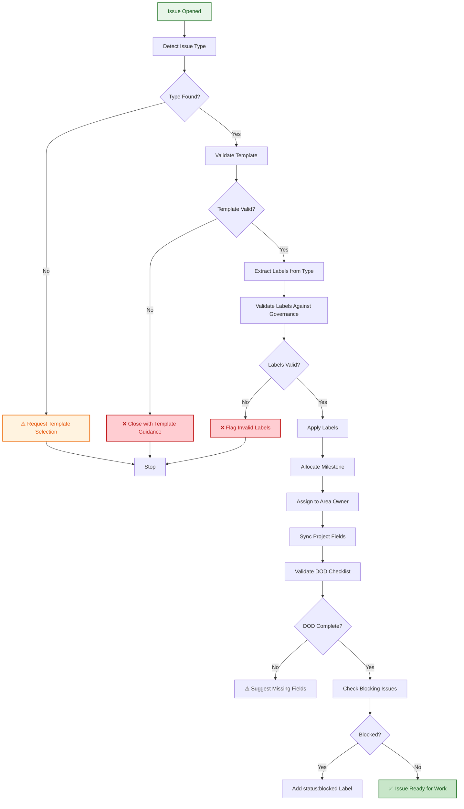
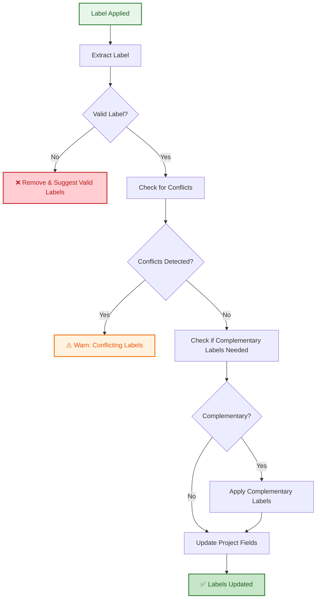
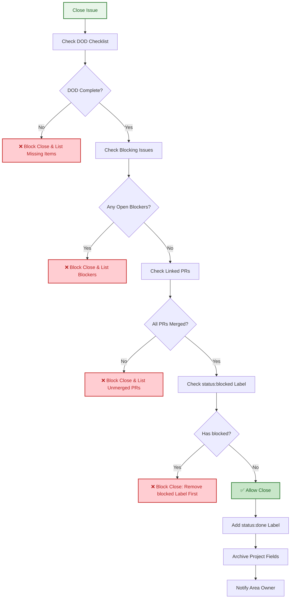

# Issue Management Agent Specification

**Version:** 1.0.0  
**Status:** Design (Phase 1)  
**Phase:** 2 (Implementation)  
**Effort Estimate:** 24 hours

---

## Overview

The Issue Management Agent automates management of GitHub issues in the `.github` repository, handling:
- Template enforcement and routing
- Label assignment with governance validation
- Milestone allocation
- User assignment (reviewer/assignee)
- Project field synchronization
- Definition of Done (DOD) validation
- Blocking issue detection

---

## Agent Triggers

The agent activates on these GitHub events:

### 1. Issue Opened
- **Event:** `issues.opened`
- **Actions:**
  1. Detect issue type from template selection
  2. Validate correct template usage
  3. Apply labels based on issue type
  4. Allocate milestone (if applicable)
  5. Assign to area owner (via code owners or manual routing)
  6. Sync project fields
  7. Validate DOD checklist completeness
  8. Check for blocking issues

### 2. Issue Edited
- **Event:** `issues.edited`
- **Trigger Conditions:**
  - Description changed
  - Title changed
  - Body structure changed
- **Actions:**
  1. Validate template still matches content
  2. Check if labels need update based on new content
  3. Re-validate DOD if description changed
  4. Update project fields if issue type changed

### 3. Issue Labeled (Manual)
- **Event:** `issues.labeled`
- **Trigger Conditions:**
  - Human manually applies label
  - Label conflicts with issue type or governance
- **Actions:**
  1. Validate label is from canonical set (with family prefix)
  2. Check for label conflicts (e.g., `priority:high` + `priority:low`)
  3. Apply complementary labels if needed
  4. Update project fields to match labels

### 4. Issue Unlabeled (Manual)
- **Event:** `issues.unlabeled`
- **Trigger Conditions:**
  - Human manually removes label
  - Removal causes governance violation
- **Actions:**
  1. Check if removal violates governance rules
  2. Warn if removing required label (e.g., removing `type:*` label)
  3. Update project fields

### 5. Issue Reopened
- **Event:** `issues.reopened`
- **Actions:**
  1. Verify description still accurate
  2. Check linked PRs/issues still exist and valid
  3. Update status labels (remove `status:done`, add `status:in-progress`)
  4. Notify area owner of reopen

### 6. Issue Closed (Post-Closure Verification)
- **Event:** `issues.closed`
- **Post-Closure Validation (cannot block, but flags issues):**
  1. Verify DOD checklist is complete
  2. Verify no blocking issues remain open
  3. Verify all linked PRs are merged
  4. Verify no `status:blocked` label
- **Actions:**
  1. Add `status:done` label
  2. Remove `status:in-progress` label
  3. Archive project fields (if applicable)
  4. Comment with validation results:
     - ✅ Pass: "Issue closed successfully. All DOD criteria met."
     - ⚠️ Warning: "Issue closed, but detected potential issues: [list]"
  5. Send completion notification

---

## Decision Tree: Issue Opened



---

## Decision Tree: Issue Labeled Manually



---

## Decision Tree: Issue Closed Validation



---

## Label Governance Rules

### Family Prefixes (Required)

Every label must have a family prefix:
- `type:` — bug, feature, task, documentation, security, design
- `status:` — needs-triage, in-progress, done, blocked, review-waiting
- `priority:` — critical, high, normal, low
- `area:` — ci, docs, labels, security, testing, automation
- `meta:` — needs-changelog, has-pr, duplicate, needs-audit

### Label Application Rules

**Per Issue Type:**

| Type | Required Labels | Auto-Applied | Suggested |
|------|-----------------|--------------|-----------|
| `type:bug` | type:bug, priority:? | status:needs-triage | area:?, meta:needs-changelog |
| `type:feature` | type:feature, priority:? | status:needs-triage | area:?, meta:needs-changelog |
| `type:task` | type:task, priority:? | status:needs-triage | area:? |
| `type:documentation` | type:documentation | status:needs-triage | area:docs |
| `type:security` | type:security, priority:critical | status:needs-triage | meta:needs-audit |

### Invalid Label Combinations

**Cannot coexist:**
- `priority:critical` + `priority:high`
- `priority:high` + `priority:normal`
- `priority:normal` + `priority:low`
- `status:needs-triage` + `status:in-progress`
- `status:blocked` + `status:done`

**Actions:**
1. Detect conflict
2. Warn user: "Cannot have both labels"
3. Suggest removal of older label
4. Do not auto-fix (let user choose)

---

## Milestone Allocation Algorithm

**Logic:**

1. **Check linked PRs:**
   - If issue links to PR with milestone → use PR's milestone
   - If multiple PRs with different milestones → use earliest

2. **Check issue type:**
   - `type:bug` → Use current development milestone
   - `type:feature` → Use next milestone
   - `type:task` → Use current milestone
   - `type:documentation` → Use next milestone

3. **Check issue priority:**
   - `priority:critical` → Current milestone (ship ASAP)
   - `priority:high` → Current milestone
   - `priority:normal` → Current + 1 milestone
   - `priority:low` → Current + 2 milestones (or backlog)

4. **Default:** Use current milestone if no other signals

**Implementation:**

```javascript
function allocateMilestone(issue) {
  // 1. Check linked PRs (highest precedence)
  const prMilestones = getLinkedPRMilestones(issue);
  if (prMilestones.length > 0) {
    return getEarliest(prMilestones);  // Use earliest PR milestone
  }

  // 2. Check issue type (determines base milestone)
  const type = extractIssueType(issue.labels);
  let baseMilestone;
  
  if (['type:bugfix', 'type:hotfix'].includes(type)) {
    baseMilestone = getCurrentMilestone();  // Current sprint
  } else if (['type:feature', 'type:epic'].includes(type)) {
    baseMilestone = getNextMilestone();  // Next planning cycle
  } else {
    baseMilestone = getBacklogMilestone();  // General backlog
  }

  // 3. Check priority (offset within type base)
  const priority = extractPriority(issue.labels);
  const offset = {
    'priority:critical': 0,   // Stay at base
    'priority:high': 0,       // Stay at base
    'priority:normal': 1,     // Add 1 milestone
    'priority:low': 2,        // Add 2 milestones (or backlog)
  }[priority] || 1;

  return getMilestoneByOffset(baseMilestone, offset);
}
```

---

## User Assignment Strategy

### Code Owners Routing

1. **Extract area from labels** (e.g., `area:ci`, `area:docs`)
2. **Look up code owners** from `.github/CODEOWNERS`
3. **Find matching team/user** for that area
4. **Assign issue** to area owner

**Example:**
```
Issue has label: area:ci
CODEOWNERS: /\.github\/workflows\/ @lightspeedwp/ci-team
→ Assign @lightspeedwp/ci-team
```

### Fallback Routes

If no code owner found:

1. **Check issue type:**
   - `type:security` → route to @lightspeedwp/security-team
   - `type:documentation` → route to @lightspeedwp/docs-team
   - Default → route to @lightspeedwp/maintainers

2. **Manual override:** Allow manual assignment, respects user choice

---

## Project Field Synchronization

The agent syncs these fields with GitHub Projects:

| Field | Source | Sync Trigger |
|-------|--------|--------------|
| **Status** | Issue labels (`status:*`) | Label changed |
| **Priority** | Issue labels (`priority:*`) | Label changed |
| **Area** | Issue labels (`area:*`) | Label changed |
| **Type** | Issue type (via template) | Issue opened/edited |
| **Milestone** | Issue milestone | Milestone changed |
| **Assignee** | Issue assignee | Assignee changed |
| **Linked PRs** | Issue body (via #NNN references) | Body edited |

**Safety:** Only sync fields that have a clear source; never overwrite manual updates without warning.

---

## Definition of Done (DOD) Validation

Each issue type has a DOD checklist:

### Bug DOD

```markdown
- [ ] Issue reproduces consistently
- [ ] Root cause identified
- [ ] Linked to related issues (if applicable)
- [ ] PR created with fix (if applicable)
- [ ] Test coverage added
```

**Validation:** Agent checks these boxes before allowing close.

### Feature DOD

```markdown
- [ ] Requirements documented
- [ ] Design reviewed (if major feature)
- [ ] Implementation plan created
- [ ] Tests written
- [ ] Documentation updated
- [ ] PR created and approved
```

**Validation:** Agent requires all boxes checked.

### Task DOD

```markdown
- [ ] Acceptance criteria documented
- [ ] Implementation complete
- [ ] Tests passing
- [ ] PR linked and merged
```

---

## Blocking Issue Detection

**Triggers:**

1. Issue body contains: "Blocks: #NNN"
2. Issue has label: `meta:blocked`
3. Related issue has label: `meta:blocking`

**Actions:**

1. Extract blocked issue numbers
2. Verify they exist and are open
3. Add `meta:blocking` label to this issue
4. Prevent close if this issue is blocking others

**Example:**
```
Issue #123 (blocked):
"Blocks: #456, #789"
→ Add meta:blocking label to #123
→ Prevent close of #456, #789 with message:
"Cannot close: blocked by #123"
```

---

## Safety Gates & Validations

**Never Act Without Confirmation:**

1. **Invalid template usage** → Comment and suggest correction
2. **Invalid labels** → Remove and suggest valid alternatives
3. **Conflicting labels** → Warn user before proceeding
4. **Blocking issues** → Prevent close with clear message
5. **Incomplete DOD** → List missing items before allowing close

**Audit Trail:**

Every agent action is logged:
```json
{
  "timestamp": "2026-09-03T14:30:00Z",
  "issue_id": 2569,
  "agent": "issue-management",
  "action": "applied_labels",
  "labels": ["type:bug", "priority:high", "status:in-progress"],
  "reason": "Detected bug issue type from template"
}
```

---

## Integration with PR Management Agent

When an issue gets labeled or updated:

1. Agent finds linked PRs (via #NNN in description)
2. Sends signal to PR agent: "Update labels based on linked issue"
3. PR agent inherits issue labels + applies PR-specific labels

**Example:**
```
Issue #2569: Added labels [type:bug, priority:critical, area:ci]
PR #2570 (linked): PR agent receives signal
→ PR agent adds [type:bug, priority:critical, area:ci] + [type:pr]
→ PR agent inherits milestone from issue
```

---

## Error Handling

### Recoverable Errors

**Network timeout calling GitHub API:**
→ Retry up to 3 times with exponential backoff (2s, 4s, 8s)

**Invalid milestone (deleted):**
→ Log warning, allocate default milestone, notify in comment

**Code owner not found:**
→ Route to @lightspeedwp/maintainers, log for monitoring

### Non-Recoverable Errors

**Malformed issue body:**
→ Comment with guidance, stop processing, require manual fix

**Invalid repository state:**
→ Log critical error, escalate to ops, stop processing

---

## Testing Strategy

### Unit Tests

- [ ] Label validation logic (50+ test cases)
- [ ] Milestone allocation algorithm (30+ test cases)
- [ ] User assignment routing (20+ test cases)
- [ ] DOD validation (25+ test cases)
- [ ] Blocking issue detection (15+ test cases)

### Integration Tests

- [ ] Issue opened → Full workflow
- [ ] Label applied → Governance validation
- [ ] Issue closed → DOD validation
- [ ] Milestone changed → Sync to PRs
- [ ] Blocking issue chain → Cascading updates

### Acceptance Tests

- [ ] Test issue #2569 → Full automation
- [ ] Test issue #2571 → Label validation
- [ ] Test issue #2572 → Milestone allocation
- [ ] Test issue #2558 → Blocking detection
- [ ] Test issue #2559 → DOD validation
- [ ] Test issue #2564 → PR linking

---

## Configuration

Agent behavior controlled via `.github/automation-config.yml`:

```yaml
issue_management:
  enabled: true
  dry_run: false
  
  labels:
    validate_prefix: true
    auto_apply_complementary: true
    warn_conflicts: true
  
  milestone:
    auto_allocate: true
    strategy: "pr_or_type_priority"
  
  assignment:
    auto_assign: true
    prefer_code_owners: true
    fallback_team: "@lightspeedwp/maintainers"
  
  validation:
    require_dod_for_close: true
    check_blocking_issues: true
    enforce_template_usage: true
  
  logging:
    audit_trail: true
    log_level: "info"
```

---

## Success Metrics

**Phase 3 (Testing):**
- ✅ 6/6 test issues successfully remediated
- ✅ 0 false positives (agent made incorrect decision)
- ✅ 0 breaking changes to existing automation
- ✅ <1% user override rate (users accept agent decisions)
- ✅ <5 minute response time per issue event

**Post-Launch:**
- ✅ 80%+ of new issues meet governance standards without manual fix
- ✅ 90%+ of labels applied correctly on first try
- ✅ 95%+ of milestones allocated correctly
- ✅ Team feedback score > 4/5

---

*This specification is detailed and comprehensive. Implementation should follow this design closely, with safety as the primary concern.*
