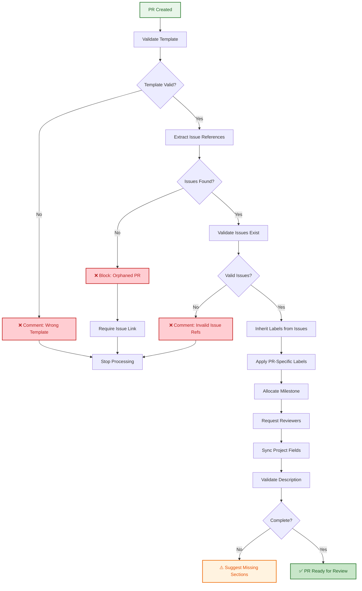
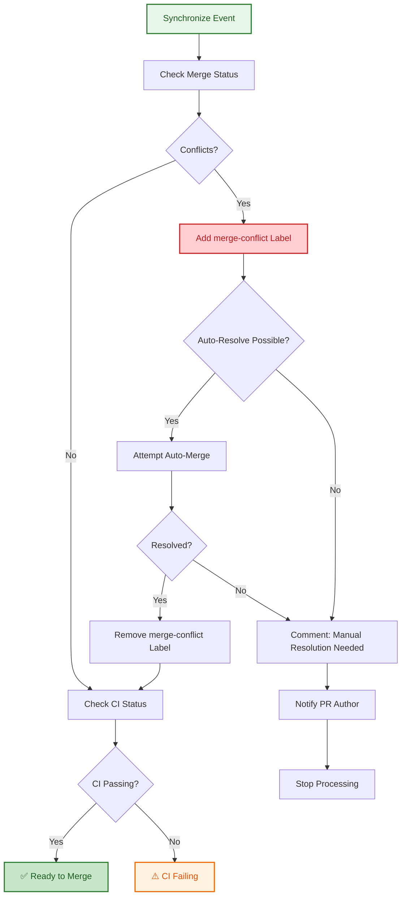
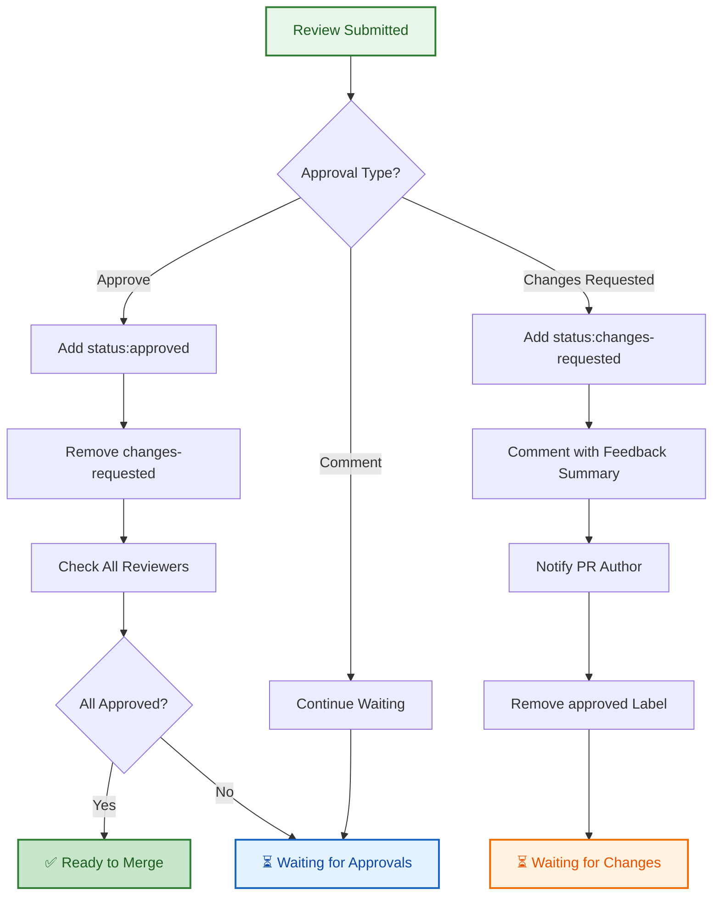

# PR Management Agent Specification

**Version:** 1.0.0  
**Status:** Design (Phase 1)  
**Phase:** 2 (Implementation)  
**Effort Estimate:** 24 hours

---

## Overview

The PR Management Agent automates management of pull requests in the `.github` repository, handling:
- PR template enforcement and validation
- Linking to related issues
- Label inheritance from linked issues
- Milestone allocation from linked issues
- Reviewer assignment (code owners + area routing)
- Merge conflict detection and resolution
- Review feedback integration
- Workflow status validation
- Infrastructure error detection

---

## Agent Triggers

The agent activates on these GitHub events:

### 1. PR Created
- **Event:** `pull_request.opened`
- **Actions:**
  1. Validate PR template usage
  2. Extract referenced issues (#NNN)
  3. Validate PR has linked issue (block if orphaned)
  4. Inherit labels from linked issues
  5. Apply PR-specific labels
  6. Allocate milestone from linked issue
  7. Request reviewer from code owners + area owner
  8. Sync project fields
  9. Validate PR description completeness

### 2. PR Synchronized (New Commits)
- **Event:** `pull_request.synchronize`
- **Actions:**
  1. Check for merge conflicts
  2. Auto-resolve conflicts if possible (with notification)
  3. Re-run workflow validation
  4. Update status based on CI results
  5. Check if WIP/draft status still valid

### 3. PR Labeled (Manual)
- **Event:** `pull_request.labeled`
- **Trigger Conditions:**
  - Human manually applies label
  - Label conflicts with linked issue labels
- **Actions:**
  1. Validate label is from canonical set
  2. Check for conflicts with inherited labels
  3. Warn if label doesn't match linked issue type

### 4. Review Requested
- **Event:** `pull_request.review_requested`
- **Actions:**
  1. Validate reviewer is from code owners or team
  2. If manual reviewer selection outside teams → warn but allow
  3. Add `status:review-waiting` label
  4. Update project field to "In Review"

### 5. Review Submitted
- **Event:** `pull_request.review_submitted`
- **Trigger Conditions:**
  - Review with changes-requested
  - Review with approve
- **Actions:**
  1. If changes-requested:
     - Add `status:changes-requested` label
     - Remove `status:approved` label
     - Remove `status:review-waiting` label
     - Notify PR author with summary of feedback
  
  2. If approved:
     - Add `status:approved` label
     - Remove `status:changes-requested` label
     - Check if all required reviewers approved
     - Update project field to "Ready to Merge"

### 6. PR Ready for Merge (All Checks Pass)
- **Event:** `pull_request` + workflow_run `completed`
- **Trigger Conditions:**
  - All status checks pass (green)
  - All required approvals obtained
  - No merge conflicts
  - Merge-when-ready condition met
- **Actions:**
  1. Add `status:ready-to-merge` label
  2. Enable auto-merge if appropriate
  3. Remove `status:changes-requested` label
  4. Notify PR author: "Ready to merge!"

### 7. Merge Conflicts Detected
- **Event:** `pull_request` + branch status change
- **Trigger Conditions:**
  - PR becomes un-mergeable
  - Merge base branch changed
- **Actions:**
  1. Add `status:merge-conflict` label
  2. Comment with conflict details
  3. Attempt auto-resolution if possible
  4. If resolution fails, request PR author action

---

## Decision Tree: PR Created



---

## Decision Tree: Merge Conflict Detection



---

## Decision Tree: Review Feedback Integration



---

## Label Inheritance from Linked Issues

**Algorithm:**

1. Extract issue references from PR description: `#2569`, `Fixes #2570`
2. Fetch labels from each linked issue
3. Filter to inheritable labels:
   - `type:*` (inherit issue type)
   - `priority:*` (inherit priority)
   - `area:*` (inherit area)
   - `meta:*` (inherit certain meta labels)
4. Apply inherited labels to PR
5. Add PR-specific labels:
   - `type:pr` (always)
   - `status:review-needed` (always on open)

**Example:**
```
Linked Issue #2569 labels:
  [type:bug, priority:critical, area:ci]

PR #2570 gets:
  [type:bug, priority:critical, area:ci, type:pr, status:review-needed]
```

**Forbidden to Inherit:**
- `status:*` labels (PR status ≠ issue status)
- `meta:has-pr` (PR creates this, doesn't inherit)
- `meta:duplicate` (issue-specific)

---

## Milestone Allocation from Linked Issues

**Algorithm:**

1. Extract linked issue references
2. Check each linked issue's milestone
3. Rules:
   - If single linked issue with milestone → use that milestone
   - If multiple linked issues with same milestone → use that milestone
   - If multiple linked issues with different milestones → use earliest
   - If no linked issue has milestone → use current milestone
4. Apply milestone to PR

**Example:**
```
PR links to:
  - Issue #2569 (milestone: v1.2.0)
  - Issue #2570 (milestone: v1.2.0)
→ PR gets milestone: v1.2.0

PR links to:
  - Issue #2569 (milestone: v1.2.0)
  - Issue #2570 (milestone: v1.3.0)
→ PR gets milestone: v1.2.0 (earliest)
```

---

## Reviewer Assignment Strategy

### Code Owners Routing

1. **Get files changed** in PR (git diff)
2. **Look up CODEOWNERS** for each file path
3. **Collect all matching teams/users** → De-duplicate
4. **Request review** from all matching code owners

**Example:**
```
PR changes:
  - .github/workflows/issue-*.yml
  - scripts/automation/issue-*.js

CODEOWNERS:
  /.github/workflows/ @lightspeedwp/ci-team
  /scripts/automation/ @lightspeedwp/automation-team
  
→ Request review from:
  - @lightspeedwp/ci-team
  - @lightspeedwp/automation-team
```

### Area-Based Routing

1. **Extract area labels** from linked issue (e.g., `area:ci`)
2. **Look up area owner** from `.github/automation-config.yml`
3. **Request additional reviewer** if needed

**Configuration:**
```yaml
area_reviewers:
  area:ci: "@lightspeedwp/ci-team"
  area:automation: "@lightspeedwp/automation-team"
  area:docs: "@lightspeedwp/docs-team"
  area:security: "@lightspeedwp/security-team"
```

---

## Merge Conflict Auto-Resolution

**Triggers:**
- PR becomes un-mergeable after base branch update
- OR PR author pushes new commits that create conflicts

**Strategy:**

1. **Detect conflict** — Check if PR is mergeable
2. **Fetch conflict files** — Get list of files with conflicts
3. **Categorize conflicts:**
   - **Trivial** (comments, spacing) → Safe to auto-merge
   - **Structural** (logic, functions) → Unsafe, need manual resolution
4. **Attempt resolution:**
   - For trivial: auto-merge
   - For structural: add comment with instructions
5. **Notify PR author** with results

**Example:**
```
Conflict detected in .github/labels.yml
Type: Trivial (both sides added new labels)
→ Auto-merge successful
→ Remove status:merge-conflict label
→ Comment: "Conflicts auto-resolved. Files merged."
```

---

## Workflow Status Validation

**On Workflow Completion (Success/Failure):**

1. **Get workflow run results**
2. **Categorize failures:**
   - **Code failure** — Test failed, lint failed, build failed
   - **Infrastructure failure** — Timeout, network error, resource limit
   - **Permission failure** — Secrets missing, access denied
3. **Actions:**
   - Code failure → Add `status:needs-fix` label, notify author
   - Infrastructure failure → Add `status:infrastructure-issue` label, escalate ops
   - Permission failure → Comment with instructions, escalate

**Example:**
```
Workflow run: tests.yml
Result: FAILURE

Error log analysis:
  "Network timeout connecting to artifact server"
→ Classification: infrastructure-failure
→ Add label: status:infrastructure-issue
→ Comment: "CI failed due to infrastructure issue (not your code)"
→ Escalate to ops team
```

---

## Integration with Issue Management Agent

When a PR is created/updated:

1. Find linked issues
2. Check if issue has updates from issue agent
3. If issue labels changed → inherit changes
4. If issue milestone changed → update PR milestone
5. If issue status changed → update PR status accordingly

**Example:**
```
Issue Agent updates #2569:
  - Changed: priority:normal → priority:critical
  - Changed: milestone: v1.3.0 → v1.2.0

PR Agent detects change:
→ Updates PR labels: priority:critical
→ Updates PR milestone: v1.2.0
→ Re-requests review (priority changed)
```

---

## Template Requirements

**Required Sections:**

```markdown
## Description
[Describe what this PR changes and why]

## Linked Issue(s)
Fixes #[issue number]

## Type of Change
- [ ] Bug fix (non-breaking change which fixes an issue)
- [ ] New feature (non-breaking change which adds functionality)
- [ ] Breaking change (fix or feature that would cause existing functionality to change)

## How Has This Been Tested?
[Describe test coverage]

## Checklist
- [ ] My code follows the style guidelines of this project
- [ ] I have performed a self-review of my own code
- [ ] I have commented my code, particularly in hard-to-understand areas
- [ ] I have made corresponding changes to the documentation
```

**Validation:**

Agent checks:
1. All required sections present
2. Issue references valid (#NNN exists)
3. Type of change matches linked issue type
4. Checklist items filled out (not all checked, but items addressed)

---

## Safety Gates & Validations

**Never Merge Without:**

1. ✅ All required status checks passing
2. ✅ All required reviewers approved
3. ✅ No merge conflicts
4. ✅ Linked to valid issue(s)
5. ✅ PR description complete
6. ✅ No blocking labels (`status:blocked`, `status:changes-requested`)

**Reversible Actions Only:**

- ✅ Can add/remove labels
- ✅ Can add/remove reviewers
- ✅ Can auto-merge if all conditions met
- ❌ Cannot force-push
- ❌ Cannot delete branch
- ❌ Cannot modify history

**Audit Trail:**

Every agent action is logged:
```json
{
  "timestamp": "2026-09-03T14:30:00Z",
  "pr_number": 2570,
  "agent": "pr-management",
  "action": "inherited_labels",
  "labels": ["type:bug", "priority:critical", "area:ci"],
  "from_issue": 2569,
  "reason": "Linked issue labels inherited"
}
```

---

## Error Handling

### Recoverable Errors

**Network timeout:**
→ Retry up to 3 times with exponential backoff

**Invalid issue reference:**
→ Comment asking to fix reference, continue processing

**Workflow timeout:**
→ Add `status:infrastructure-issue` label, escalate

**Code owner not found:**
→ Route to @lightspeedwp/maintainers

### Non-Recoverable Errors

**Malformed PR description:**
→ Comment with guidance, stop processing, require manual fix

**Merge conflict unresolvable:**
→ Comment with guidance, require PR author action

---

## Testing Strategy

### Unit Tests

- [ ] Template validation (20 test cases)
- [ ] Issue reference extraction (15 test cases)
- [ ] Label inheritance logic (25 test cases)
- [ ] Milestone allocation (20 test cases)
- [ ] Reviewer assignment (20 test cases)
- [ ] Merge conflict detection (15 test cases)
- [ ] Workflow status classification (25 test cases)

### Integration Tests

- [ ] PR created → Full workflow (template → labels → reviewers → project)
- [ ] Merge conflict → Auto-resolution → CI re-run
- [ ] Review feedback → Label update → Notification
- [ ] Issue change → PR synchronization
- [ ] Multiple linked issues → Correct milestone selection

### Acceptance Tests

- [ ] Test 6+ PRs linked to test issues
- [ ] Test conflict resolution
- [ ] Test review feedback integration
- [ ] Test infrastructure error detection
- [ ] Test code owner routing

---

## Configuration

Agent behavior controlled via `.github/automation-config.yml`:

```yaml
pr_management:
  enabled: true
  dry_run: false
  
  template:
    enforce_usage: true
    warn_incomplete: true
  
  linking:
    require_issue_link: true
    block_orphaned_prs: true
  
  labels:
    inherit_from_issues: true
    validate_pr_specific: true
  
  reviewers:
    auto_request: true
    use_code_owners: true
    use_area_routing: true
  
  conflicts:
    auto_resolve_trivial: true
    warn_on_conflicts: true
  
  workflows:
    validate_ci: true
    classify_failures: true
    detect_infrastructure_issues: true
  
  merging:
    auto_merge_when_ready: true
    require_all_approvals: true
  
  logging:
    audit_trail: true
    log_level: "info"
```

---

## Success Metrics

**Phase 3 (Testing):**
- ✅ 6+ test PRs successfully validated
- ✅ 0 false positive validations (agent made incorrect decision)
- ✅ 0 breaking changes to existing workflows
- ✅ <2% user override rate (users accept agent decisions)
- ✅ <2 minute response time per PR event

**Post-Launch:**
- ✅ 90%+ of new PRs meet governance standards without manual fix
- ✅ 95%+ of labels inherited correctly
- ✅ 90%+ of reviewers requested correctly
- ✅ 80%+ of merge conflicts auto-resolved
- ✅ Team feedback score > 4/5

---

*This specification is detailed and comprehensive. Implementation should follow this design closely, prioritizing PR author experience and safety over speed.*
