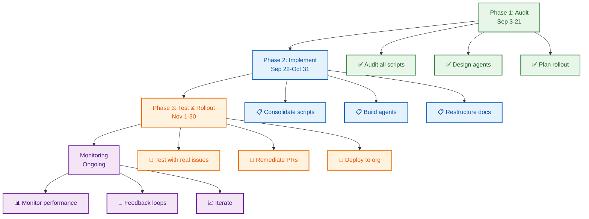

# Project Management Agent & Automation Consolidation Initiative

## Quick Facts

| Metric | Value |
|--------|-------|
| **Scope** | Scripts, Workflows, Documentation, Agents |
| **Critical Files to Audit** | 150+ |
| **Script/Workflow Duplication** | ~15-20 files with overlapping logic |
| **Documentation Duplication** | 20+ docs with overlapping content |
| **Estimated Effort** | 120-160 hours across 3 phases |
| **Phase 1 Duration** | 2-3 weeks (audit + planning) |
| **Phase 2 Duration** | 4-6 weeks (implementation) |
| **Phase 3 Duration** | 2-3 weeks (testing + rollout) |
| **Start Date** | 2026-09-03 |
| **Target Completion** | 2026-11-30 |
| **Epic Issue** | [#1240](https://github.com/lightspeedwp/.github/issues/1240) |

## Project Objectives

### Phase 1: Audit & Planning (Current)

1. **Comprehensive Audit** — Analyze all project management scripts, workflows, and documentation
2. **Duplication Analysis** — Identify overlapping functionality and consolidation opportunities
3. **Agentic Workflow Design** — Plan migration to GitHub's agentic workflow features
4. **Rollout Strategy** — Design org-wide deployment approach
5. **Test Planning** — Prepare bulk update testing against 6 real issues + linked PRs

### Phase 2: Implementation

1. **Script Consolidation** — Merge duplicate/overlapping scripts
2. **Workflow Migration** — Build agentic workflows for issue/PR management
3. **Agent Development** — Implement decision trees, templating, labeling
4. **Documentation Restructuring** — Consolidate docs into canonical hierarchy

### Phase 3: Testing & Rollout

1. **Bulk Testing** — Test agents against issue #1240 epic + child issues
2. **PR Remediation** — Validate all linked PRs meet governance standards
3. **Org Rollout** — Deploy to additional WordPress repos
4. **Monitoring & Feedback** — Establish observability + feedback loops

---

## Current Landscape

### Files to Audit (150+ files across multiple categories)

#### Active Project Update Scripts (9 files)
- `scripts/collect-link-targets.js`
- `scripts/validate-reports-structure.js`
- `scripts/workflows/projects/archive-projects.cjs`
- `scripts/workflows/projects/scan-completion.cjs`
- `scripts/workflows/orchestrate-phase-progression.cjs`
- `scripts/automation/project-docs-update.sh`
- `scripts/automation/test-project-docs-update.sh`
- `scripts/automation/update-projects-status.cjs`
- `scripts/consolidate-issue-types.js`

#### Agent Files (20+ files)
- Multiple versions in `.github/agents/` and `agents/` directories
- Task planner agents, task researcher agents, labeling agents
- Issue management agents, PR creation agents
- Duplicate definitions across directories

#### Issue Management (40+ files)
- 25+ issue templates (with 2 wrongly prefixed with `25-`)
- 8 issue management workflows
- 5 configuration files (issue-types.yml, issue-fields.yml, labels.yml, labeler.yml, label-governance-policy.yml)
- 9 documentation files with overlapping content

#### PR Management (15+ files)
- 5 PR-focused workflows
- 8 PR automation scripts
- 3 PR documentation files

#### Labeling System (30+ files)
- 6 labeling workflows
- 8 labeling scripts
- 10 labeling documentation files
- Configuration files (labels.yml, labeler.yml, label-governance-policy.yml)

#### Automation & Orchestration (15+ files)
- Multiple project orchestration scripts
- Bulk update scripts
- Validation scripts
- Documentation files

---

## Key Findings (Preliminary)

### Script/Workflow Duplication Issues

1. **Multiple label sync implementations** — 3-4 different sync approaches
2. **Overlapping issue metadata updaters** — Bulk updater, metadata auditor, field sync
3. **Duplicate PR template routing** — Multiple template resolver implementations
4. **Conflicting orchestration patterns** — Phase progression vs. project status updates

### Documentation Consolidation Opportunities

1. **Issue docs** — ISSUE_LABELS.md, ISSUE_TYPES.md, ISSUE_TRIAGE.md all overlap
2. **Labeling docs** — LABELING.md, LABEL_STRATEGY.md, LABEL_INVENTORY.md contain duplicated info
3. **Automation docs** — AUTOMATION.md, AUTOMATION_GOVERNANCE.md, individual instruction files scattered
4. **No single source of truth** — Label catalog split across multiple docs + .github/labels.yml

### Agent File Organization Issues

1. **Agents in multiple directories** — `.github/agents/`, `agents/`, `scripts/agents/`
2. **Duplicate definitions** — task-planner.agent.md exists in multiple locations
3. **No consolidation pattern** — Unclear which version is canonical
4. **Missing migration docs** — No record of when/why assets moved

---

## Test Case: Issue #1240 Epic + 6 Child Issues

### Epic Issue
- **[#1240](https://github.com/lightspeedwp/.github/issues/1240)** — [Epic] Project Management Agent & Automation Consolidation Initiative (open)

### Test Issues (6 total, currently closed)
- **[#2569](https://github.com/lightspeedwp/.github/issues/2569)** — Test issue 1 (closed, requires remediation)
- **[#2571](https://github.com/lightspeedwp/.github/issues/2571)** — Test issue 2 (closed, requires remediation)
- **[#2572](https://github.com/lightspeedwp/.github/issues/2572)** — Test issue 3 (closed, requires remediation)
- **[#2558](https://github.com/lightspeedwp/.github/issues/2558)** — Test issue 4 (closed, requires remediation)
- **[#2559](https://github.com/lightspeedwp/.github/issues/2559)** — Test issue 5 (closed, requires remediation)
- **[#2564](https://github.com/lightspeedwp/.github/issues/2564)** — Test issue 6 (closed, requires remediation)

### Validation Checklist (Per Issue)

**Issue Management Agent Must:**
- [ ] Link issue as child to epic #1240
- [ ] Update issue description (currently out of date)
- [ ] Apply correct labels from `.github/labels.yml` (with required family prefix)
- [ ] Validate linked PRs exist (1+ per issue)

**PR Management Agent Must (For Each Linked PR):**
- [ ] Verify PR description uses correct template
- [ ] Verify PR has valid labels
- [ ] Verify PR has milestone assigned
- [ ] Verify PR has assignees
- [ ] Check for merge conflicts (resolve if detected)
- [ ] Validate no unresolved review feedback
- [ ] Check workflow status (pass or document reason)
- [ ] Detect & resolve workflow errors unrelated to PR (e.g., infrastructure issues)

---

## Agentic Workflow Design (High-Level)

### Issue Management Agent

**Triggers:** Issue opened, reopened, edited, labeled manually, unlabeled

**Decision Tree:**
1. **Detect issue type** — Extract from template fields or body parsing
2. **Route to template** — Assign PR template based on branch prefix
3. **Apply labels** — Match labels from `.github/labels.yml` + governance rules
4. **Allocate milestone** — Infer from linked issues, project, or defaults
5. **Assign users** — Route to area owner or auto-assign reviewer
6. **Sync project fields** — Update project metadata
7. **Validate completeness** — Check DOD, required fields, blocking issues

### PR Management Agent

**Triggers:** PR created, synchronize (new commits), review requested, labeled

**Decision Tree:**
1. **Validate template** — Ensure correct PR template used
2. **Link to issues** — Auto-detect issue references, validate not orphaned
3. **Inherit labels** — Copy from linked issues + add PR-specific labels
4. **Allocate milestone** — Infer from linked issues
5. **Assign reviewers** — Route based on code owners + area assignment
6. **Detect conflicts** — Check for merge conflicts, attempt auto-resolution
7. **Validate workflows** — Check CI status, identify infrastructure vs. code failures
8. **Apply feedback** — Process review comments, suggest fixes

---

## Phase 1 Deliverables (This Phase)

### 1. Comprehensive Audit Report
- **Inventory Table** — All scripts/workflows with purpose, status, dependencies
- **Duplicate Analysis** — Specific findings with consolidation recommendations
- **Dependency Map** — Which scripts call which, which workflows trigger which

### 2. Design Specifications
- **Issue Management Agent Spec** — Decision trees, triggers, actions, data flows
- **PR Management Agent Spec** — Decision trees, triggers, actions, data flows
- **Agentic Workflow Architecture** — Integration with GitHub's features
- **Safety Gates Design** — How to prevent data corruption or unintended changes

### 3. Org Rollout Plan
- **Installation Process** — How to deploy agent to other repos
- **Configuration Templates** — Repo-specific settings framework
- **Monitoring & Observability** — How to track agent performance
- **Feedback Loops** — How agents learn from corrections

### 4. Test Plan & Results
- **Before/After Comparison** — State of 6 issues + linked PRs
- **Agent Decision Log** — What actions agent took and why
- **Ambiguity Report** — Decisions requiring human refinement
- **Lessons Learned** — What worked, what needs improvement

### 5. Documentation Consolidation Plan
- **Proposed Structure** — New file organization and hierarchy
- **Consolidation Mapping** — Which docs merge, which stay separate
- **Redirect Registry** — Old URLs → canonical locations
- **Updated TOC** — New documentation index

### 6. Implementation Roadmap
- **Phase 2 Tasks** — Prioritized list with effort estimates
- **Phase 3 Tasks** — Testing, monitoring, rollout
- **Risk Mitigation** — Known blockers and workarounds
- **Timeline** — Gantt-style schedule

---

## Related Projects

### Existing Related Work

1. **[Workflows Consolidation 2026-Q3](../workflows-consolidation-2026-q3/)**
   - Status: Phase 3 Complete, Phase 4 Planning
   - Effort: 85 hours across 12 weeks
   - Overlap: Workflow consolidation, script organization

2. **[Release Agentic Workflows 2026-08-11](../release-agentic-workflows-2026-08-11/)**
   - Status: ✅ Complete (Phase 5A merged)
   - Overlap: Agentic workflow patterns, safety gates, approval flows

3. **[Issue Management Integration 2026-08-29](../issue-management-integration-2026-08-29/)**
   - Status: Phase 2 Complete
   - Overlap: Issue automation, agent integration, validation

4. **[Labeling Consolidation 2026-09-03](../labeling-consolidation-2026-09-03/)**
   - Status: Active
   - Overlap: Label governance, labeling automation, consolidation strategy

### This Project's Role

This audit consolidates findings from the above projects into a unified framework for:
- **Agentic issue/PR management agents** using GitHub's new features
- **Consolidated automation infrastructure** eliminating duplication
- **Org-wide rollout** to other WordPress repos
- **Documentation restructuring** for maintainability

---

## Key Dependencies & Blockers

### Must Complete First

- ✅ Workflows consolidation phase decisions (determine which patterns to keep)
- ✅ Agentic workflow reference implementation (release agent provides blueprint)
- ✅ Issue/PR governance rules finalized (label-prefix-audit provides ruleset)

### Parallel Work

- Issue management integration Phase 3 (coordinate on agent design)
- Labeling consolidation completion (coordinate on label application)

### Will Block

- PR/issue management agent deployment to other repos (depends on this audit)
- Further automation improvements (need consolidated foundation first)

---

## Success Criteria

### Phase 1 (Audit)

**Quantitative:**
- ✅ 150+ files analyzed and categorized
- ✅ 15-20 duplicate files identified with consolidation plan
- ✅ 20+ documentation files assessed for consolidation
- ✅ 6 test issues + linked PRs fully validated

**Qualitative:**
- ✅ Clear understanding of current automation landscape
- ✅ Consensus on agentic workflow approach
- ✅ Confidence in agent design before implementation
- ✅ Team ready for Phase 2 execution

### Phase 2 (Implementation)

- ✅ All identified duplicate scripts consolidated
- ✅ Issue Management Agent functional and tested
- ✅ PR Management Agent functional and tested
- ✅ Documentation reorganized per consolidation plan
- ✅ Zero breaking changes to existing automation

### Phase 3 (Testing & Rollout)

- ✅ 6 test issues + linked PRs fully remediated by agents
- ✅ Org rollout to 2+ additional repos successful
- ✅ Monitoring/observability in place
- ✅ Feedback loop established with team

---

## Timeline

| Phase | Duration | Start | End | Status |
|-------|----------|-------|-----|--------|
| **Phase 1: Audit & Planning** | 2-3 weeks | Sep 3 | Sep 21 | 🔵 ACTIVE |
| **Phase 2: Implementation** | 4-6 weeks | Sep 22 | Oct 31 | ⏳ PLANNED |
| **Phase 3: Testing & Rollout** | 2-3 weeks | Nov 1 | Nov 30 | ⏳ PLANNED |
| **Post-Launch (Monitoring)** | Ongoing | Dec 1+ | — | ⏳ PLANNED |

---

## All Created Issues (32 Total)

### Phase 1: Audit & Planning (10 issues)

| # | Issue | Title | Effort |
|---|-------|-------|--------|
| audit-001 | [#2715](https://github.com/lightspeedwp/.github/issues/2715) | Audit all project management scripts | 10h |
| audit-002 | [#2716](https://github.com/lightspeedwp/.github/issues/2716) | Audit all GitHub workflows | 8h |
| audit-003 | [#2717](https://github.com/lightspeedwp/.github/issues/2717) | Audit agent definitions | 6h |
| audit-004 | [#2718](https://github.com/lightspeedwp/.github/issues/2718) | Analyze documentation duplication | 8h |
| audit-005 | [#2719](https://github.com/lightspeedwp/.github/issues/2719) | Create comprehensive findings report | 10h |
| audit-006 | [#2720](https://github.com/lightspeedwp/.github/issues/2720) | Design issue management agent specification | 12h |
| audit-007 | [#2721](https://github.com/lightspeedwp/.github/issues/2721) | Design PR management agent specification | 12h |
| audit-008 | [#2722](https://github.com/lightspeedwp/.github/issues/2722) | Plan org-wide rollout strategy | 8h |
| audit-009 | [#2723](https://github.com/lightspeedwp/.github/issues/2723) | Create bulk update test plan | 6h |
| audit-010 | [#2724](https://github.com/lightspeedwp/.github/issues/2724) | Document consolidation roadmap | 8h |

**Phase 1 Total: 88 hours**

### Phase 2: Implementation (10 issues)

| # | Issue | Title | Effort |
|---|-------|-------|--------|
| impl-001 | [#2725](https://github.com/lightspeedwp/.github/issues/2725) | Consolidate duplicate labeling scripts | 16h |
| impl-002 | [#2726](https://github.com/lightspeedwp/.github/issues/2726) | Consolidate duplicate issue metadata updaters | 12h |
| impl-003 | [#2727](https://github.com/lightspeedwp/.github/issues/2727) | Consolidate agent definitions | 10h |
| impl-004 | [#2728](https://github.com/lightspeedwp/.github/issues/2728) | Restructure documentation | 16h |
| impl-005 | [#2729](https://github.com/lightspeedwp/.github/issues/2729) | Implement issue management agent | 24h |
| impl-006 | [#2730](https://github.com/lightspeedwp/.github/issues/2730) | Implement PR management agent | 24h |
| impl-007 | [#2731](https://github.com/lightspeedwp/.github/issues/2731) | Build agentic workflow integrations | 12h |
| impl-008 | [#2732](https://github.com/lightspeedwp/.github/issues/2732) | Implement safety gates for agents | 8h |
| impl-009 | [#2733](https://github.com/lightspeedwp/.github/issues/2733) | Create monitoring & observability dashboard | 10h |
| impl-010 | [#2734](https://github.com/lightspeedwp/.github/issues/2734) | Write agent usage documentation | 8h |

**Phase 2 Total: 140 hours**

### Phase 3: Testing & Rollout (12 issues)

| # | Issue | Title | Effort |
|---|-------|-------|--------|
| test-001 | [#2735](https://github.com/lightspeedwp/.github/issues/2735) | Test issue agent on #2569 | 3h |
| test-002 | [#2736](https://github.com/lightspeedwp/.github/issues/2736) | Test issue agent on #2571 | 3h |
| test-003 | [#2737](https://github.com/lightspeedwp/.github/issues/2737) | Test issue agent on #2572 | 3h |
| test-004 | [#2738](https://github.com/lightspeedwp/.github/issues/2738) | Test issue agent on #2558 | 3h |
| test-005 | [#2739](https://github.com/lightspeedwp/.github/issues/2739) | Test issue agent on #2559 | 3h |
| test-006 | [#2740](https://github.com/lightspeedwp/.github/issues/2740) | Test issue agent on #2564 | 3h |
| test-007 | [#2741](https://github.com/lightspeedwp/.github/issues/2741) | Link all test issues to epic #1240 | 2h |
| test-008 | [#2742](https://github.com/lightspeedwp/.github/issues/2742) | Validate all linked PRs | 6h |
| test-009 | [#2743](https://github.com/lightspeedwp/.github/issues/2743) | Test PR agent on linked PRs | 6h |
| test-010 | [#2744](https://github.com/lightspeedwp/.github/issues/2744) | Document test results | 4h |
| test-011 | [#2745](https://github.com/lightspeedwp/.github/issues/2745) | Deploy to additional repo | 6h |
| test-012 | [#2746](https://github.com/lightspeedwp/.github/issues/2746) | Team training & feedback | 4h |

**Phase 3 Total: 46 hours**

**Grand Total: 274 hours across 3 phases (Sep 3 - Nov 30, 2026)**

---

## Files in This Project

```
.github/projects/active/automation-consolidation-agentic-workflows-2026-09/
├── README.md (this file)
├── PHASE_1_AUDIT_PLAN.md (detailed audit approach)
├── OPENSPEC_REQUIREMENTS.md (requirements specification source)
├── openspec.json (structured requirements for issue generation)
├── ISSUE_MANAGEMENT_AGENT_SPEC.md (design doc)
├── PR_MANAGEMENT_AGENT_SPEC.md (design doc)
├── TEST_PLAN_BULK_UPDATES.md (validation approach)
├── AUDIT_FINDINGS_REPORT.md (TBD - audit results)
├── DOCUMENTATION_CONSOLIDATION_PLAN.md (TBD - doc restructuring)
├── IMPLEMENTATION_ROADMAP.md (TBD - Phase 2+ tasks)
└── RELATED_FILES_INVENTORY.md (TBD - all 150+ files listed)
```

---

## How to Use This Project

1. **Start Here** → Read this README
2. **Understand the Audit** → Read `PHASE_1_AUDIT_PLAN.md`
3. **Review Agent Designs** → Read `ISSUE_MANAGEMENT_AGENT_SPEC.md` + `PR_MANAGEMENT_AGENT_SPEC.md`
4. **See the Test Plan** → Read `TEST_PLAN_BULK_UPDATES.md`
5. **Follow Implementation** → Check status updates in this README

---

## Author & Ownership

**Project Created:** 2026-09-03  
**Owner:** Ashley Shaw (ashley@lightspeedwp.agency)  
**Status:** 🔵 ACTIVE — Phase 1 (Audit) Underway  
**Coordination:** Works with Workflows Consolidation, Release Agentic, Issue Management Integration

*Built by 🧱 LightSpeedWP with ☕, 🚀, and agentic automation!*

---

## Visual Workflow


