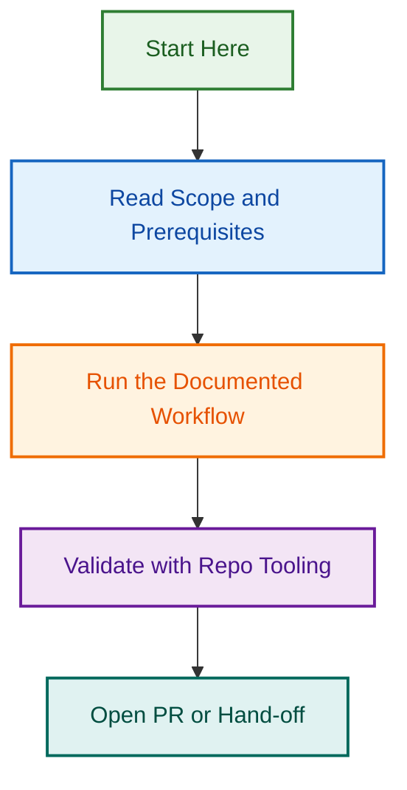

# Branch Governance Hardening

## Overview

This project hardens branch governance through machine-backed enforcement using GitHub branch rulesets and workflows. It ensures strict branch naming conventions, protection rules, and PR gate enforcement across the repository.

## Deliverables

- ✅ Main branch PR guard (release/*and hotfix/* only)
- 🔄 GitHub branch rulesets configuration
- 🔄 Branch naming enforcement workflows
- 🔄 Protection rule automation

## Related Issues

| Issue | Type | Purpose | Status |
|-------|------|---------|--------|
| TBD | epic | Master Branch Governance Initiative | 🔵 Pending |

## Phases

- **Phase 1:** Policy definition and gap analysis (Complete)
- **Phase 2:** Main branch guard implementation (Complete)
- **Phase 3-4:** Ruleset and workflow automation (Pending)

---

*For more information, see [RUN_LOG.md](./RUN_LOG.md)*

## Visual Workflow

