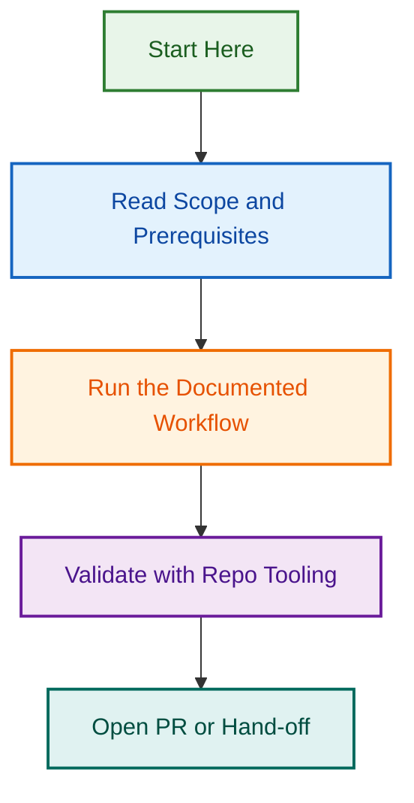

# Branch Naming Enforcement Initiative

**Project Slug:** `branch-naming-enforcement-2026-08-11`  
**Status:** ✅ Phase 1-3 Complete (P1: Unified Validators, P2: Agent Guidance, P3: Discoverability)  
**Objective:** Implement automated workflow to enforce strict branch naming conventions and eliminate manual validation drift

**Latest Update:** 2026-08-22 — Phases 1-3 completed; PR #2302 ready for merge with auto-merge enabled

## Overview

This initiative addresses recurring violations of the branch naming convention `{type}/{scope}-{short-title}` by implementing a two-layer enforcement system:

1. **Local pre-commit hook** — Catches violations before pushing
2. **PR validation workflow** — Blocks merge if branch name is invalid

## Core Problem

- Branch naming violations have become recurring (users "keep fucking up the branch naming conventions")
- Manual enforcement via `npm run validate:branch-name` is not sufficient
- Violations leak to PRs and require manual remediation
- No hard blocker prevents bad branches from reaching `develop`

## Solution Components

### Phase 1: Pre-Commit Hook

- Create `.github/hooks/pre-commit` that validates branch names locally
- Block commits if branch name is invalid
- Provide clear error message with naming rules

### Phase 2: PR Validation Workflow

- GitHub Actions workflow that runs on `pull_request` event
- Validates branch name matches pattern `{type}/{scope}-{short-title}`
- Blocks merge if branch is misnamed
- Posts helpful comment with BRANCHING_STRATEGY.md link

### Phase 3: Documentation & Setup

- Update SETUP.md or equivalent with hook installation instructions
- Create validation helper script (reusable)
- Update BRANCHING_STRATEGY.md with enforcement explanation

## Key References

- **Branching Strategy:** [docs/BRANCHING_STRATEGY.md](../../../../docs/BRANCHING_STRATEGY.md)
- **Validation Script:** `npm run validate:branch-name`
- **Existing Enforcement:** [.github/workflows/main-branch-guard.yml](../../../../.github/workflows/main-branch-guard.yml) (model for implementation)
- **PR Templates:** [.github/PULL_REQUEST_TEMPLATE/config.yml](../../../../.github/PULL_REQUEST_TEMPLATE/config.yml)

## Deliverables

- [ ] SPEC.md — Detailed specification and requirements
- [ ] RFC.md — Design decisions and technical approach
- [ ] PLANNING.md — Phase-by-phase execution plan
- [ ] GitHub Issues (5–7 linked issues for tracking)
- [ ] `.github/hooks/pre-commit` — Pre-commit hook implementation
- [ ] `.github/workflows/branch-name-validation.yml` — PR validation workflow
- [ ] `.github/scripts/validation/validate-branch-name.cjs` — Validation helper script
- [ ] Setup documentation with hook installation guide
- [ ] Project completion report

## Timeline & Completion Status

| Phase | Scope | ETA | Status | Completion Date |
| --- | --- | --- | --- | --- |
| **Phase 1** | Spec, RFC, planning, GitHub issues | 2026-08-11 | ✅ Complete | 2026-08-11 |
| **Phase 1.1** | Unified branch validators | — | ✅ Complete | 2026-08-22 |
| **Phase 1.2** | Fixed post-release sync naming | — | ✅ Complete | 2026-08-22 |
| **Phase 2** | Agent guidance & pre-creation validation | 2026-08-12 | ✅ Complete | 2026-08-22 |
| **Phase 3** | Improved discoverability (quick ref, docs, agent updates) | 2026-08-13 | ✅ Complete | 2026-08-22 |
| **Phase 4** | Team rollout & enforcement | 2026-08-14 | 🚀 Pending | — |

## Completed Work Summary (2026-08-22)

### Phase 1: Validators & Post-Release Sync (P1.1, P1.2)
- **P1.1:** Unified `.cjs` and `.js` validators to strict `{type}/{scope}-{short-title}` pattern
  - Fixed divergence: `.js` was permissive, `.cjs` was strict
  - Updated workflow to use unified `.cjs` validator
  - All tests passing (38/38)
- **P1.2:** Fixed post-release sync from `chore/` (forbidden) to `ops/` prefix
  - Updated in 3 documentation files (ADR-003, BRANCHING_STRATEGY.md, RELEASE_PROCESS.md)

### Phase 2: Agent Guidance & Pre-Creation Validation (P2.1-P2.5)
- **P2.1:** Added branch naming guidance to 19 spec-based agents
- **P2.2:** Created portable instruction file: `instructions/branch-naming.instructions.md`
- **P2.3:** Added pre-creation validation to release agent
- **P2.4:** Enhanced 7-layer safety gates with branch name validation (Gate 1)
- **P2.5:** Updated agent spec template with three branch naming options

### Phase 3: Improved Discoverability (P3.1-P3.5)
- **P3.1:** Created quick reference guide: `docs/QUICK_REFERENCE_BRANCH_NAMING.md`
- **P3.2:** Expanded CLAUDE.md with 7-step validation checklist
- **P3.3:** Significantly expanded AGENTS.md Branch Governance section (100+ lines)
- **P3.4:** Updated all 19 portable agent AGENT.md files with branch naming sections
- **P3.5:** Added validation setup links throughout key documentation

**Total Coverage:** Branch naming guidance now in 40+ files across the repository

## Progress Tracking

**GitHub Issues:** See [ISSUES_CHECKLIST.md](./ISSUES_CHECKLIST.md) for complete list and tracking

| Issue # | Title | Status | Assignee |
| --- | --- | --- | --- |
| #1756 | Create branch name validation script | Ready | — |
| #1757 | Write unit tests for validation script | Ready | — |
| #1758 | Create pre-commit hook | Ready | — |
| #1759 | Setup command & multi-platform testing | Ready | — |
| #1760 | GitHub Actions workflow | Ready | — |
| #1761 | Documentation (setup guide) | Ready | — |
| #1762 | Team rollout & monitoring | Ready | — |

## Related Issues & Pull Requests

### Primary PR
- **PR #2302** — [refactor(validation): P1-P2 - Unified validators and agent branch guidance](https://github.com/lightspeedwp/.github/pull/2302)
  - Status: Open, auto-merge enabled
  - Contains: All Phase 1-3 work (validators, agent guidance, discoverability improvements)
  - Updated: 2026-08-22 with Phase 3 commits (50 files, 893 additions)

### Related Issues & Epics
- **Epic:** [#1755 - Branch Naming Enforcement Workflow](https://github.com/lightspeedwp/.github/issues/1755) (parent epic)
- **Related Issue:** [#1967 - CI Validation Issues: Branch Naming & Gitleaks Discrepancies](https://github.com/lightspeedwp/.github/issues/1967)
- **Related Documentation:** [docs/BRANCHING_STRATEGY.md](../../../../docs/BRANCHING_STRATEGY.md)
- **Related Workflow:** [.github/workflows/main-branch-guard.yml](../../../../.github/workflows/main-branch-guard.yml)

## Key Documentation Updates

New and updated files from Phase 1-3:
- ✅ `docs/QUICK_REFERENCE_BRANCH_NAMING.md` — Quick one-page reference guide
- ✅ `instructions/branch-naming.instructions.md` — Comprehensive portable guide
- ✅ `CLAUDE.md` — Expanded "Before Every Push" validation checklist
- ✅ `AGENTS.md` — Expanded "Branch Governance" section with 31 prefixes, examples, validation procedures
- ✅ 19 `.agent.md` spec-based agents — Added branch naming sections
- ✅ 19 portable agent `AGENT.md` files — Added branch naming sections

## Files Modified in Phase 1-3

**Total:** 50 files changed, 893 additions, 28 deletions

**By Category:**
- Agent specifications: 19 files (`.agent.md`)
- Portable agents: 19 files (`agents/*/AGENT.md`)
- Core documentation: 2 files (CLAUDE.md, AGENTS.md)
- Quick reference: 1 file (`docs/QUICK_REFERENCE_BRANCH_NAMING.md`)
- Portable instructions: 1 file (`instructions/branch-naming.instructions.md`)
- Validators: 3 files (`.js`, `.cjs`, tests)
- Release gates: 1 file (`release-gates.cjs`)
- Release agent: 1 file (`release.agent.js`)
- Documentation: 3 files (ADR-003, BRANCHING_STRATEGY.md, RELEASE_PROCESS.md)
- Template: 1 file (agent template)

---

**Project Owner:** Ash Shaw  
**Last Updated:** 2026-08-11  
**Next Review:** 2026-08-14
## Visual Workflow

