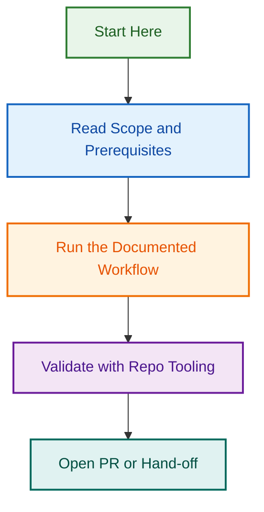

# Branch Naming Enforcement Initiative

**Project Slug:** `branch-naming-enforcement-2026-08-11`  
**Status:** 🚀 Launching  
**Objective:** Implement automated workflow to enforce strict branch naming conventions and eliminate manual validation drift

## Overview

This initiative addresses recurring violations of the branch naming convention `{type}/{scope}-{short-title}` by implementing a two-layer enforcement system:

1. **Local pre-commit hook** — Catches violations before pushing
2. **PR validation workflow** — Blocks merge if branch name is invalid

## Core Problem

- Branch naming violations have become recurring (users "keep fucking up the branch naming conventions")
- Manual enforcement via `npm run validate:branch-name` is not sufficient
- Violations leak to PRs and require manual remediation
- No hard blocker prevents bad branches from reaching `develop`

## Solution Components

### Phase 1: Pre-Commit Hook

- Create `.github/hooks/pre-commit` that validates branch names locally
- Block commits if branch name is invalid
- Provide clear error message with naming rules

### Phase 2: PR Validation Workflow

- GitHub Actions workflow that runs on `pull_request` event
- Validates branch name matches pattern `{type}/{scope}-{short-title}`
- Blocks merge if branch is misnamed
- Posts helpful comment with BRANCHING_STRATEGY.md link

### Phase 3: Documentation & Setup

- Update SETUP.md or equivalent with hook installation instructions
- Create validation helper script (reusable)
- Update BRANCHING_STRATEGY.md with enforcement explanation

## Key References

- **Branching Strategy:** [docs/BRANCHING_STRATEGY.md](../../../../docs/BRANCHING_STRATEGY.md)
- **Validation Script:** `npm run validate:branch-name`
- **Existing Enforcement:** [.github/workflows/main-branch-guard.yml](../../../../.github/workflows/main-branch-guard.yml) (model for implementation)
- **PR Templates:** [.github/PULL_REQUEST_TEMPLATE/config.yml](../../../../.github/PULL_REQUEST_TEMPLATE/config.yml)

## Deliverables

- [ ] SPEC.md — Detailed specification and requirements
- [ ] RFC.md — Design decisions and technical approach
- [ ] PLANNING.md — Phase-by-phase execution plan
- [ ] GitHub Issues (5–7 linked issues for tracking)
- [ ] `.github/hooks/pre-commit` — Pre-commit hook implementation
- [ ] `.github/workflows/branch-name-validation.yml` — PR validation workflow
- [ ] `.github/scripts/validation/validate-branch-name.cjs` — Validation helper script
- [ ] Setup documentation with hook installation guide
- [ ] Project completion report

## Timeline

| Phase | Scope | ETA |
| --- | --- | --- |
| **Phase 1** | Spec, RFC, planning, GitHub issues | 2026-08-11 |
| **Phase 2** | Pre-commit hook implementation & testing | 2026-08-12 |
| **Phase 3** | PR validation workflow & documentation | 2026-08-13 |
| **Phase 4** | Team rollout & enforcement | 2026-08-14 |

## Progress Tracking

**GitHub Issues:** See [ISSUES_CHECKLIST.md](./ISSUES_CHECKLIST.md) for complete list and tracking

| Issue # | Title | Status | Assignee |
| --- | --- | --- | --- |
| #1756 | Create branch name validation script | Ready | — |
| #1757 | Write unit tests for validation script | Ready | — |
| #1758 | Create pre-commit hook | Ready | — |
| #1759 | Setup command & multi-platform testing | Ready | — |
| #1760 | GitHub Actions workflow | Ready | — |
| #1761 | Documentation (setup guide) | Ready | — |
| #1762 | Team rollout & monitoring | Ready | — |

## Related Issues & Epics

- **Epic:** [#1755 - Branch Naming Enforcement Workflow](https://github.com/lightspeedwp/.github/issues/1755) (parent epic)
- **Related:** [docs/BRANCHING_STRATEGY.md](../../../../docs/BRANCHING_STRATEGY.md)
- **Related:** [.github/workflows/main-branch-guard.yml](../../../../.github/workflows/main-branch-guard.yml)

---

**Project Owner:** Ash Shaw  
**Last Updated:** 2026-08-11  
**Next Review:** 2026-08-14
## Visual Workflow

