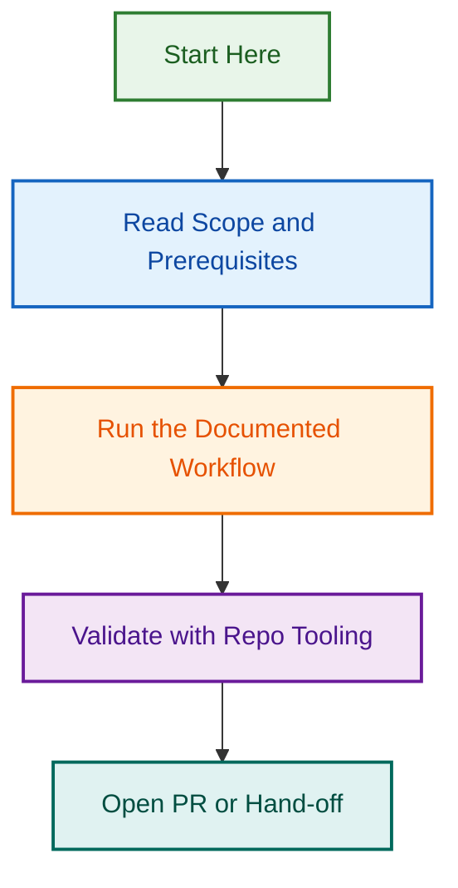

# Changelog Automation Hardening — Project Control Panel

> **Epic:** [#1271](https://github.com/lightspeedwp/.github/issues/1271) | **Status:** Phase 4 Active | **Owner:** Changelog & Release Engineering

## 📋 Quick Links

### Strategic & Planning
- **[PROJECT_PLAN.md](./PROJECT_PLAN.md)** — Full 4-phase strategic plan
- **[PHASE_4_KICKOFF.md](./PHASE_4_KICKOFF.md)** — Phase 4 execution instructions
- **[OPENSPEC_2026-09-03.md](./OPENSPEC_2026-09-03.md)** — Extended specification & implementation status (UPDATED 2026-09-03)
- **[CHANGELOG_GUIDELINES.md](./CHANGELOG_GUIDELINES.md)** — What belongs in CHANGELOG.md

### Audit & Implementation (NEW - 2026-09-03)
- **[EXECUTIVE_SUMMARY_2026-09-03.md](./EXECUTIVE_SUMMARY_2026-09-03.md)** — Quick reference (START HERE)
- **[DETAILED_FINDINGS_2026-09-03.md](./DETAILED_FINDINGS_2026-09-03.md)** — Deep-dive analysis of 7 findings
- **[CONSOLIDATION_AUDIT_DETAILED_PROMPT_2026-09-03.md](./CONSOLIDATION_AUDIT_DETAILED_PROMPT_2026-09-03.md)** — Full implementation prompt (3,200+ lines)
- **[IMPLEMENTATION_PROMPTS_2026-09-03.md](./IMPLEMENTATION_PROMPTS_2026-09-03.md)** — 6 copy/paste prompts ready to use

### Audit Issues (2026-09-03)
- **[#2650](https://github.com/lightspeedwp/.github/issues/2650)** — Fix 2 Critical CHANGELOG.md Validation Errors (⚠️ CRITICAL)
- **[#2651](https://github.com/lightspeedwp/.github/issues/2651)** — Investigate v1.0.0 Release Changelog Corruption (⚠️ CRITICAL)
- **[#2652](https://github.com/lightspeedwp/.github/issues/2652)** — Consolidate Changelog Workflows into Single Agentic Workflow (HIGH)
- **[#2653](https://github.com/lightspeedwp/.github/issues/2653)** — Create Changelog Automation Shared Skill (HIGH)
- **[#2654](https://github.com/lightspeedwp/.github/issues/2654)** — Audit & Add Missing Changelog Entries Since v1.0.0 (HIGH)

### Tracking
- **[Active Issues (Phase 4)](#-active-issues-phase-4)** — All tracked work

---
file_type: "documentation"
type: "project-documentation"
status: "active"
owner: "lightspeedwp/maintainers"

## 🎯 What This Project Does

This initiative fixes critical changelog automation bugs, rebuilds lost history from the past 2 months, defines clear rules for changelog entries, and establishes lasting safeguards to prevent future corruption.

**Key Problem:** The automated changelog workflow was destroying section structure and losing historical information. This project:

1. ✅ **Phase 1** — Fixed the automation bug
2. ✅ **Phase 2** — Recovered lost history (40+ PRs)
3. ✅ **Phase 3** — Defined rules & contributor guidelines
4. 🔄 **Phase 4** — Added automated validation & guardrails (IN PROGRESS)

---

## 📊 Completion Status

| Phase | Deliverable | Status | Issue | Target Date |
|-------|-------------|--------|-------|-------------|
| 1 | Fix section header corruption | ✅ Complete | #1275 | 2026-07-24 |
| 2 | Rebuild lost history (40+ PRs) | ✅ Complete | #1272, #1314 | 2026-07-26 |
| 3 | Define rules & guidelines | ✅ Complete | #1273 | 2026-07-31 |
| 4 | Validation & guardrails | 🔄 **IN PROGRESS** | #1316–#1319 | 2026-08-07 |
| **Epic** | **All phases delivered** | **On Track** | **#1271** | **2026-08-14** |

---

## 📂 Project Structure

```
.github/projects/active/changelog-automation-hardening/
├── README.md (this file)
├── PROJECT_PLAN.md (strategic overview)
├── PHASE_4_KICKOFF.md (implementation instructions)
├── CHANGELOG_GUIDELINES.md (entry format & rules)
├── EXECUTION_PROMPT.md (quick reference)
└── Phase reports & documentation
```

---

## 🔄 Active Issues (Phase 4)

### Phase 4A: Automated PR-to-Changelog Linking

**Issue:** [#1316](https://github.com/lightspeedwp/.github/issues/1316)

Auto-add changelog entries on PR merge if criteria met:

- PR has `changelog:included` label OR
- PR title matches changelog-worthy patterns OR
- User explicitly added CHANGELOG.md entry

**Script:** `scripts/workflows/changelog/auto-link-pr.cjs` (new)

### Phase 4B: Maintainer Review Checklist

**Issue:** [#1317](https://github.com/lightspeedwp/.github/issues/1317)

10-item checklist for reviewers before merging PRs that touch CHANGELOG.md:

- All entries are user-facing ✓
- All entries are concise ✓
- All PR/issue links valid ✓
- No duplicates ✓
- Proper formatting ✓

**Document:** `CHANGELOG_REVIEW_CHECKLIST.md` (new)

### Phase 4C: Enhanced Merge Safeguards

**Issue:** [#1318](https://github.com/lightspeedwp/.github/issues/1318)

Hardening in `merge-entries.cjs`:

- Pre-write validation (all rules pass before write)
- Backup mechanism (snapshot CHANGELOG.md before modifications)
- Post-write verification (verify changes are correct)
- Rollback instructions (on-failure guidance)
- Enhanced logging (all operations logged)

### Phase 4D: Integration Testing & Monitoring

**Issue:** [#1319](https://github.com/lightspeedwp/.github/issues/1319)

Monitor 10 PRs for zero automation failures:

- All entries auto-linked correctly
- No validation failures
- All links remain valid
- Section structure preserved

---

## 🚀 Getting Started with Phase 4

### For Implementation Teams

1. **Read PHASE_4_KICKOFF.md** for full instructions
2. **Create GitHub issues** for sub-tasks 4A–4D (linked to Epic #1271)
3. **Close completed Phase issues:** #1275, #1272, #1273, #1314
4. **Begin implementation** of 4A–4D in parallel
5. **Monitor** via PR testing (Phase 4D)

### For Reviewers

**Before merging PRs touching CHANGELOG.md:**

1. Open `CHANGELOG_GUIDELINES.md` for format rules
2. Use the Maintainer Review Checklist (Phase 4B)
3. Verify:
   - All entries are user-facing
   - All entries are concise (<150 chars)
   - All PR/issue links are valid
   - Section structure is correct
   - No duplicates exist

### For Contributors

**When your PR includes user-facing changes:**

1. Check [CHANGELOG_GUIDELINES.md](./CHANGELOG_GUIDELINES.md)
2. Add an entry to `CHANGELOG.md` [Unreleased] if applicable
3. Use format: `- **Title** — description ([PR #123](url), [#456](issue-url))`
4. Ensure entry is concise (1-2 sentences)
5. Link to PR and any related issues

---

## 📈 Success Metrics

### Quality Gates (Phase 4 completion)

- ✅ **0 broken links** in CHANGELOG.md
- ✅ **0 verbose entries** (all <150 chars)
- ✅ **0 non-changelog entries** (no docs/project/report)
- ✅ **100% PR coverage** (every entry linked)
- ✅ **0 duplicates** in [Unreleased]
- ✅ **0 automation failures** on 10 test PRs

### Completed Deliverables

- ✅ Changelog automation fix (Phase 1)
- ✅ Lost history rebuilding (Phase 2)
- ✅ Rules & guidelines documentation (Phase 3)
- 🔄 Validation & automation guardrails (Phase 4 — IN PROGRESS)

---

## 📞 Contact & References

- **Epic Owner:** Changelog & Release Engineering
- **Tracking:** [Epic #1271](https://github.com/lightspeedwp/.github/issues/1271)
- **Standards:** [Keep a Changelog](https://keepachangelog.com/en/1.1.0/)
- **Guidelines:** [CHANGELOG_GUIDELINES.md](./CHANGELOG_GUIDELINES.md)

---

## 📅 Timeline

| Milestone | Target | Status |
|-----------|--------|--------|
| Phase 1 Complete | 2026-07-24 | ✅ Done |
| Phase 2 Complete | 2026-07-26 | ✅ Done |
| Phase 3 Complete | 2026-07-31 | ✅ Done |
| **Phase 4 Complete** | **2026-08-07** | **🔄 In Progress** |
| **Epic Complete** | **2026-08-14** | **On Track** |

---

*Last updated: 2026-07-24 | Phase 4 Kickoff*

---

*Built by 🧱 LightSpeedWP with ☕, 🚀, and open-source spirit!*

## Related Issues

This project is coordinated with:

- [#1733](https://github.com/lightspeedwp/.github/issues/1733) — Phase 2: Folder Structure & Linking

See [Linking Standard](https://github.com/lightspeedwp/.github/blob/develop/.github/projects/active/reports-projects-restructuring-2026-08-11/LINKING_STANDARD.md) for linking patterns.

## Visual Workflow


