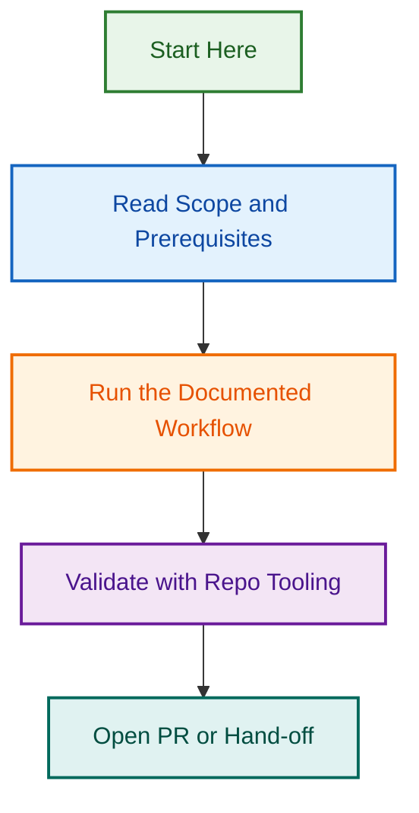

# Chat Closure Agent Implementation Project

**Objective:** Build a reusable Tier 1 portable agent that automates chat session closure workflows, enabling seamless handoffs across control-plane (`.github` repo) and WordPress repositories (plugins & themes).

## Project Summary

### Problem

Long-running Claude Code chat sessions hit context window limits, requiring:

1. Manual gathering of scattered context (projects, issues, PRs, branches, memory)
2. Manual creation of continuation prompts
3. Manual memory updates and worktree cleanup
4. Manual chat archival

### Solution

A **Chat Closure Agent** that automates all steps in a single invocation:

- ✅ Analyzes git state and extracts metadata
- ✅ Discovers related projects, issues, and PRs
- ✅ Updates memory system with closure info
- ✅ Generates professional handoff prompt
- ✅ Safely cleans up worktree (with confirmation)

### Scope

- **Repo support**: Control-plane (`.github`) + WordPress plugins + WordPress themes
- **Implementation tier**: Tier 1 (Portable, multi-file agent in `agents/chat-closure-agent/`)
- **Provider support**: Claude (Phase 1), Copilot/OpenAI (Phase 2)
- **Testing target**: ≥85% coverage

---

## Key Decisions

| Decision | Choice | Rationale |
|----------|--------|-----------|
| **Memory handoff depth** | Moderate (summary + links) | Balance brevity and actionability |
| **Worktree deletion** | Ask before deleting | Safety confirmation required |
| **Memory-issue linking** | One-way (memory→issue) | Stable links, avoids issue clutter |
| **WordPress support** | Both plugins & themes | Supported equally from Phase 1 |
| **Chat archival** | Manual (documented step) | Future: integrate API when available |

---

## Implementation Phases

### Phase 1: Core Components (Week 1)

**Goal:** Implement core analysis and git metadata extraction

**Deliverables:**

- ✅ Agent directory structure created
- ✅ `core-analysis.js` — Git state analysis, repo-type detection
- ✅ Unit tests (90%+ coverage)
- ✅ `git-metadata-extractor` skill

**Files:**

- `agents/chat-closure-agent/shared/core-analysis.js`
- `agents/chat-closure-agent/tests/core-analysis.test.js`
- `agents/chat-closure-agent/skills/git-metadata-extractor.md`

### Phase 2: Memory & Handoff (Week 2)

**Goal:** Implement memory updates and handoff prompt generation

**Deliverables:**

- ✅ `memory-updater.js` — Memory system integration (10-family YAML structure)
- ✅ `continuation-prompt-builder.js` — Markdown prompt generation
- ✅ `project-linker` skill — Find active projects and issues
- ✅ Unit tests + fixtures (90%+ coverage)

**Files:**

- `agents/chat-closure-agent/shared/memory-updater.js`
- `agents/chat-closure-agent/shared/continuation-prompt-builder.js`
- `agents/chat-closure-agent/tests/memory-updater.test.js`
- `agents/chat-closure-agent/tests/continuation-prompt.test.js`
- `agents/chat-closure-agent/tests/fixtures/`

### Phase 3: Cleanup & Agent Shell (Week 3)

**Goal:** Implement workspace cleanup and agent orchestration

**Deliverables:**

- ✅ `workspace-cleaner.js` — Safe worktree cleanup with confirmation
- ✅ `AGENT.md` specification (frontmatter + capabilities)
- ✅ Agent prompt & orchestration logic
- ✅ Integration tests (full workflow)

**Files:**

- `agents/chat-closure-agent/shared/workspace-cleaner.js`
- `agents/chat-closure-agent/AGENT.md`
- `agents/chat-closure-agent/claude/prompt.md`
- `agents/chat-closure-agent/tests/integration.test.js`

### Phase 4: Documentation & Testing (Week 4)

**Goal:** Complete documentation with Mermaid diagrams and full test coverage

**Deliverables:**

- ✅ `ARCHITECTURE.md` (3+ Mermaid diagrams)
- ✅ `USAGE_GUIDE.md` (invocation & customization)
- ✅ `TESTING_GUIDE.md` (test patterns & coverage)
- ✅ Example workflow (real-world demo)
- ✅ Full test coverage audit (≥85%)
- ✅ PR submission with test output

**Files:**

- `agents/chat-closure-agent/docs/ARCHITECTURE.md`
- `agents/chat-closure-agent/docs/USAGE_GUIDE.md`
- `agents/chat-closure-agent/docs/TESTING_GUIDE.md`
- `agents/chat-closure-agent/examples/sample-closure-workflow.md`

---

## Related Issues

| Issue | Type | Purpose | Status |
|-------|------|---------|--------|
| [#1850](../../../issues/1850) | Epic | Chat Closure Agent Implementation | 🟢 Open |
| [#1851](../../../issues/1851) | Task | Phase 1: Core Analysis | 🟢 Open |
| [#1852](../../../issues/1852) | Task | Phase 2: Memory & Handoff | ⏳ Waiting |
| [#1853](../../../issues/1853) | Task | Phase 3: Cleanup & Agent Shell | ⏳ Waiting |
| [#1854](../../../issues/1854) | Task | Phase 4: Documentation & Testing | ⏳ Waiting |

---

## Architecture Overview

### Agent Structure (Tier 1 Portable)

```
agents/chat-closure-agent/
├── AGENT.md                           # Specification (Claude + metadata)
├── README.md                          # Quick reference
├── claude/
│   ├── prompt.md                      # Claude implementation
│   └── config.json                    # Provider config
├── shared/
│   ├── core-analysis.js               # Git analysis
│   ├── memory-updater.js              # Memory system integration
│   ├── continuation-prompt-builder.js # Handoff generation
│   └── workspace-cleaner.js           # Cleanup logic
├── skills/
│   ├── git-metadata-extractor.md
│   ├── project-linker.md
│   └── handoff-documenter.md
├── tests/
│   ├── core-analysis.test.js
│   ├── memory-updater.test.js
│   ├── continuation-prompt.test.js
│   ├── workspace-cleaner.test.js
│   ├── integration.test.js
│   └── fixtures/
├── examples/
│   └── sample-closure-workflow.md
└── docs/
    ├── ARCHITECTURE.md
    ├── USAGE_GUIDE.md
    └── TESTING_GUIDE.md
```

### Functional Components

1. **Core Analysis** — Extract git metadata (branch, commits, issues, projects)
2. **Memory Updater** — Create/update memory entries with 10-family YAML structure
3. **Continuation Prompt Builder** — Generate professional handoff markdown
4. **Workspace Cleaner** — Safe worktree cleanup with user confirmation

### Repo-Type Adaptation

Detects and adapts to:

- **Control-plane** (`.github` repo) — Look for `.github/projects/active/`, workflows
- **WordPress plugins** — Look for `plugin.php`, `composer.json`
- **WordPress themes** — Look for `style.css`, `theme.json`

---

## Testing Strategy

### Unit Tests (Jest)

- **core-analysis.js** — 90%+ coverage (branch parsing, repo detection, issue extraction)
- **memory-updater.js** — 90%+ coverage (memory creation, index updates, conflicts)
- **continuation-prompt-builder.js** — 85%+ coverage (Markdown generation, sections)
- **workspace-cleaner.js** — 85%+ coverage (git state, cleanup steps)

### Integration Tests

1. **Full workflow (control-plane)** — Create branch → Make changes → Run closure
2. **Full workflow (WordPress)** — Similar, but WordPress-specific detection
3. **Dirty worktree** — Uncommitted changes → Closure → Verify stash/commit
4. **Memory integration** — Update memory → Closure → Verify index

### Fixtures

- Mock git repos (control-plane, plugin, theme)
- Mock projects, memory, commit histories
- Sample branch names and outputs

**Coverage target:** ≥85% overall line coverage

---

## Success Criteria

✅ **Implementation** — All components at 90%+ coverage  
✅ **Testing** — Jest suite passes, ≥85% coverage, all repo types  
✅ **Documentation** — ARCHITECTURE, USAGE, TESTING guides + 3+ Mermaid diagrams  
✅ **Usability** — Invokable via skill, clear output, proper memory linking

---

## Technology Stack

| Component | Technology | Reason |
|-----------|-----------|--------|
| **Agent framework** | Tier 1 portable agent | Reusable across repos |
| **Testing** | Jest (>85% coverage) | Aligns with repo standards |
| **Documentation** | Markdown + Mermaid | Per TESTING.md, SKILLS_STANDARDS.md |
| **Memory integration** | 10-family YAML structure | Uses existing memory system |
| **Skills** | Provider-agnostic + implementations | Follows agent patterns |

---

## Key Files

### Implementation Files

- `agents/chat-closure-agent/shared/*.js` — Core logic
- `agents/chat-closure-agent/skills/*.md` — Reusable skills
- `agents/chat-closure-agent/claude/prompt.md` — Claude implementation

### Test Files

- `agents/chat-closure-agent/tests/*.test.js` — Unit + integration tests
- `agents/chat-closure-agent/tests/fixtures/` — Mock data

### Documentation Files

- `agents/chat-closure-agent/docs/*.md` — Technical guides
- `agents/chat-closure-agent/examples/*.md` — Real-world examples

---

## Dependencies & Integrations

### Existing Systems

- **Memory system** (`.remember/`, `MEMORY.md`) — Existing manual handoff workflow
- **Memory schemas** (`/.schemas/memory/`) — 10-family structure
- **Git worktree** — Current branch state analysis
- **GitHub API** — Issue/PR discovery (via commits)

### Agent Tier 1 Patterns

- Multi-file structure (like Linear Advisor, Harvest Analytical agents)
- Provider-specific implementations (Claude/Copilot/OpenAI)
- Reusable skills for cross-agent use

### Standards

- AGENT_STANDARDS.md — Agent creation guidelines
- SKILLS_STANDARDS.md — Skill development standards
- TESTING.md — Jest testing standards

---

## References & Context

**Related Documentation:**

- [AGENTS.md](../../AGENTS.md) — Global AI rules, two-tier structure
- [AGENT_STANDARDS.md](../../docs/AGENT_STANDARDS.md) — Agent creation standards
- [SKILLS_STANDARDS.md](../../docs/SKILLS_STANDARDS.md) — Skill standards
- [TESTING.md](../../docs/TESTING.md) — Testing philosophy & Jest setup
- [CLAUDE.md](../../CLAUDE.md) — Repository governance, branching rules

**Memory System References:**

- `.remember/MEMORY.md` — Memory index
- `/.schemas/memory/` — Memory schemas (10-family structure)
- `api/Gemini.md`, `api/Claude.md` — Provider-specific refs (future Copilot/OpenAI)

**Similar Agents:**

- Linear Advisor Agent (`agents/linear-advisor-agent/`) — Tier 1 multi-file pattern
- Harvest Analytical Agent — Time tracking & reporting agent
- Design Partner Agent — Design system management agent

---

## Project Status

| Status | Details |
|--------|---------|
| **Created** | 2026-08-12 10:15 CEST |
| **Branch** | `feat/chat-closure-agent-implementation` |
| **Phase** | 1 (Core Components) — In Progress |
| **Next Review** | 2026-08-19 (Phase 1 completion) |

---

## Notes

- This project is the **first automated session closure system** in the organization
- Complements existing manual memory handoff workflow
- Foundation for future automation (chat archival API integration, etc.)
- All decisions finalized and approved; ready for Phase 1 implementation
## Visual Workflow


