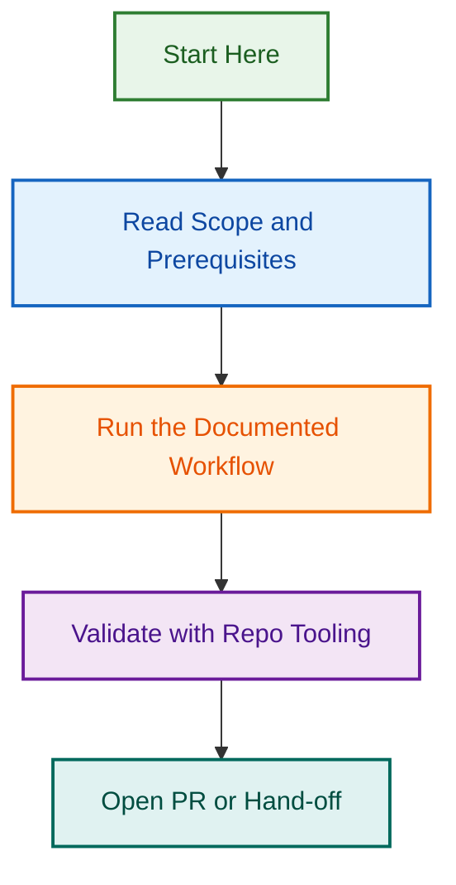

# GitHub Projects Creation System

## Project Status

🟡 **ACTIVE** — System automation and governance rules in development.

## Overview

Automated system for creating and managing GitHub projects within the LightSpeedWP organization. Establishes standardized templates, validation rules, and governance workflows for project initialization.

## Key Components

- **Project Creation Automation** — Automated workflow for creating new projects with standardized metadata
- **Template System** — Reusable templates for common project types
- **Governance Rules** — Validation and enforcement of project standards
- **Issue Tracking** — Integration with issue templates and labeling system

## Related Documents

- See `PLANNING.md` for implementation roadmap
- See `SUMMARY.md` for system overview
- See `INDEX.md` for component organization
- See `ISSUES.md` for related GitHub issues

## Next Steps

TBD — Implementation and rollout planning

---

**Project Lead:** TBD  
**Started:** 2026-08-05  
**Status:** Active  
**Last Updated:** 2026-08-06

## Related Issues

This project is coordinated with:

- [#1733](https://github.com/lightspeedwp/.github/issues/1733) — Phase 2: Folder Structure & Linking

See [Linking Standard](https://github.com/lightspeedwp/.github/blob/develop/.github/projects/active/reports-projects-restructuring-2026-08-11/LINKING_STANDARD.md) for linking patterns.

## Visual Workflow

