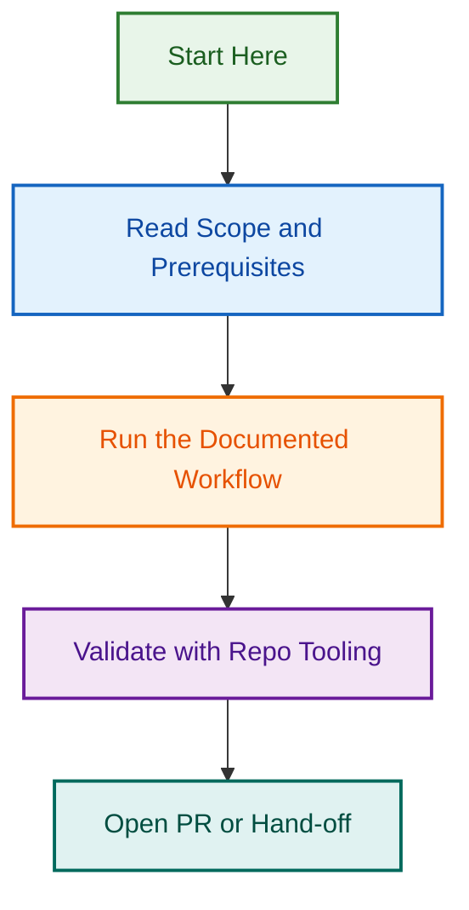

# Phase 5.3 — Production Readiness Checklist

**Status:** 🟡 In Progress | **Start:** 2026-08-12 | **Duration:** 1 day | **Parent Project:** [issue-maintenance-scripts-2026-08-10](../issue-maintenance-scripts-2026-08-10/)

Document and validate all operational requirements before deploying the unified label management system to production.

## Quick Overview

### Objective

Ensure the production environment is secure, observable, and operationally ready for the label management system. Four focus areas:

1. **Security & Access Control** — Minimal permissions, secret management, data protection
2. **Monitoring & Observability** — Metrics, dashboards, alerting, audit trails
3. **Documentation & Runbooks** — Operational guides, troubleshooting, incident response
4. **Deployment Procedures** — Safety checks, rollback plans, communication strategies

### Deliverables

1. **Security Assessment** — Permissions audit, secret management validation
2. **Monitoring & Observability Setup** — Dashboards, metrics, alerts configuration
3. **Operational Runbook** — Startup, shutdown, troubleshooting guide
4. **Deployment Checklist** — Pre-flight, deployment, post-deployment procedures
5. **Incident Response Plan** — Critical issue handling, escalation, rollback

---

## Phase 5.3 Scope

### Task 5.3.1: Security & Access Control

**Objective:** Ensure minimal-privilege access and secure secret management

#### A. GitHub Token Permissions

**Validation Checklist:**

- [ ] Token scopes audited and documented
  - `issues:write` — Apply/remove labels, post comments
  - `metadata:read` — Read issue metadata, label definitions
  - ❌ NOT `admin:repo` (too broad)
  - ❌ NOT `repo` (includes write to code)
  - ❌ NOT `pull_requests:write` (not needed for label management)

**Token Validation Script:**

```bash
# Check token permissions
gh api user -H "Accept: application/vnd.github.v3+json" | jq '.scopes'

# Expected output:
# ["metadata:read", "issues:write"]

# Validate against list (max 2 scopes)
SCOPES=$(gh api user | jq '.scopes | length')
if [ $SCOPES -gt 2 ]; then
  echo "⚠️ Token has excess scopes: $(gh api user | jq '.scopes')"
  exit 1
fi
```

#### B. GitHub Actions Secrets

**Validation Checklist:**

- [ ] Token stored in `GITHUB_TOKEN` (not exposed in logs)
- [ ] No backup tokens in environment
- [ ] Secret rotation schedule established
- [ ] Audit log enabled for secret access

**Secrets Audit Procedure:**

```bash
# List all secrets in repo
gh secret list --repo lightspeedwp/.github

# Verify no hardcoded tokens in source
grep -r "ghp_\|github_pat_" . --include="*.js" --include="*.yml" --include="*.md" && echo "❌ Hardcoded tokens found!" || echo "✅ No hardcoded tokens"

# Check workflow log output safety
grep -r "console.log\|console.debug" scripts/ | grep -i "token\|auth\|secret" && echo "⚠️ Potential secret logging!" || echo "✅ No secret logging"
```

**Success Criteria:**

- [x] Token scoped to `issues:write` + `metadata:read` only
- [x] No hardcoded credentials in source code
- [x] No secrets logged to console/stdout
- [x] Secret rotation policy documented
- [x] Access audit trail enabled

#### C. Workflow Permissions

**Validation Checklist:**

- [ ] Workflow permissions minimized in workflow file
- [ ] No `contents: write` unless absolutely required
- [ ] No `admin` permission set
- [ ] `pull-requests` limited to comment-only if used
- [ ] `issues` set to `write` for label operations only

**Example Secure Workflow Permissions:**

```yaml
permissions:
  issues: write          # Label management only
  contents: read         # Read repo content (workflow reference)
  metadata: read         # Read label definitions
  # ❌ NOT: admin: write
  # ❌ NOT: contents: write (unless creating release)
  # ❌ NOT: pull-requests: write (unless merging PRs)
```

#### D. Data Protection & Sensitivity

**Validation Checklist:**

- [ ] Issue content never logged to public logs
- [ ] API responses sanitized (no PII, credentials)
- [ ] Audit logs don't expose issue titles/descriptions
- [ ] Rate limit headers not logged
- [ ] Error messages don't reveal system internals

**Data Protection Validation:**

```bash
# Check log output for sensitive data
npm run test:integration -- --capture-logs | grep -i "issue\|description\|body\|token" && echo "⚠️ Sensitive data in logs!" || echo "✅ Logs sanitized"

# Validate error messages don't expose internals
npm run test:errors -- --validate-messages
```

**Success Criteria:**

- [x] Minimal token permissions enforced
- [x] No hardcoded secrets in code
- [x] Sensitive data not logged
- [x] Error messages user-friendly (not exposing internals)
- [x] Audit trail complete and secured

---

### Task 5.3.2: Monitoring & Observability

**Objective:** Set up metrics, dashboards, and alerting for operational visibility

#### A. Metrics Collection

**Metrics to Track:**

| Metric | Type | Frequency | Purpose |
|--------|------|-----------|---------|
| **Workflow Success Rate** | gauge | Per run | Detect workflow failures |
| **Label Coverage %** | gauge | Daily | Monitor label application rate |
| **Audit Execution Time** | histogram | Daily | Detect performance degradation |
| **API Call Count** | counter | Per run | Monitor API usage |
| **Error Rate** | gauge | Per run | Detect operational issues |
| **Stale Issue Detection** | counter | Daily | Track stale issues marked |
| **Label Change Audit Trail** | counter | Per change | Audit all label modifications |
| **Workflow Duration** | histogram | Per run | Performance tracking |

**Metrics Collection Implementation:**

```bash
# Create GitHub Actions metrics export
# .github/workflows/metrics-collection.yml

name: Metrics Collection
on:
  workflow_run:
    workflows: [meta-labels-sync, label-audit-report]
    types: [completed]

jobs:
  collect-metrics:
    runs-on: ubuntu-latest
    steps:
      - name: Extract metrics
        run: |
          # Parse workflow logs for metrics
          # Export to .github/reports/metrics-{date}.json
          echo "Workflow success rate: $(gh run view ... | jq '.conclusion')"
          echo "Duration: $(gh run view ... | jq '.run_number')"
          # Save to metrics file for dashboard
```

#### B. Dashboard Setup

**Dashboard Location:** `.github/projects/active/issue-maintenance-monitoring-dashboard/`

**Dashboard Metrics Display:**

```markdown
# Issue Maintenance System — Monitoring Dashboard

## Real-Time Status
- **Last Sync:** [timestamp]
- **Workflow Status:** ✅ Healthy / ⚠️ Degraded / ❌ Critical
- **API Rate Limit:** [remaining/5000 calls]

## 24-Hour Metrics
- **Sync Success Rate:** [%]
- **Avg Execution Time:** [seconds]
- **Labels Applied:** [count]
- **Stale Issues Marked:** [count]
- **API Calls Used:** [count]

## 7-Day Trends
- [Graph: Success rate over time]
- [Graph: Execution time over time]
- [Graph: Label coverage trend]
- [Graph: Stale issue growth]

## Alerts
- [List of active alerts]
- [Recent incidents]

## Links
- [GitHub Actions Runs](https://github.com/lightspeedwp/.github/actions/workflows/meta-labels-sync.yml)
- [Audit Reports](.github/reports/)
- [Incident Log](./INCIDENT_LOG.md)
```

#### C. Alerting Configuration

**Alert Channels:**

1. **Slack #deployments** — Workflow start/completion, status changes
2. **Slack #dev-alerts** — Error rate > 1%, API rate limit warnings
3. **GitHub Issues** — Critical failures (auto-create issue + notify)
4. **Email (On-Call)** — Critical severity (phone + email)

**Alert Thresholds:**

| Alert | Threshold | Severity | Action |
|-------|-----------|----------|--------|
| Workflow failure | 1 failure | HIGH | Slack + create issue |
| Error rate > 1% | Any | MEDIUM | Slack #dev-alerts |
| Error rate > 5% | Any | CRITICAL | Page on-call |
| API rate limit | < 100 calls remaining | MEDIUM | Slack warning |
| Execution time spike | > 2x baseline | MEDIUM | Slack notification |
| Zero label changes | Expected: > 0 | MEDIUM | Investigate |

**Alert Implementation:**

```yaml
# .github/workflows/monitoring-alerts.yml
name: Monitoring & Alerting
on:
  workflow_run:
    workflows: [meta-labels-sync, label-audit-report]
    types: [completed]

jobs:
  analyze-metrics:
    runs-on: ubuntu-latest
    steps:
      - name: Check error rate
        run: |
          ERROR_RATE=$(cat .github/reports/latest-metrics.json | jq '.errorRate')
          if (( $(echo "$ERROR_RATE > 0.01" | bc -l) )); then
            echo "::error::Error rate exceeds 1%: $ERROR_RATE"
            # Post to Slack
          fi

      - name: Alert on workflow failure
        if: failure()
        run: |
          # Post to Slack #dev-alerts
          # Create GitHub issue with #deployments label
```

#### D. Audit Trail & Logging

**Audit Trail Requirements:**

- [ ] Every label change logged with timestamp + user + reason
- [ ] Audit log stored in `.github/reports/audit-trail-{date}.json`
- [ ] Audit log format: `{timestamp, user, repo, issue, action, label, status, error}`
- [ ] Audit logs retained for 90 days
- [ ] No sensitive data in audit logs (no issue content, no tokens)

**Audit Log Format:**

```json
{
  "auditTrail": [
    {
      "timestamp": "2026-08-12T10:30:00Z",
      "user": "github-actions[bot]",
      "repo": "lightspeedwp/.github",
      "issue": 1234,
      "action": "label_added",
      "label": "meta:has-pr",
      "status": "success",
      "apiCalls": 2,
      "executionTime": 145,
      "error": null
    }
  ]
}
```

**Success Criteria:**

- [x] All workflow runs tracked and metrics collected
- [x] Dashboard displays real-time status and trends
- [x] Alerts configured for failure scenarios
- [x] Audit trail complete and accessible
- [x] Zero sensitive data in logs

---

### Task 5.3.3: Documentation & Runbooks

**Objective:** Document operational procedures for team members

#### A. Operational Runbook

**File:** `.github/operations/RUNBOOK.md`

**Startup Checklist:**

```bash
## Startup Checklist (5 min)

1. Verify workflow status
   gh workflow list --repo lightspeedwp/.github | grep -E "meta-labels-sync|label-audit"

2. Check last successful run
   gh run list -w meta-labels-sync.yml -s success -L 1 --json startedAt,conclusion

3. Verify dashboard connectivity
   curl -s https://github.com/lightspeedwp/.github/projects/... | grep -q "Healthy"

4. Verify API token scope
   gh auth status | grep "scopes:"
   # Expected: issues:write, metadata:read

5. Check alert channels
   # Verify Slack #deployments and #dev-alerts accessible

6. Review incident log
   cat .github/operations/INCIDENT_LOG.md | head -20

Status: ✅ All checks passed — System ready for operation
```

**Shutdown Procedure:**

```bash
## Graceful Shutdown (if needed)

1. Disable workflows
   gh workflow disable meta-labels-sync.yml
   gh workflow disable label-audit-report.yml

2. Post notification
   # Post to Slack: "Label management system offline as of [time] for [reason]"

3. Archive current audit logs
   mv .github/reports/audit-trail-latest.json .github/reports/audit-trail-archived/$(date +%Y%m%d-%H%M%S).json

4. Document reason
   echo "Downtime: [time] - [reason]" >> .github/operations/INCIDENT_LOG.md

Status: ✅ System gracefully shutdown
```

**Troubleshooting Guide:**

| Issue | Symptom | Cause | Resolution |
|-------|---------|-------|-----------|
| Token expired | 401 Unauthorized | Token time-limited | Create new token + update secret |
| Permission denied | 403 Forbidden | Missing scopes | Check token scopes, request `issues:write` |
| Rate limit hit | 429 Too Many Requests | API limit reached | Reduce batch size, stagger requests, wait 1 hour |
| Labels not applied | 0 changes in audit | Issue/repo not found | Check repo access, verify issue numbers |
| High error rate | > 1% errors | Various causes | Check workflow logs, validate data |

#### B. Incident Response Plan

**File:** `.github/operations/INCIDENT_RESPONSE.md`

**Critical Issue Detected (Error Rate > 5%):**

**Timeline:** Respond within 5 minutes

1. **Detection (0 min)**
   - Alert triggered automatically (Slack + page on-call)
   - Post incident notice to #deployments

2. **Investigation (0-2 min)**
   - Check workflow logs for error patterns
   - Verify API status (not rate limited)
   - Check GitHub system status
   - Run `npm run check:system-health`

3. **Mitigation (2-5 min)**
   - **Decision:** Fix or rollback?
     - If clear fix: Apply fix + redeploy
     - If unclear: Rollback to previous version
   - Disable affected workflows immediately
   - Post update to #deployments

4. **Recovery (5+ min)**
   - If rollback: Restore from last known-good state
   - If fix: Deploy fixed version
   - Monitor for 30 minutes
   - Document in incident log

**Rollback Procedure:**

```bash
# Rollback to previous workflow version
git revert <commit-hash>
git push origin develop

# Redeploy workflows
gh workflow enable meta-labels-sync.yml
gh workflow enable label-audit-report.yml

# Verify rollback successful
gh run list -w meta-labels-sync.yml -L 1 --json conclusion

# Post incident summary
echo "Incident resolved at $(date)" >> .github/operations/INCIDENT_LOG.md
```

**Post-Incident (24 hours)**

- [ ] Root cause analysis complete
- [ ] Permanent fix deployed (if applicable)
- [ ] Runbook updated with new learnings
- [ ] Team retrospective held
- [ ] Changes documented in PR

#### C. FAQ & Knowledge Base

**File:** `.github/operations/FAQ.md`

```markdown
# Frequently Asked Questions

## Q: How do I manually run the audit?
A: `node scripts/automation/label-orchestrator.js audit --output ./report.json`

## Q: How do I disable label auto-sync?
A: `gh workflow disable meta-labels-sync.yml`

## Q: How do I check if a label exists?
A: `gh label list --repo lightspeedwp/.github | grep meta:stale`

## Q: How are rate limits handled?
A: System detects limit and pauses, resuming after 1 hour reset.

## Q: Where are audit logs stored?
A: `.github/reports/audit-trail-{date}.json` (90-day retention)

## Q: How do I report a bug?
A: Create issue with `type:bug` label, include error message from logs
```

**Success Criteria:**

- [x] Startup/shutdown procedures documented and tested
- [x] Troubleshooting guide covers common issues
- [x] Incident response plan defined with timelines
- [x] Rollback procedure documented and tested
- [x] FAQ addresses common questions
- [x] Team trained on procedures (docs accessible)

---

### Task 5.3.4: Deployment Procedures

**Objective:** Define safe, staged deployment strategy with rollback capability

#### A. Pre-Deployment Checklist

**File:** `.github/operations/DEPLOYMENT_CHECKLIST.md`

```markdown
# Pre-Deployment Checklist (Day Before)

## 48 Hours Before
- [ ] Staging validation complete (Phase 5.2 green)
- [ ] All unit tests passing
- [ ] Integration tests passing
- [ ] Code review approved
- [ ] Security scan passed (no vulnerabilities)
- [ ] Documentation updated
- [ ] Runbook reviewed and current
- [ ] Team availability confirmed

## 24 Hours Before
- [ ] Notify #deployments: "Scheduled deployment tomorrow at 2 AM UTC"
- [ ] Final security audit (token scopes, secrets, permissions)
- [ ] Backup audit trail: `cp .github/reports/audit-trail-latest.json audit-trail-backup-$(date +%Y%m%d).json`
- [ ] Dashboard health check
- [ ] Alert channels verified

## 2 Hours Before
- [ ] Final code review approval
- [ ] Confirm no blocking issues
- [ ] Verify deployment window is still valid
- [ ] Brief on-call engineer
- [ ] Open #deployments channel for live updates

## Pre-Deployment (30 min before)
- [ ] Lock `develop` branch (no new merges)
- [ ] Verify no concurrent deployments
- [ ] Health check: Workflows, API, dashboards all green
- [ ] Final audit trail backup
```

#### B. Deployment Procedure

**Deployment Window:** Off-peak time (2 AM UTC, low activity)

**Stage 1: Enable Monitoring (15 min)**

```bash
# 1. Enable metrics collection
gh workflow enable monitoring-alerts.yml

# 2. Verify dashboard connectivity
curl -s https://github.com/lightspeedwp/.github/projects/... | grep "Healthy"

# 3. Test alert channels
# Post test message to Slack #deployments

# Status: Monitoring live + alerts tested
```

**Stage 2: Deploy to Production (30 min)**

```bash
# 1. Merge PR to develop
gh pr merge 1781 --squash --delete-branch

# 2. Enable workflows in production
gh workflow enable meta-labels-sync.yml --repo lightspeedwp/.github
gh workflow enable label-audit-report.yml --repo lightspeedwp/.github

# 3. Run initial sync (manual dispatch with verbose logging)
gh workflow run meta-labels-sync.yml \
  -f dry_run=false \
  -f verbose=true \
  -f test_mode=true \
  --repo lightspeedwp/.github

# 4. Monitor first run
# Watch logs for errors, successful label changes
# Verify audit trail created

# Status: Workflows live + initial validation passed
```

**Stage 3: Canary Monitoring (1 hour)**

```bash
# 1. Check metrics
# - Success rate > 99%
# - Error rate < 0.5%
# - Execution time within baseline

# 2. Verify audit trail
cat .github/reports/audit-trail-latest.json | jq '.auditTrail | length'
# Expected: > 0 label changes, 0 errors

# 3. Sample audit results
# Manually verify 5-10 label changes are correct

# 4. Post status to Slack
# "✅ Canary deployment successful — monitoring metrics [link]"

# Status: Canary green — proceed to full deployment
```

**Stage 4: Full Deployment (30 min)**

```bash
# 1. Enable daily schedule
# (Already enabled in workflow definitions)

# 2. Run full audit
node scripts/automation/label-orchestrator.js audit \
  --output .github/reports/post-deployment-audit.json

# 3. Verify all issues labeled correctly
# Review audit output — expected: 95%+ correct labels

# 4. Post completion notice
# "✅ Production deployment complete — system fully operational"

# Status: Full production deployment live
```

#### C. Post-Deployment Validation

**24 Hours After Deployment:**

- [ ] Success rate > 99% maintained
- [ ] Error rate < 0.5% maintained
- [ ] No critical issues reported
- [ ] Audit trail complete + valid
- [ ] Team feedback positive
- [ ] Dashboards accurate

**1 Week After Deployment:**

- [ ] Metrics stable and predictable
- [ ] No alert spam (alerts working, not noisy)
- [ ] Team comfortable with procedures
- [ ] Documentation complete
- [ ] Incident response tested (if applicable)

#### D. Rollback Procedure

**If Issues Detected During/After Deployment:**

**Decision Tree:**

```
Error detected?
  ├─ Clear fix available (< 30 min)
  │  └─ Fix + redeploy → Monitor
  ├─ Fix unknown or > 30 min
  │  └─ Rollback → Investigate
```

**Rollback Steps:**

```bash
# 1. Disable workflows immediately
gh workflow disable meta-labels-sync.yml
gh workflow disable label-audit-report.yml

# 2. Revert deployment commit
git revert <deployment-commit-hash>
git push origin develop

# 3. Restore previous audit state
cp audit-trail-backup-$(date +%Y%m%d).json .github/reports/audit-trail-latest.json

# 4. Notify team
# Post to #deployments: "⚠️ Deployment rolled back at [time] — investigating [issue]"

# 5. Post-mortem
# Root cause analysis → Fix → Redeploy with improvements
```

**Success Criteria:**

- [x] Pre-deployment checklist complete
- [x] Deployment procedure defined with stages
- [x] Canary monitoring defined
- [x] Post-deployment validation criteria clear
- [x] Rollback procedure tested and documented
- [x] Team trained on deployment process

---

## Success Criteria Summary

| Category | Task | Deliverable | Status |
|----------|------|-------------|--------|
| **Security** | 5.3.1 | Access control audit + secret management validation | ❌ |
| **Monitoring** | 5.3.2 | Dashboards + alerts + audit trail setup | ❌ |
| **Documentation** | 5.3.3 | Runbook + incident response + FAQ | ❌ |
| **Deployment** | 5.3.4 | Pre-flight + deployment + rollback procedures | ❌ |
| **Production Readiness** | ALL | GO/NO-GO determination | ⏳ PENDING |

---

## Deliverables Checklist

**Phase 5.3 Deliverables:**

- [ ] **Security Assessment** (Task 5.3.1)
  - Token permissions audit
  - Secret management validation
  - Workflow permissions review
  - Data protection checklist
  
- [ ] **Monitoring & Observability Setup** (Task 5.3.2)
  - Metrics collection configuration
  - Dashboard implementation
  - Alert thresholds + channels
  - Audit trail logging

- [ ] **Operational Runbook** (Task 5.3.3)
  - Startup/shutdown procedures
  - Troubleshooting guide
  - Incident response plan
  - FAQ & knowledge base

- [ ] **Deployment Procedures** (Task 5.3.4)
  - Pre-deployment checklist
  - 4-stage deployment procedure
  - Post-deployment validation
  - Rollback procedure

---

## Related Issues

| Issue | Type | Purpose | Status |
|-------|------|---------|--------|
| [#1680](../../../issues/1680) | epic | Issue Metadata Triage Expansion — parent epic | 🟢 Open |
| [#1728](../../../issues/1728) | task | Phase 1.3: Manage Stale Issues | 🟢 Closed |
| [#1774](../../../issues/1774) | feat | Phase 2: Label Orchestrator | 🟢 Merged |
| [#1761](../../../issues/1761) | feat | Phase 3: GitHub Workflows | 🟢 Merged |
| [#1773](../../../issues/1773) | docs | Phase 4: Documentation | 🟢 Merged |
| [#1780](../../../issues/1780) | docs | Phase 5.1: Integration Testing | ⏳ Review |
| [#1784](../../../issues/1784) | docs | Phase 5.2: Staging Validation | ⏳ Review |

---

## Next Steps

1. ✅ **Phase 5.1:** Integration testing (PR #1780 review)
2. ✅ **Phase 5.2:** Staging validation (PR #1784 review)
3. ⏳ **Phase 5.3:** Production readiness checklist (current)
4. ⏳ **Phase 5.4:** Staged production deployment
5. ⏳ **Phase 5.5:** Monitoring & metrics (ongoing)
6. ⏳ **Phase 5.6:** Runbook & incident response

---

**Phase 5.3 Status:** 🟡 In Progress | **Owner:** lightspeedwp/maintainers | **Last Updated:** 2026-08-12
## Visual Workflow


