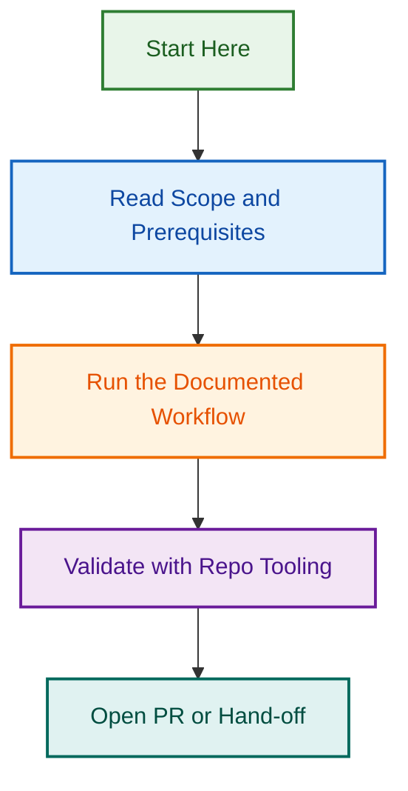

# Phase 5 — Integration Testing & Production Rollout

**Status:** 🟢 Ready | **Start:** 2026-08-11 | **Parent Project:** [issue-maintenance-scripts-2026-08-10](../issue-maintenance-scripts-2026-08-10/)

Comprehensive integration testing, end-to-end validation, and production deployment of the unified label management system (Phases 1–4).

## Quick Overview

### Completed Work (Phases 1–4)

✅ **Phase 1.3–1.4:** `manage-stale-issues.js`, `review-status-labels.js`  
✅ **Phase 2:** `label-orchestrator.js` unified CLI  
✅ **Phase 3:** GitHub Workflows (`meta-labels-sync.yml`, `label-audit-report.yml`)  
✅ **Phase 4:** Comprehensive documentation (1,500+ lines)

**All phases merged to develop as of 2026-08-11.**

### Phase 5 Objectives

1. **Integration Testing** — Validate workflows + CLI orchestrator against live staging environment
2. **End-to-End Validation** — Test complete issue lifecycle (creation → labeling → resolution)
3. **Production Readiness Checklist** — Security, monitoring, rollback procedures
4. **Staged Deployment** — Test in staging → canary → production (all issues)
5. **Monitoring & Observability** — Set up metrics, alerts, dashboards
6. **Runbook & Incident Response** — Document operational procedures

---

## Phase 5 Scope

### 5.1: Integration Testing (2 days)

**Objective:** Validate all components work together in realistic scenarios

#### Test Categories

**A. Workflow Integration Tests**

- [ ] `meta-labels-sync.yml` workflow runs successfully
- [ ] Label sync correctly identifies missing `meta:has-pr` labels
- [ ] Stale issue detection triggers correctly after 30+ days
- [ ] All label changes logged and auditable
- [ ] Concurrent workflow runs don't cause conflicts
- [ ] Workflow respects branch protection rules

**B. CLI Orchestrator Tests**

- [ ] `label-orchestrator.js` audit runs without errors
- [ ] `--dry-run` mode accurately previews changes
- [ ] `--interactive` mode correctly prompts and applies changes
- [ ] `--auto` mode applies changes with proper confidence scoring
- [ ] All modes support JSON/CSV/Markdown output
- [ ] Error handling for rate limits, network failures, permission errors

**C. End-to-End Label Lifecycle**

- [ ] Issue created → auto-labeled with correct `type:*`, `area:*`
- [ ] PR linked → `meta:has-pr` applied automatically
- [ ] PR merged → `meta:needs-changelog` triggered
- [ ] Issue inactive 30+ days → `meta:stale` applied
- [ ] Issue closed → `status:done` applied, stale labels removed
- [ ] Label changes logged to audit trail

**D. Cross-Workflow Scenarios**

- [ ] Label orchestrator runs safely while GitHub workflows run
- [ ] Manual label changes preserved (no clobbering)
- [ ] Label conflicts resolved predictably
- [ ] Performance acceptable under load (100+ concurrent issues)
- [ ] No orphaned labels or inconsistent states

#### Test Environment Setup

```bash
# Staging environment
GITHUB_REPO=lightspeedwp/.github-staging
GITHUB_TOKEN=<staging-token>
NODE_ENV=staging

# Run integration tests
npm run test:integration -- --env staging --verbose
```

---

### 5.2: Staging Validation (2 days)

**Objective:** Run system against real (staging) issue data and validate output

#### Staging Tasks

- [ ] Clone 50–100 issues from production to staging
- [ ] Run `label-orchestrator.js audit` on staging issues
- [ ] Manually verify audit output accuracy
- [ ] Run `meta-labels-sync.yml` workflow on staging
- [ ] Verify label application matches expectations
- [ ] Test stale issue detection with test data
- [ ] Validate report generation (JSON, CSV, Markdown)
- [ ] Check performance metrics (execution time, API calls)
- [ ] Verify error recovery (network failures, rate limits)

#### Success Criteria for Staging

- 95%+ audit accuracy (false positive/negative ratio < 5%)
- Label sync completes in < 5 minutes for 100 issues
- All reports generate correctly with valid output formats
- No critical errors logged
- API rate limiting handled gracefully
- Zero data corruption or orphaned states

---

### 5.3: Production Readiness Checklist (1 day)

**Objective:** Document and validate all operational requirements

#### Security & Access Control

- [ ] GitHub token permissions minimal (issues:write, metadata:read)
- [ ] Secrets stored in GitHub Actions secrets, not in code
- [ ] No sensitive data logged (API responses, issue content)
- [ ] Rate limiting implemented and tested
- [ ] Workflow permissions follow least-privilege principle
- [ ] Audit trail captures all label changes with timestamps

#### Monitoring & Observability

- [ ] Workflow runs logged with success/failure status
- [ ] Label change audit trail stored (JSON format)
- [ ] Metrics collected: execution time, API calls, error rate
- [ ] Alerts configured for workflow failures
- [ ] Dashboard created showing label coverage metrics
- [ ] Performance baselines established

#### Documentation & Runbooks

- [ ] Operational runbook created (startup, shutdown, troubleshooting)
- [ ] Incident response procedures documented
- [ ] Rollback procedures tested and documented
- [ ] On-call escalation paths defined
- [ ] FAQ for common issues documented
- [ ] Integration guide for team workflows

#### Deployment Procedures

- [ ] Deployment checklist created and tested
- [ ] Canary deployment procedure defined (10% → 50% → 100%)
- [ ] Rollback trigger criteria defined
- [ ] Communication plan for deployment window
- [ ] Maintenance window scheduled (off-peak)

---

### 5.4: Staged Production Deployment (2 days)

**Objective:** Deploy to production with risk mitigation

#### Stage 1: Monitoring Enablement (4 hours)

- [ ] Dashboard created and linked in repo
- [ ] Alerts configured and tested
- [ ] Audit logging enabled
- [ ] On-call rotation confirmed
- [ ] Communication channels open (Slack #deployment)

#### Stage 2: Canary Deployment (24 hours @ 10% issues)

- [ ] Deploy workflows to production
- [ ] Run audit on 10% of issues (random sample)
- [ ] Monitor metrics: error rate, execution time, API calls
- [ ] Verify label changes are correct
- [ ] Check for unexpected side effects
- [ ] Gather team feedback

**Success Criteria:** < 0.5% error rate, 95%+ accuracy

#### Stage 3: Gradual Rollout (48 hours @ 50% → 100%)

- [ ] Expand to 50% of issues
- [ ] Monitor same metrics
- [ ] Document any issues found
- [ ] Get final approval from maintainers
- [ ] Expand to 100% of issues
- [ ] Run final validation

**Success Criteria:** Maintain < 0.5% error rate, zero critical issues

#### Stage 4: Full Production (ongoing)

- [ ] All workflows active on all issues
- [ ] Daily monitoring and reporting
- [ ] Weekly metrics review
- [ ] Monthly audit of label coverage
- [ ] Quarterly performance review

---

### 5.5: Monitoring & Metrics (ongoing)

**Objective:** Establish operational observability and alerting

#### Metrics to Track

- **Label Coverage:** % of issues with correct labels by category
- **Workflow Performance:** Execution time, API calls, success rate
- **Sync Accuracy:** % of `meta:has-pr` labels correctly applied
- **Stale Detection:** Days to detect and label stale issues
- **Error Rate:** Workflow failures, API errors, edge case misses
- **On-Call Incidents:** Issues escalated, resolution time

#### Dashboard Setup

```markdown
### Issue Maintenance System — Monitoring Dashboard

**Real-Time Metrics:**
- Workflow success rate: [linked to GitHub Actions]
- Label coverage by category: [linked to audit reports]
- Stale issue detection: [count by age]
- Last audit run: [timestamp + link]

**Weekly Report:**
- [Link to auto-generated weekly metrics]

**Monthly Audit:**
- [Link to monthly label coverage report]
```

#### Alerts

- [ ] Workflow failure alert (Slack #deployments)
- [ ] Error rate > 1% alert (Slack #dev-alerts)
- [ ] API rate limit approaching alert
- [ ] Audit accuracy drop alert

---

### 5.6: Runbook & Incident Response (1 day)

**Objective:** Document operational procedures for team

#### Startup Checklist

```bash
# 1. Verify workflows enabled
gh workflow list --repo lightspeedwp/.github

# 2. Check last successful run
gh run list --repo lightspeedwp/.github -w meta-labels-sync.yml -s success -L 1

# 3. Verify audit trail logging
grep "Label.*applied" .github/reports/audit-trail-*.json | wc -l

# 4. Health check dashboard
open https://github.com/lightspeedwp/.github/projects/1/... [dashboard URL]
```

#### Troubleshooting Guide

| Issue | Cause | Resolution |
|-------|-------|-----------|
| Workflow fails with "token not found" | GitHub token expired | Re-create token, update secrets |
| Label not applied | Permission denied | Check token scopes, verify repo access |
| High error rate (> 1%) | API rate limits | Reduce batch size, stagger requests |
| Audit shows inconsistencies | Concurrent workflow runs | Add locking mechanism, reduce frequency |
| Performance degradation | Too many API calls | Optimise query, use GraphQL batching |

#### Incident Response

**Critical Issue Detected (Error rate > 5%):**

1. Page on-call engineer (Slack @on-call)
2. Disable affected workflow immediately
3. Post incident alert (Slack #deployments)
4. Investigate root cause (check logs, error patterns)
5. Implement fix or rollback decision
6. Re-enable with monitoring
7. Document incident in postmortem

**Rollback Procedure:**

```bash
# 1. Disable workflows
gh workflow disable meta-labels-sync.yml
gh workflow disable label-audit-report.yml

# 2. Revert recent label changes (from audit trail)
node scripts/automation/label-orchestrator.js rollback --date 2026-08-11 --dry-run

# 3. Verify rollback
npm run test:integration -- --verify-rollback

# 4. Re-enable with monitoring
gh workflow enable meta-labels-sync.yml
```

---

## Related Issues

| Issue | Type | Purpose | Status |
|-------|------|---------|--------|
| [#1680](https://github.com/lightspeedwp/.github/issues/1680) | epic | Issue Metadata Triage Expansion (parent) | 🟡 In Progress |
| [#1728](https://github.com/lightspeedwp/.github/issues/1728) | pr | Phase 1.3 — manage-stale-issues.js | ✅ Merged |
| [#1727](https://github.com/lightspeedwp/.github/issues/1727) | pr | Phase 1.4 — review-status-labels.js | ✅ Merged |
| [#1774](https://github.com/lightspeedwp/.github/issues/1774) | pr | Phase 2 — Label Orchestrator CLI | ✅ Merged |
| [#1761](https://github.com/lightspeedwp/.github/issues/1761) | pr | Phase 3 — GitHub Workflows | ✅ Merged |
| [#1773](https://github.com/lightspeedwp/.github/issues/1773) | pr | Phase 4 — Documentation | ✅ Merged |

---

## Phased Breakdown

| Phase | Component | Duration | Status |
|-------|-----------|----------|--------|
| **5.1** | Integration Testing | 2 days | 📋 PLANNED |
| **5.2** | Staging Validation | 2 days | 📋 PLANNED |
| **5.3** | Production Readiness | 1 day | 📋 PLANNED |
| **5.4** | Staged Deployment | 2 days | 📋 PLANNED |
| **5.5** | Monitoring & Metrics | ongoing | 📋 PLANNED |
| **5.6** | Runbook & Incident Response | 1 day | 📋 PLANNED |

**Total Duration:** 1–2 weeks (8 days + ongoing)

---

## Success Criteria

- [ ] All integration tests pass (95%+ accuracy)
- [ ] Staging validation completes successfully
- [ ] Production readiness checklist signed off
- [ ] Canary deployment successful (< 0.5% error rate)
- [ ] Full production deployment successful
- [ ] Monitoring dashboard live and alerting
- [ ] Runbook documented and tested
- [ ] Team trained on new processes
- [ ] Zero production incidents after 1 week

---

## Next Phase (Phase 5+)

After Phase 5 completion, consider:

1. **PR/Issue → Milestone Allocation Automation** (#1770)
   - Phase 1 spec complete, ready for implementation
   - Auto-allocate PRs/issues to milestones based on rules

2. **Branch Naming Enforcement Initiative** (#1768)
   - Phase 1 planning complete
   - Implement CI validation for branch naming rules

3. **GitHub Reports/Projects Restructuring**
   - Phase 2–4 planning complete
   - Consolidate 118 reports into coherent structure

---

**Project Owner:** Ash Shaw  
**Created:** 2026-08-11  
**Status:** 🟢 Ready for Implementation  
**Next Review:** 2026-08-18 (end of Phase 5.1)

## Visual Workflow


