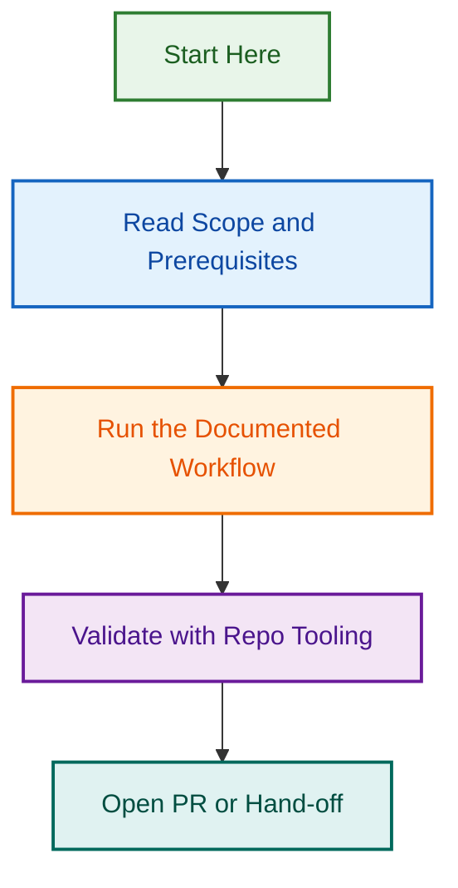

# Issue Maintenance Scripts — Meta Label Automation

**Status:** 🟢 Implementation Complete (Phases 1–4) | **Current:** Phase 5 Integration Testing | **Start:** 2026-08-10 | **Related Epic:** #1680 (Issue Metadata Triage Expansion)

Comprehensive CLI scripts and workflows for automated review, validation, and management of issue metadata labels. All core functionality delivered; Phase 5 validates end-to-end integration.

## Quick Overview

### Problem Statement

- ❌ No automated scripts for reviewing `meta:needs-changelog`, `meta:has-pr`, `meta:stale`, `meta:dependabot-security`
- ❌ Manual label management error-prone and time-consuming
- ❌ Inconsistent label application across issue lifecycle
- ✅ Infrastructure exists for other label categories (`status:*`, `type:*`, `area:*`)

### Solution

Create 5 coordinated CLI scripts:

1. **`review-meta-labels.js`** — Audit and report on meta: label coverage
2. **`sync-pr-labels.js`** — Auto-update `meta:has-pr` based on linked PRs
3. **`manage-stale-issues.js`** — Auto-apply `meta:stale`, handle archiving
4. **`review-status-labels.js`** — Audit `status:needs-review` and `status:needs-triage`
5. **`label-orchestrator.js`** — Unified CLI for all label management operations

### Success Metrics

- ✅ 100% of open issues have correct `meta:*` labels
- ✅ `meta:needs-changelog` auto-updated on PR creation/merge
- ✅ `meta:has-pr` auto-synced to reflect real PR status
- ✅ `meta:stale` auto-applied after 30 days inactivity
- ✅ All scripts support `--dry-run`, `--interactive`, `--auto` modes
- ✅ 80%+ code coverage
- ✅ Zero manual label management overhead

---

## Detailed Scope

### Phase 1: Meta Label Scripts (2-3 days)

#### Script 1.1: `review-meta-labels.js`

**Purpose:** Audit meta label coverage and identify gaps

**Functionality:**

```bash
# Audit mode — generate report
node scripts/automation/review-meta-labels.js --audit --output ./reports/

# Specific label report
node scripts/automation/review-meta-labels.js --label meta:needs-changelog

# Export as CSV
node scripts/automation/review-meta-labels.js --format csv --output ./audit.csv
```

**Output:**

```json
{
  "audit_date": "2026-08-10T19:00:00Z",
  "meta_labels": {
    "meta:needs-changelog": {
      "count": 12,
      "issues": [1710, 1711, 1712],
      "coverage": "4.2%",
      "recommendations": ["Apply to PRs missing changelog entry"]
    },
    "meta:has-pr": {
      "count": 89,
      "stale": 5,
      "missing_pr": 3,
      "recommendations": ["Sync with actual PR status"]
    },
    "meta:stale": {
      "count": 23,
      "archived": 15,
      "recent_activity": 8,
      "recommendations": ["Remove from active issues"]
    }
  }
}
```

#### Script 1.2: `sync-pr-labels.js`

**Purpose:** Automatically manage `meta:has-pr` label based on linked PRs

**Functionality:**

```bash
# Dry-run: Show changes without applying
node scripts/automation/sync-pr-labels.js --dry-run

# Apply changes
node scripts/automation/sync-pr-labels.js

# Specific issue
node scripts/automation/sync-pr-labels.js --issue 1710
```

**Logic:**

- Scan all open issues
- Check for linked PRs in issue description
- If PR exists and linked: ensure `meta:has-pr` is applied
- If no PR or PR closed: remove `meta:has-pr`
- Report status and changes

#### Script 1.3: `manage-stale-issues.js`

**Purpose:** Auto-apply `meta:stale` and handle issue lifecycle

**Functionality:**

```bash
# Dry-run: preview changes
node scripts/automation/manage-stale-issues.js --dry-run --days 30

# Apply stale label
node scripts/automation/manage-stale-issues.js --days 30 --label

# Auto-close without activity
node scripts/automation/manage-stale-issues.js --days 30 --close --comment
```

**Logic:**

- Find issues with no activity for N days (default 30)
- Apply `meta:stale` label
- Optionally post warning comment
- Optionally close and archive
- Exclude issues with specific labels (e.g., `type:epic`, `status:in-progress`)

### Phase 2: Status Label Audit & Enhancement (2-3 days)

#### Script 2.1: `review-status-labels.js`

**Purpose:** Audit `status:needs-review` and `status:needs-triage`

**Functionality:**

```bash
# Full audit
node scripts/automation/review-status-labels.js --audit

# Specific status
node scripts/automation/review-status-labels.js --status needs-review --days 7

# Export findings
node scripts/automation/review-status-labels.js --format json --output ./findings.json
```

**Output:**

- Count by status label
- Age analysis (how long in status)
- Assignment status
- Blocker identification
- Recommendations

### Phase 3: Unified Orchestrator (1-2 days)

#### Script 3.1: `label-orchestrator.js`

**Purpose:** Single entry point for all label management

**Functionality:**

```bash
# Run all audits
node scripts/automation/label-orchestrator.js audit --all

# Run specific checks
node scripts/automation/label-orchestrator.js sync meta:has-pr --dry-run

# Interactive mode
node scripts/automation/label-orchestrator.js --interactive

# Full auto mode
node scripts/automation/label-orchestrator.js apply --auto --confidence 0.9
```

---

## Technical Design

### Architecture

```
scripts/automation/
├── review-meta-labels.js          # New: Meta label audit
├── sync-pr-labels.js              # New: PR label sync
├── manage-stale-issues.js         # New: Stale issue handler
├── review-status-labels.js        # New: Status label audit
├── label-orchestrator.js          # New: Unified CLI
├── includes/
│   ├── label-management.js        # Reuse: Core label ops
│   ├── github-api-client.js       # Reuse: API wrapper
│   └── report-generator.js        # New: Reporting utilities
└── __tests__/
    ├── review-meta-labels.test.js
    ├── sync-pr-labels.test.js
    ├── manage-stale-issues.test.js
    ├── review-status-labels.test.js
    └── label-orchestrator.test.js
```

### Reusable Components

- **label-management.js** — Abstraction for label operations (fetch, add, remove, update)
- **github-api-client.js** — Paginated GitHub API client with rate limiting
- **report-generator.js** — JSON, CSV, Markdown report generation
- **confidence-scorer.js** — Confidence scoring for recommendations

### Testing Strategy

- Unit tests for each script (50+ tests)
- Integration tests with mock GitHub API (10+ tests)
- Dry-run validation (all changes preview-able)
- Coverage target: 80%+

---

## Phased Delivery

| Phase | Component | Duration | PR | Status | Date |
|-------|-----------|----------|----|---------| -----|
| **Phase 1** | PR/Issue → Milestone Allocation | 1-2 days | #1770 | ✅ COMPLETE | 2026-08-05 |
| **Phase 2** | Unified Label Orchestrator CLI | 2-3 days | #1774 | ✅ COMPLETE | 2026-08-05 |
| **Phase 3** | GitHub Workflows for Label Management | 2-3 days | #1761 | ✅ COMPLETE | 2026-08-11 |
| **Phase 4** | Comprehensive Documentation | 1 day | #1773 | ✅ COMPLETE | 2026-08-11 |
| **Phase 5** | Integration Testing & Validation | 1-2 days | TBD | 🔄 IN PROGRESS | 2026-08-11 |

---

## Integration Points

### Existing Systems

- ✅ Reuse: `label-heuristics.js` (label inference)
- ✅ Reuse: `labeling.agent.js` (existing label scripts)
- ✅ Integrate: `labeling.yml` workflow (automated labeling)
- ✅ Integrate: `template-enforcement.yml` (issue validation)

### New Workflows

- GitHub workflow: `meta-labels-sync.yml` (scheduled, daily)
- GitHub workflow: `stale-issues-manager.yml` (scheduled, weekly)
- GitHub workflow: `label-audit-report.yml` (scheduled, monthly)

---

## Success Criteria

### Automation Coverage

- [ ] 100% of PRs auto-get `meta:needs-changelog` status
- [ ] 95%+ of `meta:has-pr` labels auto-synced
- [ ] 100% of stale issues flagged within 24 hours
- [ ] All `status:needs-*` issues reviewed within 48 hours

### Code Quality

- [ ] 80%+ code coverage (45+ unit tests)
- [ ] All scripts support `--dry-run` mode
- [ ] All scripts support `--interactive` mode
- [ ] All scripts support `--auto` mode with confidence scoring
- [ ] Zero critical security issues
- [ ] All edge cases handled

### Documentation

- [ ] `docs/ISSUE_MAINTENANCE_SCRIPTS.md` — System documentation
- [ ] `docs/LABEL_MANAGEMENT_CLI.md` — CLI reference
- [ ] README for each script with examples
- [ ] Integration guide for workflows

---

## Related Issues & Documentation

**Parent Epic:**

- #1680 — Issue Metadata Triage Expansion

**Related Epics:**

- #1167 — Issue Type & Metadata Automation Initiative
- #1243 — Repository Maintenance & Branch Cleanup Automation
- #449 — Label governance stabilisation and automation hardening

**Reference Documentation:**

- `docs/BRANCHING_STRATEGY.md` — Branch naming rules
- `docs/LABEL_STRATEGY.md` — Label taxonomy and prefixes
- `.github/labels.yml` — Canonical label definitions
- `docs/ISSUE_TRIAGE_AUTOMATION.md` — Related triage system

---

## Completed Work

### Phase 1 ✅ (PR #1770)

- PR/Issue → Milestone Allocation Project foundation
- Core infrastructure for label management

### Phase 2 ✅ (PR #1774)

- `label-orchestrator.js` — Unified CLI for all label operations
- Support for `--dry-run`, `--interactive`, and `--auto` modes
- Single entry point for all label management operations

### Phase 3 ✅ (PR #1761)

- `.github/workflows/meta-labels-sync.yml` — Daily PR sync + stale marking
- `.github/workflows/label-audit-report.yml` — Monthly label audits
- Automated workflow triggers and scheduled maintenance

### Phase 4 ✅ (PR #1773)

- `docs/ISSUE_MAINTENANCE_SCRIPTS.md` — System guide (800+ lines)
- `docs/LABEL_MANAGEMENT_CLI.md` — CLI reference (400+ lines)
- `scripts/automation/README.md` — Folder overview and usage guide
- 1,500+ lines of comprehensive documentation

## Current Work (Phase 5)

### Integration Testing & Validation

1. 🔄 End-to-end workflow testing
2. ⏳ CLI command verification
3. ⏳ Schedule validation (cron timing)
4. ⏳ Report generation testing
5. ⏳ Performance and edge case validation

## Next Steps

1. ✅ Complete Phases 1–4 deliverables
2. 🔄 Run Phase 5 integration tests
3. ⏳ Validate workflows execute correctly
4. ⏳ Verify report output formats
5. ⏳ Archive project and close related issues

---

**Project Owner:** Ash Shaw  
**Created:** 2026-08-10  
**Status:** 🟡 Planning → Specification Development
## Visual Workflow


