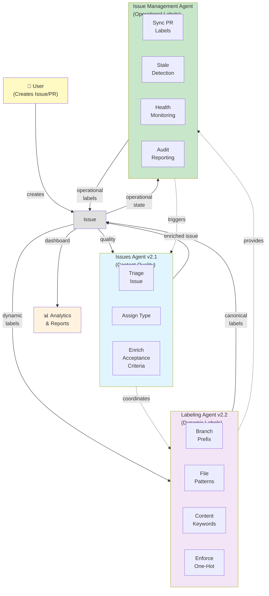

# Agent Ecosystem Architecture — Integration Map

**Purpose**: Establish how three complementary agents collaborate without conflict: Issues Agent (content quality), Labeling Agent (dynamic label application), and Issue Management Agent (operational label management).

---

## Agent Ecosystem Overview



---

## Three-Agent Architecture

### Agent 1: Issues Agent v2.1 — Content Quality

**Domain**: Issue content, metadata, description quality  
**Status**: ✅ Active & Stable (v2.1)

**Responsibilities**:

- Type assignment (type:bug, type:feature, etc.)
- Issue triage and categorization
- Enrichment (acceptance criteria, technical details)
- Content quality validation

**Labels Applied**:

- `type:*` (bug, feature, task, epic, story, chore, documentation, etc.)
- `category:*` (governance, automation, api, frontend, etc.)
- Custom quality labels

**Triggers**:

- Issue created/updated
- Manual invocation
- PR review comments

**Guardrails**:

- Only canonical types from `.github/issue-types.yml`
- Validation-first approach
- Never deletes user content

---

### Agent 2: Labeling Agent v2.2 — Dynamic Labels

**Domain**: Dynamic label application based on patterns  
**Status**: ✅ Active & Stable (v2.2)

**Responsibilities**:

- Branch prefix detection (feat/ → type:feature)
- File pattern matching (src/blocks/* → area:block-editor)
- Content-based type detection (keywords in title/body)
- One-hot constraint enforcement (only one status/priority/type)
- Label standardization & migration (legacy → canonical)

**Labels Applied**:

- `type:*` (from branch, files, or content)
- `area:*` (from file patterns)
- `priority:*` (defaults to priority:normal)
- `status:*` (enforces one-hot)
- Canonical labels only (no legacy)

**Triggers**:

- PR opened/updated (file patterns, branch prefix)
- Issue created/updated (content, templates)
- Label changes (standardization/migration)
- Manual workflow dispatch

**Guardrails**:

- All rules in `.github/labeler.yml` (config-driven)
- Only canonical labels from `.github/labels.yml`
- Alias migration for legacy labels
- One-hot enforcement prevents conflicting labels

---

### Agent 3: Issue Management Agent — Operational Labels

**Domain**: Label operations, health, audit  
**Status**: 🔄 In Development (Phase 2)

**Responsibilities**:

- PR synchronization (adds/removes meta:has-pr)
- Stale issue detection (adds meta:stale after inactivity)
- Health monitoring (API rate limits, operation success)
- Audit reporting (label coverage, metrics)
- Troubleshooting (diagnostics, recommendations)

**Labels Applied**:

- `meta:has-pr` (PR linked and open)
- `meta:stale` (inactive >30 days)
- `meta:needs-changelog` (affects changelog)
- `meta:no-changelog` (doesn't need changelog)
- `meta:dependabot-security` (security update eligible)

**Triggers**:

- Scheduled daily (3 AM UTC): sync + stale detection
- Scheduled monthly (1st, 4 AM UTC): audits
- Manual dispatch: dry-run preview
- Health checks: daily 12 PM UTC

**Guardrails**:

- Configuration-validated per repo
- Dry-run mode default (safe preview)
- Smart exclusions (epics, in-progress, critical, milestones)
- API rate limiting respected
- All operations idempotent (safe to re-run)

---

## Agent Responsibilities Matrix

```
                          Issues Agent  Labeling Agent  IMA
                          (Content)     (Dynamic)       (Operations)
─────────────────────────────────────────────────────────────────
Type Assignment           ✅ Primary    ✅ Secondary    ❌ N/A
Content Quality           ✅ Primary    ❌ N/A          ❌ N/A
Acceptance Criteria       ✅ Primary    ❌ N/A          ❌ N/A
Area Labels               ❌ N/A        ✅ Primary      ❌ N/A
Status Labels             ❌ N/A        ✅ Primary      ⚠️  Secondary
Priority Labels           ❌ N/A        ✅ Primary      ❌ N/A
Meta Labels               ❌ N/A        ❌ N/A          ✅ Primary
PR Synchronization        ❌ N/A        ❌ N/A          ✅ Primary
Stale Detection           ❌ N/A        ❌ N/A          ✅ Primary
Label Migration           ❌ N/A        ✅ Primary      ❌ N/A
One-Hot Enforcement       ❌ N/A        ✅ Primary      ❌ N/A
Health Monitoring         ❌ N/A        ❌ N/A          ✅ Primary
Audit Reporting           ❌ N/A        ❌ N/A          ✅ Primary
```

---

## Label Ownership

### By Prefix

| Prefix | Owner | Purpose | Example |
|--------|-------|---------|---------|
| `type:*` | Issues + Labeling | Content type & category | type:bug, type:feature |
| `area:*` | Labeling | Code area / component | area:ci, area:docs |
| `priority:*` | Labeling | Urgency level | priority:critical |
| `status:*` | Labeling (default) | Current state | status:in-progress |
| `meta:*` | **Issue Management** | Operational metadata | meta:has-pr, meta:stale |
| `category:*` | Issues | Organization category | category:governance |

### Clear Boundaries

```
Issues Agent: type:*, category:*
             (Content quality & classification)
                  ↓
             [Issue Enriched]
                  ↓
Labeling Agent: area:*, priority:*, status:*
               (Dynamic pattern-based labels)
                  ↓
            [Issue Labeled]
                  ↓
Issue Management Agent: meta:*
                       (Operational monitoring)
```

---

## Collaboration Patterns

### Pattern 1: Sequential Execution (Typical)

```
1. Issue Created
   ↓
2. Issues Agent runs (manual or on-demand)
   └─ Type assignment, enrichment
   ↓
3. Labeling Agent runs (automatic on create/update)
   └─ Dynamic labels (area, priority, status)
   └─ One-hot enforcement
   ↓
4. Issue Management Agent runs (scheduled daily)
   └─ PR sync, stale detection
   └─ Health monitoring
   ↓
5. Issue fully labeled & monitored
```

---

### Pattern 2: Coordination for Label Validation

**Issue Management Agent** delegates to **Labeling Agent** for:

- ✅ Canonical label verification
- ✅ Alias resolution (legacy → canonical)
- ✅ One-hot constraint validation
- ✅ Label configuration loading

**Example: When adding meta:stale label**

```
Issue Management Agent:
1. Detect issue is stale (no activity >30 days)
2. Call Labeling Agent utility: validateCanonical('meta:stale')
3. Get back: label exists, color code, aliases, constraints
4. Apply label safely (no conflicts)
```

---

### Pattern 3: Handoff from Issues Agent to Labeling Agent

**Issues Agent** can trigger **Labeling Agent** for enhanced labeling:

```
Issues Agent workflow:
1. Enrich issue (type, criteria, links)
2. Signal readiness: "Please apply dynamic labels"
3. Labeling Agent:
   - Apply area labels based on description
   - Enforce one-hot constraints
   - Apply priority if not set
   ↓
4. Both agents complete their work on same issue
```

---

## Integration Points

### Integration 1: Shared Label Utilities

**All agents can use common utilities** from `scripts/automation/includes/`:

```javascript
// All agents can import and use:
const { validateLabel, resolveAlias } = require('./label-management.js');

// Issues Agent: verify type is canonical
const isCanonical = validateLabel('type:bug');

// Labeling Agent: resolve legacy label
const canonical = resolveAlias('defect'); // → 'type:bug'

// Issue Management Agent: verify meta label
const isMeta = validateLabel('meta:stale');
```

### Integration 2: Coordinated Label Application

**Order of label application**:

```
1. Labeling Agent applies initial labels (branch, files, defaults)
2. Issues Agent enriches and may adjust type (if needed)
3. Issue Management Agent adds operational labels (meta:*, activity-based)
```

**No conflicts** because each owns different label prefixes.

---

### Integration 3: Unified Configuration

**All agents respect canonical configuration**:

```yaml
# .github/labels.yml (single source of truth)
- name: meta:has-pr
  color: "1f6feb"
  description: "Issue has linked open PR"

- name: meta:stale
  color: "d4d4d4"
  description: "Issue inactive >30 days"

- name: type:bug
  color: "9f3734"
  description: "Bug report or defect"
```

**All agents**:

- Read canonical labels from this file
- Never hardcode labels
- Validate before applying
- Respect color, description, aliases

---

## Execution Timeline

```
Issue Lifecycle

DAY 0 (Issue Created)
├─ Issues Agent (if manual)
│  ├─ Type assignment
│  ├─ Enrichment
│  └─ Quality check
│
├─ Labeling Agent (automatic)
│  ├─ Dynamic labels (area, priority, status)
│  ├─ One-hot enforcement
│  └─ Standardization
│
└─ Issue now fully labeled & enriched

DAY 1-30 (Active Development)
└─ Issue Management Agent (daily, 3 AM UTC)
   ├─ PR sync: detects linked PR → meta:has-pr
   ├─ Status monitoring: activity present → not stale
   └─ Health check: operation successful

DAY 31 (Inactive)
└─ Issue Management Agent (daily, 3 AM UTC)
   ├─ PR sync: PR closed → removes meta:has-pr
   ├─ Stale detection: no activity 30+ days → meta:stale
   ├─ Health reporting: issue flagged as stale
   └─ Optional: notification to stakeholders

DAY 32+ (Monitoring)
└─ Issue Management Agent (daily + monthly audits)
   ├─ Continues monitoring stale status
   ├─ Monthly audit: stale % trending up/down
   └─ Health dashboard: shows stale issue count
```

---

## Test Coverage for Multi-Agent Workflows

### Test 1: No Label Conflicts

```gherkin
Scenario: All agents work without conflicts
  Given an issue exists with type:feature
  When Issues Agent enriches content
    And Labeling Agent applies area:docs
    And Issue Management Agent adds meta:stale
  Then issue has all three labels
    And no label conflicts occur
    And all labels are canonical
```

### Test 2: Label Boundary Respect

```gherkin
Scenario: Each agent respects label boundaries
  Given Labeling Agent sets status:in-progress
    And Issue Management Agent wants meta:stale
  When both agents operate
  Then both labels are applied
    And no conflict (different prefixes)
    And issue state is consistent
```

### Test 3: Sequential Coordination

```gherkin
Scenario: Agents coordinate in sequence
  Given issue just created
  When Issues Agent runs first (type assignment)
    And Labeling Agent runs second (dynamic labels)
    And Issue Management Agent runs third (operational labels)
  Then issue is fully enriched
    And all agent operations complete
    And labels are applied in order without conflict
```

---

## Recommended Implementation Approach

### Phase 2: Issue Management Agent Development

1. **Respect Labeling Agent**
   - Use shared label utilities (validate, resolve aliases)
   - Don't apply labels directly; delegate to Labeling Agent if needed
   - Read canonical labels from `.github/labels.yml`

2. **Clear Ownership**
   - Issue Management Agent: meta:* labels only
   - Never touch type:*, area:*, priority:*, status:*
   - Explicit guard: validate(label).prefix === 'meta'

3. **Error Handling**
   - If label not canonical: use Labeling Agent utility
   - If label already applied: skip (idempotent)
   - If conflict: log and escalate to human

### Phase 5: Optional Labeling Agent Enhancement

Consider adding to **Labeling Agent v2.3**:

```markdown
### Optional: Integration with Issue Management Agent

The Labeling Agent could be enhanced to:
1. Read operational metrics from Issue Management Agent
2. Adjust priority based on stale/active status
3. Validate meta:* labels don't conflict with status:*
4. Coordinate label transitions (e.g., stale → archived)
```

---

## Conclusion

The three agents form a **complementary ecosystem**:

- **Issues Agent** → Content Quality (enrichment, type, criteria)
- **Labeling Agent** → Dynamic Labels (branch, files, patterns)
- **Issue Management Agent** → Operational Labels (state, activity, health)

**No conflicts** because each owns distinct label domains:

- Issues Agent: type:*, category:*
- Labeling Agent: area:*, priority:*, status:*
- Issue Management Agent: meta:*

**Clear integration points** ensure seamless collaboration without duplication or confusion.

---

*Agent Ecosystem v1.0 | Created 2026-08-12 | Multi-Agent Architecture*
