# Issue Management Agent — Integration with Existing Agents

**Purpose**: Ensure the new Issue Management Agent complements existing agents without conflicts or duplication.

---

## Existing Agents in the Ecosystem

### 1. Issues Agent (v2.1) — Active ✅

**File**: `.github/agents/issues.agent.md`  
**Focus**: Issue quality & enrichment  
**Responsibilities**:

- Type assignment
- Issue triage
- Refinement & enrichment
- Acceptance criteria generation
- Technical details extraction

**Guardrails**: Only canonical types/labels, validation-first, data integrity preservation

---

### 2. Metadata Triage Handlers

**Location**: `scripts/automation/handlers/`  
**Focus**: Issue metadata management  
**Capabilities**:

- PR-to-issue linking
- Milestone allocation
- Issue metadata updates
- Custom field handling

---

## Agent Responsibility Matrix

```
                          Issues Agent        Issue Management Agent
                          (Quality)           (Operations/Labels)
─────────────────────────────────────────────────────────────────
Content Quality           ✅ Primary          ❌ Not in scope
Type/Category             ✅ Assign/validate  ⚠️  Reports on coverage
Issue Enrichment          ✅ Acceptance etc   ❌ Not in scope
Label Application         ⚠️  Some labels     ✅ Primary (meta:, status:)
PR Synchronization        ❌ Not in scope     ✅ Primary (meta:has-pr)
Stale Detection           ❌ Not in scope     ✅ Primary (meta:stale)
Health Monitoring         ❌ Not in scope     ✅ Primary
Audit Reporting           ❌ Not in scope     ✅ Primary
Troubleshooting           ❌ Not in scope     ✅ Primary
Error Detection           ✅ Content errors   ✅ Operations errors
```

---

## Integration Patterns

### Pattern 1: Complementary Operations

```mermaid
---
config:
  theme: base
  accTitle: Integration Pattern - Complementary Operations
  accDescr: Two-agent workflow showing Issues Agent (quality triage and enrichment) and Issue Management Agent (operations and monitoring) working on the same issue from different angles
---
graph LR
    Issue["Create Issue"]
    
    subgraph IssuAgent["Issues Agent<br/>(Quality)"]
        Triage["Triage"]
        Type["Assign Type"]
        Enrich["Enrich Content"]
        AC["Add Acceptance<br/>Criteria"]
    end
    
    subgraph MgmtAgent["Issue Management Agent<br/>(Operations)"]
        SyncPR["Sync PR Labels<br/>(meta:has-pr)"]
        Monitor["Health Monitor"]
        Report["Generate Reports"]
    end
    
    Issue --> IssuAgent
    IssuAgent --> |typed, enriched| MgmtAgent
    MgmtAgent --> |monitored, reported| Dashboard["Dashboard/Reports"]
    
    style IssuAgent fill:#e1f5ff
    style MgmtAgent fill:#c8e6c9
```



**Workflow**:

1. Issue created
2. **Issues Agent** → Type, triage, enrich content
3. **Issue Management Agent** → Monitor, sync labels, report health
4. Both agents enhance the same issue from different angles

### Pattern 2: Data Flow

```
Issue Lifecycle
│
├─ Creation
│  └─ Issues Agent (quality checks, type assignment)
│     └─ Issue now has proper metadata
│
├─ Active Development
│  └─ Issue Management Agent (monitor, sync labels)
│     └─ Labels stay in sync with PR status, activity
│
├─ Inactivity
│  └─ Issue Management Agent (stale detection)
│     └─ Mark as stale if inactive >30 days
│
└─ Closure
   └─ Both agents complete their responsibilities
```

---

## No Conflicts: Different Domains

### Issues Agent Domain: **Issue Content Quality**

```
Issue Content (Internal)
├─ Type: bug, feature, task, etc.
├─ Title: clear, descriptive
├─ Description: detailed, structured
├─ Acceptance Criteria: SMART goals
├─ Technical Details: implementation context
└─ Links: related issues, ADRs, decisions
```

**Agent Actions**:

- ✅ Suggest type improvements
- ✅ Enhance description
- ✅ Generate acceptance criteria
- ✅ Validate content quality

---

### Issue Management Agent Domain: **Issue Operational State**

```
Issue Operations (External)
├─ PR Synchronization: meta:has-pr label
├─ Stale Detection: meta:stale label
├─ Status Tracking: status:* labels
├─ Health Monitoring: which issues need attention
└─ Audit Reporting: label coverage metrics
```

**Agent Actions**:

- ✅ Sync PR-related labels
- ✅ Mark stale issues
- ✅ Generate audit reports
- ✅ Health checks
- ✅ Troubleshooting

---

## Coordination Patterns

### When Issues Agent Runs

**Trigger**: Issue created or updated (content changes)

```
Issue Updated (content)
│
└─ Issues Agent
   ├─ Validate type
   ├─ Check description quality
   ├─ Enhance acceptance criteria
   └─ Update issue content
```

**Labels touched**: Minimal (only type/category labels)  
**No conflict** with Issue Management Agent (operates on different labels)

---

### When Issue Management Agent Runs

**Trigger**: Scheduled (daily/monthly) or manual

```
Daily Sync Scheduled (3 AM UTC)
│
└─ Issue Management Agent
   ├─ Check PR links → meta:has-pr
   ├─ Check activity → meta:stale
   ├─ Health checks
   └─ Generate reports
```

**Labels touched**: Meta labels, status labels  
**No conflict** with Issues Agent (operates on different labels)

---

## Explicit Label Boundaries

### Issues Agent Label Scope

```yaml
# Types (assigned by Issues Agent)

# Categories (assigned by Issues Agent)
category:governance
category:automation
category:api
category:frontend
```

**Rule**: Issues Agent only modifies these labels

---

### Issue Management Agent Label Scope

```yaml
# Meta Labels (managed by Issue Management Agent)
meta:has-pr
meta:stale
meta:needs-changelog
meta:no-changelog
meta:dependabot-security
meta:no-issue-activity
meta:no-pr-activity

# Status Labels (managed by Issue Management Agent)

# Area Labels (may be reported on)
area:ci
area:docs
area:security
area:labels

# Priority Labels (may be reported on)
priority:critical
priority:important
priority:normal
priority:low
```

**Rule**: Issue Management Agent primarily operates on meta and status labels

---

## Refactoring Plan for issues.agent.md

### Current Status

The existing `issues.agent.md` is:

- ✅ Stable and working (v2.1)
- ✅ Focused on content quality
- ✅ Maintained by @ash (Ash Shaw)

### Recommended Enhancements (Future, Phase 5+)

Consider expanding `issues.agent.md` to:

1. **Report on label coverage** (read-only)
   - Check if all issues have proper type labels
   - Check if critical issues have priority labels
   - Report gaps to Issue Management Agent

2. **Coordinate with Issue Management Agent**
   - After enriching content, trigger IMA for label sync
   - Respect IMA's label boundaries
   - Share diagnostic reports

3. **Enhanced guardrails**
   - Don't modify meta:* labels (Issue Management Agent's domain)
   - Don't modify status:* labels (Issue Management Agent's domain)
   - Only modify type/category/area labels

### Proposed Refactoring (Phase 5)

```markdown
---
title: Issues Agent v2.2
description: Enhanced issue quality agent with label coverage reporting
version: v2.2
---

### Enhancements in v2.2

1. **Label Coverage Reporting**
   - Report on type label coverage
   - Report on priority label gaps
   - Coordinate with Issue Management Agent

2. **Improved Guardrails**
   - Explicit boundary: don't touch meta:* or status:*
   - Validate before any label changes
   - Log all label modifications

3. **Better Coordination**
   - After enrichment, signal readiness for IMA
   - Share diagnostics with IMA
   - Support multi-agent workflows
```

---

## Workflow Examples

### Example 1: New Feature Request

```
1. User creates issue
   Title: "Add support for X"
   Description: Basic info

2. Issues Agent runs (automated)
   ✅ Assigns type:feature
   ✅ Enriches description
   ✅ Generates acceptance criteria
   ✅ Adds links to related issues
   
   Issue now has:
   - Proper type label
   - Detailed description
   - Clear acceptance criteria

3. Issue Management Agent runs (daily, 3 AM)
   ✅ Checks for linked PRs (none yet)
   ✅ Checks activity (new, not stale)
   ✅ Generates health report
   
   Issue now has:
   - meta:has-pr (not applied, no PR yet)
   - meta:stale (not applied, recent)
   - Shows in reports as "active, waiting for work"

✅ Both agents worked on the same issue, zero conflicts
```

---

### Example 2: Stale Issue with Low Content Quality

```
Issue has been inactive for 45 days:

1. Issue Management Agent runs (daily, 3 AM)
   ✅ Marks with meta:stale (inactive >30 days)
   ✅ Reports in health checks
   
   Issue now flagged as stale

2. Human notices stale flag
   Decides to revive the issue
   Updates description with new context

3. Issues Agent could run (if triggered manually)
   ✅ Re-validates description quality
   ✅ Updates acceptance criteria if needed
   ✅ Enhances if content is sparse
   
   Issue now has better content

4. Issue Management Agent removes stale label
   (Activity detected, conversation resumed)
   
✅ Both agents worked sequentially, no conflicts
```

---

## Testing Multi-Agent Workflows

### Test Scenario 1: Parallel Operations

```gherkin
Scenario: Both agents work on same issue
  Given an issue exists
  When Issues Agent enriches the content
    And Issue Management Agent syncs labels
  Then both operations complete successfully
    And no label conflicts occur
    And issue has both content quality + operational labels
```

### Test Scenario 2: Sequential Operations

```gherkin
Scenario: Issues Agent, then Issue Management Agent
  Given a newly created issue
  When Issues Agent completes enrichment
    Then Issue has type + content quality improvements
  When Issue Management Agent runs
    Then Issue has label sync + health status
    And both sets of metadata are consistent
```

### Test Scenario 3: Edge Case - Conflicting Labels

```gherkin
Scenario: Prevent label conflicts
  Given Issues Agent wants to set "type:bug"
    And Issue Management Agent manages "meta:*" labels
  When both agents operate
  Then no conflicts occur
    And boundary is respected
    And each agent touches only its domain
```

---

## Recommendation

### Keep Both Agents Separate

✅ **Issues Agent** (v2.1+)

- Focus: Content quality, type assignment, enrichment
- Domain: Issue content metadata
- No changes needed (already working well)

✅ **Issue Management Agent** (New)

- Focus: Label operations, health monitoring, audits
- Domain: Operational labels (meta:*, status:*)
- Explicit boundary: doesn't touch Issues Agent's labels

### Future Enhancement Path

1. **Phase 2-4**: Issue Management Agent standalone
2. **Phase 5**: Optional refactoring of Issues Agent
   - Add label coverage reporting
   - Better coordination with IMA
   - Enhanced guardrails

### No Conflicts

- Different domains (content vs operations)
- Different labels (type/category vs meta/status)
- Different triggers (content changes vs scheduled)
- Can coexist and enhance each other

---

## Integration Checklist

- [ ] Issues Agent continues to work (v2.1)
- [ ] Issue Management Agent respects label boundaries
- [ ] No label conflicts in tests
- [ ] Documentation updated for both agents
- [ ] Guardrails explicit in both agents
- [ ] Multi-agent workflows tested
- [ ] Team understands agent boundaries
- [ ] Monitoring tracks both agents separately

---

*Integration Document v1.0 | Created 2026-08-12*
